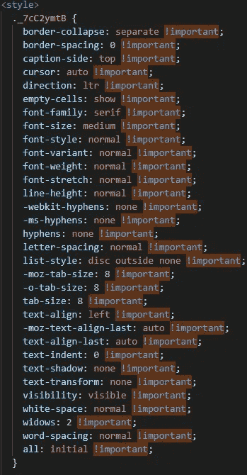

# 编码 WTFs —万圣节版

> 原文：<https://levelup.gitconnected.com/coding-wtfs-halloween-edition-d53c287d0809>

## 包括一些学习！


由[Ivan lapirin](https://unsplash.com/@lapyrin?utm_source=unsplash&utm_medium=referral&utm_content=creditCopyText)在 [Unsplash](https://unsplash.com/s/photos/wtf?utm_source=unsplash&utm_medium=referral&utm_content=creditCopyText) 上拍摄的原始照片，由作者编辑

谁在过去没有经历过那些可怕的恐怖故事，那些真正震撼他们灵魂的故事，以至于每当他们想起它时，他们仍然感到寒冷在他们的脊柱上颤抖？

换句话说，我们都见过可怕的代码，当时它可能是糟糕的，因为你要么维护它，要么以某种方式与它交互。

但不是今天，不是先生！今天我们要笑…我的意思是，从过去的错误中吸取教训。算是吧。

所以我进入了 [r/badcode](https://www.reddit.com/r/badcode/) ，在那里游了一会儿后，我设法获得了 7 颗宝石，今天我将与大家分享。

所以让我们开始吧！

# 好的老空如果

看看我们的第一位美女:


[来源](https://www.reddit.com/r/badcode/comments/q0zxrg/saw_this_on_page_source_of_a_live_website/)

从哪里开始？首先，我认为我们应该赞扬使用严格相等的运算符来检查`name`的值是否真的是`null`。

也就是说，祝贺到此为止，因为一旦你看到整个逻辑，代码就有几个问题:

1.  首先向我扑来的是空的 IF 块。它扑向我，因为我已经看过几百遍了。我讨厌碰到它，把完全相反的表达式放在 IF 中并去掉空块真的那么难吗？虽然不是在这种情况下，如果布尔表达式如此复杂，以至于得到相反的表达式有点令人头痛，你总是可以用括号把它括起来，并加上前缀`!`，这样就完成了。
2.  `IF`区块是为了确保我们不会试图问候一个没有真正告诉我们名字的人(至少从表面上看是这样)。问题？这个条件，考虑到它是如何与`null`进行比较的，会让`undefined`和空字符串通过，事实上，它也会让包含空白的字符串通过。如果条件是`if(!name)`，我们可能会捕捉到更多错误值，比如空字符串或`undefined`。
3.  最后，我们不能忽视最后一行中的安全漏洞。从 [MDN 的网站](https://developer.mozilla.org/en-US/docs/Web/API/Element/innerHTML):

> 设置`innerHTML`的值会删除元素的所有后代，并用通过**解析字符串** *htmlString* 中给定的 HTML 构建的节点来替换它们。

重点是我的，它的意思是告诉你问题出在哪里。我们放入`innerHTML`的任何东西都会被*解析。*所以我们为 XSS 攻击打开了大门，我们的攻击者可以给自己起一些恶意的名字，比如:`Fernando`，每当我的名字出现在屏幕上的任何地方，这些代码就会执行一些 JavasScript。

为什么？因为这段代码没有净化用户的输入。记住孩子们，永远不要相信用户，每次你使用他们的输入时，首先清理，检查 HTML 标签，并遵循 [OWASP 的建议。](https://cheatsheetseries.owasp.org/cheatsheets/Cross_Site_Scripting_Prevention_Cheat_Sheet.html)

# 将可读代码发挥到极致

我们都知道晦涩的一行程序是没有帮助的，虽然它们在你写完的前 10 分钟可能看起来很酷，但你很快就会忘记它们的意思，任何人在你之后都会恨你和你的后代很长时间。

我们的下一个很棒的代码示例把一行代码变成可读代码有点过头了:


[来源](https://www.reddit.com/r/badcode/comments/q151aj/tales_of_a_long_friday_afternoon/)

是的，它工作了。对于任何编写代码的人来说，幻数都是一个大禁忌，但在这种情况下，说实话，这些数字并没有那么神奇。考虑到它处理的是`Date.now()`方法，很明显代码在从当前时间中减去时间。所以这是一个解释它应该做什么的问题，这可以通过在顶部添加一个很好的注释来解释这一点来解决。

相反，该解决方案将一行难以阅读的代码变成了一段不太长的代码。顺便说一句，它比原来的行更进了一步，允许您使用`daysToGoBack`变量(在第一次计算中无法直接获得)来表达您想要减去多少天。

记住，可读代码不是这么写的。

# 你会把这个叫做什么？

我只是很难给它起个名字:


[来源](https://www.reddit.com/r/badcode/comments/pzupq9/one_of_my_classmates_was_confused_on_an_assignment/)

从来源来看，这似乎是一个计算机科学作业出错。这个 Python 函数的名字意味着它试图计算`encripted_message`变量中每个字母的频率。但我的天啊，这不是我该走的路。

你能想象当这个学生意识到信息中也有大写字母时的表情吗？如果它也包括数字呢？伙计，不要让我开始接受多种编码。

玩笑归玩笑，这是一个刚刚开始学习编程的人的典型错误。这可能是此人的首要任务之一。我记得我试图解决这样的问题，最终你学会用更复杂的结构思考，比如地图或哈希表，突然你的整个世界打开了。但在那之前，这个穷学生可能花了几个小时写了一个本该花几分钟的代码。

# 短短几行字就有这么多问题

下一个问题来自一个并不真正了解 JavaScript 中数组和异步是如何工作的人。要么是这样，要么是这个人试图超级小心……出问题了？我不知道了…


[来源](https://www.reddit.com/r/badcode/comments/q3v3wi/this_poor_confused_little_thing_came_from_the/)

四行代码，这就是导致 2 个(或者 3 个，取决于你怎么看)错误的全部原因。这肯定是个记录。

让我们来解开这个美丽的包裹:

1.  让我们抛开显而易见的事情:我们这里没有任何异步代码。那么为什么要使用`await`和`async`？难倒我了，除非这个人希望在`map`中增加额外的异步调用，否则这毫无意义。
2.  为什么要定义一个空数组，用一个`map`的结果填充它，只是为了立即开始通过`push`方法一次手动添加一个项目？
3.  就这一点而言，为什么要使用`map`来迭代数组的元素呢？这不是这个方法的要点，你得到了`forEach`。

我的意思是，这可以写成`let ids = ut_ids.map(ut => ut.UserTestID)`。一个实际上可以理解的很好的一行程序。

记住，不时温习一下你的[数组方法](https://developer.mozilla.org/en-US/docs/Web/JavaScript/Reference/Global_Objects/Array)，它总是有用的，除非你真的需要处理异步行为，否则不要添加`async/await`。请注意，最后一点没有伤害代码，只是伤害了我们的眼睛，但仍然没有意义，所以它不应该在那里。

# 当一切都很重要的时候，那么什么都不重要

我们已经习惯于听到经理给出的优先级，对吗？有时他们都想尽快得到一切，因为一切都是第一位的。

但在这种情况下，我们将这种痛苦转移到浏览器中，请看:



[来源](https://www.reddit.com/r/badcode/comments/q2guo3/there_are_1380_important_tags_on_this_css/)

没错，Chrome，现在你的感觉和我一样了！

这可能是这位开发人员在写这篇漂亮的 CSS 作品时的想法。

或者，许多人可能会认为，这也可能是生成的代码，主要线索是 CSS 类名。本质上，强制这些参数中的每一个都是`!important`可以确保用户不会意外地覆盖它们。

虽然这可能是对`!important`的极端使用，但我相信你以前也经历过。作为一名主要的后端开发人员，我可以在学习 CSS 特异性规则的同时处理它们，并说“哦，该死的，我会让它在这里和这里，那里，它现在工作了”。

我能理解。然而，如果你每天都在使用 CSS，并且你发现自己依赖于这个技巧来完成工作，你可能想要[阅读一下这篇文章](https://uxengineer.com/css-specificity-avoid-important-css/)，了解一下特殊性规则以及如何避免过多使用`!important`。

# 重码？我没有看到重复的代码

复制&粘贴一点逻辑并重用它从来都不是解决问题的方法，但这通常是我们刚起步时的解决方案。我想在我们作为代码猴子发展的那个阶段，我们还不习惯抽象事物，所以我们最终会得到这样的东西:


[来源](https://www.reddit.com/r/badcode/comments/q3cedx/it_looks_bad_but_at_least_it_works/)

从表面上看，这位开发人员正在构建经典的计算器。我记得以前我是用 C 语言写的，但这几乎是一回事。你输入两个数字和一个操作，然后执行计算并显示结果，简单。一旦你让它为一个人工作，就很容易把它扩展到其他人，在这种情况下，它是如此的容易，以至于这个开发者只是复制了整个事情。

不仅如此，如果你足够仔细地观察重复的模式，你会注意到微小的差别:结果和结果文本都保存在每个`case`块的不同变量中。

现在，让我们进一步分析一下:

*   这个人对全球的`num1`和`num2`使用相同的变量，这已经是很糟糕的做法了。
*   在每个`case`块中，他们定义了 2 个新的变量，因为他们使用了`let`，他们需要使用不同的名字，因为他们的作用域是整个`switch`语句，否则会有名字冲突。

相反，他们可以在带有`let`的`calculate`函数中定义 2 个变量，但是是在函数级，并在每个`case`块中使用它们。事实上，每个`case`中重复的所有内容都可以在`switch`之前或之后提取(一旦操作已经执行)。让实际的`switch`只处理调用哪个函数的决定。

此外，由于所有操作都有两个参数，开关可以重写为:

这是可能的，因为在 JS 中，我们可以将函数引用赋给变量，然后简单地动态调用它们。很方便。

最后，我在道德上有义务说，整个`switch`语句对于这个场景来说是多余的，一个更干净的解决方案应该是使用这样的对象文字:

当然，在调用这个操作之前，您还需要检查它是否有效，但是我将把它作为一个练习留给您:)。

最后，记住孩子们:不要使用全局变量，药物也不要使用。

# 这就是我讨厌 JAVA 的原因

当然，根据我的个人偏好，这最后一个可能有点偏，但是，你不能告诉我这是“OK 代码”:


[来源](https://www.reddit.com/r/badcode/comments/pw81cl/the_most_horrible_piece_of_java_ive_ever_seen/)

老实说，一行简单的代码怎么会如此可怕。我只是，为什么你会，真的！？

虽然你可能会说*“嗯，费尔南多，我不知道这有什么问题，但我完全可以读出来”*。对这种语法的需求会产生这样的结果:


[取自本回购](https://github.com/EnterpriseQualityCoding/FizzBuzzEnterpriseEdition/blob/uinverse/src/main/java/com/seriouscompany/business/java/fizzbuzz/packagenamingpackage/impl/printers/FizzStringPrinter.java#L37-L45)

我只是不明白一门语言怎么会要求你定义一个变量的类型，然后用完全相同的名字来实例化它。真的:

```
TYPE myVarName = new TYPE()
```

我的意思是，鉴于这些语言的限制，你没有办法做别的事情，所以避免表里不一。我个人不喜欢用如此冗长的语言编码。也许我已经老了，现在我只是不喜欢重复自己，或者也许这是我在大学里花在反对我的 JAVA 作业上的所有时间，或者也许我只是简单地错了——嘿，这不是第一次了！。

但是如果你能避免它，用别的代码。

今天到此为止，这里没有关于编码意味着什么的深刻见解，也没有什么大的教训要学。我只是想让你知道，在适当的环境下，阅读糟糕的代码也可以很有趣:)

享受你的幽灵十月吧！