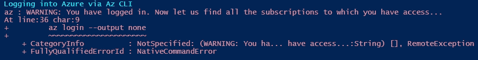

# 休息时间脚本:恢复您的 local.settings.json

> 原文：<https://levelup.gitconnected.com/coffee-break-scripts-restoring-your-local-settings-json-d7e56344185c>

## 使用 PowerShell 从 Azure Functions 实例


对于那些经常使用 Azure 函数的人来说，最平凡的任务之一就是必须在本地开发环境中不断修改和重新创建 local.settings.json 文件。有时候，你需要在不同的环境中调试一个功能应用程序，不断地改变你的本地配置是很痛苦的。如果你的功能 app 已经部署好了，为什么不让 ***PowerShell**** 替你做所有的苦差事呢？

此函数将从已部署的函数应用程序中动态获取应用程序配置设置，并在您的本地计算机上以正确的格式重新创建 local.settings.json。

它支持交互式和非交互式登录(前提是您拥有从指定帐户读取应用配置设置的适当权限)，如下所示:

```
# Interactive Sign-InRestore-AzFunctionLocalSettingsJson -FunctionAppName <function_app_name> -FunctionAppResourceGroup <function_app_resource_group># Non-Interactive Sign-InRestore-AzFunctionLocalSettingsJson -FunctionAppName <function_app_name> -FunctionAppResourceGroup <function_app_resource_group> -ServicePrincipalAppId <service_principal_app_id> -ServicePrincipalAppSecret <service_principal_app_secret> -AzureTenantId <azure_tenant_id> 
-NonInteractive
```

在使用 MFA 的交互式登录流时，我注意到的唯一稍微奇怪的功能是，Az CLI 会引发稍微奇怪的错误——以下面的例子为例，其中的“警告”似乎是我实际上已经登录了。



任务警告成功

然而，好消息是，这与代码本身的运行没有关系——对于那些不希望自己的日志被警告堵塞的人来说，这只是一个小小的烦恼！

希望你会发现这很有用(或者至少可以节省一点时间！)，祝你的 Azure Functions 之旅好运。

****说实话，这主要是 Azure CLI 用 PowerShell 作为包装器来做所有的艰苦工作，所以请确保您的机器上有这个(您可以从这里的***[](https://docs.microsoft.com/en-us/cli/azure/install-azure-cli?view=azure-cli-latest)****下载)！****