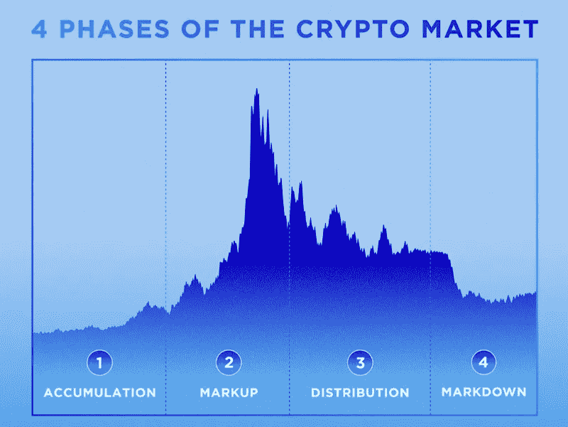

# 比特币基地联合创始人向你展示如何繁荣这个加密循环

> 原文：<https://levelup.gitconnected.com/coinbase-co-founder-shows-you-how-to-thrive-this-crypto-cycle-8774da10360f>

利用他在加密货币周期方面长达十年的经验来构建您的无懈可击的策略。

来源— [范例 CC0 图像](https://www.paradigm.xyz/team/fredehrsam)

在 2013 年 Crypto 下跌期间，30%的员工离开了公司，[比特币基地](https://www.coinbase.com/trade)的联合创始人 Ehrsam 承认那段时间感觉非常孤独。

比特币基地由两个朋友在公寓里创立，现在是美国最重要的加密货币公司

Ehrsam 和他的朋友 Brian Armstrong 创办公司时只有 24 岁，这家公司最终在股票市场首次亮相，市值超过 1000 亿美元。

据报道，这位前职业视频游戏玩家和狂热的《魔兽世界》玩家仍持有比特币基地 8.9%的股份。

厄尔萨姆已经不在比特币基地了；相反，他现在是自己的 Web3 投资公司 [Paradigm](https://www.paradigm.xyz/2021/03/surviving-crypto-cycles) 的联合创始人。

在这里，他分享了他经历加密货币熊市的经历，以及你应该如何思考。

他对 Crypto 中的循环的哲学是，当事情好的时候，它们从来没有看起来那么好，当事情坏的时候，它们从来没有那么坏。

没有人知道当前的低迷会如何结束，但历史告诉我们，每次低迷都会让加密货币空间变得更加强大。

> 弗雷德·厄尔萨姆:
> 
> “周期没有好坏之分；它们是天然的。
> 
> 极度兴奋为世界提供了梦想未来的机会。最底层的绝望迫使现实和清晰。"

Ehrsam 表示，他在 2011 年、2013 年和 2017 年经历了三个重要的市场周期

当市场变得恐惧时，他经历了兴奋的高潮，然后是彻底的绝望和幻灭。

在这里，你将学习他的经验和观察，从生活在多个密码周期，所以你可以避免潜在的陷阱，并最大限度地提高你的成功机会。

# 不要试图预测未来。

密码市场是周期性的。

它们通常遵循一种忽高忽低的模式。当需求超过供给时，硬币的价格就会上涨。然而，一段时间后兴趣开始减弱，价格开始下跌。

这种上升和下降构成一个循环。

一个加密周期有四个阶段，通常需要四年才能完成。

1.  积累(容量低)
2.  加价(新人进入量高)
3.  分销(买方成为卖方)
4.  下调(市场情绪消极恐惧)

来源—[crypto.com](https://crypto.com/university/four-phases-crypto-market-cycle)

Ehrsam 说，预测未来是不可能的，但过去的周期表明未来可能会发生什么。考虑到加密货币机会的规模，波动应该是意料之中的。

> 弗雷德·厄尔萨姆:
> 
> “虽然预测未来是不可能的，但过去的周期让我们知道应该做些什么。
> 
> 它们可以帮助我们想象最近这波兴奋的潜在后果。
> 
> 它们提醒人们，不确定性和波动性是可以预期的”。

# **对过去密码周期的观察。**

循环从不重复，但它们确实押韵。

市场会经历这个过程，元素会重复出现。

如果你为未来的情景做好准备，这会有所帮助，Ehrsam 认为理解这些情景是值得的。

Ehrsam 指出了市场周期中发生的四件事。

*   人们变得高度情绪化。
*   循环加强了回声系统。
*   周期淘汰薄弱的项目。
*   周期创造弹性

# **人变得高度情绪化**。

在加密领域，人们要么获得要么失去大笔的钱，而每一种情况都很难用理性的头脑来处理。

Ehrsam 说，炒作期历来都很短，而横盘或下跌交易期历来都很长。

他回忆说，2013 年，30%的员工在变得沮丧后离开了公司，他承认这让他感到难以置信的孤独。

当谈到市场的涨跌周期时。

> 弗雷德·厄尔萨姆:
> 
> “人们很难理性地应对繁荣期或低迷期”。
> 
> “在比特币基地，我们在 2013 年如日中天，却在 2017 年之前经历了漫长而痛苦的三年”。

# 循环强化了生态系统。

埃赫萨姆认为，Crypto 退出每个周期时都比进入时更强大，这在五年的时间范围内是正确的。

他说，如果你缩小范围，周期看起来不稳定；然而，采用曲线一直呈上升趋势。

> “尽管情绪起伏不定，但在比特币基地，我们走出每一个周期时的状态都比上一个周期结束时更好，无论是从哪一个指标还是从许多倍数来看都是如此”。

# **周期淘汰弱势项目。**

低迷时期是暴露弱势项目并将其赶出市场的绝佳时机。

> 弗雷德·厄尔萨姆:
> 
> “在上行周期中，当涨潮托起所有船只时，糟糕的基本面和有缺陷的策略在下行周期中无情地暴露出来。
> 
> 许多人没能活下来。
> 
> 那些在下跌市场中拥有建立加密投资组合优势的人，通常会在下一个上涨周期到来时茁壮成长。

# 如果你提高了对周期的适应能力，这将会有所帮助。

预测任何市场的具体情况都具有挑战性，所以你必须对它们有弹性。

厄尔萨姆认为，在兴奋或绝望的时候，你能做的最重要的事情就是为自己着想。

> 弗雷德·厄尔萨姆:
> 
> “有时候，他人的经验有助于思考。因此，带着这个警告，下面是我发现的在周期中创造弹性的有效方法。”
> 
> "为马拉松做准备，而不是短跑。"

Ehrsam 认为，如果你长期从事这项工作，挑战性的情况会变得更容易处理，经验也是如此。

> “让你自己去建立这种体验。基础技术的突破带来了巨大的机遇和不确定性，这是周期配方中的两个关键因素”。

# 最后的想法。

一个可以让你戴上帽子的框架可以帮助你在黑暗中导航，尤其是在一个投机性很强的新兴市场。

Ehrsam 提出了一个完美的观点，即最重要的机会是不确定性。

如果每个人都认为加密货币空间是必然的，机会就不会这么大。

使用加密货币周期的四个阶段来构建您的策略，并利用一个绝佳的机会。

> *如果你想在 Web3 上阅读更多我的观点，考虑成为会员吧。你的会员费直接支持你读的作家。如果你用我的链接* [*注册，我会赚一小笔佣金。点击这里*](https://medium.com/@jayden_levitt/membership) *。*

*本文仅供参考；不应将其视为财务、税务或法律建议。在做出任何重大财务决定之前，请咨询财务专家。*