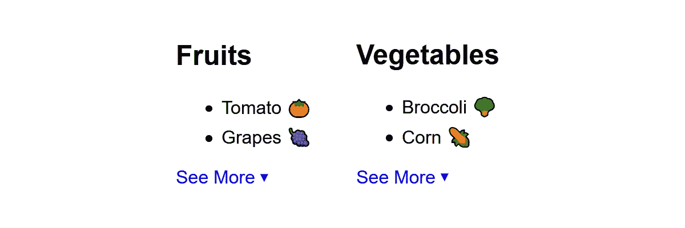

# 有或没有 JavaScript 的可折叠部分

> 原文：<https://levelup.gitconnected.com/collapsible-sections-with-or-without-javascript-3fd871955a9d>



虽然 HTML 5 确实为可折叠部分提供了

<details>和<summary>标签，但从语义的角度来看，这通常是错误的代码。例如，如果你只想在用户点击一个部分之前显示列表的一部分，你就必须把列表分成两个独立的部分，这是语法/结构上的乱码。</summary></details>

当制作这些类型的代码段时，人们通常依赖 JavaScript 来完成。大多数脚本依赖于臃肿的库，并被硬编码到特定的元素。在[他关于折叠部分的好文章](https://medium.com/swlh/writing-a-front-end-component-with-vanilla-js-8a8fbff56299) — *中，这篇文章的灵感* — wrap.classList.add('closed', 'collapseWrap');

} // for hook function toggleCollapse(e) {
e.preventDefault();
e.currentTarget.previousElementSibling.classList.toggle('closed');
} // toggleCollapse})();

我把它放入生活中，这样范围就被隔离了。我们获取所有的元素。折叠后，依次穿过这些钩子。对于每一个，我们获取 parentNode 包装器，在包装器的之后创建一个锚**，分配我们需要这个锚拥有的所有属性，然后向父节点添加类，以表明我们的脚本正在工作——`.collapseWrap` ——并且它是`.closed`。我们的 CSS 只有在`.collapseWrap`存在的情况下才适用，所以编写它的脚本就像打开/关闭不存在一样。**

请注意，如果我们不在锚点上放置 href，它在大多数浏览器中都不会点击，键盘导航会跳过它。同样，我们也没有将任何内容放入锚中，因为我们可以让 CSS 使用生成的内容来控制/更改其中的文本。

当我们的锚被点击时调用的`toggleCollapse`函数简单地阻止了事件，然后切换发起事件的锚的`previousElementSibling`上的`.closed`类，我们知道这是我们对可以折叠的区域的包装。

因此，我们的事件处理程序小而快，这就是为什么我真的提倡“遍历 DOM”而不是每次都试图获取/查询元素。如果你的 HTML 结构是一致的，你可以简单地在`event.currentTarget`的事件处理程序中找到你想要的兄弟/父/子。

## CSS——奇迹发生的地方

```
.collapseAnchor {
  text-decoration:none;
  color:blue;
}.collapseAnchor:before {
  content:"See Less";
}.collapseWrap.closed + .collapseAnchor:before {
  content:"See More";
}.collapseAnchor:after {
  content:"\25B2";
  display:inline-block;
  padding:0.4em 0 0 0.3em;
  vertical-align:top;
  font-size:0.625em;
}.collapseWrap.closed + .collapseAnchor:after {
  content:"\25BC";
}.collapseWrap.closed > .collapseAfter ~ * {
  position:absolute;
  top:-999em;
  left:-999em;
}
```

锚点中的文本首先生成为打开状态，然后使用相邻的兄弟组合符:"+"生成为关闭状态。这很容易让我们为每个状态设置文本。

这个小小的 UTF-8 三角形通常很难在浏览器中正确对齐，但是通过将它设置为内联块并添加一些填充，我们可以看到它应该在的地方，并用边距推动它。当前一个元素关闭时，将其更改为向下箭头。

真正的诀窍是最后一部分。当包装器有了`.closed`类时，我们发现`.collapseAfter`是它的子类，并隐藏它后面的任何同级标签。有些人会说“永远不要使用*选择器”,因为开销问题，但在这种情况下，这是 100%的 bullcookies。它的应用范围受到它前面的组合子的限制，从而将应用/渲染开销减少到零。

隐藏是通过绝对定位来处理的

## 现场演示

这是给你们的笔

## 脚本方法的利与弊

像往常一样，让我们从问题开始。

**缺点**

*   依赖于 JavaScript
*   操作 DOM 的方式可能会让一些不太熟练的开发人员感到困惑
*   如果标记在其他人以后编辑时不保持一致，DOM 操作可能会中断。

**优点**

*   非脚本化或非可视化 UA，内容只是正常显示或访问。这对可访问性和搜索都有好处。
*   我们只需要一个类挂钩来为任何包装好的兄弟元素块添加功能。
*   键盘导航锚
*   锚及其内容在标记中不是静态的。这样做通常会增加非视觉导航的难度。

但是我们能做得更好吗？

# 没有 JavaScript 的方式

要在没有 JavaScript 的情况下做到这一点，我们需要在标记中添加隐藏的输入和标签，作为切换的钩子。请记住，单击一个 LABEL 标签与单击它所包装的任何输入是一样的，或者它是为。后者正是我们这里所需要的。

利润

```
<h2>Fruits</h2>
<input
  type="checkbox"
  id="toggle_fruits"
  class="toggle_collapse"
  hidden
  aria-hidden="true"
>
<ul>
 <li>Tomato 🍅</li>
 <li class="collapseAfter">Grapes 🍇</li>
 <li>Watermelon 🍉</li>
 <li>Mango 🥭</li>
 <li>Peach 🍑</li>
</ul>
<label for="toggle_fruits" hidden aria-hidden="true"></label><h2>Vegetables</h2>
<input
  type="checkbox"
  id="toggle_vegetables"
  class="toggle_collapse"
  hidden
  aria-hidden="true"
>
<ul>
 <li>Broccoli 🥦</li>
 <li class="collapseAfter">Corn 🌽</li>
 <li>Carrot 🥕</li>
 <li>Eggplant 🍆</li>
</ul>
<label for="toggle_vegetables" hidden aria-hidden="true"></label><h2>Test Section</h2>
<input
  type="checkbox"
  id="toggle_testSection"
  class="toggle_collapse"
  hidden
  aria-hidden="true"
>
<div>
  <p class="collapseAfter">
    The first paragraph will show all the time, however later paragraphs will not. This method works on ANY markup so long as there's a common parent wrapper, such as a <code>&lt;div&gt;</code>
  </p><p>
    Lorem ipsum dolor sit amet, consectetur adipiscing elit. Vivamus vel nibh et dolor dignissim tempor vel vel ante. Fusce vehicula vitae elit eu commodo. Vivamus consectetur diam vitae ligula gravida, sit amet dignissim libero ultricies. Sed at efficitur dolor, ut eleifend arcu. Ut porta volutpat lobortis. Nullam sit amet est ac mauris sollicitudin ultricies. Donec maximus, velit vel lacinia faucibus, odio urna suscipit sem, at tincidunt tortor leo id orci. Nam iaculis tristique ligula. Vivamus urna ligula, iaculis a tellus sed, feugiat venenatis tellus. Maecenas ullamcorper neque at vestibulum cursus. Ut urna sapien, tempus ut ornare eget, ultrices vitae nisl.
  <p><p>
    Interdum et malesuada fames ac ante ipsum primis in faucibus. Duis commodo dui lectus, id elementum lectus condimentum a. Maecenas feugiat ornare lorem, ac tincidunt purus ultricies eget. Ut fringilla pharetra mi sed sodales. Cras accumsan eleifend massa, et ullamcorper ante tempus ut. Nam dolor diam, finibus a felis et, lacinia viverra dui. Donec magna leo, vestibulum id urna sit amet, dapibus pharetra orci. Sed sodales et erat sed egestas. Phasellus condimentum tempus urna, id facilisis ligula maximus vel.
  </p>
</div>
<label for="toggle_testSection" hidden aria-hidden="true"></label>
```

使用`hidden`和`aria-hidden=”true”`属性告诉所有用户代理忽略这些元素。为了使它们不被所有屏幕媒体忽略，我们需要在 CSS 中将它们设置为显示状态。

记住，在产品中，你所有的 CSS 都应该通过<link>和一个适合你目标设备的`media=””`来包含。在我们的例子中是“屏幕”。如果你看到一个样式表`<link>`或`<style>`缺少 media=" *something* "或设置为 media="all "，你看到的是 web 开发中令人讨厌的 3i:无知、无能和不称职。*是的 bootcrap，tailwind，还有其他的，* ** *我在跟你说话！***

## CSS——更加神奇

```
.toggle_collapse {
  /* make it show to work across all ua's */  
  display:block; 
}.toggle_collapse, /* hide off screen */
.toggle_collapse + * > .collapseAfter ~ * {
 position:absolute;
 top:-999em;
 left:-999em;
}.toggle_collapse:checked + *  .collapseAfter ~ * {
  position:static;
}.toggle_collapse + * + label {
  display:inline-block; /* make visible for screen media */
  color:blue;
}.toggle_collapse + * + label:before {
 content:"See More";
}.toggle_collapse:checked + * + label:before {
 content:"See Less";
}.toggle_collapse + * + label:after {
 content:"\25BC";
 display:inline-block;
 padding:0.4em 0 0 0.3em;
 vertical-align:top;
 font-size:0.625em;
}.toggle_collapse:checked + * + label:after {
 content:"\25B2";
}
```

与我们的脚本版本惊人地相似。首先，我们必须让我们的“隐藏”元素显示出来，以便它们在屏幕媒体上可以正确地通过键盘导航，但是我们仍然希望它们隐藏起来，所以我们将它们移出屏幕。将它们隐藏在屏幕之外的代码与我们的隐藏状态共享，因为两者需要做同样的事情。

隐藏状态的选择器要复杂得多:

```
.toggle_collapse + * > .collapseAfter ~ * {
```

基本上，无论什么标签紧跟在我们的`INPUT.toggleCollapse` 之后，我们都会寻找一个 collapseAfter 子标签，并隐藏它之后的所有兄弟标签。同样，有些人会因为使用 any 元素选择器而紧张，这样做只会显示出他们的无知。

由于选中状态将是我们的关闭状态，我们最终不得不交换关闭/打开文本和箭头…但在大多数情况下，CSS 的工作方式与脚本版本几乎相同。

**现场演示**

## 非脚本版本的优缺点

你也必须权衡这样做的各种问题。

**缺点**

*   更多的标记
*   对于那些不熟悉以这种方式滥用隐藏输入的人来说，标记令人困惑
*   不知道“hidden”或“aria-hidden”的较老的 UA 在没有应用 CSS 时会被挂起，或者使用户对输入标签感到困惑。

**优点**

*   没有 JavaScript，甚至适用于访问脚本被阻止/禁用/不可用的屏幕媒体用户！
*   在现代用户界面中，屏幕阅读器、盲文阅读器、搜索引擎或其他非视觉用户界面不存在令人不快的额外元素
*   输入的键盘导航*(尽管可能会添加一些额外的 CSS 来使其更加明显)*

# 结论

这两种方法都有优点。脚本版本真的很好，因为你所要做的就是确保有一个通用的包装器，并在你希望中断/折叠发生的地方应用这个类。只要你在一个屏幕媒体设备上，非脚本化的就能工作。两者都优雅地退化为非视觉化和非脚本化的可用性和可访问性，因为每一个努力都被投入到点点滴滴和跨越 I…*或…嗯…什么的。*

如今，CSS 让我们做的事情确实令人惊讶，但仍然有很好的理由使用 JavaScript，只要你“把它放在裤子里”，让 CSS 做大部分“真正的工作”。在这两种方法中，我实际上向知道自己在做什么的人推荐 CSS 方法，向初学者或喜欢只需要一个类就能应用它的便利的人推荐 JavaScript 方法。老实说，我会根据具体情况做出决定。