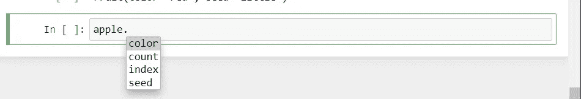

# Python 中的集合模块

> 原文：<https://levelup.gitconnected.com/collections-module-in-python-4db4bfda6d31>

## 了解和实现 Python 模块“集合”的详细指南


贝丝·Jnr 在 [Unsplash](https://unsplash.com?utm_source=medium&utm_medium=referral) 上的照片

集合模块是 Python 中的内置模块。它实现了专门的容器数据类型，而不是像字典、列表、集合和元组这样的基本类型。

本模块提供的备选方案如下:

# 计数器

Counter 是一个字典子类，帮助计算可散列的对象。其中的元素存储为字典键，对象的计数存储为值。

所以还是先导入吧。

```
**from** collections **import** Counter
```

现在我们将创建一个包含多个数字元素的列表，并对元素进行计数。同样的事情也会发生在字符串上。

```
>>> list1 **=** [11,11,22,33,44,55,44,44,33,33,77,66]>>> Counter(list1)
Counter({11: 2, 22: 1, 33: 3, 44: 3, 55: 1, 77: 1, 66: 1})>>> str1 **=** "aaabbbeeedddihhh">>> Counter(str1)
Counter({'a': 3, 'b': 3, 'e': 3, 'd': 3, 'i': 1, 'h': 3})
```

现在我们将使用计数器来计算一个句子中的单词。

```
>>> str2 **=** 'Python is fun fun, Python is cool, it is really fun'
>>> words **=** str2.split()>>> Counter(words)
Counter({'Python': 2,
         'is': 3,
         'fun': 2,
         'fun,': 1,
         'cool,': 1,
         'it': 1,
         'really': 1})
```

现在让我们来看看一些反制的方法。

```
c **=** Counter(words)
```

为了得到最常用的单词，我们做了以下工作。在括号里，我们可以提到我们需要多少个常用词。

```
>>> c.most_common(3)
[('is', 3), ('Python', 2), ('fun', 2)]
```

以获得所有计数的总和。

```
>>> sum(c.values())
11
```

列出独特的元素。

```
>>> list(c)
['Python', 'is', 'fun', 'fun,', 'cool,', 'it', 'really']
```

转换为集合、字典、列表(元素、计数)对。

```
>>> set(c)
{'Python', 'cool,', 'fun', 'fun,', 'is', 'it', 'really'}>>> dict(c)
{'Python': 2, 'is': 3, 'fun': 2, 'fun,': 1, 'cool,': 1, 'it': 1, 'really': 1}>>> list_of_pairs **=** c.items()
list_of_pairs>>> dict_items([('Python', 2), ('is', 3), ('fun', 2), ('fun,', 1), ('cool,', 1), ('it', 1), ('really', 1)])
```

从(元素，计数)对列表转换

```
>>> Counter(dict(list_of_pairs))
Counter({'Python': 2,
         'is': 3,
         'fun': 2,
         'fun,': 1,
         'cool,': 1,
         'it': 1,
         'really': 1})
```

得到 n 个最少的公共元素。考虑 n=4

```
>>> c.most_common()[:**-**4**-**1:**-**1]
[('really', 1), ('it', 1), ('cool,', 1), ('fun,', 1)]
```

要删除零和负计数

```
c **+=** Counter()
```

重置所有计数。

```
>>> c.clear()>>> c
Counter()
```

# 默认字典

这是一个类似字典的对象，它提供了字典提供的所有方法，但是将第一个参数(default_factory)作为字典的默认数据类型。这样做的特点是比做 dict.set_default 方法快。此外，defaultdict 永远不会引发 KeyError。任何不存在的键都将获得默认工厂返回的值。

```
**from** collections **import** defaultdict
```

我们先创建一个普通的字典，求一个字典里没有的键。您将观察到它将引发一个关键错误。

```
>>> dict1 **=** {'key1':11}>>> dict1
{'key1': 11}>>> dict1['key1']
11>>> dict1['key2']
**---------------------------------------------------------------------------**
**KeyError**                                  Traceback (most recent call last)
**<ipython-input-39-21a28621eabd>** in <module>
**----> 1** dict1**['key2']****KeyError**: 'key2'
```

现在让我们创建一个 defaultdict 并做同样的事情。

```
>>> dict2 **=** defaultdict(object)>>> dict2['key1']
<object at 0x18ec393dff0>
```

因此，正如您所看到的，字典中没有键，但是当我们调用一个键时，它没有引发错误。事实上，它返回了它是一个对象以及地址。它是一个对象，因为它是我们所提到的。通常，这也和 lambda 函数一起使用，在这里我们提到应该分配给键的默认值。

```
>>> dict3 **=** defaultdict(**lambda**:0)>>> dict3['key1']
0>>> dict3['key2'] **=** 1>>> dict3
defaultdict(<function __main__.<lambda>()>, {'key1': 0, 'key2': 1})
```

# 有序直接

OrderedDict 是一个字典子类，它记住其内容的添加顺序。

```
**>>> from** collections **import** OrderedDict>>> dict4 **=** OrderedDict()>>> dict4['apple'] **=** 1
>>> dict4['mango'] **=** 5
>>> dict4['grapes'] **=** 3
>>> dict4['guava'] **=** 2
>>> dict4['pear'] **=** 5>>> dict4
OrderedDict([('apple', 1),
             ('mango', 5),
             ('grapes', 3),
             ('guava', 2),
             ('pear', 5)])**>>> for** key,value **in** dict4.items():
        print (key, value)apple 1
mango 5
grapes 3
guava 2
pear 5
```

如你所见，配对的添加方式与它们的排序方式相同。现在考虑 2 本字典。

```
>>> d1 **=** OrderedDict()>>> d1['key1'] **=** 1
>>> d1['key2'] **=** 2>>> d2 **=** OrderedDict()>>> d2['key2'] **=** 2
>>> d2['key1'] **=** 1>>> print(d1 **==** d2)
False
```

即使两个字典中的元素相同，它也会返回 false，因为它们是以不同的顺序添加的。现在如果我们考虑一个普通的字典，它将返回 True。

```
>>> d1 **=** {}>>> d1['key1'] **=** 1
>>> d1['key2'] **=** 2>>> d2 **=** {}>>> d2['key2'] **=** 2
>>> d2['key1'] **=** 1>>> print(d1 **==** d2)
True
```

# 命名元组

标准元组使用数字索引来获取任何元素，如下所示。

```
>>> t1 **=** (11,22,33)>>> t1[1]
22
```

然而，在元组非常大的情况下，很难记住使用哪个索引。namedtuple 为每个成员分配名称和数字索引。

每种 namedtuple 都由自己的类表示，该类是使用 namedtuple()工厂函数创建的。

命名元组可以被认为是创建带有一些属性字段的新对象/类类型的一种非常快速的方法。

```
**from** collections **import** namedtuple
```

参数是新类的名称和一个包含元素/属性名称的字符串。

```
>>> Fruit **=** namedtuple('Fruit', 'color seed')>>> apple **=** Fruit(color**=**'red', seed**=**'little')>>> apple
Fruit(color='red', seed='little')
```

所以现在类已经创建好了，你可以像往常一样使用它了。除了使用索引调用成员之外，您还可以调用属性。



```
>>> apple.color
'red'>>> apple[1]
'little'
```

此处参考笔记本[。](https://github.com/jayashree8/Python_guide/blob/master/Python%20modules%20and%20packages/Collections%20module%20in%20Python.ipynb)

## 学习 Python 可以参考的入门书籍:

[](https://amzn.to/3yDY4To) [## Python 速成班，第二版:基于项目的编程入门实践

### 世界上最畅销的 Python 书籍的第二版。一个快速的，没有废话的 Python 编程指南…](https://amzn.to/3yDY4To) [](https://amzn.to/3vtvQZv) [## 艰难地学习 Python:一个非常简单的介绍可怕的美丽世界…

### 你会学习 Python！Zed Shaw 完善了世界上最好的学习 Python 的系统。遵循它，你会…](https://amzn.to/3vtvQZv) [](https://amzn.to/3urluYI) [## 思考 Python，2e:如何像计算机科学家一样思考

### 思考 Python，2e:如何像计算机科学家一样思考](https://amzn.to/3urluYI) 

## 学习 Python 可以参考的高级书籍:

[](https://amzn.to/3fMzVBn) [## 编程 Python:强大的面向对象编程

### 如果你已经掌握了 Python 的基础，你就可以开始使用它来完成真正的工作了。编程 Python 将…](https://amzn.to/3fMzVBn) [](https://amzn.to/34oFFMl) [## 高级 Python 编程:使用以下工具构建高性能、并发和多线程应用

### 关键特性使用 Dask 和 PySpark Master 技能在集群上设置和运行分布式算法，以准确地…](https://amzn.to/34oFFMl) 

> *联系我:* [*领英*](https://www.linkedin.com/in/jayashree-domala8/)
> 
> *查看我的其他作品:* [*GitHub*](https://github.com/jayashree8)