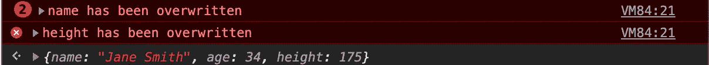

# JavaScript 对象冲突

> 原文：<https://levelup.gitconnected.com/colliding-javascript-objects-80257a58dcd0>

如何合并物体和处理它们的碰撞。


物体碰撞

合并 Javascript 对象是一个经常讨论的话题。快速搜索会找到很多文章和合并对象的方法。他们中的大多数没有谈到当两个或更多的被合并的对象具有相同的键时会发生什么。很多教程会“非常方便地”使用合并时不会有碰撞的例子。

让我们来看看最现代和最简单的合并对象的方法。展开语法:[let objClone = {…obj }；](https://developer.mozilla.org/en-US/docs/Web/JavaScript/Reference/Operators/Spread_syntax)ECMAScript 2018 中引入。

```
let object1 = {
  name: 'John Smith',
  age: 34
}

let object2 = {
  name: 'Mark Smith',
  height: 180
}let object3 = {
  name: 'Jane Smith',
  height: 175
}let object4 = {...object1, ...object2, ...object3 }/*
  {name: "Jane Smith", age: 34, height: 175}
*/
```

从上面我们可以看到，当所有的物体被合并时，我们实际上由于碰撞而丢失了数据。唯一没有出现问题的关键值是“年龄”。值**名称**和**高度**已经根据它们在序列中的放置顺序被覆盖。

虽然这像预期的那样工作，但是如果您没有意识到存在冲突，它将会在没有警告的情况下继续运行，从而导致潜在的数据丢失。虽然这种合并方法绝对是最简单和最容易理解的，但它可能并不是在所有情况下都是理想的。

# Object.assign({}，`object1`，`object2, object3`)；

```
let object1 = {
  name: 'John Smith',
  age: 34
}

let object2 = {
  name: 'Mark Smith',
  height: 180
}let object3 = {
  name: 'Jane Smith',
  height: 175
}let object4 = Object.assign({}, object1, object2, object3);/*
  {name: "Jane Smith", age: 34, height: 175}
*/
```

从上面可以看出，它的行为与“扩展”操作符完全相同，当发生冲突时，最后添加的对象优先。虽然这是意料之中的，但我们还是不知道有冲突，除非您事先知道，或者您后来发现(希望不是在生产中)有丢失的值。

# 带警报的自定义功能

如果你对以上两种方法的工作方式感到满意，并且你知道你的物体不会碰撞，那么就没有任何问题。如果您确实想知道何时发生冲突，那么您将需要使用一个自定义函数，当发生冲突时，该函数要么失败，要么发出警告。

```
let object1 = {
  name: 'John Smith',
  age: 34
}

let object2 = {
  name: 'Mark Smith',
  height: 180
}let object3 = {
  name: 'Jane Smith',
  height: 175
} function mergeObjs (...objects) {  
  let target = {};
  // Merge the object into the target object
  function merger (obj) {
    for (let prop in obj) {
      // Check if target already has this property
      if (target.hasOwnProperty(prop)) {
        console.error(`${prop} has been overwritten`);
      } 
      target[prop] = obj[prop];
    }
  };
  // Loop through each object and conduct a merge
  for (let i = 0; i < objects.length; i++) {
    merger(objects[i]);
  }
  return target;
}mergeObjs(object1, object2, object3);
```



从上图可以看出，生成的对象与 spread 操作符和 Object.assign 方法完全相同。主要的区别是，当对象碰撞时，我们现在有一个警告，因为当**名称**和**高度**都被覆盖时，它们都抛出了一个控制台错误。

总之，虽然很容易找到简单问题的解决方案，但它们并不总是以我们期望的方式运行。在我们的碰撞问题中，简单的解决方案会产生意想不到的后果，导致数据丢失。通过自己处理对象合并，我们有了解决碰撞问题的方法。