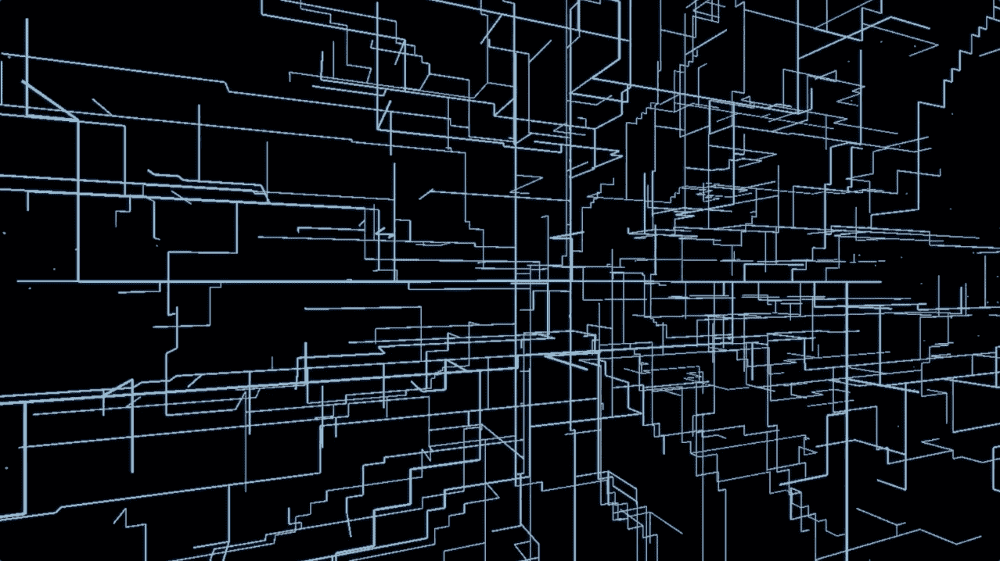
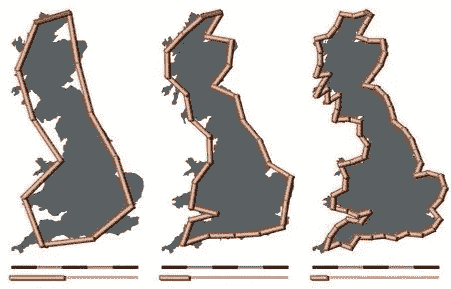
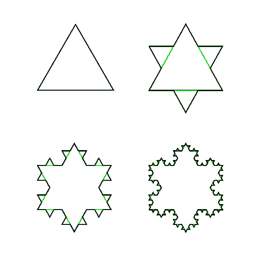
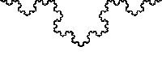
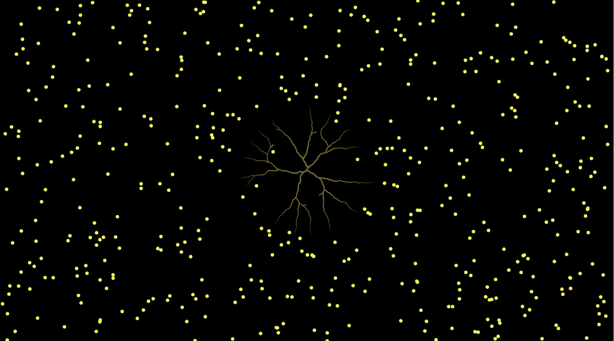
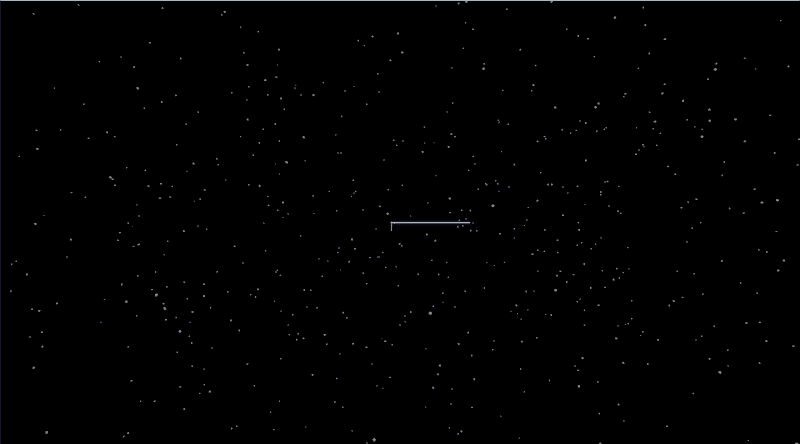

# 用分形树开拓空间

> 原文：<https://levelup.gitconnected.com/colonize-space-with-fractal-trees-ecd6cbb6e78c>

## 分形和空间殖民算法快速指南

[我的 P5.js 实现](https://logancyang.com/simulations/charting/charting.html)

在这篇文章中，我将编写一些特殊的曲线形状，它们可能不会很快帮助我们殖民银河系，但可能会改变你的想法，让数学再次变得有趣。这个主题叫做**分形**。

# 什么是分形？

在回答这个问题之前，我们先来看一些例子。想想英国海岸线的长度。你认为有多长？稍微搜索一下，你可能会发现:

> 根据英国测绘局的数据，为 11，073 英里

但是它也提到了一种叫做 ***海岸线悖论*** 的东西。显然，回答这个问题并不像我们想象的那么简单！

[维基百科](https://upload.wikimedia.org/wikipedia/commons/2/20/Britain-fractal-coastline-combined.jpg)

图中显示长度取决于*你用来测量它的最小单位*。如果你放大海岸线的一部分，你会看到类似的曲线，和大图中的一样。理论上，你可以在上面无限放大*，仍然可以看到那些弯弯曲曲的曲线。这意味着如果你有无限的分辨率，长度也会接近无限。这有多违反直觉？*

*这是另一个例子。假设我们有一个等边三角形，我们对每条边做如下操作:*

1.  *将边分成 3 等份*
2.  *画一个较小的等边三角形，以中间的线段为底边，向外指向*
3.  *在步骤 2 中移除小三角形的底部线段*

*一次又一次地重复这个过程，我们从三角形变成了像雪花一样的东西。*

**

*[维基百科](https://en.wikipedia.org/wiki/Koch_snowflake#/media/File:KochFlake.svg)*

*这被称为**科赫雪花**，或**科赫曲线**，以瑞典数学家*黑尔格·冯·科赫*的名字命名，他在 1904 年的一篇论文中介绍了这一曲线。如果我们永远重复这个过程，科赫雪花的周长是多少？是**无穷大**！因为在这个过程的每一步中，我们得到的周长是前一步的 1/3 倍。周长呈指数增长并发散。就像海岸线一样，当你放大它时，你会得到相似的(在这种情况下，完全相同的)结构。*

**

*[维基百科](https://en.wikipedia.org/wiki/Koch_snowflake#/media/File:Kochsim.gif)*

*然而，科赫雪花的面积显然是有限的，因为*我们总是可以画一个圆把它包围起来*。这不是很神奇吗？*

*好吧…这些分形的东西到底是什么？让我们试着得到一个定义。*

# *定义*

*分形这个术语是数学家伯努瓦·曼德尔布罗在 1975 年创造的。它意味着破碎或断裂。*

> ***一个结构需要有 3 个属性才能成为分形:***
> 
> ***1。自相似性:当你放大它时，它看起来与整体相似(或完全相同)。***
> 
> ***2。小尺度下的精细结构。***
> 
> ***3。从递归定义生成***

*我上面描述的生成 Koch 雪花的过程是递归过程的一个很好的例子。*

*分形不仅看起来很有趣，而且在测量理论、自然科学、技术和艺术方面也有很大的意义。它在混沌理论领域特别相关。如果你感兴趣，你可以阅读其他一些著名的分形:*

*   *[康托尔集](https://en.wikipedia.org/wiki/Cantor_set)*
*   *[曼德勃罗集](https://en.wikipedia.org/wiki/Mandelbrot_set)*
*   *[Sierpiński 三角形](https://en.wikipedia.org/wiki/Sierpiński_triangle)*
*   *[奇怪的吸引子](https://en.wikipedia.org/wiki/Attractor#Strange_attractor)*

*现在，我将向你展示如何使用一种叫做 [**空间殖民**](http://algorithmicbotany.org/papers/colonization.egwnp2007.html) 的算法来创建分形树。这绝对是算法最酷的名字之一！我们开始吧！*

# *2D 的太空殖民*

*该算法通过捕捉预先生成的“树叶”来创建分形。这些叶子通常是随机生成的，以填充目标空间，并且*它们吸引附近的树枝向它们生长*。*

*我们首先定义 3 个类:`Leaf`、`Branch`和`Tree`。*

*(我使用的是 P5.js，但是你可以使用任何你想要的渲染器。下面的算法不依赖于特定的技术)*

## *叶子*

*`Leaf`的构造器创建了一个随机的 2D 点和一个布尔标志`reached`,用于跟踪一个分支是否到达它。*

*它还有一个`show()`方法在画布上呈现这个叶子。*

## *树枝*

*一个分支由它的**位置**、它的**父分支的位置**和一个从它的父分支复制的**方向**来表示。该方向可用于为其子代创建新的方向。*

*`Branch`对象的属性:*

*   *`parent`:母分公司*
*   *`pos`:位置*
*   *`dir`:方向*
*   *`originDir`:跟踪父母的方向*
*   *`count` : #找到这个分支最近的叶子*
*   *`stepSize`:调整增长速度的参数*

*`Branch`也有*

*   *`reset()`:将方向设置回`originDir`(父方向)，将`count`设置为 0。它在每次`grow()`通过后被调用。*
*   *`show()`:将分支渲染为从其父位置到其位置的直线。*

## *树*

*一个`Tree`有属性:*

*   *一排树叶*
*   *一排树枝*
*   *一个`maxDistance`和一个`minDistance`:定义什么是“附近的”,以便树叶对相关树枝施加吸引力*

*以及空间殖民算法的核心方法`grow()`。*

*要显示该树，只需定义一个`show()`，它调用我们之前定义的`Leaf`和`Branch`的`show()`。*

*在增长我们的树之前，需要在以下步骤中初始化它:*

1.  *它需要一个根作为分支中的第一个元素。这个根是一个`Branch`对象，有位置，有方向，没有父对象。*
2.  *所有的叶子都需要生成。*
3.  *作为`grow()`的先决条件，根需要长到某些叶子附近，才能开始吸引过程。*

## *种植树木*

*这是这个算法最关键的部分。它由 3 个高级部分组成:*

1.  *在所有的叶子和树枝上画一个双圈，以示“吸引”。*
2.  *在每个相关分支的“方向”向量上应用“吸引力”。如果一个分支被识别为最接近多个叶子，则吸引力被累积*。**
3.  **在先前分支的末端使用先前计算的方向生长新的分支。**

**我想关注的一步是确定一个新的方向。对于每个`leaf`和`closestBranch`对，**

*   **得到向量(closestBranch -> leaf)，*规格化*它。**
*   **将这个归一化向量添加到`closestBranch`的方向向量中，该向量将被用作其子分支的方向。再次注意，这个方向是*累积的*，所有的叶子共享这个`closestBranch`。**
*   **增加`closestBranch`的计数，记录共享它的叶子的数量，换句话说，可以影响它的累积方向。**

**创建子分支时，方向除以分支的`count`。这一步是当周围有太多叶子时减缓生长，以便在未来的通道中有更多的机会到达这些叶子。**

**如果你真的编写了这个算法，你会发现有些树叶不会被树捕获。这是因为树枝长得太快，太大了，或者正好在一些树叶中间，吸引力被抵消了。为了避免这种现象，我们可以在每个新分支的方向上添加一个小的随机扰动，并根据需要使`stepSize`变小。**

**除了我刚才提到的主要观点外，还有一些细节需要注意。遗漏一个细节会给你带来麻烦。一个特别容易错过的是在一次`grow()`通过后*重置所有分支计数和方向*。**

**我不会用代码搞乱页面，但是你可以在这里找到它。结果如下所示。**

****

**[我的 P5.js 实现](https://logancyang.com/simulations/fractals/space_colonization.html)**

# **太空殖民:3D 的一个变种**

**我发现观察 3D 空间中的垂直线很令人满意，所以我对上面的算法进行了一点调整，以生长一棵分支在正交方向 x，y 和 z 上的分形树。我调整的地方是决定新分支方向的部分。**

**这个想法很简单。**

1.  **获取向量(closestBranch -> leaf)，归一化它，和前面一样。**
2.  **找到最大的 x，y，z 分量，并将其设置为新方向。**

**就是这样。让它变成 3D 的方法就更简单了。只需在代码中的所有坐标上添加一个`z`组件即可。**

**结果如下所示。也可以在浏览器直播[这里](https://logancyang.com/simulations/charting/charting.html)观看。(P5.js 在 3D 中旋转的线条太多显得比较慢。如果缩小窗口并刷新，它会运行得更快。)**

****

**[我的 P5.js 实现](https://logancyang.com/simulations/charting/charting.html)**

# **摘要**

**分形是惊人的结构，不仅在智力上引人入胜，而且在各种应用中也非常有价值。这是一个伟大的演习，以编码他们，并欣赏其魔力。如果你想了解更多关于在 P5.js 中可视化分形和处理的信息，请查看丹尼尔·希夫曼的[精彩编码训练 YouTube 视频](https://www.youtube.com/playlist?list=PLRqwX-V7Uu6bXUJvjnMWGU5SmjhI-OXef)！**

# **资源**

*   **编码训练[视频](https://www.youtube.com/playlist?list=PLRqwX-V7Uu6bXUJvjnMWGU5SmjhI-OXef)**
*   **[https://en.wikipedia.org/wiki/Fractal](https://en.wikipedia.org/wiki/Fractal)**
*   **[https://en.wikipedia.org/wiki/Coastline_paradox](https://en.wikipedia.org/wiki/Coastline_paradox)**
*   **[太空殖民论文](http://algorithmicbotany.org/papers/colonization.egwnp2007.html)**

***见我在* [*中*](https://medium.com/@loganyang) *上的其他帖子，或者关注我在* [*上的推特*](https://twitter.com/logancyang) *。***