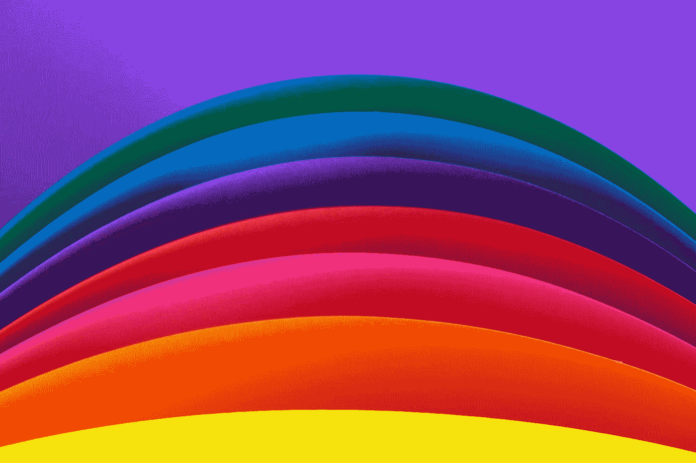
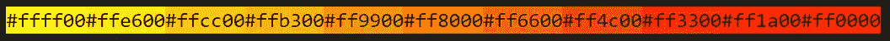
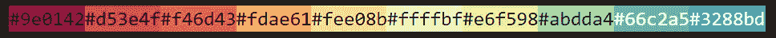
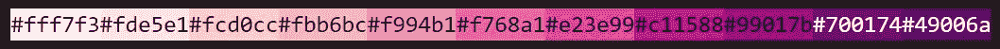
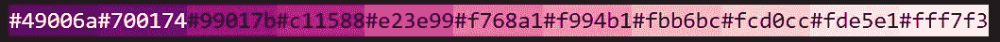

# 带有 Chroma.js 的 JavaScript 中的色阶

> 原文：<https://levelup.gitconnected.com/color-scales-in-javascript-with-chroma-js-b9f59d2a68d7>

## 用这个强大的小 JavaScript 库给你的应用着色！



丹尼尔·利维斯·佩鲁西在 Unsplash[拍摄的照片](https://unsplash.com?utm_source=medium&utm_medium=referral)

许多开发人员用 CSS 设计颜色代码和比例，从一些在线调色板中挑选颜色。然而，它并不是每个人都喜欢的工具。好消息是我们有 Chroma.js，这是一个很小的库，对于在 JavaScript 代码中生成色阶有很大的帮助。这意味着您可以将它直接插入到您的 JavaScript 框架中！

## 我们开始吧！

# 安装

在您的 web 应用程序中，您可以在 HTML 文档中使用来自 CDNJS 的链接

```
**<script src="**[**https://cdnjs.cloudflare.com/ajax/libs/chroma-js/2.1.0/chroma.min.js**](https://cdnjs.cloudflare.com/ajax/libs/chroma-js/2.1.0/chroma.min.js)**" integrity="sha512-yocoLferfPbcwpCMr8v/B0AB4SWpJlouBwgE0D3ZHaiP1nuu5djZclFEIj9znuqghaZ3tdCMRrreLoM8km+jIQ==" crossorigin="anonymous"></script>**
```

或者，您也可以使用 NPM 安装它。

```
**$ npm install chroma-js**
```

# 用法示例

您可以简单地用`chroma.scale([<color1>,<color2>, ... , <color n>])`函数在您的 JavaScript 代码中创建一个色标，它将在您指定的颜色之间创建色标。

例如，您可以使用以下脚本创建从黄色到红色的色标:

```
**var color_scale = chroma.scale([‘yellow’, ‘red’]);**
```

然后，您可以通过以下方式访问 RGB 或十六进制代码中的颜色

```
**color_scale(0).rgb()    // [255, 255, 0]
color_scale(0.1).rgb()  // [255, 230, 0]
color_scale(0.2).rgb()  // [255, 204, 0]
color_scale(0.3).rgb()  // [255, 179, 0]
...
color_scale(1.0).rgb()  // [255, 0, 0]**===================================**color_scale(0).hex()    // "#ffff00"
color_scale(0.1).hex()  // "#ffe600"
color_scale(0.2).hex()  // "#ffcc00"
color_scale(0.3).hex()  // "#ffb300"
...
color_scale(1.0).hex()  // "#ff0000"**
```



**从 chroma.scale(['yellow '，' red'])** (作者)

您可以使用色标进行更多选择，例如，基于 [ColorBrewer](https://colorbrewer2.org/#type=sequential&scheme=BuGn&n=3) 的色标。混合更多的颜色代码。

这里还有一些例子:

```
**chroma.scale('Spectral');**
```



**从 chroma . Scale(‘Spectral’)**输出的 10 级色阶(作者)

```
**chroma.scale('RdPu');**
```



**从 chroma.scale('RdPu')** (作者)输出的 10 级色阶

```
**chroma.scale('RdPu').domain([1,0]);** // reverse color scales
```



**从 chroma . Scale(‘RdPu’)输出的 10 级色阶。域名([1，0])** (作者)

## 差不多就是这样！

如果你喜欢这个工具，你可以在 https://gka.github.io/chroma.js/[找到更高级的教程，如果你需要缩放方法中的颜色处理组合。总的来说，我希望您喜欢这篇文章，并且能够将这个工具应用到您的应用程序或项目中。](https://gka.github.io/chroma.js/)

安全**健康**健康！祝编码愉快！

**感谢您的阅读。👋**😄

[](https://medium.com/@JoeTS)