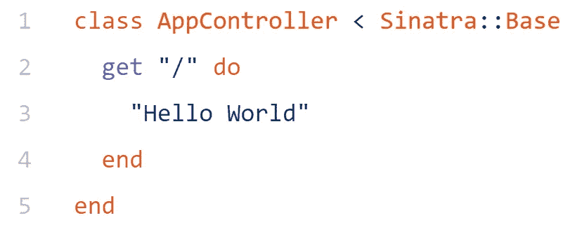
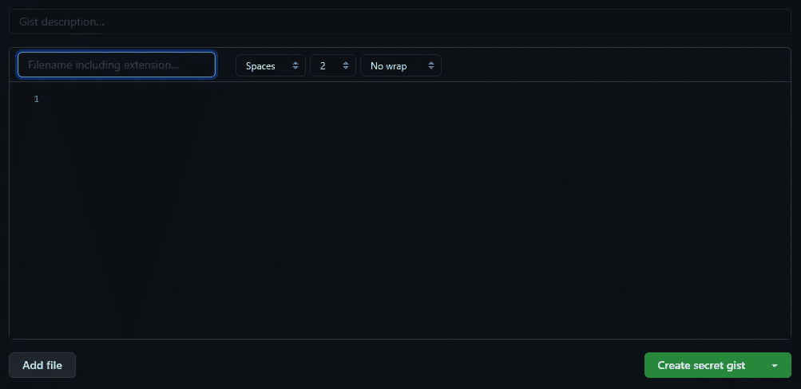
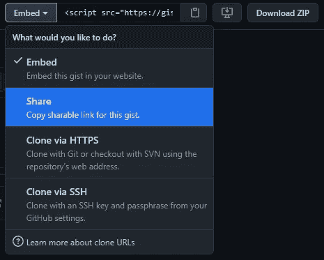
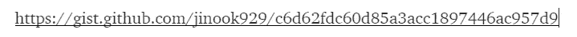
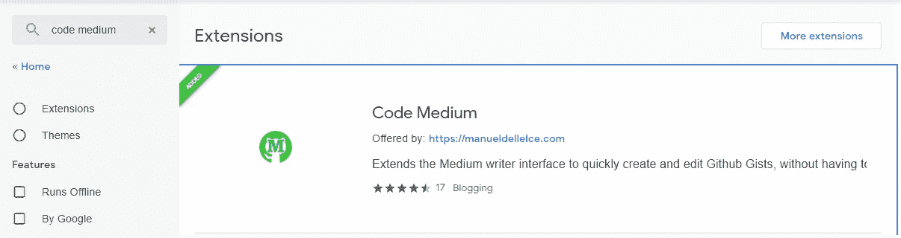

# Medium.com 的彩色代码片段

> 原文：<https://levelup.gitconnected.com/colored-code-snippet-for-medium-com-4129fda9e0d5>



我们想要中号的！！！

如果你是一名软件工程师(或者至少是该领域的一名学生)，并且在 Medium.com 上拥有自己的博客账户，那么很有可能你会感受到我很久以来的感受。我们需要更好的代码片段！

通过使用三重反勾号(` ``),您可以对代码片段(更像块)做以下工作:

```
class AppController < Sinatra::Base
  get "/" do
    "Hello World"
  end
end
```

它实际上是交流，但是……我们想要更多，比如行号或彩色化。有办法吗？有，有！我将与你分享两种方法，但是，在此之前，请确保你有一个 [Github](http://www.github.com) 帐户(我假设你已经有一个作为软件 engineer~^^的帐户)，因为你需要它。

# 方法一。使用 GithubGist 添加嵌入

第一种方法是在媒体中使用“添加嵌入”功能。它看起来是这样的:


这是当你有一个新的段落时你所看到的。点击加号圈！


你能找到“添加嵌入”选项吗？？？

在弹出的圆圈中，选择带有<>的那个，现在你只需要一个 GithubGist 的嵌入地址。要访问您的 [GithubGist](http://gist.github.com) 账户，您只需在您的 Github 地址的“[https://gist.github.com/your_account_name/](https://gist.github.com/jinook929/)”中添加“ ***gist*** ”代替“ ***www*** ”

然后，在右上角您会看到 3 个图标:


通知，加，帐户

单击“+”图标，您将看到一个代码片段框:



在黑暗模式下

将描述放在顶部，用行号和颜色填充文件名和代码*。完成后，只需点击右下角的绿色按钮(您可以选择'*秘密*'或'*公开*')。转到您的代码片段页面，您会看到:*


就在前面提到的 3 个图标下面

将“**嵌入**改为“**共享**”:



然后，复制地址并粘贴到媒体'添加一个嵌入'选项，并输入！


还记得那个带'<>'的圈吗？


您将看到以下说明。



现在粘贴您的共享地址，并输入！

Tada！！！您的中型博客中有一个漂亮的代码片段。

# 方式二。使用浏览器扩展，代码媒介

在中型博客中拥有漂亮彩色代码片段的另一种方法是使用浏览器扩展。要使用这个扩展，你需要 Chrome 或者 Firefox。Code Medium 是一个浏览器扩展，允许您将 GithubGist 代码框直接带入您的媒体编辑窗口。



谷歌 Chrome 网络商店的搜索结果

你只需将这个扩展添加到你的 Chrome(火狐浏览器)上，一个弹出窗口会询问你是否允许这个扩展和你的 Github 账户连接。将您的帐户连接到扩展后，只需按照创建者的如下说明进行操作:


很好看的 gif~

这个编辑窗口将打开，供您输入代码块，您将得到与我解释的**方式#1** 相同的结果:

现在，我们解决了作为软件 engineer^^的最大问题之一！！！如果你需要更多关于第二条路的信息，你可以点击这里访问[。所以，朋友们~编码快乐~~~](https://github.com/Maluen/code-medium)