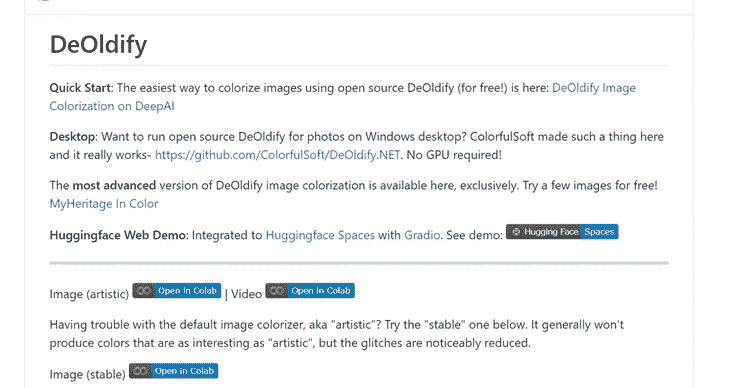

# 使用 Python 和 AI 给黑白照片上色。

> 原文：<https://levelup.gitconnected.com/colorize-black-and-white-photos-using-python-and-ai-5b3e5f85df44>

想知道你以前的黑白照片在现实中是什么样子吗？让我们找出答案。


解密示例([https://github.com/jantic/DeOldify](https://github.com/jantic/DeOldify))

介绍 **DeOldify** ，这是一个基于深度学习的项目，用于着色和恢复您的旧图像。它基于 GANs。现在拿出你爷爷奶奶的旧相册，我们开始吧。



我们将使用 google colab 来运行 Deoldify 模型。谷歌 Colab 是谷歌研究院的产品。Colab 允许任何人通过浏览器编写和执行任意 python 代码。


打开 google colab，使用以下代码获取 Deoldify 存储库。

```
!git clone https://github.com/jantic/DeOldify.git
```

上面的代码克隆了 Deoldify 库，现在让“cd”进入 Deoldify 文件夹。

```
cd DeOldify
```

Deoldify 模型需要一些库才能工作。让我们通过运行以下命令来安装它们:

```
!pip install -r colab_requirements.txt
```

Deoldify 需要一个预先训练好的模型来运行，我们只需要创建一个新的目录“models”并将模型下载到其中。

可以使用下面的命令来完成。

```
!mkdir 'models'
!wget https://data.deepai.org/deoldify/ColorizeArtistic_gen.pth -O ./models/ColorizeArtistic_gen.pth 
```

现在让我们导入 deoldify 库和 fast.ai 库。fast.ai 是另一个深度学习库，deoldify 建立在它的基础上。

```
import fastaifrom deoldify.visualize import *
```

创建一个变量着色程序来加载和存储我们的模型。

```
colorizer = get_image_colorizer(artistic=False)
```

下面的代码允许我们将图像上传到 google colab，然后可以将它传递给模型。

```
source_url = ‘’ #@param {type:”string”}render_factor = 35 #@param {type: “slider”, min: 7, max: 40}watermarked = True #@param {type:”boolean”}if source_url is not None and source_url !=’’:image_path = colorizer.plot_transformed_image_from_url(url=source_url, render_factor=render_factor, compare=True, watermarked=watermarked)show_image_in_notebook(image_path)else:print(‘Provide an image url and try again.’)
```


请注意，colab 笔记本处理一张图像可能需要 60 秒。

例如，我们将使用下面这张 1939 年北卡罗来纳州达勒姆县的照片。杜克大学体育场附近，杜克-卡罗莱纳足球赛当天，汽车停在高速公路旁。


来源:Reddit(用户 u/MyIpodStillWorks)

这是 1939 年北卡罗来纳州达勒姆县的输出图像(彩色)


让我们再举几个例子:

让我们用另一张 1940 年哈莱姆区一个自豪的社区杂货店老板的照片


来源:Reddit(用户 u/dittidot)

一个自豪的社区杂货店老板，哈莱姆区，1940 年(彩色)


1963 年，巴黎，另一个孩子在看木偶戏的例子


来源:Reddit(用户 u/Le_Rat_Mort)

1963 年巴黎木偶戏中的孩子们(彩色)


另一个 1953 年生日派对的例子


来源:Reddit(用户 u/Dhorlin)

1953 年的生日聚会(彩色)


1953 年，孩子们在玩耍


来源 Reddit(用户 u/beatricetalker)

1953 年玩耍的孩子(彩色)


现在你有了它，一个可以给照片着色的深度学习模型。想想看，我们也能给视频着色吗？

是的，我们可以。
但是让我们在其他文章中这样做。

如果你喜欢我的文章，s *支持我，使用这个[链接](https://medium.com/@arjungullbadhar/membership)成为一个中等会员*。你也可以*在文章末尾使用奖励作者功能留下提示*。

[](/convert-a-jupyter-notebook-to-a-web-app-with-a-few-lines-of-code-e01fbac4a876) [## 用几行代码将 Jupyter 笔记本转换成 web 应用程序。

### Mercury Library 可以将您的 Jupyter 笔记本转换为一个独立的 web 应用程序，可以在 web 上托管。

levelup.gitconnected.com](/convert-a-jupyter-notebook-to-a-web-app-with-a-few-lines-of-code-e01fbac4a876) [](/remove-objects-from-images-using-ai-a00876460dd1) [## 基于人工智能的数字图像修复

### 只需几个简单的步骤，就可以使用人工智能从你的令人敬畏的图像中删除照片炸弹。

levelup.gitconnected.com](/remove-objects-from-images-using-ai-a00876460dd1)