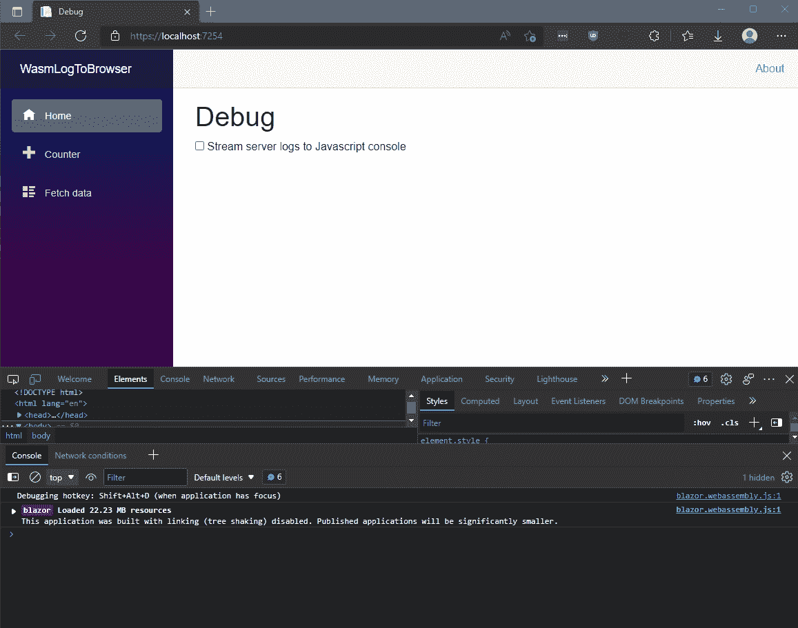
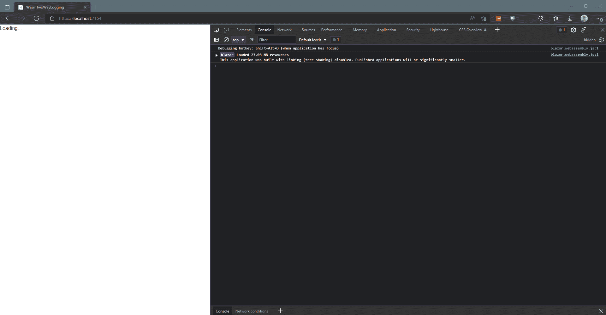
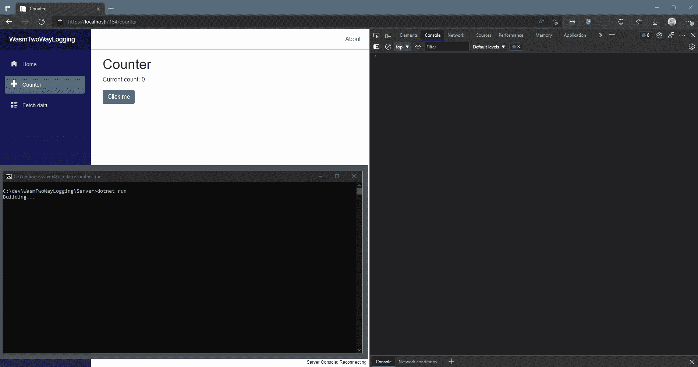

# 结合 Blazor WebAssembly 客户端和服务器日志:使用 NLog 和 SignalR 的双向日志流

> 原文：<https://levelup.gitconnected.com/combine-blazor-webassembly-client-and-server-logs-two-way-log-streaming-with-nlog-and-signalr-cf45ced27082>

上次，在使用自定义 NLog 目标和 SignalR 将 Blazor(ASP.Net 核心)日志流式传输到浏览器的[中，我们设置了一个新的 Blazor WebAssembly 项目，将服务器日志流式传输到浏览器:](https://medium.com/@adored_coral_armadillo_894/streaming-blazor-asp-net-core-logs-to-the-browser-with-a-custom-nlog-target-and-signalr-82d900c0e3)



在那篇文章的最后，我总结道“*这对 Blazor 服务器项目更有用，因为一切都已经在服务器上发生了”*。在接下来的几天里，它继续困扰着我，因为我在想，如果能像在 Blazor Server 中一样，在 Blazor WASM 中将客户端和服务器日志结合起来该有多好。

我想要的确切设置是作为开发环境工具:

*   服务器项目将日志流式传输到浏览器 JavaScript 控制台
*   客户端项目将日志流式传输到服务器项目控制台

在服务器上，这将提供与 Blazor 服务器项目相同的体验，前端和后端日志被合并，同时还增加了从浏览器 JavaScript 控制台访问相同日志的能力。

每个步骤都有提交的存储库可以在这里找到。

[](https://github.com/stewartcelani/WasmTwoWayLogging) [## GitHub-stewartcelani/WasmTwoWayLogging

### 此时您不能执行该操作。您已使用另一个标签页或窗口登录。您已在另一个选项卡中注销，或者…

github.com](https://github.com/stewartcelani/WasmTwoWayLogging) 

请随意跳到文章的末尾，看一张 GIF 图片。

# **第七步:修复服务器项目以直接访问 LoggingHub，而不是通过微软。AspNetCore.SignalR.Client**

通过 Server \ Logging \ hub connection . cs 使用 SignalR 从服务器向自身发送 SignalR 消息感觉有点笨拙，所以幸运的是[有一种方法可以通过 SignalR HubContext](https://docs.microsoft.com/en-us/aspnet/core/signalr/hubcontext?view=aspnetcore-6.0) 从 hub 外部发送消息。不过，并没有浪费所有的资源，我们将需要稍后从客户端项目中使用 LoggingHubConnection.cs 来将客户端日志发送到服务器。

不包括删除 Server \ Logging \ Logging hub connection . cs 我们有 [4 个更改的文件](https://github.com/stewartcelani/WasmTwoWayLogging/commit/b6992a6833e7df003abecb54abc64061446cab5c#diff-fa6370bf83a253635896bf21e7fff5c1b1fb7c0972fa3e6e93df22bdad3e005c)。

1.  **Server \ Services \ debug service . cs**是我们将通过 LoggingHub 上下文直接向浏览器发送日志消息的地方，该上下文通过构造函数中的 ASP.NET 核心依赖注入提供。
2.  我们需要一种方法将对调试服务的引用放入 Server \ Logging \ Logging hub target . cs 中。为此，在 **Server\Program.cs** 、**、**中，我们可以[在应用启动时获取对服务的引用](https://docs.microsoft.com/en-us/aspnet/core/fundamentals/dependency-injection?view=aspnetcore-6.0)，然后将该引用传入 Server \ Logging \ logger . cs::Configure。
3.  **Server\Logging\Logger.cs** 将引用传递给 LoggingHubTarget。
4.  一个非常精简的**Server \ Logging \ Logging hub target . cs**只是将 logEvent 呈现为一个字符串，并将其传递给 DebugService::LogToBrowser。

# 步骤 8:在客户端项目中设置 NLog

是时候将 NLog 添加到我们的客户端项目中了。

```
cd .\Client
dotnet add package NLog
```

现在，让我们快速启动和运行 NLog 并登录到控制台。

现在，我们已经通过 JavaScript 控制台组合了服务器/客户端日志记录:



# 步骤 9:清理客户端代码

首先让我们重构 Client \ Services \ debug service . cs，以便只将服务器输出记录到控制台。

更新 MainLayout.razor，以便仅在我们的环境为“开发”时挂载 ServerConsole.razor 组件。

最后，让我们告诉我们的信号连接总是重试，如果它掉线。我们将通过实施 IRetryPolicy 来实现这一点。默认情况下，AutomaticReconnect 将在四次尝试失败后停止尝试。默认行为和如何实现自定义重试策略可以在这里阅读[。](https://docs.microsoft.com/en-us/aspnet/core/signalr/dotnet-client?view=aspnetcore-6.0&tabs=visual-studio)

# 步骤 10/10:使用自定义 NLog 目标将客户端连接到服务器并完成

这里，我们将重新实现上一篇文章中使用的基本相同的 LoggingHubTarget 和 LoggingHubConnection，只是这次是在客户端项目中。

我不会覆盖一个嵌入中的每一个变化，因为有太多，但你可以[在这里直接浏览变化](https://github.com/stewartcelani/WasmTwoWayLogging/commit/f928c8e2d74e140c5d3a6cea32e4307fb9265547)。

变更摘要:

*   将 Client \ Library \ infiniteretry policy . cs 移动到 Shared\InfiniteRetryPolicy.cs，因为我们将在客户端和服务器上使用
*   将日志配置为通过 Client\Logging\Logger.cs、\ Logging \ LoggingHubConnection.cs 和 Client \ Logging hub target . cs 流向服务器
*   我们需要某种方法来连接 Server \ Services \ debug service . cs 来监听“logto Server”logging hub 事件，并将它们打印到控制台。不幸的是，这不可能直接从 HubContext 中实现，所以我使用了微软。AspNetCore.SignalR.Client 在 DebugService 中设置 HubConnection。总之:DebugService 用它的 HubContext 将日志从服务器广播到客户机，并用 HubConnection.On 监听来自客户机的广播。

最终结果如下所示:



服务器上和浏览器控制台中的统一客户端和服务器日志

总的来说，我很高兴在 Blazor 中获得并运行这种日志功能是如此容易。我可以想象自己在未来的项目中使用它。