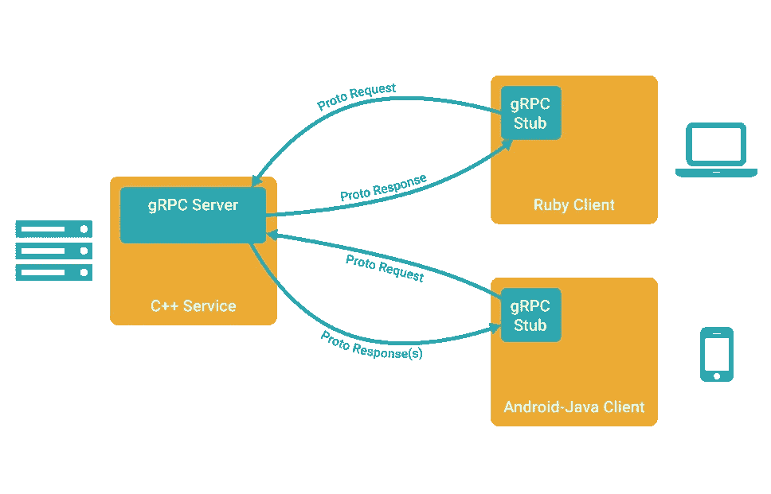

# 将 Python & Go 用于机器学习与 gRPC 相结合

> 原文：<https://levelup.gitconnected.com/combine-python-go-for-machine-learning-with-grpc-fb1316a2219b>

## 利用 2021 年最流行的两种编程语言的优势！


ython 和 Go 都发现自己处于各自角色的编程食物链的顶端。Python 已经成为数据科学的首选语言(没有双关语的意思),因为它有大量的库支持，例如 Scikit-Learn、Pandas、Numpy 和 TensorFlow 等等。另一方面，Go 已经成为微服务、分布式系统和高效服务器端架构的标准选择。各有各的长处，为什么不把两者结合起来呢？

> 我们可以通过使用 gRPC (google 远程过程调用)来充分利用 Python 和 Go。这将允许我们在 Go 中构建一个简单的客户端，同时我们在 Python 中创建并利用一个 Scikit-Learn 模型，该模型将充当查询的服务器。Go 客户端将发送一个葡萄酒的文本描述，Python 服务器将对该描述的多样性做出预测。这将展示一个概念证明(PoC ),说明如何使用 gRPC 以有效的方式更好地结合一些顶级语言。

# gRPC 的快速概述

我不会对 gRPC 做太深入的探讨，因为我在过去已经写过了。基本上，它是一种独立于语言的高效通信方法。它通过用字节码表示的 protobuf 消息传输数据，这比标准的基于 json 的 REST API 要有效得多。



来自[程序员组](https://programmer.group/images/article/60a127ec15564eedd8336c3f772b858a.jpg)

启动和运行 gRPC 有三个主要步骤。第一个是通过。原型文件，我们接下来会看到。

然后，您需要为客户机和服务器各自的数据绑定和方法生成代码。最后一步是实现方法存根。一旦完成，您现在就可以在服务器和客户机代码之间发送高效的字节编码请求和响应。

# 创造。原型文件和生成 gRPC 绑定

我们将为这个例子维护一个简单的项目设置。项目的根层将是我们的 Go 客户端加上`go.mod/sum`。然后我们将拥有自己填写的根文件`.proto`。在`pb`文件夹中还有一个存放 Go 的 protobuf 数据绑定的文件夹，而 Python 代码依赖于`py`文件夹中自动生成的`.py`文件。

```
.
├── client.go
├── go.mod
├── go.sum
├── wine_varieties.proto
├── pb
│   └── wine_varieties.pb.go
└── py
    ├── wine_varieties_pb2_grpc.py
    ├── wine_varieties_pb2.py
    └── server.py
```

## 定义原型文件

现在我们需要填写`wine_varieties.proto`。首先，我们将语法设置为最新版本的`proto3`，并将包设置到我们的目录`pb`。我们还将`go_package`设置为相对路径`“./pb”`。然后，我们为葡萄酒评论的请求和响应定义消息。最后，我们定义一个服务，它将作为一个接口来生成我们必须在 Python 代码中实现的`GetWineVariety()`方法。

## 生成 protobuf 和 gRPC 代码

现在我们已经定义了原型文件，让我们首先生成 Go 代码。protoc 命令是协议缓冲区的编译器，协议缓冲区是 gRPC 使用的数据格式。标志`go_out=plugins=grpc:pb`告诉`protoc`使用 gRPC 插件并将文件放在`pb`目录中。go_opt=paths=source_relative 告诉`protoc`在相对于当前目录的`pb`目录中生成代码。`wine_varieties.proto`文件将用于生成代码。这将用数据绑定和助手方法填充`wine_varieties.pb.go`。

```
$ protoc --go_out=plugins=grpc:pb --go_opt=paths=source_relative wine_varieties.proto
```

现在我们可以生成 Python 代码了。这将为`wine_varieties_pb2_grpc.py`和`wine_varieties_pb2.py`创建代码。

```
$ python3 -m grpc_tools.protoc -I.. --python_out=. --grpc_python_out=. ../wine_varieties.proto
```

# Python 中的文本分类

现在我们已经生成了 protobuf 和 gRPC 代码，是时候实现服务器了。服务器将首先在葡萄酒数据的 csv 上训练线性支持向量分类器(SVC)。它还将实现方法`GetWineVariety()`供 Go 客户端查询。我们将在`server.py`中一次处理一件。首先，让我们导入必要的库。

> **注意**:我不会详细讨论 SVC 或特征提取，因为这超出了本文的范围。

## 构造服务器类

接下来我们需要定义 Python 类`WineClassifierServer`，它将在`wine_varieties_pb2_grpc`中生成的`WineClassifierServiceServicer`作为参数。不要太担心这个，这只是进行我们的远程过程调用的管道。

重要的是，我们在`__init__(self):`中初始化这个类，以便对葡萄酒数据进行训练，并获得我们的初始模型训练估计值。您会注意到某些对象，如`top_10_varieties`或`count_vect`被声明为该类的属性——这是因为我们需要这些属性来在下面的方法`GetWineVariety()`中进行预测。我不打算解释这段代码的细节，但它是 Python 中简单的文本分类，很容易学会。

这个例子的数据可以在 Kaggle 的[这里](https://www.kaggle.com/zynicide/wine-reviews/version/4)找到。

很好，现在我们可以在我们的类中实现`GetWineVariety()`方法了。该方法接收 protobuf 请求以及来自 Go 客户端的上下文。这里我们利用了类属性，比如`self.count_vect`和我们训练的初始 SVC 模型`self.lsvc`，以便对葡萄酒评论进行预测。在第 10–13 行，我们找到了与我们的预测相匹配的葡萄酒品种的名称，并将该名称用作我们的`WineReviewResponse`的`variety`字段。

## 用 Python 创建 gRPC 服务器

差不多了，现在我们只需要定义实际启动和运行服务器的代码。这里没有什么特别的，只是一些日志配置，然后在端口 8080 上启动一个 gRPC 服务器。

如果我们运行`server.py`，我们将获得排名前 10 的葡萄酒品种以及我们的模型训练准确性，并记录服务器已准备好接受请求。

```
$ python3 server.py 
2021-08-05 09:13:30,262 - INFO - {'Pinot Noir': 0, 'Chardonnay': 1, 'Cabernet Sauvignon': 2, 'Red Blend': 3, 'Bordeaux-style Red Blend': 4, 'Riesling': 5, 'Sauvignon Blanc': 6, 'Syrah': 7, 'Rosé': 8, 'Merlot': 9}
Accuracy: 81.15%
2021-08-05 09:13:36,308 - INFO - server ready on port 8080
```

# Go 中的简单客户端

现在是容易的部分。我们已经通过为 Python 生成 protobuf 和 gRPC 代码完成了所有繁重的工作，并继续实现服务器逻辑。我们在这里只执行三个简单的步骤。首先，我们在端口 8080 上启动一个 gRPC 客户机。然后我们用自己的自定义`Review`声明一个`WineReviewRequest`来进行预测。最后，我们查询`client.GetWineVariety()`并打印我们得到的结果。

因为这些都是通过本地模块完成的，所以您需要稍微调整一下您的`go run`命令。如果运行这个程序，下面是输出:

```
$ GO111MODULE=off go run client.go 
2021/08/05 09:17:48 Predicted wine variety: Riesling
```

很酷，是吧？

现在，您已经将 Go 中的客户端与 Python 服务器结合起来，以便使用 gRPC 对葡萄酒评论进行预测。这是一个简单的例子，还有很多需要改进的地方，但是它表明了今天的编程语言在互操作性方面继续发展。这是个好消息，因为它让我们能够利用每种语言的核心优势。感谢阅读！