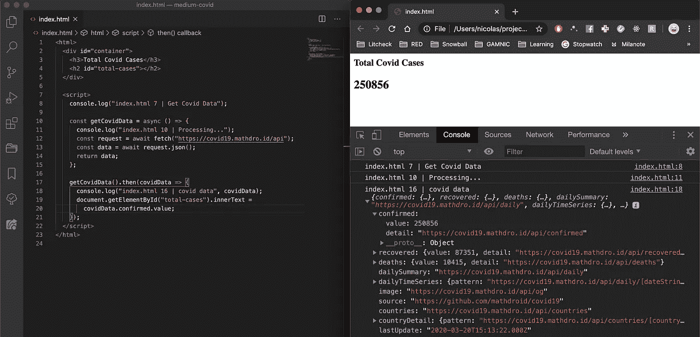
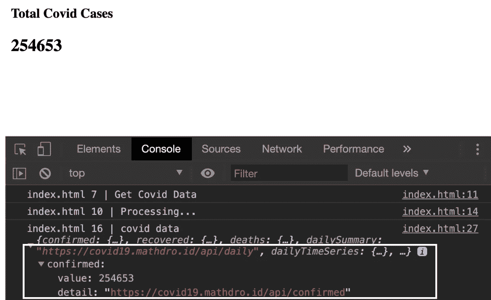
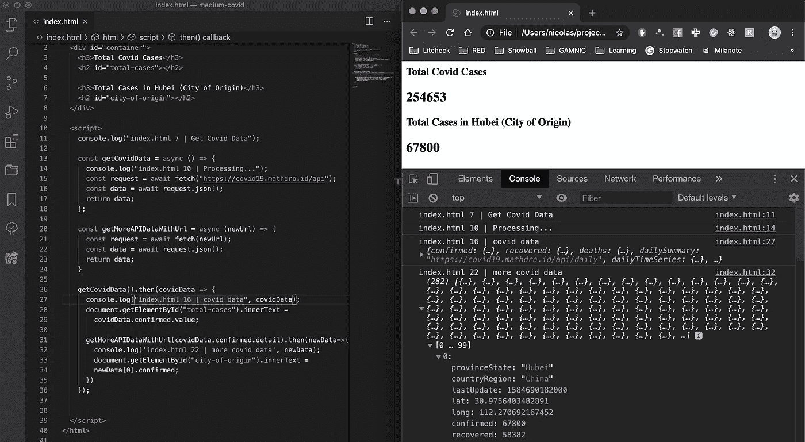
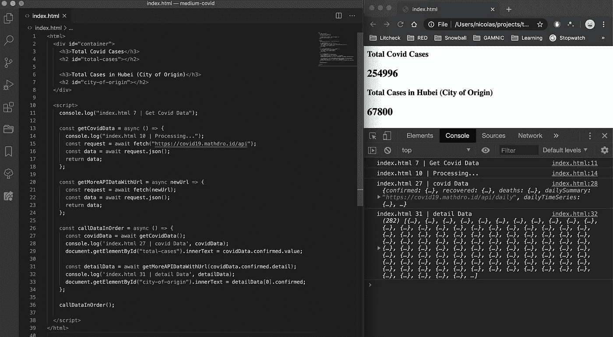
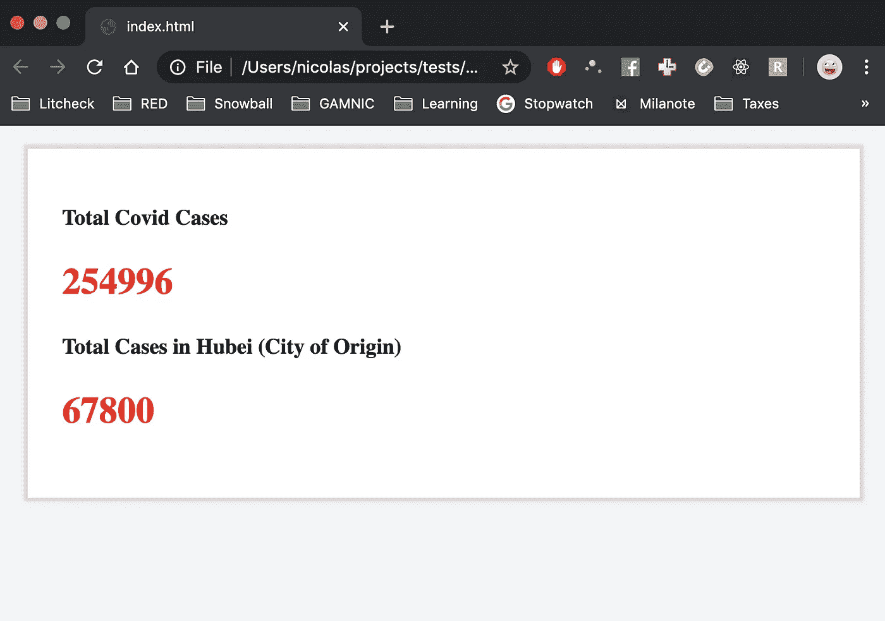

# 将 API 调用与 Javascript Async/Await 结合起来(深入)

> 原文：<https://levelup.gitconnected.com/combining-api-calls-with-javascript-try-catch-ba1b7b9303a5>

## 同时制作自己的新冠肺炎仪表板！

这是我学习 Javascript 时最纠结的话题之一。我想从多个来源获取数据并一起使用。我遇到了各种各样的错误，但最终理解了用 Javascript 处理异步代码的过程。

今天，在犯了很多错误之后，我想出了一个简单的方法来解决这个问题。

我认为从冠状病毒 API 获取数据可能适合今天的情况。也许你可以建立伟大的数据工具给人们看！

我决定用**纯 html/javascript** 制作这个教程。你必须在每次更新代码时重新加载网站，因为我们没有热重新加载。

**最终代码**在底部。如果你只是想检查一下，向下滚动。

我通过建立我的在线公司雪球学会了如何编码。您可以看到对 Google Sheets API 的多个 API 调用是如何工作的！

[www.snowballfinances.com](http://www.snowballfinances.com)

# 文章结构

1.  设置
2.  具有异步功能的单个请求
3.  组合请求
4.  最终代码

# 应用程序设置

进入您的终端，运行以下命令:

`mkdir covid19-data`

`cd covid19-data`

`touch index.html`

`code .`(如果你有 VS 代码，或者在你喜欢的文本编辑器上打开文件)

# **单个请求**

## 我们将会做什么

*   获取真正的冠状病毒数据
*   从第一个请求中获取信息，并将该信息用于第二个请求。

用容器、标题和 id 为“total-cases”的元素设置 html。这是我们希望看到的第一个数据点。

很简单。现在让我们调用 API。您需要构建 javascript 异步函数。

## 异步函数

根据 Mozilla([https://developer . Mozilla . org/en-US/docs/Web/JavaScript/Reference/Statements/async _ function](https://developer.mozilla.org/en-US/docs/Web/JavaScript/Reference/Statements/async_function))，异步函数是:

> 函数通过[事件循环](https://developer.mozilla.org/en-US/docs/Web/JavaScript/EventLoop)以不同于代码其余部分的顺序运行，返回一个隐含的`[Promise](https://developer.mozilla.org/en-US/docs/Web/JavaScript/Reference/Global_Objects/Promise)`作为结果。但是使用异步函数的代码的语法和结构看起来像标准的同步函数。”

**我的解读**:以**顺序**运行代码的一种方式。

**例:执行一个 API 调用，第一个完成后再执行另一个 API 调用。**

## 我们的第一个功能

**getCovidData()** 获取冠状病毒数据，并将我们函数的 innerHtml 设置为数据的值(*在下面的*中有详细解释)。

## 说明

在脚本标记中，函数 getCovidData 处理第一个请求。**请求**常量使用**等待**来**获取(" https://covid 19 . mathdro . id/API ")**

`**const** request = **await** **fetch**("https//covid19.mathdro.id/api")`

**fetch()** 是一个 Javascript 函数，它请求 url 的数据并返回一个**承诺。**`await`这个词意味着 Javascript 现在正在等待承诺的解决。

简单来说，await 告诉 Javascript“在实际获取数据之前不要继续执行”。

然后你有以下内容:

`**const** data = **await** **request**.json();`

你必须对**请求**使用 await，因为记住，如果你不让它等待，它会在****获取完成之前执行 request.json() **。**从**给你一个未定义的错误或功能错误。因为您正在对一个尚不存在的值执行一个函数。******

**完成这两步后，你就可以安全地将**的数据返回**到 **console.log()** 里面了。**

**最后，执行函数(第 17 行)。如果保存并重新加载该页面，您将获得以下结果。**

****

**我们有一个 23 行代码的实时 COVID19 数据获取工具。**精彩。****

# **组合请求**

**现在如果你仔细观察，在下面的**图像上的“**已确认的**对象中，你有 2 个属性:****

****

*   **值:(一些不断更新的值)**
*   **详细信息:一个网址(https://covid19.mathdro.id/api/confirmed)**

**如果我想访问“detail”属性 url，并获取该 url，该怎么办？第一次 api 调用没有给我们足够的信息。如果我们想要更多，我们想在一个序列中做多个调用呢？**

**让我们做另一个函数，它获取 url 并返回“ **detail** ”数据。**

**这是这个额外功能的代码。您可以替换您以前的所有代码，或者更好的是，尝试自己编写代码！这个新函数的功能与之前的函数相同，但是向 fetch 传递一个定制的 url 参数。它从根本上做同样的事情，所以如果你理解了前面的解释，这个新函数应该是有意义的。**

**您会注意到我在 getCovidData()函数中运行 getMoreDataWithUrl。这确保了你已经从 getCovidData()返回了以前的数据，这样你就可以访问那个"**detail**URL。然后获取详细 url 数据，将其传递给 getmoreapidatawithrul(detaitaurl)。**

**现在看看这个！**

****

**我们现在掌握了全世界的病例总数，以及中国湖北省的病例数！**

**我在第 7 行创建了一个新的数据条目 id，名为“city-of-origin ”,我使用**

**`document.getElementById("city-of-origin").innerText = newData[0].confirmed;`**

**这一切都很好，但是执行 getCovidData()函数。then() …看起来不是很干净，尤其是如果你有一个嵌套的。然后从另一个函数中调用()。我们能让它看起来更好吗？**

**让我们看看是否可以用一个新函数 **callDataInOrder()让它变得更干净；****

**好多了。这是以同样方式工作的结果！**

****

**让我们添加一点 CSS 和一些加载指示器，使我们的 COVID 数据仪表板看起来更整洁一些。**

# **最终代码**

**这就是它应该有的样子！**

****

**我要求你们研究这些功能，并扩展这个仪表板的功能。你甚至可以制作一个冠状病毒仪表盘，显示每个受影响的国家。剩下的就交给你了。**

**以下是使用异步函数的更高级教程，因此您可以构建更酷的项目:**

** [## 带 Javascript 的 Google Sheets API 教程

### 快速、深入的教程。学习如何从头开始使用带有 Javascript 的 Sheets API，以及如何在

levelup.gitconnected.com](/google-sheets-api-tutorial-with-javascript-588f581aa1d9)  [## 带 Javascript 的股票 API 教程

### 使用 Node.js 的简单股票获取后端，带有客户端调用示例。

levelup.gitconnected.com](/stocks-api-tutorial-with-javascript-40f24320128c) 

希望你喜欢这个教程。请随意问任何问题，我很乐意帮助你。

# 编码快乐！😄**