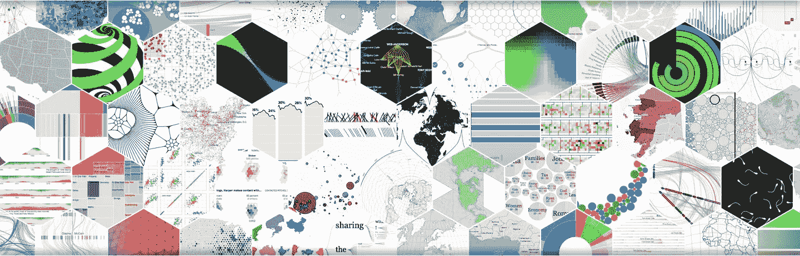

# 将 D3.js 与 React 结合使用

> 原文：<https://levelup.gitconnected.com/combining-d3-js-with-react-1c15c41429a6>


3.js 代表数据驱动文档，它是一个很棒的库，有很多很棒的特性。D3.js 是一个 Javascript 库，它利用 SVGs 与 CSS 和其他 HTML 标签的结合来帮助你创建漂亮的图形。从高层次来看，D3 将您提供的数据合并到 DOM 元素中。有了它，您就可以操纵 DOM，并以您的数据为基础在屏幕上执行转换。

## 为什么要用 D3？



有许多数据可视化库，你不应该只局限于一个。我相信 D3 是最好的数据可视化库之一，因为它非常健壮，具有许多内置特性，并为开发人员提供了许多工具来创建令人惊叹的图形和图表。

从众多的数据可视化库中，D3 客观上是最受欢迎的。GitHub 上有超过 [89k 颗星星，是使用最广泛的库之一。正因为如此，这个库已经被审查了好几年，并被监控以尽可能地保持更新。](https://github.com/d3/d3)

## 有什么问题？


因为图书馆年代久远，它是在反应时代诞生之前建造的。React 是最流行和最强大的前端框架之一，将 D3 与 React 结合是一个自然的转变。不幸的是，将 D3 与 React 结合使用并不是一个无缝的组合。

首先，网上没有明确的指导，让你一步一步地演练如何实现这两个。与其他流行的 React 库不同，如 Bootstrap React，没有明确的例子说明如何实现在 React 之前构建的库，也没有任何好的指南。

其次，由于对 D3 一无所知，这是一条陡峭的学习曲线。原始文档和大部分在线教程都是用普通的 JavaScript 编写的——因为 D3 是在 React 之前创建的。所以你不仅要学习如何使用 D3，还要在 React 中实现它的时候重新学习。这给 2019 年学习 web 开发的人造成了一个自然令人沮丧的问题。

## 解决方法是什么？

解决这个问题很简单，但不容易。

> Y 你需要学习 D3.js 并学会使用它的内置函数。之后，您需要学习将结果插入 React 组件。

正因为如此，你需要理解在 D3 的引擎盖下到底发生了什么。基本上 D3 所做的是为你创建 DOM 元素，并将你给它的数据附加到这些元素上。如果你想和 React 一起使用，这不是一个好主意。您实际上是将 DOM 的控制权交给了 D3，并从 React 那里拿走了它。

相反，您想要做的是学习 D3 具有的健壮的内置函数，并使用 React 使用解析的数据创建前端。下面是一个非常简单的例子，展示了将 D3.js 与 React 结合起来的效果:

```
export default const Graph = props => {const xScale = d3
    .scaleLinear()
    .domain(d3.extent(data.dataset, d => d.x))
    .range([data.margin, data.width])const yScale = d3
    .scaleLinear()
    .domain([0, d3.max(data.dataset, d => d.y)])
    .range([data.height, data.margin])const line = d3.line()
    .x(d => xScale(d.x))
    .y(d => yScale(d.y))
    .curve(d3.curveCatmullRom.alpha(0.7))return <div>
      <svg height={data.height} width={data.width}> <line className="axis" x1={data.margin} x2={data.width} y1={data.height} y2={data.height}/> <line className="axis" x1={data.margin} x2={data.margin} y1={data.margin} y2={data.height}/> <path d={click.clicked ? line(data.dataset) : 0}/> </svg>
   </div>
}const data = {
  dataset: [
    {x: 0, y: 0},
    {x: 1, y: 1},
    {x: 2, y: 1},
    {x: 3, y: 2},
    {x: 4, y: 3},
    {x: 5, y: 5},
    {x: 6, y: 8},
    {x: 7, y: 13},
    {x: 8, y: 21},
    {x: 9, y: 34},
    {x: 10, y: 55},
  ],
  width: 500,
  height: 500,
  margin: 20,
}
```

通过组合`xScale`、`yScale`和`line`中的 D3.js 函数，当您将数据输入到 SVG 元素`svg, line and path`时，D3 可以创建正确的数据格式。

## 结论


使用 D3.js 可以让你看到它是多么的可定制。结合 React 的强大功能，您就拥有了一个强大的工具。