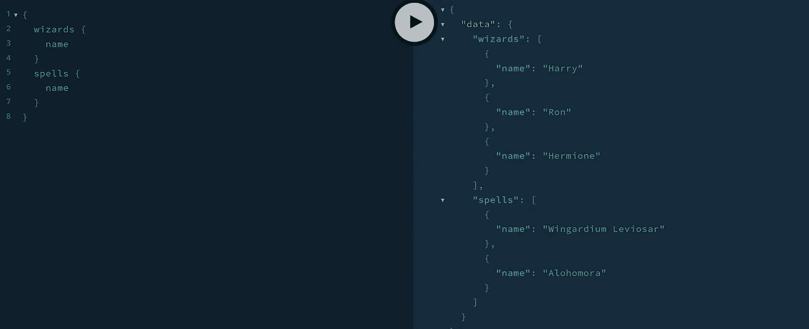

# 将多个 GraphQL 服务组合成一个联邦数据图

> 原文：<https://levelup.gitconnected.com/combining-multiple-graphql-services-into-one-federated-data-graph-c3d93b4bab45>


克林特·王茂林在 [Unsplash](https://unsplash.com?utm_source=medium&utm_medium=referral) 上拍摄的照片

微服务在过去的十年里越来越受欢迎。原因有很多…可伸缩性、可靠性、可维护性…还有很多。本文不会关注这些，尽管现在几乎任何一本好书或文章都会深入讨论这些。

这种快速增长和采用的原因可能与任何 web 开发人员使用现代编程语言和发布的工具构建和部署微服务的速度有关。

最近，我发现自己在做一个项目，这个项目为系统运行所涉及的数据提供了清晰的上下文边界。这使得设计处理这些数据的服务变得相对简单！每个服务都有一个核心需求:读取大量数据并提供给用户。以前从未有机会在生产环境中使用 GraphQL，这是我的第一选择。我着手创建每个服务，为每个服务创建一个 [Apollo 服务器](https://www.apollographql.com/docs/apollo-server/)，以及相关的模式和解析器。前端用的[阿波罗客户端](https://www.apollographql.com/docs/react/)。

这种方法的唯一缺点是每个服务公开自己的 GraphQL 服务器端点。有多种方法可以处理这个问题，但是其中一种方法是为每个端点创建一个新的环境变量，并将每个视图包装在一个 Apollo 提供程序中。远非理想。允许多个服务自由创建单个数据图的解决方案对于减少所需的额外复杂配置来说是完美的。

介绍[阿波罗联邦](https://www.apollographql.com/docs/federation/)！Apollo Federation 组合了多个 GraphQL 服务，并公开了一个单一的联邦数据图！完美！

本文将介绍什么是 Apollo Federation，使用 Apollo Federation 的好处，以及如何开始使用 Apollo Federation。写这篇文章的目的是分享我在过去几个月的学习，而不是一篇指导性的文章。如果我犯了任何错误或可以改进的地方，请给我一个呼喊，让我知道！编程片段将在 NodeJS 和 TypeScript 中。尽情享受吧！

先说什么是阿波罗联邦。以下是官方文件中引用的一段 YouTube 视频:

> 一组工具，用于以声明方式将多个 GraphQL 模式组合成一个数据图

这意味着我们可以定义单独的**集成**服务，使用它们自己的 GraphQL 模式，运行在多个服务器上。例如，我们可能有一个巫师服务和一个咒语服务。我们可以用一个服务来表示两者，并用一个大的模式来表示巫师和咒语。然而，这可能会很快失控，并在未来拖开发人员的后腿！我们想避免的事情，对吗？一旦我们的服务启动并运行，我们就可以使用 **Apollo Federation** 通过**网关将这些模式整合在一起。**

这正好解决了之前讨论的问题——在前端将许多不同的地址放在一起。现在，我们可以使用一个网关 URL 来访问单个数据图，并让每个服务扩展它，从而从我们的所有服务中提供一个架构。

我们需要三个包来开始:

```
@apollo/federation - which makes the schemas in our services federation ready
@apollo/gateway - helps us to pull together our services and distribute GraphQL requests to respective services
apollo-server - we need an instance of Apollo Server for each service and the Gateway API
```

让我们首先为我们的法术创建一个集成的服务。这样做的代码在下面的要点，让我们指出一些关键线路，并检查他们在做什么。注意第 5 行，我们已经把我们的法术类型变成了一个实体。这是通过添加@key 指令并将其分配给“id”来实现的。通过添加@key 指令，我们允许*其他服务*能够引用或扩展这个类型，只要它们知道 ID。

下一个重要的行是第 10 行。我们在这里使用 extend 关键字，因为基本查询将存在于我们的网关上，并且所有实现服务都扩展了这个查询类型。

最后，注意第 27 行。这里，我们使用 buildFederatedSchema 函数来构建我们的联邦模式，使用我们定义的 typeDefs(第 4 行)和解析器(第 15 行)。

现在让我们创建向导服务。请注意我们的巫师服务和我们的法术服务之间的相似之处。

最后，我们需要创建我们的网关服务。我们可以通过创建另一个阿波罗服务器来做到这一点。我们的网关服务需要引用我们的实现服务。这是在第 6 行完成的，这里有我们的 serviceList，一个对象数组，其中每个对象引用我们的一个实现服务。

注意，在第 13 行，当我们创建 ApolloServer 时，我们不再传入模式，而是传入网关。

现在，如果我们运行这个，我们应该看到我们的两个服务在我们的 GraphQL 操场上合并成一个数据图。



GraphQL 操场单一数据图

总的来说，Apollo Federation 为拥有多个 GraphQL 服务提供了一个干净、简单的解决方案。我发现 Apollo Federation 可以加快开发速度，缩小开发和部署之间的差距。我发现错误修复很简单，因为我现在只维护与每个服务相关的数据图，我发现维护很简单，几乎没有压力！

希望本文强调了使用 Apollo Federation 创建和部署基于 GraphQL 的微服务是多么简单。这里是本文中使用的 [GitHub 库](https://github.com/gitpancake/federation-medium-spells)。我真的很喜欢使用这些工具，并对 GraphQL 生态系统有了更多的了解。希望你也是！感谢阅读:)。