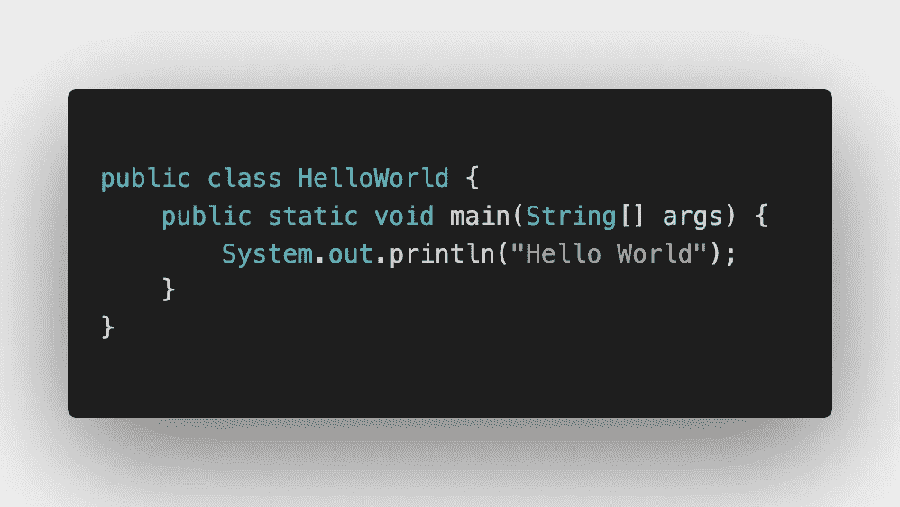
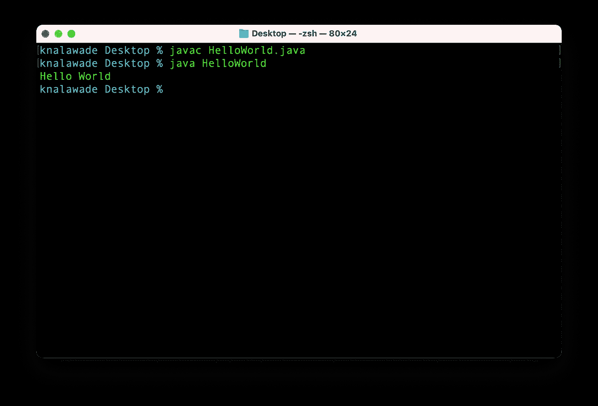

# 快来加入 Java 的美丽世界吧！

> 原文：<https://levelup.gitconnected.com/come-and-join-the-beautiful-world-of-java-9cedc815bafa>


克里斯托夫·高尔在 [Unsplash](https://unsplash.com?utm_source=medium&utm_medium=referral) 上拍摄的照片

您知道 Java 在超过 10 亿部智能手机上运行吗？没错！Java 是世界上最流行的语言之一。它用于构建桌面、移动和 web 应用程序。你在手机上使用的操作系统 Android 是用 Java 开发的。

如果你是一个初学编码的人，你来对地方了。Java 是开始编程之旅的好方法。对于初学者来说，这是一种免费使用且简单易学的语言。它还有一个巨大的在线社区，所以，如果你面临任何问题，99.99%的时候你都能找到解决方案。

在这篇文章中，我将向你解释如何从头开始学习 Java，并向你展示你可以参考的资料。

# 设置和安装

在使用之前，你首先需要安装 Java。在 [Windows](https://www.guru99.com/install-java.html) 、 [Mac OS](https://docs.oracle.com/javase/10/install/installation-jdk-and-jre-macos.htm) 和 [Linux](https://phoenixnap.com/kb/how-to-install-java-ubuntu) (Ubuntu)中安装 Java 的步骤可以在各自的链接中找到。不要忘记为 Java 设置路径变量，否则可能会遇到问题。

一旦安装了 Java，运行下面的命令来检查版本。这也有助于检查 Java 是否正确安装。

```
java -version
```

好吧！现在您的系统中已经有了 Java，编写一个简单的 [Hello World](https://www.programiz.com/java-programming/hello-world) 程序并运行它。它应该是这样的:



Java 的 Hello World

要运行这个程序，你只需要两个命令。



第一个命令编译程序，第二个命令运行程序。就是这么简单。

# 基本概念

从上面的例子中，你知道了 Java 程序是什么样子的。现在，要理解 Java 中使用的基本语法和关键字，请阅读这篇文章。还要学习 Java 中的[数据类型](https://www.geeksforgeeks.org/data-types-in-java/)、[操作符](https://www.geeksforgeeks.org/operators-in-java/)、[控制语句](https://www.geeksforgeeks.org/decision-making-javaif-else-switch-break-continue-jump/)和[循环](https://www.geeksforgeeks.org/loops-in-java/)。

另外，如果你对 Java 如何编译和运行程序感到好奇，请访问这里的。你会对幕后发生的事情有一个很好的理解。

# 面向对象编程

Java 中的几乎所有东西都是对象(我用“几乎”是因为 Java 仍然有原始数据类型，如 *int* 、 *char* 等。).与上面的例子类似，每个 Java 程序都以一个类开始。所以，要熟悉 Java，你需要很好地掌握 OOP 概念。

别担心，这不是你必须单独学习的东西。Java 是基于 OOP 的，当你使用 Java 时，你也会理解 OOP。一定要看看[这篇](https://medium.com/@kunal.nalawade25/oop-just-a-glimpse-354815efd81e)帖子，了解你需要学习的 OOP 概念。

# 内置类

Java 有数百个内置类。假设你需要一个数组，它的大小根据元素的数量而变化，也就是一个动态数组。别担心， [ArrayList](https://www.geeksforgeeks.org/arraylist-in-java/) 已经帮你搞定了。它是 Java 中的内置类，具有不同的数组操作函数。

作为初学者，先熟悉一下[集合框架](https://www.geeksforgeeks.org/collections-in-java-2/) (ArrayList，Set 等)中的类和接口。)以及类似于 [HashMap](https://www.geeksforgeeks.org/java-util-hashmap-in-java-with-examples/) 、 [TreeMap](https://www.geeksforgeeks.org/treemap-in-java/) 、[数组](https://www.geeksforgeeks.org/array-class-in-java/)、 [String](https://www.geeksforgeeks.org/string-class-in-java/?ref=lbp) 和[String buffer](https://www.geeksforgeeks.org/stringbuffer-class-in-java/)/[StringBuilder](https://www.geeksforgeeks.org/stringbuilder-class-in-java-with-examples/)的类。

所有这些类都将提供数据结构和基本功能，如排序，随时可以使用。有时，您可能会遇到排序是其中一个步骤的问题。因此，不用担心使用哪种排序算法，您可以专注于问题中更具挑战性的任务。

# 异常处理

不管你的代码有多好，它总是会遇到问题，你的代码应该准备好处理这些问题。这就是异常处理发挥作用的地方。

作为一名 Java 程序员，您应该知道会发生什么类型的异常以及处理它们的方法。例如，如果您的代码从服务器获取数据，服务器很有可能不响应，在这种情况下，您的代码应该能够处理这种情况。

我已经在我之前的一篇[帖子](https://medium.com/@kunal.nalawade25/heres-what-you-should-know-about-java-exception-handling-5ed08669ad21)中详细解释了异常处理。

# 多线程操作

多线程允许同时执行程序的多个部分。这些部分被称为螺纹。随着应用程序进程越来越复杂，线程被用来最大限度地提高性能和 CPU 利用率。阅读[本](https://totalview.io/blog/multithreading-multithreaded-applications)了解更多关于线程和多线程的知识。

在 Java 中，多线程用于并发执行，通过让多个线程共享资源，允许程序运行得更快。通过这样做，Java 能够提高程序的执行速度。

在 Java 中有两种创建线程的方法:

*   [扩展线程类](https://youtu.be/b_h4-_j6JmY)
*   [实现可运行接口](https://www.geeksforgeeks.org/runnable-interface-in-java/)

# 其他概念

到目前为止，我已经向您展示了作为初学者应该学习的概念，但是 Java 并不局限于这些概念。还有其他概念如[序列化](https://www.geeksforgeeks.org/serialization-in-java/)、[垃圾收集](https://stackify.com/what-is-java-garbage-collection)、[内存管理](https://www.geeksforgeeks.org/java-memory-management/)、[套接字](https://www.geeksforgeeks.org/socket-programming-in-java/)、[设计模式](https://www.tutorialspoint.com/design_pattern/index.htm)等。

另外，我推荐买《Head First Java》这本书，这是我最喜欢的 Java 书籍之一。这本书对初学者很友好，用一种既有趣又易学的视觉方式解释了每一个概念。你可以在这里[得到这本书](https://www.amazon.in/Head-First-Java-Brain-Friendly-Guide/dp/8173666024) ( *印度*)或者[这里](https://www.amazon.com/Head-First-Java-Kathy-Sierra/dp/0596009208) ( *美国* ) ( *这些都不是附属链接)*。

# 下一步

如果你已经学习了 Java 的基础知识，那么是时候进行下一步了。如果你正在准备面试，开始解决 [LeetCode](https://leetcode.com/) 上的编码问题。还有，看看这些 [Java 面试问题](https://www.javatpoint.com/corejava-interview-questions)。

如果你对竞技编码感兴趣，可以参加 [HackerRank](https://www.hackerrank.com/) 和 [CodeChef](https://www.codechef.com/) 上的编码比赛。也开始做项目。如果你对开发移动应用感兴趣，学习 Android，如果是网络应用，学习 Spring Boot。

最后，学习时要有耐心。开始时你会犯很多错误，有时你甚至不知道自己在做什么。相信过程并保持一致。

如果你想知道为什么这篇文章有这么多超链接，它的目的是。向您展示可以用来开始学习 Java 的材料。显然，网上有大量的资料，然而，这篇文章展示的是我推荐的，并不详尽。

# 结论

Java 已经存在了很长一段时间，并将继续存在。印度对 Java 开发人员的需求很高，而且只会越来越多。在这篇文章中，我向您展示了如何学习各种概念并开始用 Java 进行开发。

Java 在很大程度上基于 OOP，因此它有助于你理解面向对象的编程风格。Java 还利用了多线程、服务器和套接字编程。总的来说，Java 是一门伟大的语言，你会喜欢学习它的。

如果您无法理解内容或对解释不满意，请在下面评论您的想法。新想法总是受欢迎的！如果你喜欢这篇文章，请鼓掌。订阅并关注我的每周内容。此外，请务必查看我的其他[帖子](https://medium.com/@kunal.nalawade25)。到那时，再见！！