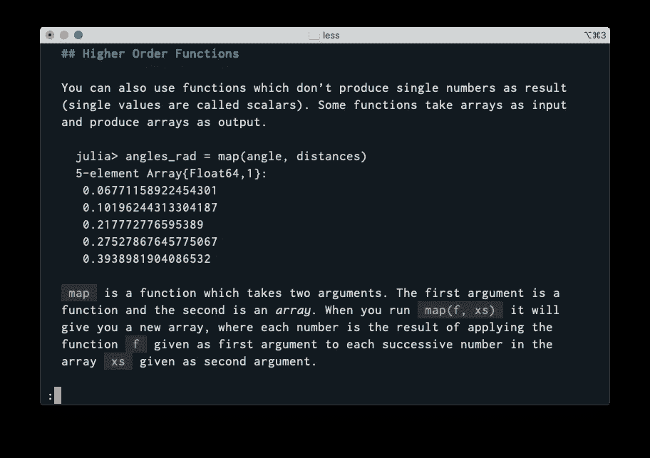

# 面向开发人员的现代命令行工具

> 原文：<https://levelup.gitconnected.com/command-line-tools-for-software-developers-94fb27921440>

## 帮助搜索代码、计算行数、查看文档等的工具

命令行中有比`grep`和`find`更多的东西。更好的图形支持和 unicode 支持为创建漂亮的命令行工具提供了更多的可能性。

## 树——树

显示目录的树状视图。

```
$ tree -L 2 foobar
```

这显示了一个`foobar`目录的树形视图，但是只有两层。


在使用自制软件的 macOS 上安装: `$ brew install tree`

## 蝙蝠——蝙蝠

`bat`是经典`cat`命令的替代。下面是一个在文件上执行`bat`的例子:

```
$ bat examples/temperature.py
```


您可以看到一个主要的优点是它突出显示了语法，使得查看各种文件更容易，尤其是源代码文件。`bat`还能够为手册页着色。你可以在这里阅读更多关于`bat`能力[的内容，但是如果你像我一样使用鱼壳，你可以像这样启用`bat`:](https://github.com/sharkdp/bat)

```
set -x MANPAGER "sh -c 'col -bx | bat -l man -p'"
```

或者一个更简单的解决方案是只安装可选的`bat`命令，其中你只使用一个 bat 作为前缀，所以你写`batman`而不是`man`。

```
brew install eth-p/software/bat-extras
```

## VisiData — vd

[VisiData](https://www.visidata.org) 是一种命令行 Excel。它在工作方式上与 Vim 有一些相似之处。


这将在当前目录的 VisiData 中打开一个视图，让您深入到想要进一步调查的文件: `$ vd .`

在 macOS 上，您可以轻松地安装自制软件:

```
$ brew install visidata
```

## 模糊查找— fzf

[模糊查找](https://github.com/junegunn/fzf)，`fzf`比`find`更方便用户查找特定文件，因为它是交互式的。

```
$ fzf
```

这将给出匹配文件的列表，您可以通过键入试图以模糊方式匹配的字母来缩小范围。


你可以在这里找到一些如何使用这个工具的有趣例子。

安装方式: `$ brew install fzf`

## 快速查找— fd

`fd`是`fzf`的替代品。它是互补的，因为它不像`fzf`那样是交互式的。


安装方式: `brew install fd`

## 发光—发光

一个漂亮的终端降价查看器。安装方式:

```
$ brew install glow
```

您可以使用`glow`打开当前目录中的 markdown 文件，只需输入:

```
$ glow
```

给你一个大概的印象:


当您选择单个文件时，您会看到不同的语法元素以不同的颜色突出显示:



## 计数代码行数— cloc

如果你想快速了解你自己或别人的项目中有多少行代码，那么`cloc`是一个很棒的小工具。它会考虑注释行之类的东西。


安装方式:

```
$ brew install cloc
```

## Grep 替换—确认

`[ack](https://beyondgrep.com)` [](https://beyondgrep.com)是对`grep`的彻底改进，可以搜索源代码。安装方式:

```
$ brew install ack
```

这个工具的一个好处是，你不需要做任何配置来处理源代码。开箱即用，它将限制其搜索源代码文件。

## Grep JSON 文件— jq

这允许您递归地从 JSON 文件中挑选元素。

```
cat somefile.json | jq '.["foo"]["bar"]'
```

这将挑选出 JSON 文件中存储在键`bar`下的内容，键`bar`位于键`foo`下。

安装方式: `$ brew install jq`

## 卡库恩—卡克

Kakoune 不是一个真正的小工具，而是 Vim 风格的代码编辑器。这是 Vim 的一个用户友好版本，如果你需要在你的一台计算机上远程编辑，这是很有用的。

## 努谢尔—努

`nu`实际上是一个特殊的 shell，处理它的所有输出，就好像它们是数据帧(表)。它几乎有点像外壳，工作方式有点像 SQL。

例如，在 Nushell 中，像`ls`这样的命令将产生表格作为输出。您可以使用`select`选择该表的单个列:

```
> ls | select name size
```

但是这也可以推广到`.csv`文件，例如，如果我得到一个`welldata.csv`文件，我可以这样做，只得到`MD`和`TVD`列作为输出。

```
> open welldata.csv | select MD TVD
```

您可以将此选项与不同的选项结合使用，例如选择第 4、8 和 10 行:

```
> open welldata.csv | select MD TVD | nth 4 8 10
```

## 鱼壳——鱼

严格地说，这也不是一个 shell 工具，但它是我喜欢的 shell。与其他 shells 相比，它的主要优势是功能强大，同时易于学习和使用。

您可以通过集成`fzf`来改进它的操作，这样您就可以使用`Ctrl-R`通过命令历史进行正常的反向搜索。为此，你需要安装`fisher`软件包管理器。

```
$ brew tap bbatsche/fisher
$ brew install fisherman
$ fisher add jethrokuan/fzf
```

其他工具外壳如`zsh`也有类似的功能。

# 进一步阅读

如果你想看更多这类工具的例子，你可以看看这些网页:

*   [现代命令行工具在 Rust](https://zaiste.net/posts/shell-commands-rust/) 中重写。