# 命令命令行

> 原文：<https://levelup.gitconnected.com/commanding-the-command-line-dd005e888cc2>

如果你是编程新手，你现在可能更习惯使用图形用户界面(GUI)——想想 MAC 的“Finder”和 Windows 的“File Explorer”。

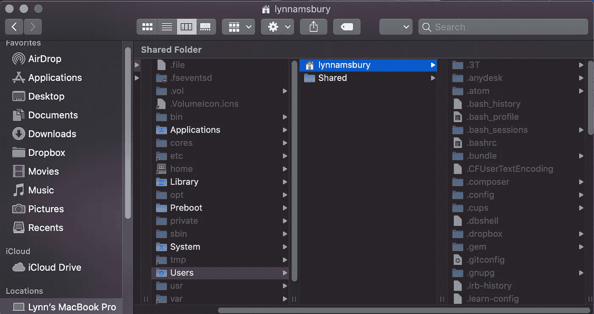

MacOS 的 Finder 窗口

然而，随着您继续您的编码之旅，您将很快了解到命令行界面(CLI)不仅是您访问某些所需工具的唯一方式，而且它比 GUI 快得多(您现在可能没有这种感觉，但是当您习惯它时就会有这种感觉)。

如果您不熟悉命令行，那么本文旨在作为入门的基础教程。

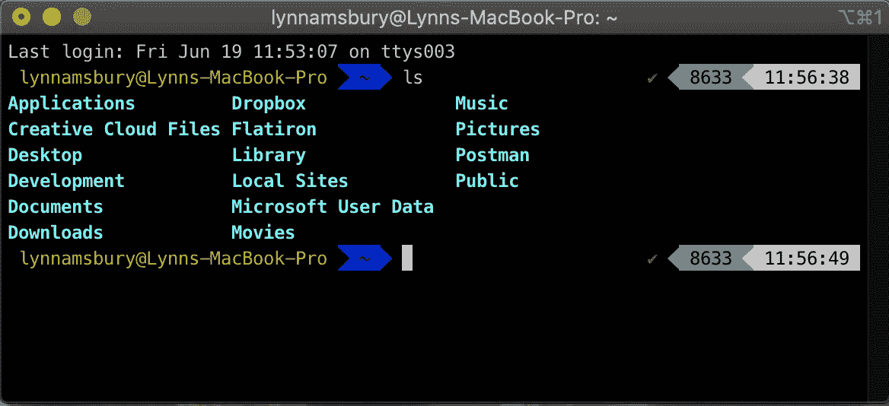

iTerm 窗口

# 那么命令行是什么呢？

命令行允许用户使用文本与计算机通信。您可以从终端程序(也称为“终端”，是“终端模拟器”的缩写)访问命令行。“终端”是指早期的计算，当时用户从单独的工作站访问一台被称为大型机的共享计算机。这些工作站被称为终端，它们由一个显示器和一个键盘组成，并与主机相连。从那时起，事情有了很大的发展，现在我们使用软件程序创建的虚拟终端与我们的计算机进行交互。

Mac 用户可以访问内置的终端，该终端可以通过 Launchpad 启动。还有其他几个终端程序可以下载；我用 iTerm2。此外，您的文本编辑器可能有一个内置的终端。我使用 Visual Studio 代码，它也有一个我经常使用的终端。

当你打开一个终端时，它会启动一个外壳程序。shell 程序从用户那里获得输入，并将输出返回给屏幕。shell 程序读取并解释用户在命令行界面中键入的文本，与计算机交互以处理命令，并通过命令行界面将信息返回给终端程序。最常见的 shell 程序叫做 bash。

# 命令入门

## 我在哪里？

如果您打开终端进行新的会话，您可能在您的个人目录中。

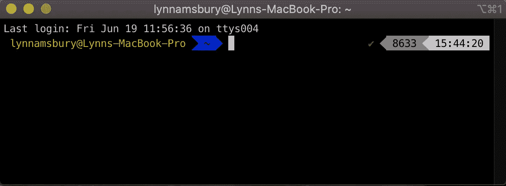

波浪号

在我的 iTerm 窗口中，当我打开一个新的会话时，你可以看到代表我的主目录的波浪号(~)，但是如果我不知道波浪号是什么意思，我可以输入代表“打印工作目录”的`pwd`

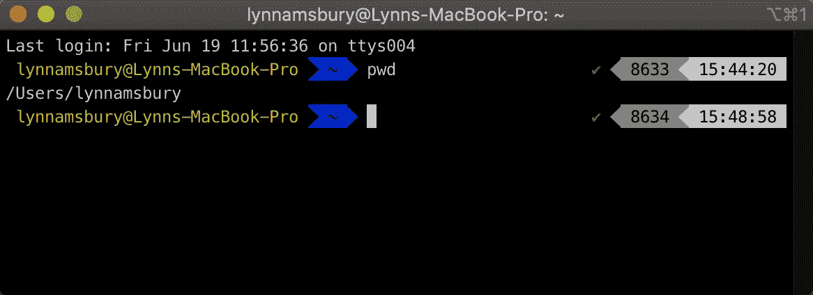

显示当前工作目录

果然，我在我的主目录中。

## 除了我，这里还有什么？

在命令行中键入`ls` (list)来找出答案！

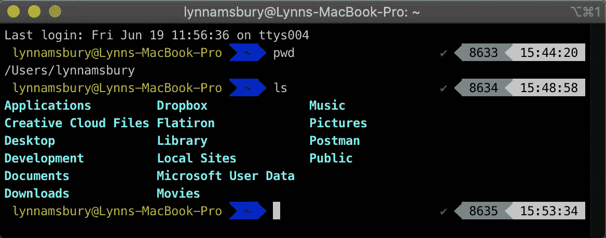

限位开关（Limit Switch）

我的主目录中有几个其他目录(也称为文件夹)。

## 盒子里有什么？

或者更确切地说，是其他目录？

让我们进入其中一个`cd`(改变目录)一探究竟。

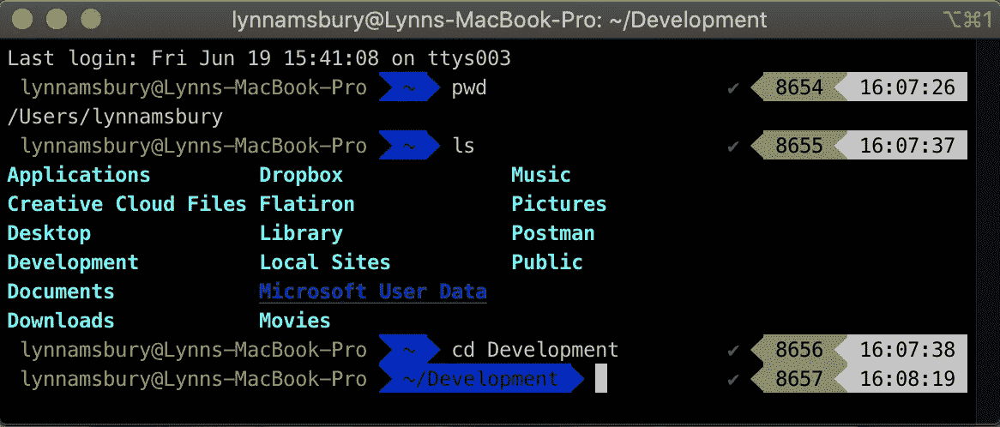

激光唱片

嗯嗯嗯……怎么回事？

我确实切换到了开发目录，但是为了查看那里有什么，我需要再次运行我的 list 命令`ls`。

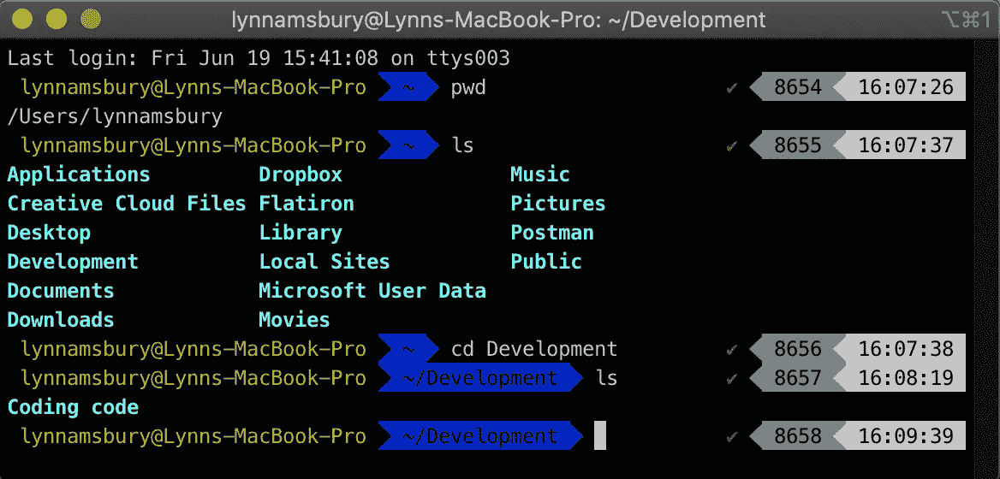

cd 后的 ls

现在我可以在我的开发文件夹中看到两个目录。我也能理解，但我想你已经明白了。

## 所以，概括一下:

打印您的 **W** 工作 **D** 目录(您现在所在的位置)。

`ls`**L**is**s**你当前所在的目录中的所有内容。

`cd`让你 **C** 切换到不同的 **D** 目录。

## 更多命令:

`cd ..`让你退出你所在的目录，回到父文件夹。它会将您在文件结构树中上移一级。

`cd ../..`让你退出你所在的目录，并通过*两个*级别进入祖父目录。你可以继续像这样连锁，但你可能想停下来，在某种程度上确定你在你认为你在的地方。

`cd`和`cd ~`都将直接带您到您的主目录。

`mkdir`用一个文件夹名新建一个目录(文件夹)。

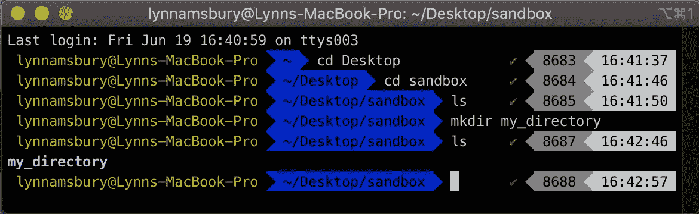

我的目录

`rmdir`用文件夹的名字删除一个目录——只要它是空的。

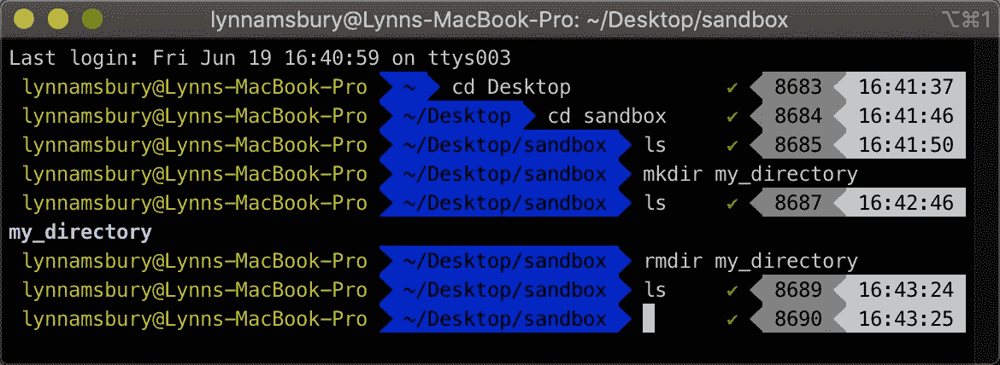

我的目录

如果该文件夹中有文件，则需要首先删除它们，否则当您尝试删除它时会出现错误。

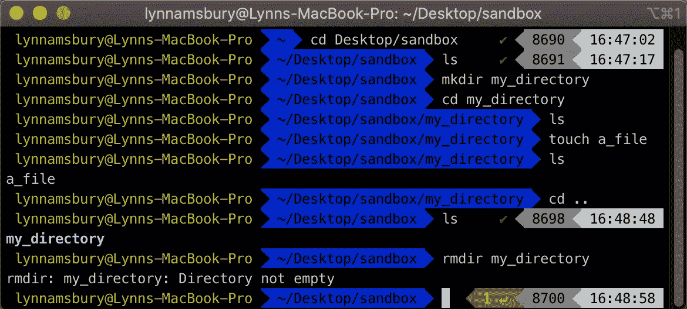

错误

`touch`用一个文件名制作一个新文件。

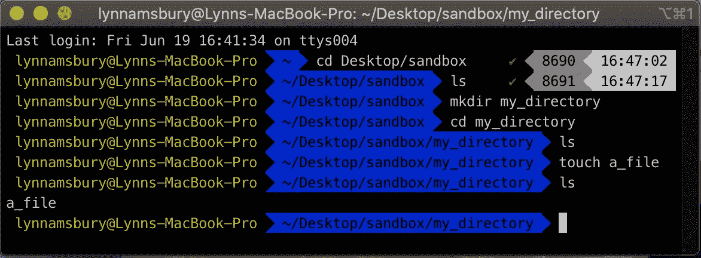

触摸文件

`rm`用文件名删除该文件。

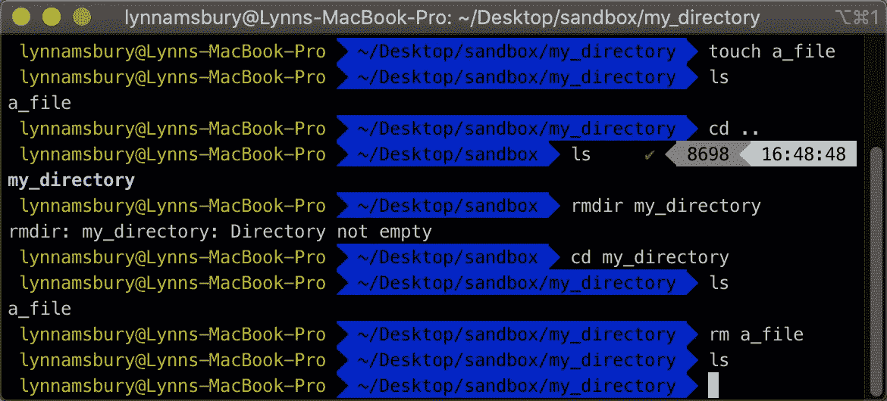

rm a_file

`rm *`将删除文件夹中的所有文件和子目录。

`take`用一个文件名或一个文件夹名将两个*创建*那个文件或文件夹*和*你放进去了。

如果你的终端变得过于杂乱，它会清理你的终端，给你一个清新开阔的工作空间。

这远不是您可以在命令行中做的所有事情的详尽列表，但它应该足以让您开始。快乐指挥！

附言:如果你想练习命令行，麻省理工学院有一款名为 [Terminus](http://web.mit.edu/mprat/Public/web/Terminus/Web/main.html) 的有趣游戏可以帮到你。