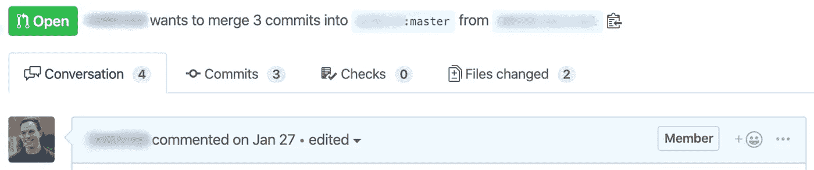

# 像谈判一样评论公关

> 原文：<https://levelup.gitconnected.com/comment-on-prs-like-youre-negotiating-6523b55709de>

## 在维护开发人员礼仪的同时，影响拉式请求中的变更的最好和最有效的方法是将其视为谈判

前联邦调查局谈判专家克里斯·沃斯的*从未分裂差异——谈判就像你的生活取决于它一样*是一本诱导转变的书，它有能力增强你沟通的许多方面。将沃斯讨论的谈判策略融入你的日常生活——包括你的工作——无疑会让你的互动产生更令人满意的结果。

作为一名软件工程师，我的许多书面交流都是通过拉式请求进行的。不可否认，我并不总是像预期的那样传达我的想法。更有问题的是，有时一条评论会从我的脑海中过滤掉，而我会准确无误地传达我的想法*。提醒自己每一个拉取请求都是一次谈判，我尽最大努力调整我的评论内容，让我的同事理解我的观点。通常情况下，下面的谈判策略会说服同事用更多的时间和精力来换取我的认可。*

**

# *你需要的 3 种谈判策略*

## *1.损失厌恶*

> *“人们会冒更大的风险来避免损失，而不是获得收益”(沃斯 128)。*

*一般来说，人们都是[厌恶损失的](https://www.scientificamerican.com/article/what-is-loss-aversion/)。大多数人宁愿投资于低风险资产，即使他们可能从高风险资产中赚更多的钱。将同样的概念应用到反馈中，最好是**强调通过合并提议的变更可能会失去什么**，而不是通过重复反馈可能会得到什么。*

> *你有没有可能把这个重构成 O(n)时间而不是 O(n)？O(n ) time 会增加应用程序响应时间，**这会降低吞吐量，导致其他系统的级联故障。***

*通过评论*什么会丢失，*投稿人更有可能改正错误。管理层更有可能注意到损失(失败的系统)而不是相应的收益(更快的响应时间)。*

## *2.标准问题*

> *“有针对性的问题能够教育你的对手问题是什么，而不是通过告诉他们问题是什么而引起冲突”(沃斯 153)。*

*一个校准的问题是精心设计的——它是一个开放式的问题。它可以偏离他人之前提出的观点。它可以是一个旨在引导对方得出你的结论的问题。然而最重要的是，这给人一种错觉，以为对方在控制局面。这些问题通常以“什么”或“如何”开头，很少以“为什么”开头一般来说，沃斯解释说“像对待热炉子上的燃烧器一样对待‘为什么’——不要碰它”,因为它几乎总是被认为是“指责性的”(沃斯 153-154)。将与拉请求的作者相矛盾的陈述改写成问题，并从你的词汇表中删除单词 *why* 。例如，代替:*

> *“这个逻辑比较复杂，请简化一下。”*

*或者*

> *“你为什么决定这样做？”*

*考虑一下，*

> *“你使用这种逻辑结构的动机是什么？目标是什么？”*

*从小我们就被教导要问*为什么*——这是我们工程师一直在做的事情。然而，你需要去编程这种行为；和别人交流的时候忘了这一点。你可以传达同样的信息，而不会得到防御性的回答。相反，你会得到一个真实的答案——或者更好的是，一个谈判另一端的人解决了你所说的问题的答案。*

*校准问题的其他示例有:*

*   *这解决了什么问题？*
*   *这怎么会是最优解呢？*
*   *是什么激发了这种变化？*
*   *这将如何解决问题？*

**

## *3.获得见面时间*

> *“和你的同事面对面交流。十分钟的面对面交流往往会揭示出超过几天的研究成果”(沃斯 245)。*

*如果所有这些都失败了，安排一次与提出拉取请求的人的快速一对一的会面，或者在空闲时间与他们联系，看看你们是否能在他们的办公桌前讨论这个问题。书面交流很容易被误解，因为没有一种语言是脱离上下文的。*

*考虑上述谈判策略，口头重申你在拉动式请求中提出的顾虑。记得微笑——你会发现自己没那么苛求。*

# *学以致用*

*我可能已经从克里斯·沃斯的*中删去了与软件工程相关的关键要点——谈判就像你的生活取决于它一样*；很难在一篇简短的文章中做到这部优秀的书正义。里面的课程不仅会提高你的工作产出，还会在工作之外影响你。这本书充满了激烈的人质谈判故事，以及沃斯和他的学生生活经历中较为平静的轶事。*

*在写下一条评论之前，使用 1。厌恶损失，2。校准问题，和 3。见面时间。成为有说服力的评论大师不是一朝一夕的事，但是坚持下去，你会看到巨大的成果！*