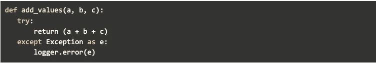
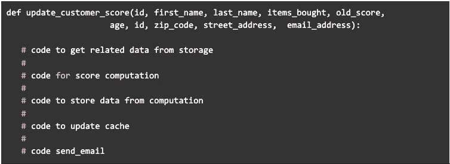

# 数据科学项目中常见的代码味道以及如何修复它们

> 原文：<https://levelup.gitconnected.com/common-code-smells-in-data-science-projects-and-how-to-fix-them-e1e3b2a2fd39>


我合作过的很多数据科学和 ML 项目，都是先不是程序员的人写的。他们主要关心的是一个工作模型，而不是一个可维护的软件，所以他们写的代码不像你所期望的那样适合生产是很合理的。在本文中，我列出了我在重构 DS/ML 应用程序时遇到的一些最常见的代码味道。我希望这个列表能对一些人发展他们的“代码鼻子”有所帮助。

代码气味可以作为您的代码可能有问题的指示器。它们并不具有规定性。不应该作为*“看到 x 就错了，要做 y”。像往常一样，理解你的代码如何工作，如何使用，如何发展，基于这些因素，你可以辨别你是否在做正确的事情。*

**伐木不当:**

我不确定这是否可以归类为代码味道或反模式，但是我经常看到这种情况，我觉得这种做法应该在本文中占有一席之地。



logging.py

在上面的例子中，无论什么原因导致计算失败，都会创建一个错误日志。在这种情况下，记录而不是让函数失败是不好的，因为它可能会创建一个意外的状态，在这种状态下，即使发生了失败(应该是致命的),程序仍会继续执行。这种做法还会在日志中隐藏错误，而不是让开发人员处理异常。

如果你想更深入地了解伐木业的实践， [sobolevn 写了一篇关于它的精彩文章](https://sobolevn.me/2020/03/do-not-log)。

**长方法和长参数列表:**

简洁明了的方法更容易阅读和工作。长参数和长方法通常是需要重构为一个类或拆分为一个单独方法的征兆。

比方说，我们有这样的代码



由于上面的例子是一个伪代码，这个函数试图做什么就一目了然了。但是如果它是一个实际的函数，读者可能需要一些时间来弄清楚。在重构这段代码之前，我们可以问问自己。

*“我真的需要所有这些参数吗？如果是，我能把它们组合成对象或数据类吗？”*

此外，我们还可以注意到，这个函数不仅按照函数名的建议更新客户分数，而且还检索相关数据、计算和发送电子邮件。所以值得考虑的是，它们是否真的需要在同一个函数中。

*附注:我犯这种渎职行为的次数比我愿意承认的次数要多。*

**死代码**

死代码是代码中不再使用或不再相关的部分；尽可能地删除它们。随着时间的推移，死代码会越积越多，没有人有足够的时间进行大扫除。我对此的建议是使用一个好的 linter，当函数中的变量没有被使用时，它会在 CI 中发出警告/失败，并使用一个 IDE，它允许您查看函数的使用情况。

**评论**

人们打算通过在代码中添加文档作为注释来做好事。有些人甚至解释了每一句台词的意思:

```
*## add x and y, and then return sum* 
```

当注释由于代码进化而变得不准确时，这是不必要的，甚至可能适得其反:*“注释说 x，但程序说 y，这是一个 bug 吗？”*。并不是说注释不应该存在于你的代码库中，但是大多数时候，你的代码应该更简单并且[自文档化](https://stackoverflow.com/questions/209015/what-is-self-documenting-code-and-can-it-replace-well-documented-code)。

一些提示:

*   如果意图很明显，就不要添加评论。
*   删除/更新旧评论。
*   选择好的变量名和函数名，而不是注释。

**不交流和不一致的名字**

您的方法名称应该简洁地描述它的功能(自我记录),并选择一组应该在整个项目中使用的标准术语。例如，您可以选择一个更具体的名称，如“translate_files()”，而不是将方法命名为“process_files()”。以下是一些关于命名的提示:

*   方法/变量的意图应该从它的名字就能看出来
*   变量应该彼此有意义地不同
*   类名应该是名词
*   方法名应该有一个动词
*   为类似目的标准化名称

**消息链**

当类中有多层方法调用时，就会出现消息链。消息链违反了德米特的[法则，该法则规定对象只能与最近的邻居通信。违反 LoD 的代价是您将在代码库中获得大量的依赖性，从依赖性和可测试性的角度来看这是很糟糕的。修复消息链的一个常用方法是检查依赖关系并分离方法/类。](https://en.wikipedia.org/wiki/Law_of_Demeter)