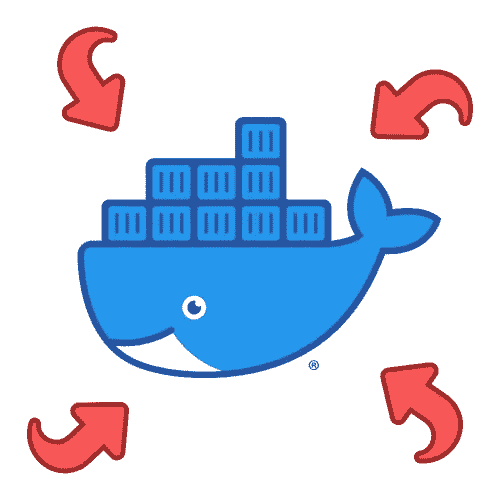

# 常见的 Docker 漏洞及其修复方法

> 原文：<https://levelup.gitconnected.com/common-docker-vulnerabilities-and-how-to-fix-them-6e51724c16a1>

Docker 容器已经成为一种越来越流行的打包和部署应用程序的方式，它提供了一种在一致的环境中运行软件的轻量级和可移植的方式。然而，像任何其他系统一样，如果配置不当，Docker 容器容易受到各种安全问题的攻击。

Docker 漏洞

这里有一些你在使用 Docker 容器时应该注意的常见漏洞…

# **不安全的 Docker 守护进程**

Docker 守护进程是 Docker 平台的核心组件，它负责管理主机上的容器。如果 Docker 守护程序没有得到适当的保护，未经授权的用户就可以访问它，然后启动、停止和操纵主机上的容器。

Docker 守护进程结构

为了保护 Docker 守护进程，您应该确保只有受信任的用户才能访问它，并且它被配置为使用安全的通信协议，如 TLS 或 SSH。

# 不安全的容器图像

容器映像是用于创建 Docker 容器的模板，它们包含应用程序运行所需的所有代码和依赖关系。如果映像是从不安全或不可信的来源构建的，它可能包含可被攻击者利用的漏洞。

图像漏洞

为了确保容器图像的安全性，您应该只使用来自可信来源的图像，并确保定期将它们更新到最新版本。

# 错误配置的容器设置

Docker 容器有各种各样的设置，可以配置这些设置来满足在其中运行的应用程序的需要。但是，如果这些设置配置错误，可能会给容器带来安全风险。例如，如果您将容器的特权级别设置得太高，它可能会获得对敏感系统资源的访问权限。

错误配置

为了避免这类问题，您应该仔细检查和配置容器的安全设置。

# 网络安全性不足

Docker 容器通常部署在网络环境中，它们依赖网络通信来正常工作。但是，如果网络没有得到适当的保护，攻击者就可以访问和操纵容器。

网络漏洞

为了保护您的容器免受基于网络的攻击，您应该确保您的网络配置正确，并使用防火墙和其他安全措施来限制可信用户和设备的访问。

# 摘要

Docker 容器是打包和部署应用程序的一种强大而方便的方式，但是如果配置不当，它们也容易受到各种安全问题的攻击。为了保护您的容器和它们承载的应用程序，您应该确保 Docker 守护程序是安全的，只使用可信的和最新的容器映像，仔细配置您的容器的安全设置，并保护您的网络。

总的来说，保护 Docker 容器需要强大的安全实践、定期维护和持续监控的组合，以确保及时检测和解决漏洞。

如需更多类似内容，请关注或联系我:

*   **推特:** [@BenTorvo](https://twitter.com/BenTorvo)
*   【ben@torvo.com.au】邮箱: [邮箱:](http://torvo.com.au/)
*   **网址:**[torvo.com.au](http://torvo.com.au/)

# 分级编码

感谢您成为我们社区的一员！在你离开之前:

*   👏为故事鼓掌，跟着作者走👉
*   📰查看[升级编码出版物](https://levelup.gitconnected.com/?utm_source=pub&utm_medium=post)中的更多内容
*   🔔关注我们:[Twitter](https://twitter.com/gitconnected)|[LinkedIn](https://www.linkedin.com/company/gitconnected)|[时事通讯](https://newsletter.levelup.dev)

🚀👉 [**加入人才集体，找到一份令人惊喜的工作**](https://jobs.levelup.dev/talent/welcome?referral=true)