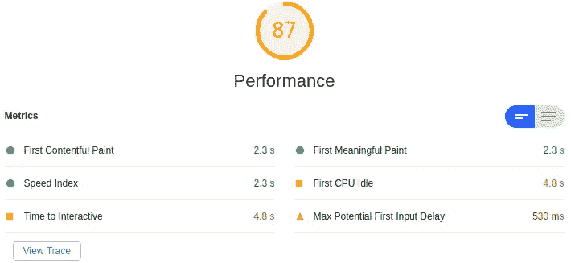
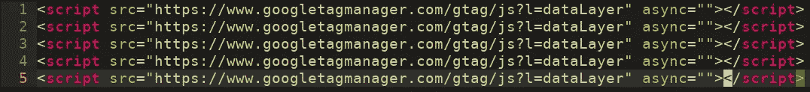

# 预渲染 Vue.js 应用程序的常见问题(以及如何解决)

> 原文：<https://levelup.gitconnected.com/common-issues-pre-rendering-your-vue-js-app-and-how-to-fix-them-14e7fe8a5a60>



当你试图缩短你的第一次绘制时间时，预渲染你的应用程序是一个简单的方法来获得即时的提升。它的工作方式非常简单——作为应用程序构建过程的一部分，您可以模拟一个浏览器，并在您的应用程序中访问您想要预渲染的路线。它们被允许加载到初始就绪状态，然后当前的 DOM 状态被保存，这就变成了你的预渲染入口点。

所以现在当用户第一次访问你的网站时，他们会立即下载代表你已经加载的应用程序的静态 HTML 因此，即使你的应用程序还没有加载，看起来也已经加载了！希望在他们注意到之前，子弹已经上膛了。这也可能有一些优势，让你的网站容易被一些搜索引擎抓取。

使用最新的 Vue CLI，将预渲染设置为构建过程的一部分非常简单。但是经过几天的挠头和调试，我想我应该回顾一下在我自己的开发中绊倒我的几个问题和交互。希望以后能帮你省点时间！

## 处理重复或动态注入的标签



有时候你包含的库会动态地插入一个`<script>`或者注入一个`<iframe>`。他们这样做是为了推迟加载，发布相关的跟踪信息，或者根据客户端的配置加载不同的资源。不幸的是，当你预渲染时，你的构建机器现在是客户端，所以他们添加的所有东西现在都是垃圾。这样做的库的几个例子是 [Firebase Analytics](https://firebase.google.com/) (它引入了`[gtag.js](https://developers.google.com/gtagjs)`)和 [Stripe](https://stripe.com/docs) (它添加了一个跟踪`<iframe>`，其中会话信息已经被编码为 URL 参数)。

要解决这个问题，您需要删除垃圾——预渲染不应该删除导致这些标签被添加的原始库，所以这些应该在预渲染版本中再次运行，这次输出一些有用的东西。这意味着我们需要做的就是对任何预先渲染的输出进行后处理，以移除添加的标签。Vue 预渲染的推荐库是 [prerender-spa-plugin](https://github.com/chrisvfritz/prerender-spa-plugin) ，在这个库中，后处理是通过接受单个对象作为参数的`postProcess`钩子来处理的。我们需要处理的内容包含在参数的`.html`属性中，我们可以重写并返回:

Production vue.config.js

在我的示例代码中，我使用了一些简单的正则表达式来删除有问题的脚本和 iframe 标签以保持简单。一个更健壮、更不容易出错的方法可能是使用像[*cheerio*](https://github.com/cheeriojs/cheerio)*这样的 DOM 操作库来处理这些标签的裁剪。*

您可以通过构建项目并手动检查预渲染输出文件中的重复标记来验证这是否正常工作。

## 异步脚本和样式表不再异步

延迟加载脚本有几种不同的方法，而延迟加载样式表的方法并不多。一种常见的方法是使用 JavaScript 通过操纵`<script>`或`<link>`标签本身(例如，通过交换`media`属性的值)将它从关键路径中取出，并在过程中稍后加载。上一期之后，你大概就能看出这里要出什么问题了。标签会立即自我转换，所以由于预渲染，所有的异步魔法都消失了。

这个问题的解决方案与前一个问题相同——您需要手动对生成的 HTML 进行后处理，将您的`<script>`和`<link>`标签转换回它们的惰性加载的等价标签。实现这一点的实际代码将取决于您设置了哪些脚本和 css，以及您用来延迟它们加载的方法。例如，您可能正在使用像 [critters](https://github.com/GoogleChromeLabs/critters) 这样的库进行关键路径 CSS 内联，并像这样延迟加载 CSS:

```
<link rel="preload" onload="this.rel='stylesheet'">
```

在您的页面被预渲染后，您将只剩下一个`<link rel="stylesheet"`。要修复它，你需要在`postProcess`中将它转换回`rel="preload"`。

## 在页面加载之前，您会看到错误的预渲染


将预渲染与服务人员 SPA 规则相结合会导致一些不寻常的结果

现在这是一个大的，需要一些追踪，罪魁祸首是你的服务人员。您的服务人员的配置很可能包括一个将加载`/index.html`的回退匹配所有规则。这意味着，如果用户安装了您的服务人员，当他们访问您预先呈现的路线时，**他们实际上将获得索引页面的预先呈现版本**！因此，在你的应用程序启动并加载正确的页面之前，他们会看到错误的页面。肯定不是你想要的。

您需要调整配置的几个方面来获得正确的行为。首先，您需要调整正在预渲染的路线列表——扩展它以包含尽可能多的应用程序部分，从而减少回退规则处理的区域数量。

接下来你需要对你的`service-worker.js`做一些调整。您需要找到默认的重定向，看起来类似于`workbox.routing.registerNavigationRoute('/index.html')`并添加一个`blacklist`，这是一个正则表达式数组。例如，如果你已经预先渲染了`/foo`，你会想要:

这将在用户访问`/foo`时将`/index.html`排除在服务之外。

**我没有尝试过这种模式，因为我需要额外的服务人员功能—如果它确实有所描述的问题，您可能需要切换到“InjectManifest”模式来解决它。**

# 总结一下…

预渲染肯定会使你的构建过程变得复杂一些，并且会引入一个全新的 bug 源，这个问题很难解决。但是，一旦它全部启动并运行，第一幅画的额外速度真的很明显，所以投资时间是值得的。上述问题很难诊断，但是一旦你了解了它们，解决起来就很简单了。希望我在未来为你节省了一些时间。