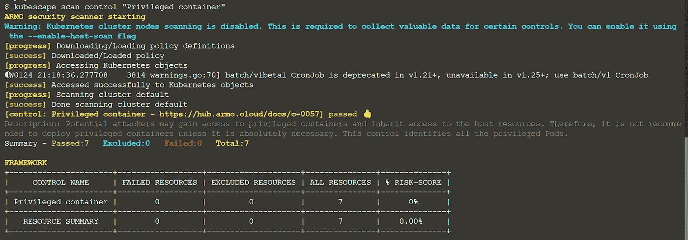

# 常见的 Kubernetes 错误配置以及如何修复它们

> 原文：<https://levelup.gitconnected.com/common-kubernetes-misconfigurations-and-how-to-fix-them-172054f66ee9>


[伊恩·泰勒](https://unsplash.com/@carrier_lost?utm_source=medium&utm_medium=referral)在 [Unsplash](https://unsplash.com?utm_source=medium&utm_medium=referral) 上拍照

越来越多的组织开始在网上开展业务。随着竞争的加剧，组织保持服务更新并提供比竞争对手更多的优势至关重要。由于推送的更新数量不断增加，有效部署和管理基础架构变得更加困难。这就是为什么大多数组织正在转向 Kubernetes。

Kubernetes 是一个开源平台，用于管理容器和与容器相关的服务。使用 Kubernetes，很容易在生产环境中复制与开发环境相同的计算环境。因此，始终确保无故障部署。

虽然 Kubernetes 非常有用，但由于其陡峭的学习曲线，学习起来非常复杂。这导致了错误配置的 Kubernetes 环境的部署。

根据 [StackRox](https://www.stackrox.com/post/2020/02/5-surprising-findings-from-stackroxs-latest-kubernetes-security-report/) 的报告，错误配置是 Kubernetes 安全事件的最大原因。在本文中，我们将回顾 Kubernetes 中常见的错误配置，并讨论最佳实践。

# Kubernetes 错误配置

## 特许集装箱

Kubernetes 为用户提供了部署一个具有最高许可和特权的容器的功能。拥有所有可能权限的容器称为特权容器。特权容器拥有主机的所有根功能。因此，特权容器可以访问普通容器无法访问的所有资源。

特权容器应该只在容器需要直接访问硬件时使用。特权容器的其他用例包括在 docker 容器中运行 docker 守护进程，以及在 Jenkins 中自动执行 CI/CD 任务。如果容器使用特权标志运行，用户将对主机的所有资源拥有关键访问权。如果该容器遭到破坏，攻击者将能够使用所有可用功能运行命令。

在 Kubernetes 中，可以通过在 YAML 文件中指定“privileged: true”标志来部署特权容器。这样的 YAML 文件看起来会像这样:

```
apiVersion: v1kind: Podmetadata: name: <Pod name>spec: containers: - name: <container name> image: <image> securityContext: - privileged: true
```

虽然这个“privileged: true”标志在一个简单的 YAML 文件中很容易发现，但是在一个有许多行配置的 YAML 文件中发现这种错误配置就变得很难了。这就是开源工具像 Kubescape 可以让我们更容易发现错误配置的地方。

Kubescape 是一个工具，它提供了各种安全相关功能的工具集，如风险分析、安全合规、RBAC 可视化工具和图像漏洞扫描。

使用提供的脚本安装 Kubescape 很容易。

# 装置

在您的终端中运行以下 bash 一行程序

```
curl -s [https://raw.githubusercontent.com/armosec/kubescape/master/install.sh](https://raw.githubusercontent.com/armosec/kubescape/master/install.sh) | /bin/bash
```

安装后，运行以下命令扫描易受攻击的 YAML 文件。

```
kubescape scan framework nsa vulernable_file.yaml
```

在这里，我们指定了 Kubescape 的几个参数。

首先，我们指定要执行扫描。由于 Kubescape 提供了多种扫描框架——[MITRE 和 NSA](https://www.armosec.io/blog/kubescape-the-first-tool-for-running-nsa-and-cisa-kubernetes-hardening-tests/)——我们明确指定要使用 NSA 框架。

最后，我们传递想要扫描的 YAML 文件的名称。

完成后，我们可以看到输出表明此 YAML 文件易受攻击，权限提升是可能的。

您还可以测试容器上的特定控件。

```
kubescape scan control “Privileged container”
```

如果您的容器是安全的，不会受到特权容器错误配置的影响，您应该会看到下面的输出。



# 来自私有存储库的图像

许多开发人员将他们的图像存储在云提供商中，如 Azure Container Registry([ACR](https://azure.microsoft.com/en-us/services/container-registry/))或 Amazon Elastic Container Registry([ECR](https://aws.amazon.com/ecr/))。要访问这些云提供商，需要使用云凭据来认证和提取映像。

如果攻击者获得了对集群的访问权，他们可以使用 [imagePullSecrets](https://kubernetes.io/docs/tasks/configure-pod-container/pull-image-private-registry/) 提取凭证，然后使用该凭证从注册表中提取所有映像。

这种错误的配置可以用 kubescape 控件“来自私有注册表的图像”来测试。

要运行此测试，请在终端中键入以下命令:

```
kubescape scan control ‘Images from private registry’
```

如果您正在运行的集群存在这种错误配置，将会显示类似图像的输出。


# Bash/Cmd 在容器内部

如果攻击者拥有在容器中运行外壳脚本或一组外壳命令的权限，他们就可以使用它来执行恶意软件。补救这种错误配置的最好方法是从容器中移除 cmd.exe 或 bash。

可以运行以下命令来检查您的容器是否有这种错误配置。

```
kubescape scan control ‘Bash/cmd inside container’
```

运行时，该控件将在漏洞扫描数据库中搜索产品规格中指定的映像。如果容器有 bash 或 cmd，它将返回不满意。


# 结论

现在，几乎所有的组织都在使用容器来尽可能提高云基础设施和部署的效率。然而，尽管容器技术的部署有所增加，但仍然缺乏熟悉容器配置的人员。这导致攻击数量不断增加。这就是为什么建议借助自动化容器安全框架(如“kubescape ”)来保持最新的容器安全，并确保您遵守 MITRE 和 NSA 规定的所有控制措施。