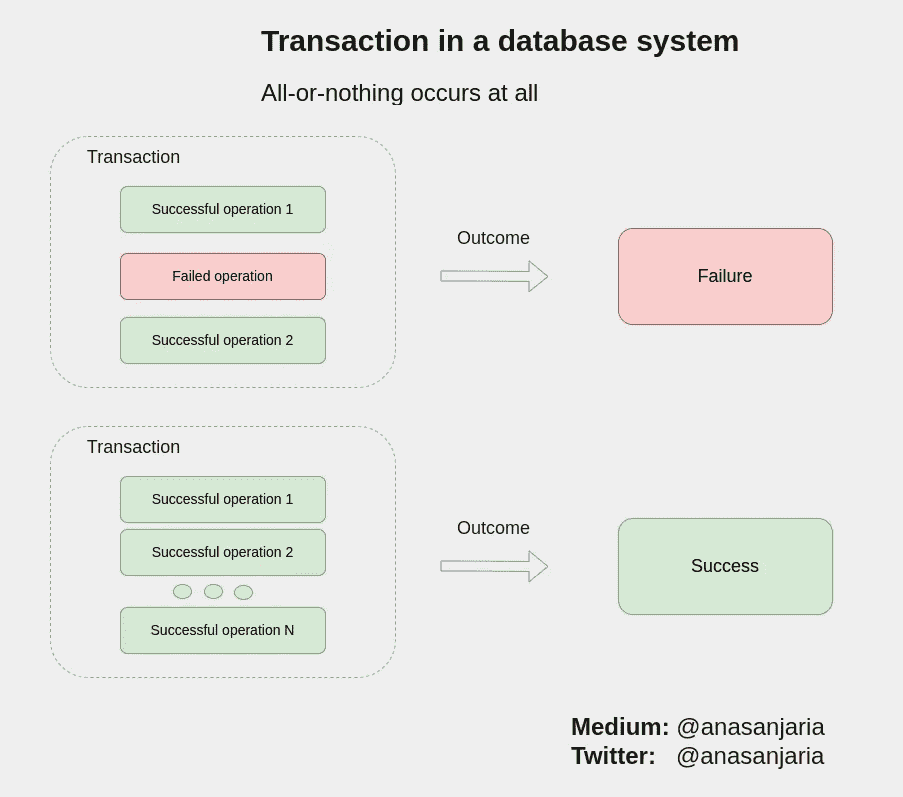
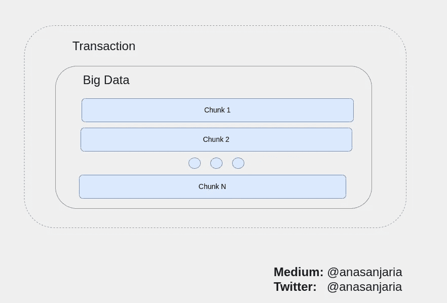
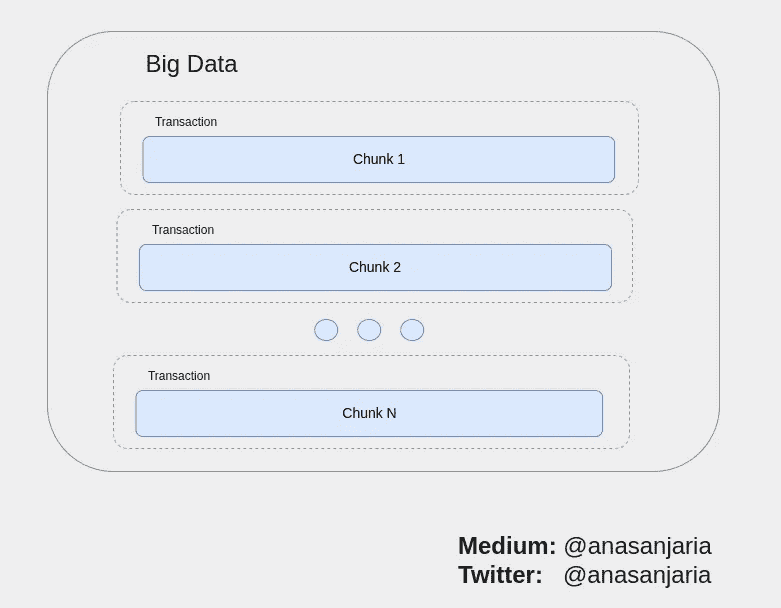
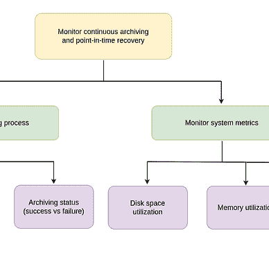
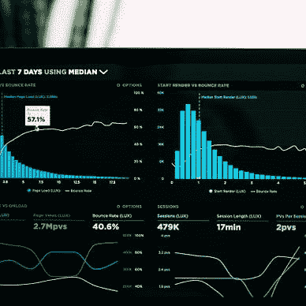
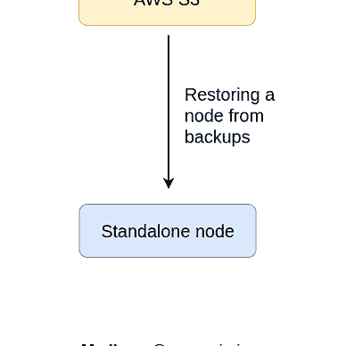
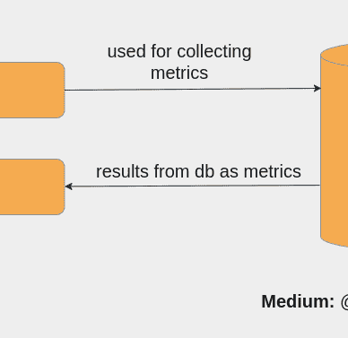

# 常见错误—在交易中处理大数据

> 原文：<https://levelup.gitconnected.com/common-mistake-processing-big-data-in-a-transaction-2b276912a512>

## [数据库](https://medium.com/@anasanjaria/list/databases-7ea27ca82ce1)



数据库系统中事务的概念——由作者使用 https://app.diagrams.net/的[创建](https://app.diagrams.net/)

数据库系统中有一个事务的概念。意思是:

> 执行所有操作或不执行任何操作。

它确保了数据的完整性。但是你知道如何处理交易中的大数据吗？

我遇到了一段代码，它在单个事务中执行大数据。

> 在我看来，这是一种不好的做法。



在单个事务中处理大数据——由作者使用 https://app.diagrams.net/[创建](https://app.diagrams.net/)

# 原因—在单个事务中处理大数据是不良做法

在单个事务中处理所有块的问题是不确定的执行时间。这意味着整体执行时间依赖于大数据，而大数据会随着数据的增长而增加。

> 通常，我们在生产环境中设置查询超时，这样我们的系统就不会永远等待执行数据库操作。

在这个特定的用例中，我们的系统将不断抛出超时异常，因为它不能在给定的时间框架内完成一个大的事务。

另一个问题是它可能会增加我们数据库系统的负载。

# 在交易中处理大数据的推荐做法



处理事务中的每个块——由作者使用[https://app.diagrams.net/](https://app.diagrams.net/)创建

处理大数据的推荐方法是处理事务中的每个(同等大小的)数据块。这样的话，

*   我们有一个确定的执行时间。
*   它不会使我们的数据库系统超载。

感谢阅读。

如果你有任何问题，请随时提问。

如果你喜欢这篇文章，你可能也会喜欢下面的系列文章。


[阿纳斯·安贾里亚](https://medium.com/@anasanjaria?source=post_page-----2b276912a512--------------------------------)

## 数据库

[View list](https://medium.com/@anasanjaria/list/databases-7ea27ca82ce1?source=post_page-----2b276912a512--------------------------------)10 stories

[阿纳斯·安贾里亚](https://medium.com/@anasanjaria?source=post_page-----2b276912a512--------------------------------)

## 现场可靠性工程

[View list](https://medium.com/@anasanjaria/list/site-reliability-engineering-fd4dc0eabf12?source=post_page-----2b276912a512--------------------------------)6 stories

```
**Want to connect?** [Facebook](https://www.facebook.com/anas.anjaria.kh) | [LinkedIn](https://www.linkedin.com/in/anasanjaria/) | [Twitter](https://twitter.com/anasanjaria)**Subscribe to get my work directly into your inbox.** [https://medium.com/subscribe/@anasanjaria](https://medium.com/subscribe/@anasanjaria)
```