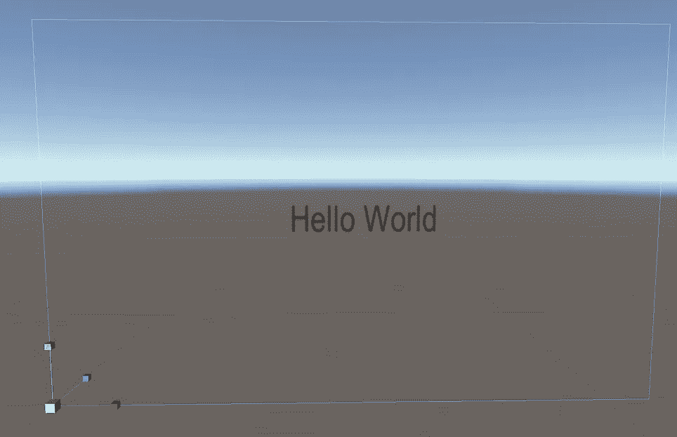
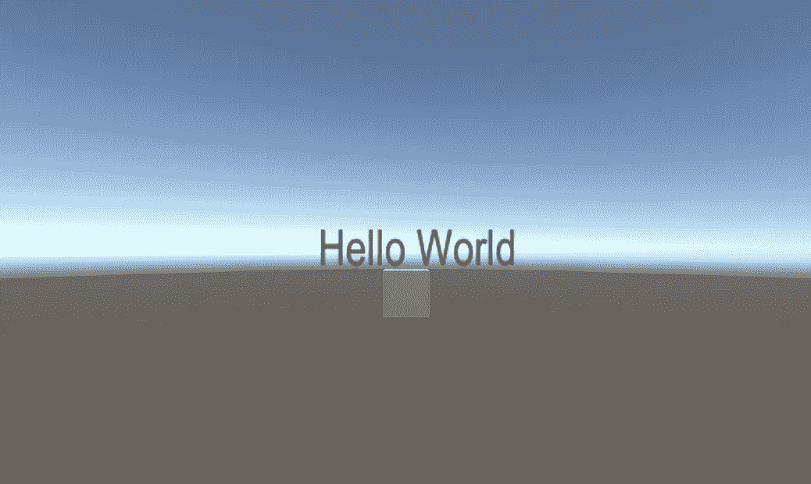

# 初学者在学习 Unity 时的常见错误

> 原文：<https://levelup.gitconnected.com/common-mistakes-beginners-make-while-learning-unity-f9ff1f43d9d6>

## 遵循以下建议，快速推进您的 unity 之旅

Pawel Kadysz 在 [Unsplash](https://unsplash.com?utm_source=medium&utm_medium=referral) 上的照片

我自己也是 unity 的初学者，但是正如他们所说的，o *只有初学者才能理解初学者的痛苦，*所以我写了这篇博文。

我是通过在线课程学习 unity 的，虽然我是按照说明来做的，但还是有一些你无法避免的陷阱。此外，如果你想变得更有创造力，做比他们在课程中教的更多的事情，你肯定会发现自己在几个小时内处于一种困惑的状态。

发生在我身上！出于某种原因，我游戏中的所有关卡都被删除了，我不得不重新创建一切。我不明白灯光是怎么回事，所以在我的第一场比赛中一切都是漆黑一片。我试图为游戏制作一个记分牌，但文本就是不出现。

如果你已经把手弄脏了，我肯定你知道我在说什么。但是如果你是新手，这篇文章将会是你的救星。很难找到这些问题的解决方案/原因。在谷歌上冲浪几个小时后，以下是这些常见问题的解决方案。

## 预制构件

> Unity 的预置系统允许你创建、配置和存储一个游戏对象，包括它的所有组件、属性值和子游戏对象
> 作为可重复使用的资产。预设资源作为一个模板，你可以在场景中创建新的预设实例。

如果你正在处理许多相似的物体和不同的关卡，那么预设真的是一个救命稻草。然而，一知半解会毁掉你的项目。我不小心把关卡都删了，就是这样。

要创建一个预置，只需拖动任何游戏对象到资产文件夹，预置将被创建。你现在可以使用这个预置来创建相同的游戏对象，次数不限。新的游戏对象将从预设中接收所有关于颜色、材质、尺寸等的信息，只有位置和旋转对于每个游戏对象是不同的。

因为信息是从预设中获取的，如果你对那个文件做了任何改变，所有从它派生的游戏对象都会受到影响。你可以更改使用预设创建的游戏对象，但确保不要将它们应用到预设，否则，所有其他游戏对象(与预设具有相同属性)都将受到影响。

比方说我们有 3 个立方体:立方体 A，立方体 B，立方体 C，都是用同一个预设创建的。它们可以有唯一的位置和旋转值，但是比例和其他一切都是一样的。假设，我把立方体 A 的大小从 1 变到 2，其他立方体不会发生任何变化。但是如果我点击 ***应用改变*** 到预设，所有的立方体都会改变。

所以现在我们有三个尺寸为 2 的立方体，我们的预制体也有尺寸 2。

让我们把立方体 C 的 Z 轴边改为 3，立方体 B 的 Z 轴边改为 5，而把立方体 A 和 prefab 留为 2。现在，如果我点击立方体 C 并应用预设，立方体 A 的 Z 轴边也会变成 3，因为它和预设有相似的属性。立方体 B 根本不会变！

为了更好地理解它，我建议你把手弄脏。

 [## 预制构件

### Unity 是 Unity 场景中的基本对象，可以表示角色、道具、场景、摄像机、航点和…

docs.unity3d.com](https://docs.unity3d.com/Manual/Prefabs.html) 

## 照明设备

照片由 [Brian Suh](https://unsplash.com/@_briansuh?utm_source=medium&utm_medium=referral) 在 [Unsplash](https://unsplash.com?utm_source=medium&utm_medium=referral) 上拍摄

灯光是游戏中最重要的事情之一。无论你的场景看起来如何，但没有照明，就像没有盐的食物一样。unity 中有很多种灯光——点光源、聚光灯、平行光、环境照明等。有各种各样的方法来渲染灯光，如果你搞砸了，你的场景可能看起来一片漆黑。

我们可以讨论很多关于照明的问题，但不可能在一篇文章中面面俱到。

> 要改善场景的照明，可以通过使用不同的天空盒、不同的强度和反射来调整环境照明。

关闭环境照明，根据需要添加聚光灯或点光源。现在打开环境照明来获得场景的最终视图。

设置好所有照明对象后，关闭**自动生成照明**并手动生成照明。这将在项目**中创建一个**照明数据资产**。**它包含场景的 GI 数据，以及照亮场景所需的其他数据。

由于自动生成照明将照明数据存储在内存中，而不是存储在文件中，unity 会丢失在播放模式中卸载的场景的 GI 数据。

使用下面的链接了解更多信息。

 [## 照明最佳实践- Unity Learn

### 优化场景照明不是一门精确的科学-你的过程通常取决于你的艺术方向。为此…

learn.unity.com](https://learn.unity.com/tutorial/lighting-best-practices) 

## 帆布

所有的 UI 元素都必须放在 canvas gameobject 中作为其子元素。

场景模式下的画布，文本位于中间。将画布视为全屏。主游戏对象在左下角(左)结果在游戏模式中，文本按预期显示在屏幕中间(右)

创建文本字段时，会自动创建一个画布游戏对象。如图所示，与游戏相比，这块画布看起来很大。有人可能会认为他们需要根据游戏来缩小画布的大小，但事实并非如此。

> 将此画布视为与您的屏幕大小相同，并放置 UI 元素，如图所示。游戏场景中的结果会如你所料。对于默认的屏幕空间覆盖渲染模式来说也是如此。

canvas 中有 3 种渲染模式:屏幕空间覆盖，屏幕空间相机和世界空间。UI 元素的变化方式取决于您选择的呈现模式。

*   在**屏幕空间覆盖模式**中，如果屏幕大小被调整，或者分辨率被改变，画布将自动改变以与之匹配。
*   在**屏幕空间-摄像机模式**中，画布被放置在摄像机前方给定的距离处。在这种模式下，相机设置会影响用户界面的外观。
*   在**世界空间模式**中，画布将表现为任何其他游戏对象。当 UI 必须放在其他游戏对象的后面或前面时，可以使用这种模式。

 [## 帆布

### 画布是所有 UI 元素都应该位于其中的区域。画布是一个游戏对象，上面有一个画布组件…

docs.unity3d.com](https://docs.unity3d.com/Packages/com.unity.ugui@1.0/manual/UICanvas.html) 

## 不要抄袭教程

在开始的时候，因为害怕搞砸任何事情，完全复制教程感觉很容易，也是正确的事情。但是不要这样做。

随着时间的推移，unity(或任何其他程序/语言)的 UI 会发生变化。如果你不能在没有教程的情况下完成一个项目，在某些时候你会陷入困境。最好不要什么都照搬，让你的想象力天马行空，卡住了就用谷歌。