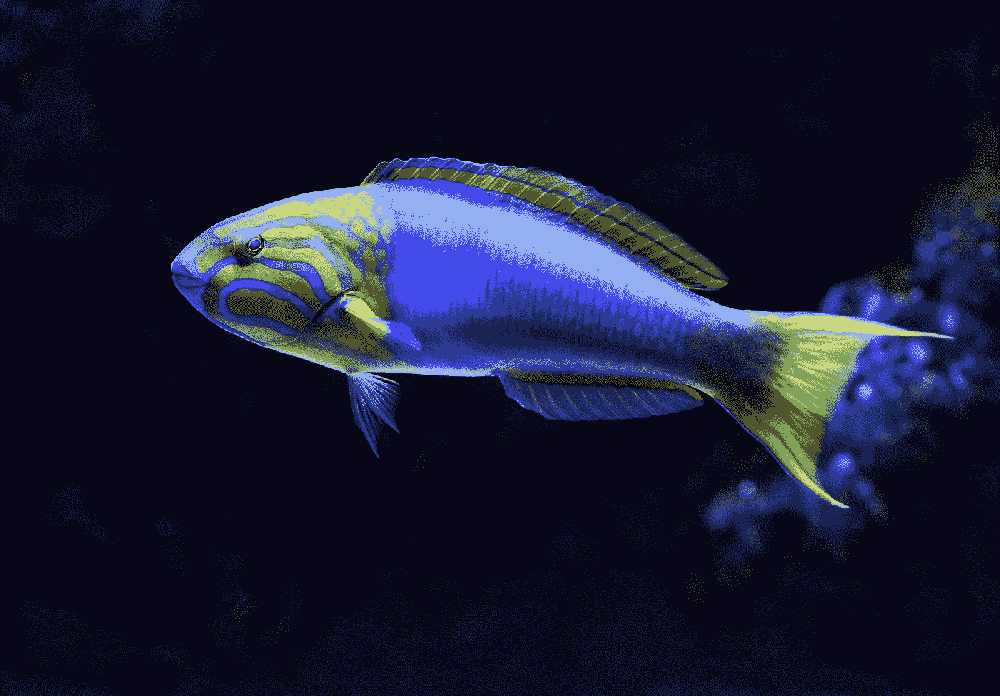

# 常见的 Vue 问题—删除重复元素、全局事件等等

> 原文：<https://levelup.gitconnected.com/common-vue-problems-removing-repeated-elements-global-events-and-more-d09be6474df1>


照片由 [Katerina Kerdi](https://unsplash.com/@katekerdi?utm_source=medium&utm_medium=referral) 在 [Unsplash](https://unsplash.com?utm_source=medium&utm_medium=referral) 拍摄

Vue.js 让开发前端应用变得简单。然而，我们仍有可能遇到问题。

在这篇文章中，我们将看看一些常见的问题，并看看如何解决它们。

# 在用 v-for 呈现列表之前删除重复的元素

为了在使用`v-for`呈现列表之前删除重复的元素，我们可以使用 Lodash 方法创建一个没有重复的比较属性。

例如，我们可以写:

```
import uniq from 'lodash/uniq'
// ...computed: {
  uniqueCategories() {
    return uniq(this.products.map(({ category }) => category))
  }
}
```

我们从每个类别中获得独特的项目。

然后我们可以用`v-for`和`uniques`来代替`products`数组，

我们可以写:

```
<li v-for="category in uniqueCategories">
  {{category}}
</li>
```

# 运行 Jest 测试时意外导入令牌

如果我们有这个错误，这意味着 JavaScript 解释器不能识别这个语法。

为了解决这个问题，我们可以给巴别塔添加`transform-es2015-modiles-commonjs`插件。

我们可以跑:

```
npm i -D babel-plugin-transform-es2015-modules-commonjs
```

来安装它。

# 组件通信

如果我们的组件有父子关系，那么我们可以使用道具和事件。

或者我们可以使用事件总线模式。

为了使用事件总线模式，我们可以创建一个新的 Vue 实例，并在其上调用`$emit`来发出一个事件。

然后我们可以用`$on`方法监听发出的事件。

要创建事件总线，我们只需编写:

```
import Vue from 'vue';
export const EventBus = new Vue();
```

在`event-bus.js`里。

那么我们可以在任何组件中使用它。

我们可以写:

```
import { EventBus } from './event-bus.js';// ...methods: {
  emitGlobalClickEvent() {
      EventBus.$emit('message', this.count);
    }
  }
  ...
}
```

然后在另一个组件中，我们可以通过编写:

```
import { EventBus } from './event-bus.js';//...EventBus.$on('message', count => {
  //...
});
```

`count`具有`this.count`的发射值。

如果我们在父母和孩子之间交流，那么我们可以从父母和孩子那里传递道具。

例如，我们可以写:

```
<child :myProp='myProp'></child>
```

`my-prop`是我们传递给`child`的道具。

在`child`中，我们可以通过`this.myProp`来访问它。

此外，我们可以从子进程向父进程发出一个事件。

例如，我们可以写:

```
this.$emit('childToParent', data)
```

在子组件方法中。

然后我们可以通过写来听:

```
<child :myProp='myProp' @childToParent='val = $event'></child>
```

`$event`具有我们用`childToParent`事件发出的`data`的值。

我们把值赋给了`val`。

# 生产中的分布式文件夹路径

我们可以在生产中为我们的 Vue 应用提供不同的基础路径。

例如，我们可以写:

```
module.exports = {
  publicPath: process.env.NODE_ENV === 'production'
    ? '/path/to/dist/'
    : '/'
}
```

在`vue.config.js`中，将生产路径设置为`/path/to/dist`。

在其他环境中，我们从根为应用提供服务。

`process.env.NODE_ENV`拥有专为其打造的应用环境。

# 使用 v-html 的双向数据绑定

当`contenteditable`属性被添加到元素中时，我们可以监听输入事件来更新内容。

例如，我们可以写:

```
<div id='app'>
  <div class="input" @input="onInput" @keyup.enter="submit" contenteditable></div>
  <div class="output" v-html="msg"></div>
</div>
```

然后在我们的组件代码中，我们写:

```
new Vue({
  el: '#app',
  data: {
    msg: ''
  },
  methods: {
    typing(el) {
      this.msg = el.target.innerHTML;
    },
    submit() {
      console.log(this.msg);
    }
  }
});
```

我们将`this.msg`设置为元素的`innerHTML`属性，以将 HTML 内容设置为`this.msg`。

然后我们可以用`v-html`按原样显示。

# 在 Vue 组件中使用全局变量

要在组件中使用全局变量，我们可以创建一个计算属性。

例如，我们可以写:

```
window.globalVar = 'global';
```

然后在我们的组件对象中，我们可以写:

```
computed: {
  myGlobalVar() {
     return window.globalVar;
  },
},
```

我们获取`globalVar`对象并返回它。

# 这在 Axios 回调中未定义

我们应该为回调使用箭头函数，这样就不会创建新的函数作用域。

例如，我们应该写:

```
.catch((error) => {
  console.error(error.response);
  if ( error.message === "Network Error" ) {
    this.show = true;
    this.message = 'Please try again later';
  }
});
```

箭头函数不绑定到`this`，所以`this`将是组件。



[David Clode](https://unsplash.com/@davidclode?utm_source=medium&utm_medium=referral) 在 [Unsplash](https://unsplash.com?utm_source=medium&utm_medium=referral) 上拍摄的照片

# 结论

我们可以更改提供构建文件的路径。

此外，我们可以创建计算的属性，并使用`v-for`遍历条目。