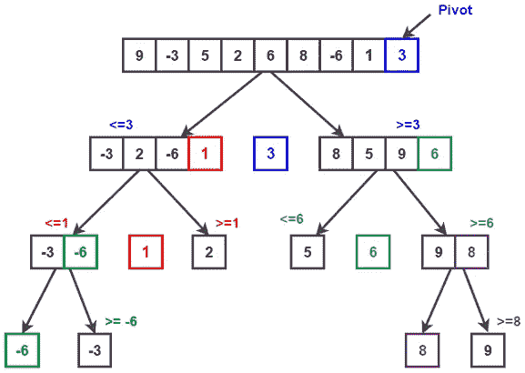
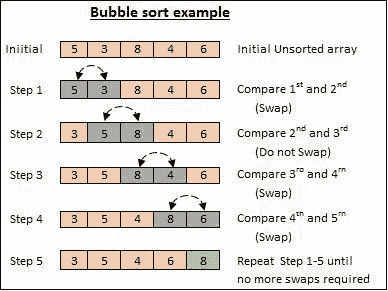

# 用于更好编程的常用排序算法

> 原文：<https://levelup.gitconnected.com/commonly-used-sorting-algorithms-for-better-programming-a3667af12e50>


索菲·埃尔维斯在 [Unsplash](https://unsplash.com?utm_source=medium&utm_medium=referral) 上的照片

**为什么对算法的深刻理解如此重要？因为当我们为一个问题编写解决方案时，我们必须在短时间内实现最高效、最可靠、最快速的代码。如果我们没有很好地掌握算法，那么我们将会在代码中挣扎。**

在本文中，我将讨论两种常用的减少时间复杂度的排序算法技术。

1.  快速排序
2.  气泡排序

# 1.快速排序

这是一个非常高效的算法，对于最坏的情况使用 O(n log n)的时间复杂度，对于一般情况使用 n 的时间复杂度。这是基于将数据数组划分成更小的数组。

*   大数组分为两个数组，一个保存比特定值大的值，另一个保存比特定值小的值。*(具体数值有个专门的名字叫'****pivot****')*
*   分离大数组后，递归调用子数组两次进行排序。



礼貌:[www.techiedelight.com](https://www.techiedelight.com/quicksort/)

pivot 值将数组分为两部分。递归地，我们为每个子列表寻找支点，直到所有列表只包含一个元素。

# 透视算法:

```
**Step 1** − Choose the highest index value has pivot
**Step 2** − Take two variables to point left and right of the list excluding pivot
**Step 3** − left points to the low index
**Step 4** − right points to the high
**Step 5** − while value at left is less than pivot move right
**Step 6** − while value at right is grater than pivot move left
**Step 7** − if both step 5 and step 6 does not match swap left and right
**Step 8** − if left ≥ right, the point where they met is new pivot
```

递归使用 pivot 算法后，我们必须按照下面的算法对每个分区进行快速排序。

# 快速排序算法

```
**Step 1** − Make the right-most index value pivot
**Step 2** − partition the array using pivot value
**Step 3** − quicksort left partition recursively
**Step 4** − quicksort right partition recursively
```

# 使用 java 编写代码

快速排序在大型数据集中非常有效。虽然有些难以理解，但在程序中使用这种算法是非常有效的。

# 2.气泡排序

对于较小的数据集，这种算法比快速排序更容易。这是基于数组中相邻元素的比较，如果它们没有按顺序排列，就进行交换。这对于较大的数据集是无效的，因为平均和最坏情况的时间复杂度都是 O(n ),其中 n 是项目的数量。



# 算法

```
**Step 1 -** Start with the first element of the array, compare the   current element with the next element.
**Step 2 -**If the current element is greater than the next element of the array, swap them. **Step 1 -**If the current element is less than the next element, move to the next element. **Repeat Step 1**.
```

# 使用 java 代码

尽管冒泡排序是一种简单得多的算法，但它不适合较大的数据集。

我希望这有助于您更好地了解这些排序算法。我期待着在未来分享更多的文章。🎊

注意安全伙计们🙌

**参考文献**

[www.tutorialspoint.com](https://www.tutorialspoint.com/)

[www.geeksforgeeks.org](https://www.geeksforgeeks.org/)