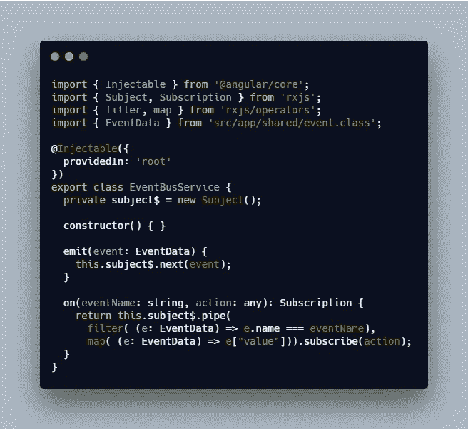
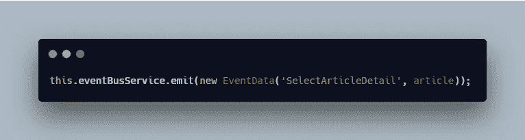
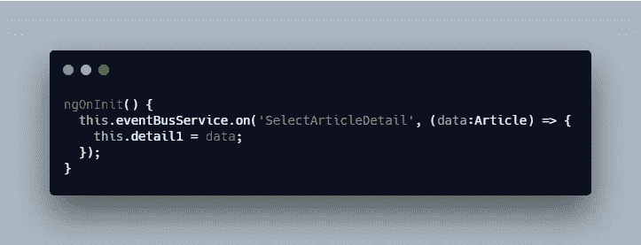
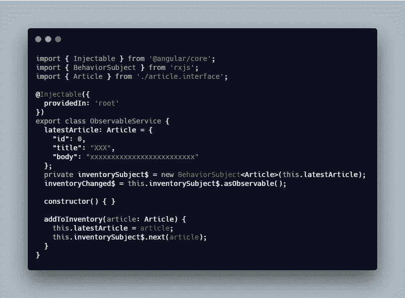
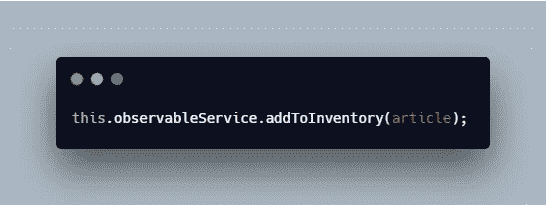
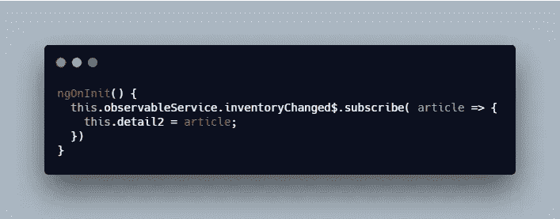

# 使用 RxJS 在角度组件之间进行通信

> 原文：<https://levelup.gitconnected.com/communicate-between-angular-components-using-rxjs-7221e0468b2>

## 有角的

## 关于如何使用 RxJS 主题和行为主题在角度组件之间进行通信的指南

安妮·斯普拉特在 [Unsplash](https://unsplash.com/search/photos/coffee?utm_source=unsplash&utm_medium=referral&utm_content=creditCopyText) 上的照片

在本文中，我将使用 RxJS 展示当组件彼此不认识或者不共享直接的父/子关系时，它们是如何通信的。

内容:

1.  问题
2.  事件总线解决方案
3.  可观察服务解决方案
4.  个案研究

*更多类似的内容，请查看*[https://betterfullstack.com](https://betterfullstack.com)

# 问题

在许多前端框架中，包括 Angular，当我们将应用程序或页面分成许多小的 UI 组件并将事件绑定到祖父组件的父组件的父组件时，总会出现通信问题。

在角度中，我们使用`@Output(**)**`和`@Input()`。这在正常情况下工作得很好，但是当我们想要将传入的数据和传出的事件绑定到一个容器组件时，管理起来可能是一场噩梦。

我们需要在组件的许多层次上添加许多`@Input()`和`@Output()`，有时这是行不通的，但这需要更多的努力，而且有风险。

一种解决方案是使用状态管理，如 [Redux](https://redux.js.org/) 、 [NGRX](https://ngrx.io/) 或 [NGXS](https://www.ngxs.io/) ，以帮助未连接的组件能够进行通信。

在本文中，我将介绍两个额外的解决方案来处理这个问题，而不需要在代码中引入状态管理库。

1.  使用`Subject`事件总线。
2.  用`Behavior Subject`可观察的服务。

为了演示这个解决方案，我将创建[示例源代码](https://github.com/hoangtranson/sample-communication-subject)，它允许用户点击文章列表项，并在另一个组件中显示细节。

# 事件总线解决方案

事件总线的概念非常简单。您将创建一个全局可达的事件总线服务。

然后，您可以向总线发出事件，如果有任何侦听器注册到该事件名称，那么它将执行回调函数。

在本文中，我将使用 [RsJS Subject](/rxjs-subjects-explained-with-examples-78ae7b9edfc) 创建事件总线。

事件总线服务

在文章列表中，每当用户点击一个条目时，就会发出一个事件，并将文章数据传递给事件总线。

从文章列表组件发出事件

这段代码意味着我们将事件`SelectArticleDetail`与文章信息一起发送。

现在，细节组件将监听该事件。

侦听 SelectArticleDetail 事件

监听器将监听`SelectArticleDetail` 并执行回调，将文章数据赋给一个局部变量并显示在 UI 上。

# 可观察服务解决方案

这个想法简单来说就是创建一个清单来传递里面的值。所以每次库存发生变化时，观察者都会知道并执行回调。

我们用名为`inventorySubject$`的默认商品值创建了一个`BehaviorSubject`，并用方法`addToInventory()`将商品添加到库存中。

将商品添加到库存的可观察服务

在商品列表中，用户每次点击商品，都会将商品添加到库存中。

将商品添加到库存

现在，在 detail 组件中，我们将订阅库存以获取新值。

订阅库存更改以获取新值

# 个案研究

我已经将这些技术应用到许多项目中，下面是一些我认为有用的真实案例:

1.  事件总线:我想将相同的模态或弹出窗口分组，以便在用户每次通过 UI 上的按钮与 API 交互时通知用户 web 应用程序的状态。
2.  事件总线:在 mono repo 使用不同前端框架的情况下，我使用事件总线在不同框架之间分派事件并监听，或者从 Angular 分派并监听普通 Javascript。
3.  嵌套组件的事件总线和可观察服务:当我们要绑定数据或事件进出组件 D (UI 组件)到 C (UI 组件)到 B (UI 组件)和 A(容器组件)与 API 通信时，使用`@Input()`和`@Output()`会很复杂。

如果你有更多的案例，我会很高兴听到他们。向他人学习是提高的好方法。

# 摘要

总而言之，本文介绍了两种在两个或多个互不了解的组件之间进行通信的方法。

我们使用可观察的服务来订阅简单情况下的数据，并使用事件总线将不同的事件名称分派给不同的侦听器。

我希望这篇文章对你有用！你可以在[媒体](https://medium.com/@transonhoang?source=post_page---------------------------)上关注我。我也在[推特](https://twitter.com/transonhoang)上。欢迎在下面的评论中留下任何问题。我很乐意帮忙！

 [## 学习角度-最佳角度教程(2019) | gitconnected

### 50 大角度教程-免费学习角度。课程由开发人员提交和投票，使您能够…

gitconnected.com](https://gitconnected.com/learn/angular)  [## 故事-更好的全栈

### 关于 JavaScript、Python 和 Wordpress 的有用文章，有助于开发人员减少开发时间并提高…

betterfullstack.com](https://betterfullstack.com/stories/)