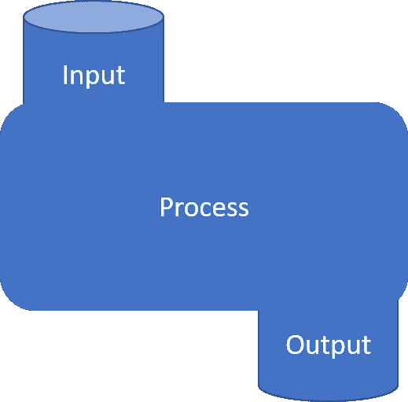
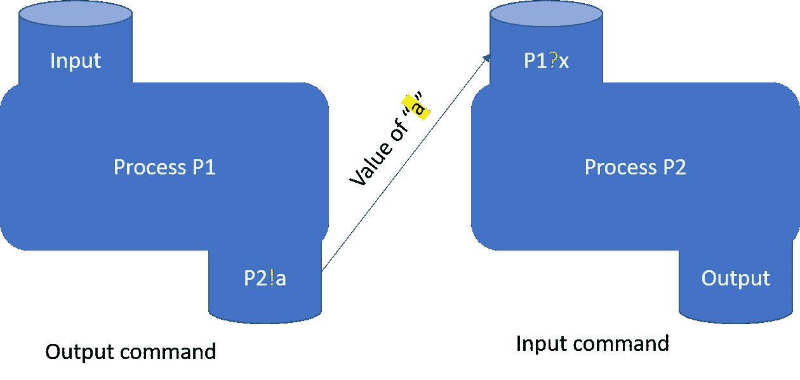

# 简而言之，Go 开发者的沟通顺序流程(CSP)。

> 原文：<https://levelup.gitconnected.com/communicating-sequential-processes-csp-for-go-developer-in-a-nutshell-866795eb879d>

## 简单扼要地介绍 CSP、它的术语以及它的相似之处。

**通信顺序进程(CSP)** 简而言之，每当讨论 Go 并发以及它如何成为并发编程的灵丹妙药时，我们都会听到这个词。当我第一次听到这个术语时，我开始想，

> CSP 是某种使编写并发代码如此简单的新技术或算法吗？

在阅读了 CSP 最初的[论文](https://dl.acm.org/citation.cfm?doid=359576.359585)之后，结果并没有什么奇特之处——一个简单的概念(后来被公式化为[过程演算](https://en.wikipedia.org/wiki/Process_calculus)来推理程序的正确性)通过两种编程原语解决并发性。

1.  **输入。**
2.  **输出。**

本文将术语*流程*缩写为任何需要输入才能运行并产生输出的独立逻辑。(你可以把这想象成`Goroutine`)



CSP 流程

**允许多个并发进程通过同步它们的 I/O 来彼此同步(*通过指定的源和目的地*进行通信)。本文用命令对此进行了描述。**

> `!`用于向流程发送输入

> `lineprinter!lineimage`
> 
> 向`lineprinter`发送`lineimage`的值进行打印。

> `?`用于读取过程的输出

> `cardreader?cardimage`
> 
> 从`cardreader`读取一张卡片，并将其值(一个字符数组)赋给变量`cardimage`。

CSP 描述的主要概念是同步和[保护命令](https://en.wikipedia.org/wiki/Guarded_Command_Language)。

## **同步**



在 CSP 下通信的两个进程(同步的例子)。

在上述同步的例子中，

1.过程 **P1** 通过输出命令(！)来处理 **P2** 。
2。过程 **P2** 通过输入命令从过程 **P2** 输入值(？)并赋给“x”。

## 保护命令→

我们来看看维基百科上对它的定义。

保护命令是 G → S 形式的[语句](https://en.wikipedia.org/wiki/Statement_(programming))，其中

*   g 是一个[命题](https://en.wikipedia.org/wiki/Proposition)，叫做警卫
*   s 是一个陈述

所以简单地把左手(G)边作为条件，或者把*守护*为右手(S)边。

结合保护命令和 I/O 命令，CSP 论文举了一个例子如下。

> `*[c:character; west?c → east!c]`
> 
> 读取`west`输出的所有字符，并逐个输出到`east`。当过程`west`终止时，重复终止。

有没有发现和 Go 的频道有一些相似之处？显然，这是。虽然 Go 中的解决方案有点长，但是**霍尔的 I/O 命令**和 **Dijkstra 保护命令**构成了 Go 通道的基石。

```
ch <- v    // Send v to channel ch.
v := <-ch  // Receive from ch, and
           // assign value to v.
```

看过下面这段话吗([通过交流分享记忆](https://blog.golang.org/share-memory-by-communicating))

> *不通过共享内存进行交流；相反，通过交流来分享记忆。*

想知道为什么？

再看看 CSP，告诉我你看到了什么。一个复杂的世界通过交流与独立行为的部分互动。

**学到了什么？拍拍手👏来帮助别人找到这篇文章。**

[](https://gitconnected.com/learn/golang) [## 学习围棋-最佳围棋教程(2019) | gitconnected

### 23 大围棋教程-免费学习围棋。课程由开发者提交和投票，使您能够找到…

gitconnected.com](https://gitconnected.com/learn/golang)