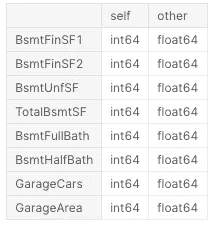
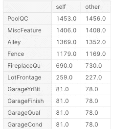
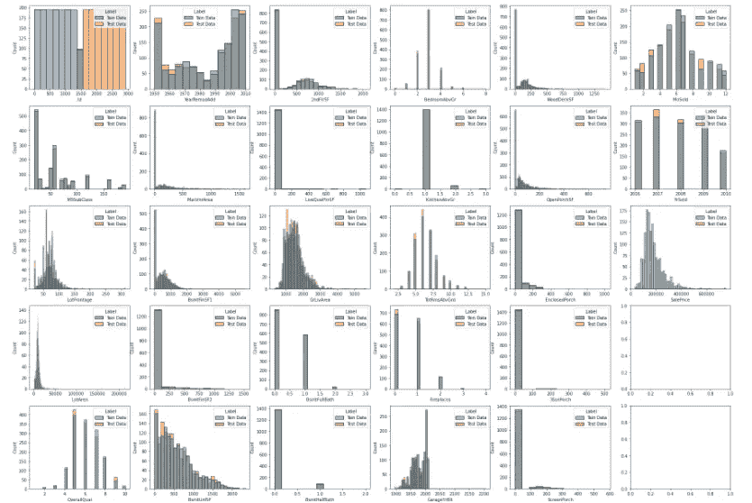
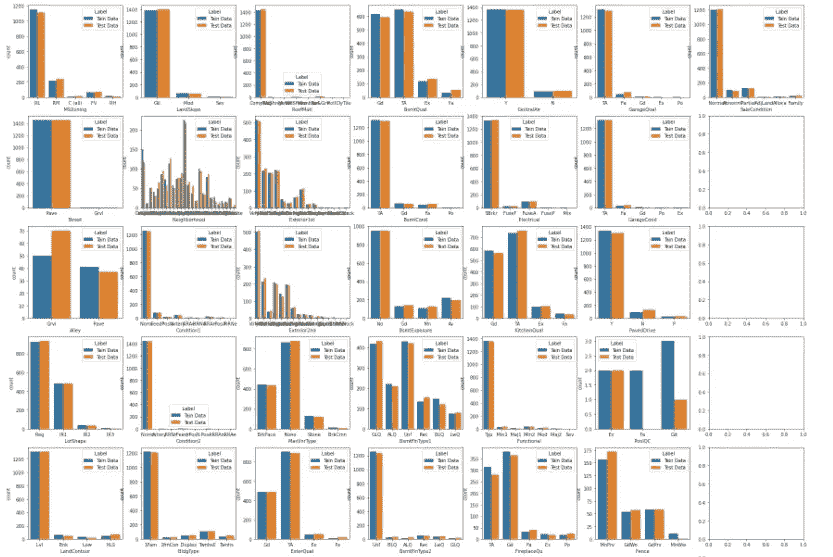
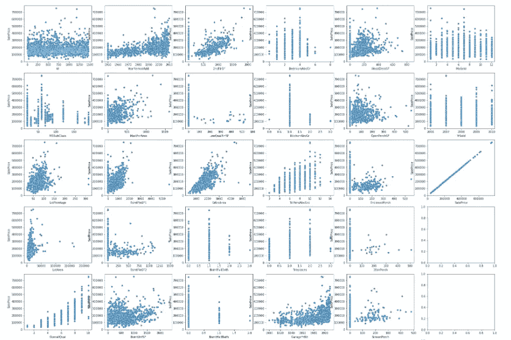
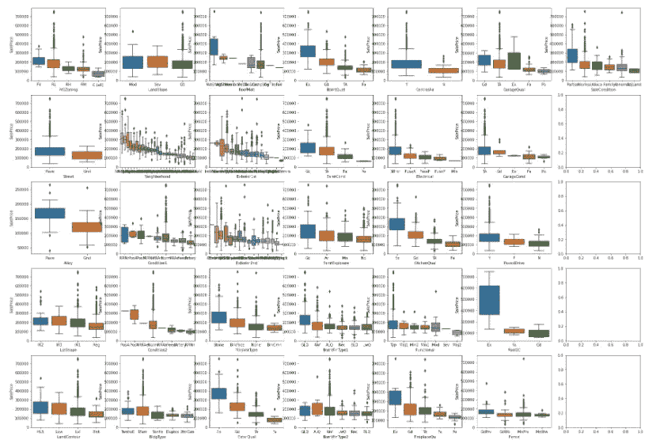

# 比较和对比:探索具有许多特征的数据集

> 原文：<https://levelup.gitconnected.com/compare-contrast-eda-of-datasets-with-many-features-f9665da15132>


马库斯·斯皮斯克在 [Unsplash](https://unsplash.com?utm_source=medium&utm_medium=referral) 上的照片

我刚刚和s1 = train_data.dtypes
s2 = test_data.dtypes
s1_train = s1.drop('SalePrice')
s1_train.compare(s2)



结果:具有不同数据类型的要素

因此，从上面我们可以很容易地看到，有 9 个特征在训练和测试数据中具有不同的数据类型。有关系吗？它需要更多的探索，在我们的例子中不需要，因为它们都是数字类型，但如果其中一个是对象类型，这可能是一个问题。

```
# Null Value Comparison
null_train = train_data.isnull().sum()
null_test = test_data.isnull().sum()
null_train = null_train.drop('SalePrice')
null_train.compare(null_test).sort_values(['self','other'], ascending= [False,False])
```



结果:部分要素具有空值

在这里，我们可以看到空值似乎均匀地分布在两个数据集上，这向我们保证，我们可以对两个数据集以类似的方式处理这些空值。

## 2.训练和测试数据的对比分布

特征的分布是特征工程的一个关键考虑因素，我们总是想回答一些问题:

连续特征是否正态分布？有没有哪一个范畴的特征被某一个范畴所支配，并遮蔽了其他范畴？同样，我们可以对比它们，而不是分别研究训练和测试数据的问题。

**对于连续特征，我们可以如下应用 Seaborn 直方图:**

```
# Distribution Comparison - Continuous Variablescon_var = s1[s1.values != 'object'].index
f, axes = plt.subplots(7,6 , figsize=(30, 30), sharex=False)
for i, feature **in** enumerate(con_var):
    sns.histplot(data=combined_data, x = feature, hue="Label",ax=axes[i%7, i//7])
```



分布比较—连续变量的一部分

上述分布显示:

*   对于大多数特征，训练和测试数据的分布是相似的；
*   一些特征可以被重新分类为‘分类的’，例如‘ms subclass’；
*   有些特性是由 0/null 支配的(例如:PoolArea)，因此我们可以考虑丢弃。

**对于分类特征，我们可以如下应用 Seaborn 计数图:**

```
# Distribution Comparison - Catagorical Variablescat_var = s1[s1.values == 'object'].index
f, axes = plt.subplots(7,7 , figsize=(30, 30), sharex=False)
for i, feature **in** enumerate(cat_var):
    sns.countplot(data = combined_data, x = feature, hue="Label",ax=axes[i%7, i//7])
```



分布比较—分类变量的一部分

分类变量的比较表明:

*   大多数特征的训练数据和测试数据分布是相似的
*   有些功能有主导项，我们可以考虑把一些次要项组合成一组，比如' HeatingQC '、' FireplaceQu '、' GarageQual '、' GarageCond '中的' Fa' & 'Po '

## 3.比较响应变量和连续特征之间的线性

线性影响我们模型的质量。一些特征可能与响应变量有正/负关系，但不是线性的，对于这种情况，转换可能有助于改进我们的模型。

```
f, axes = plt.subplots(7,6 , figsize=(30, 30), sharex=False)
for i, feature **in** enumerate(con_var):
    sns.scatterplot(data=train_data, x = feature, y= "SalePrice",ax=axes[i%7, i//7])
```



销售价格与连续特征的比较—连续变量的一部分

在这里，我们可以看到一些关系似乎是积极的，但不是完全线性的:“SalePrice”对“BsmtUnfSF”，“SalePrice”对“LotFrontage”等，因此我们将考虑将这些特征转换成对数形式以提高线性。

## 4.通过响应变量对比分类特征项目

在过程 2 中，我们已经确定了我们想要组合的分类特征，然后我们将继续确认我们想要组合的这些项目具有相似的价格(响应变量)。(这样我们就不会重新分组导致响应变量的不同表现)

```
f, axes = plt.subplots(7,7 , figsize=(30, 30), sharex=False)
for i, feature **in** enumerate(cat_var):
    sort_list = sorted(train_data.groupby(feature)['SalePrice'].median().items(), key= lambda x:x[1], reverse = True)
    order_list = [x[0] for x **in** sort_list ]
    sns.boxplot(data = train_data, x = feature, y = 'SalePrice', order=order_list, ax=axes[i%7, i//7])
plt.show()
```



分类特征内销售价格对比的一部分

在这里，我们可以看到“HeatingQC”、“FireplaceQu”、“GarageQual”和“GarageCond”中“Fa”和“Po”的销售价格是相似的，因此我们可以考虑继续合并这些项目。

# 摘要

有了上面提到的四个主要的“比较和对比”过程，我很快就发现了需要进行特征工程的地方。我觉得在对具有许多特征的数据集进行探索性数据分析时，使用我们的批判性思维模式是很重要的:我们不应该展示所有细节，而是应该始终专注于**快速识别潜力以改进预测模型。**从这个意义上说，“比较和对比”方法可以帮助我们保持正确的方向。

## Gary Lu 的相关文章:

[](https://glucn.medium.com/tuning-hyperparameters-with-optuna-af342facc549) [## 使用 Optuna 调整超参数

### 本文讨论了我使用 Optuna 调优 ML 模型超参数的经验。

glucn.medium.com](https://glucn.medium.com/tuning-hyperparameters-with-optuna-af342facc549) 

## 链接:

【https://www.kaggle.com/garylucn/house-price 

[https://github . com/Glu cn/ka ggle/blob/main/House _ Prices/notebook/House-price . ipynb](https://github.com/glucn/kaggle/blob/main/House_Prices/notebook/house-price.ipynb)