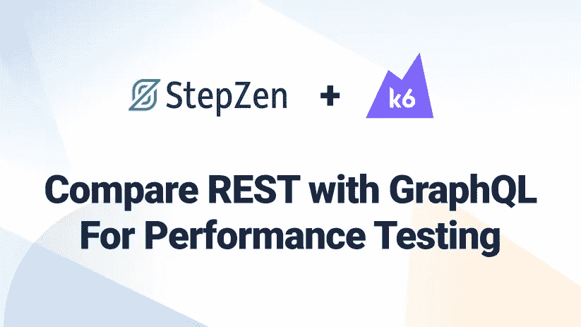
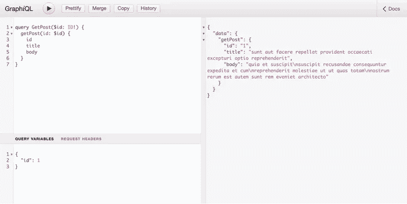
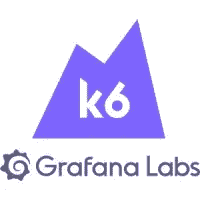

# 使用 StepZen 和 k6 比较 REST 和 GraphQL 的性能测试

> 原文：<https://levelup.gitconnected.com/compare-rest-with-graphql-for-performance-testing-using-stepzen-and-k6-eb71ffb4c949>



对于许多公司来说，性能是使用 GraphQL 的主要原因。但这是一个有效的论点吗？开发人员经常将 GraphQL 与 REST APIs 进行比较，并将 N+1 请求(或过量提取)视为使用 GraphQL 的一个重要原因。让我们来测试一下，看看 GraphQL APIs 是否真的能超越现有的 REST APIs。为此，我们将采用 GraphQL 化的 REST API，测试 GraphQL 的性能，并将其与 REST 方法进行比较。为此，我们将使用流行的性能测试工具 [k6](https://k6.io/) 。

## 探索 GraphQL API

在探索 GraphQL API 之前，让我们了解更多关于这项技术的知识。GraphQL 是一种 API 的查询语言，由脸书(现为 Meta)于 2012 年设计，用于处理低带宽网络上的 API 请求。内部使用后，GraphQL 于 2015 年开源。自 2019 年以来，其商标一直归 GraphQL 基金会所有，确保了其在 Meta 之外的未来。GraphQL 在开源社区和企业中都被广泛采用。

GraphQL 的查询语言依赖于一个模式，该模式包含可以用来请求或变更数据的所有操作以及这些操作的相应响应类型。返回虚构文章数据的 GraphQL API 的模式如下所示:

```
type Post {
  id: ID!
  userId: ID!
  title: String
  Body: String
}

type Query {
  posts: [Post]
  post(id: ID!): Post
}
```

在这个模式中定义了两个类型为`Query`的操作，响应类型为`Post`。这意味着您可以查询所有帖子的列表，或者指定标识符`id`来获取特定的帖子。要获得一个帖子，您可以向这个 GraphQL API 发送一个请求，并附加一个包含获取消息的查询的主体:

```
query {
  getPost(id: 1") {
    id
    title
    body
  }
}
```

GraphQL API 的响应将遵循类型`Post`的形状，并包括查询中定义的所有字段。在上面的查询中，您可以看到我们没有包含字段`userId`，因此它不会包含在该查询的响应中。根据您赋予参数`id`的值，消息将以 JSON 格式返回。如果对查询进行了更改，例如，添加了更多要检索的字段，这些字段将被追加到结果中。

> 在`Query`之后，操作也可以是`Mutation`(用于突变数据)或`Subscription`(用于实时或流数据)。

为了测试这个查询，您当然可以使用 [StepZen](https://stepzen.com/getting-started) 通过 CLI 将 REST API 转换为 GraphQL API，就像我为 [JSONPlaceholder](https://jsonplaceholder.typicode.com/) 所做的那样。免费的 REST API 嘲笑了帖子、用户和评论的数据；您现在可以使用 GraphQL 查询它了！

大多数 GraphQL API，就像这个一样，都带有 graph QL，这是一个与 graph QL API 交互的开源 IDE。已经为您添加了一个示例查询，但是您可以进行任何更改。GraphiQL 界面如下所示:


您可以在这个[部署的演示端点](https://public3b47822a17c9dda6.stepzen.net/api/with-jsonplaceholder/__graphql?query=query%20GetPost%20%7B%0A%20%20getPost%28id%3A%20%221%22%29%20%7B%0A%20%20%20%20id%0A%20%20%20%20title%0A%20%20%20%20body%0A%20%20%7D%0A%7D)上尝试这个查询。您发送给 GraphQL API 的查询位于屏幕的左侧，而右侧显示的是响应。该查询与我们之前描述的相同，但是这次该查询被命名为`GetPost`。命名查询是一种推荐的模式，可以帮助 GraphQL APIs 进行缓存等操作。此外，响应的格式与查询的格式相同。

但是您并不局限于使用 GraphQL 之类的东西来与 GraphQL API 进行交互。GraphQL 是一种与传输无关的查询语言，但是大多数实现都使用基于 HTTP 的 GraphQL。这意味着您可以使用 HTTP(S)向 GraphQL API 发送请求，类似于 REST APIs。只有对 GraphQL 的请求的格式不同于对 REST APIs 的请求，因为您只使用 HTTP-method POST，无论是在检索数据还是改变数据时，并且总是需要 POST 主体。

如果您正在使用 JavaScript 发送 HTTP 请求，并且想要向 GraphQL API 发送请求，这将转化为以下内容。

```
fetch('https://public3b47822a17c9dda6.stepzen.net/api/with-jsonplaceholder/__graphql', {
  method: 'POST',
  mode: 'cors', // no-cors, *cors, same-origin
  headers: {
    'Content-Type': 'application/json',
  },
  body: JSON.stringify({
    query: `
      query GetPost {
        getPost(id: "1") {
          id
          title
          body
        }
      }
    `,
  }),
});
```

> 注意，内容类型被设置为`application/json`，因为 GraphQL 依赖于 JSON。发送和接收请求时都是如此。

在研究了这个 GraphQL API 之后，让我们设置 k6，以便在下一节中使用它来测试 GraphQL。

## 为 GraphQL 设置 k6

我们在上一节中探索的从 REST API 获取帖子的 GraphQL API 是使用 GraphQL-over-HTTP 实现的；您可以像其他 REST API 一样向它发送请求。获取数据的 JavaScript 代码片段已经展示了如何去做。这个代码片段需要稍微修改一下，以便与 k6:

```
import http from 'k6/http';

const query = `
  query GetPost {
    getPost(id: "1") {
      id
      title
      body
    }
  }
`;

const headers = {
  'Content-Type': 'application/json',
};

export default function () {
  http.post(
    'https://public3b47822a17c9dda6.stepzen.net/api/with-jsonplaceholder/__graphql',
    JSON.stringify({ query }),
    { headers }
  );
}
```

这个 k6 脚本现在可以使用查询来测试 GraphQL API 的性能。但是在每个请求上查询相同的 post 并不能帮助我们测试 GraphQL API 的性能。因此，我们可以在 GraphQL 查询中使用动态变量，并向查询传递一个 0 到 100 之间的随机数(REST API 中的帖子数)。在此之前，我们需要向查询添加动态参数来获取文章数据。具有动态值`id`的相同查询将如下所示:

```
query GetPost($id: ID!) {
  getPost(id: $id) {
    id
    title
    body
  }
}
```

当发送请求时，您需要在 GraphQL 查询旁边附加一个 JSON 对象，其中包含一个值为`id`。如果您访问[图形界面](https://public3b47822a17c9dda6.stepzen.net/api/with-jsonplaceholder/__graphql?query=query%20GetPost%28%24id%3A%20ID%21%29%20%7B%0A%20%20getPost%28id%3A%20%24id%29%20%7B%0A%20%20%20%20id%0A%20%20%20%20title%0A%20%20%20%20body%0A%20%20%7D%0A%7D&variables=%7B%0A%20%20%22id%22%3A%201%0A%7D)，您可以使用“查询参数”选项卡:



使用查询变量的动态值测试 GraphQL API 的 k6 脚本的更新版本如下所示。如前所述，我们可以传递一个 0 到 100 之间的随机值，因为这是 REST API 中以图表形式显示的帖子数量:

```
import http from 'k6/http';

const query = `
  query GetPost($id: ID!) {
    getPost(id: $id) {
      id
      title
      body
    }
  }
`;

const headers = {
  'Content-Type': 'application/json',
};

export default function () {
  http.post(
    'https://public3b47822a17c9dda6.stepzen.net/api/with-jsonplaceholder/__graphql',
    JSON.stringify({
      query,
      variables: { id: Math.floor(Math.random() * 101) },
    }),
    { headers }
  );
}
```

现在我们已经设置了第一个 k6 脚本，我们可以在下一节使用 k6 在 GraphQL API 上运行性能测试。

## 使用 k6 测试 GraphQL 性能

用 k6 测试 GraphQL API 的性能与测试 REST API 非常相似。使用我们在上一节中设置的脚本，我们不仅可以测试 GraphQL API 的性能，还可以测试在 GraphQL 查询中包含或排除字段是否会影响性能。在性能测试的结果中，我们将比较接收到的数据大小和迭代次数，但不比较响应时间。REST 和 GraphQL 之间的响应时间更难测试，因为 API 之间的缓存机制可能非常不同。运行这些测试只需要你在本地机器上下载并安装 k6 [和](https://k6.io/docs/getting-started/installation/)。

要运行第一个测试，您需要将脚本保存在一个名为`single.js`的文件中，这样您就可以使用:

```
k6 run --vus 10 --duration 30s single.js
```

这个命令将使用 10 个 vu(虚拟用户)运行 K6 30 秒。

```
/\      |‾‾| /‾‾/   /‾‾/   
     /\  /  \     |  |/  /   /  /    
    /  \/    \    |     (   /   ‾‾\  
   /          \   |  |\  \ |  (‾)  | 
  / __________ \  |__| \__\ \_____/ .io

  execution: local
     script: single.js
     output: -

  scenarios: (100.00%) 1 scenario, 10 max VUs, 1m0s max duration (incl. graceful stop):
           * default: 10 looping VUs for 30s (gracefulStop: 30s)

running (0m30.1s), 00/10 VUs, 1859 complete and 0 interrupted iterations
default ✓ [======================================] 10 VUs  30s

     data_received..................: 932 kB 31 kB/s
     data_sent......................: 459 kB 15 kB/s
     http_req_blocked...............: avg=1.1ms    min=0s       med=1µs      max=206.02ms p(90)=1µs      p(95)=1µs     
     http_req_connecting............: avg=159.26µs min=0s       med=0s       max=31.23ms  p(90)=0s       p(95)=0s      
     http_req_duration..............: avg=160.46ms min=112.28ms med=139.78ms max=404.8ms  p(90)=258.63ms p(95)=326.02ms
       { expected_response:true }...: avg=160.46ms min=112.28ms med=139.78ms max=404.8ms  p(90)=258.63ms p(95)=326.02ms
     http_req_failed................: 0.00%  ✓ 0         ✗ 1859
     http_req_receiving.............: avg=254.95µs min=26µs     med=142µs    max=89.41ms  p(90)=289µs    p(95)=528.69µs
     http_req_sending...............: avg=172.3µs  min=33µs     med=138µs    max=8.94ms   p(90)=271.4µs  p(95)=364µs   
     http_req_tls_handshaking.......: avg=924.91µs min=0s       med=0s       max=173.97ms p(90)=0s       p(95)=0s      
     http_req_waiting...............: avg=160.03ms min=112.13ms med=139.46ms max=403.45ms p(90)=258.03ms p(95)=325.8ms 
     http_reqs......................: 1859   61.753961/s
     iteration_duration.............: avg=161.72ms min=112.38ms med=139.94ms max=609.5ms  p(90)=258.79ms p(95)=327.48ms
     iterations.....................: 1859   61.753961/s
     vus............................: 10     min=10      max=10
     vus_max........................: 10     min=10      max=10
```

结果显示，GraphQL API 在 30 秒内被命中约 1859 次，平均持续时间为 160 毫秒。此外，我们可以看到收到了 932kb 的数据，发送了 459kb 的数据。

GraphQL 擅长的事情之一是限制您接收的数据量。与 REST APIs 不同，您不会收到静态响应，但是您有权力决定返回哪些字段。让我们重新运行这个脚本，但是这次限制由 GraphQL API 返回的字段:

```
const query = `
  query GetPost($id: ID!) {
    getPost(id: $id) {
      title
    }
  }
`;
```

这次不返回`id`、`title`和`body`，只返回文章的标题。如果您使用这一更改重新运行 k6 脚本，收到的数据量应该比第一次运行时少:

```
| GETPOST       | FIRST RUN      | FEWER FIELDS   |
|---------------|----------------|----------------|
| data_received | 932kb (31kb/s) | 594kb (20kb/s) |
```

在我的测试中，发送的数据量没有太大变化。我们所做的唯一改进是从 GraphQL 查询中删除了两个字段。但是收到的数据量减少了近 30%。

如果我们涉及更多的数据，会发生什么？REST API 将总是返回一个固定的响应，包含它返回的每个帖子的所有字段。而使用 GraphQL，我们只能收到每篇文章的标题。当我们将获取所有帖子的所有字段的结果与只获取所有帖子的标题的结果进行比较时，我们能得到更有说服力的结果吗？让我们通过创建一个名为`all.js`的新脚本来尝试一下:

```
import http from 'k6/http';

const query = `
  query GetPosts {
    getPosts {
      id
      title
      body
      userId
    }
  }
`;

const headers = { 'Content-Type': 'application/json' };

export default function () {
  http.post(
    'https://public3b47822a17c9dda6.stepzen.net/api/with-jsonplaceholder/__graphql',
    JSON.stringify({ query }),
    { headers }
  );
}
```

这个更新的 k6 脚本将获得所有的帖子和所有的字段，这次包括`userId`。如果您直接调用 JSONPlaceholder API，该 API 将有相同的响应。在与之前相同的条件下用 k6 运行这个脚本将会产生:

```
| GETPOSTS      | FIRST RUN       |
|---------------|-----------------|
| data_received | 39mb (1.3 mb/s) |
```

当我们对 k6 脚本进行修改，只获取每个帖子的`title`字段时，我们应该能够大大减少这个数字。为了进行试验，将脚本`all.js`中的查询更新为以下内容:

```
const query = `
  query GetPosts {
    getPosts {
      title
    }
  }
`;
```

当您第二次运行 k6 性能测试时，新的结果将在您的终端中可见。正如预期的那样，接收的数据量减少了很多，从 39mb 减少到“仅仅”13mb。而迭代次数也增加了，这意味着在相同的迭代次数下，接收的数据量会更少。

```
| GETPOSTS      | FIRST RUN       | FEWER FIELDS   |
|---------------|-----------------|----------------|
| data_received | 39mb (1.3 mb/s) | 13mb (417mb/s) |
```

你可以想象，如果每天有成千上万的用户请求帖子列表，这将产生巨大的差异。与 REST API 生成的响应相比，您的用户只需用 GraphQL 加载不到三分之一的数据，因为您可以控制返回的数据。

**由于 REST APIs 的设置而检索过多的数据，这就是我们在 GraphQL 中所说的“溢出”。**从我们运行的性能测试中，您可以看到过度蚀刻对您应用程序的影响。现在我们知道 k6 可以测试 GraphQL API 的性能，并且 GraphQL API 已经显示了它的价值，让我们在下一节继续测试一个更重的 graph QL 查询。

## 嵌套 GraphQL 查询的性能

确定数据形状的能力并不是开发人员选择采用 GraphQL 作为 API 查询语言的唯一原因。GraphQL APIs 只有一个端点，查询(或其他操作)也可以处理嵌套数据。您可以在一个请求中从不同的数据库表(如 SQL 连接)甚至不同的数据源请求数据。这与 REST APIss 不同，在 REST API 中，您通常必须访问多个端点才能从不同的源获取数据。这也被称为**“下钻”(或 N+1 问题)，GraphQL 通过让您一次查询多个数据结构来解决这个问题。**

在我们正在测试的 GraphQL API 的 GraphQL 接口中，您可以探索其他可用的查询。其中一个查询将结合来自 REST API 端点的数据来获取帖子和用户。在 REST API 中，这些是独立的请求，但在 GraphQL API 中，它们被组合在一个 GraphQL 查询中，您可以在部署的演示端点[上尝试此处](https://public3b47822a17c9dda6.stepzen.net/api/with-jsonplaceholder/__graphql?query=query%20GetPost%28%24id%3A%20ID%21%29%20%7B%0A%20%20getPost%28id%3A%20%24id%29%20%7B%0A%20%20%20%20id%0A%20%20%20%20title%0A%20%20%20%20body%0A%20%20%20%20user%20%7B%0A%20%20%20%20%20%20name%0A%20%20%20%20%20%20phone%0A%20%20%20%20%20%20email%0A%20%20%20%20%7D%0A%20%20%7D%0A%7D&variables=%7B%0A%20%20%22id%22%3A%201%0A%7D)或在下面的截图中看到:


为了获得这些数据，GraphQL API 将执行以下操作:

1.  向底层 JSONPlaceholder REST API 发送一个请求，以获取带有指定值的 post，用于`id`到`[https://jsonplaceholder.typicode.com/posts/[id]](https://jsonplaceholder.typicode.com/posts/[id].)` [。](https://jsonplaceholder.typicode.com/posts/[id].)
2.  基于第一个 REST API 请求为`userId`返回的值，它将在第二个 REST API 请求中向`[https://jsonplaceholder.typicode.com/users/[id]](https://jsonplaceholder.typicode.com/users/[id].)` [请求用户信息。](https://jsonplaceholder.typicode.com/users/[id].)

由于 GraphQL API 也有分别获取帖子(称为`getPost`)和用户(称为`getUser`)信息的查询，因此我们可以针对单个组合查询的请求测试这两个查询的请求性能。首先，让我们在 k6 脚本中测试单独的查询，以对 GraphQL API 进行另一个性能测试。您可以将下面的 k6 脚本放在一个名为`batch.js`的新文件中:

```
import http from 'k6/http';
import { group } from 'k6';

const post = `
  query GetPost($id: ID!) {
    getPost(id: $id) {
      id
      title
      body
      userId
    }
  }
`;

const user = `
  query GetUser($id: ID!) {
    getUser(id: $id) {
      id
      name
      username
      email
      phone
      website
      address {
        street
        suite
        city
        zipcode
        latitude
        longitude
      }
      company {
        name
        catchPhrase
        bs
      }
    }
  }
`;

const headers = {
  'Content-Type': 'application/json',
};

export default function () {
  http.batch([
    [
      'POST',
      'https://public3b47822a17c9dda6.stepzen.net/api/with-jsonplaceholder/__graphql',
      JSON.stringify({
        query: post,
        variables: {
          id: Math.floor(Math.random() * 101),
        },
      }),
      { headers },
    ],
    [
      'POST',
      'https://public3b47822a17c9dda6.stepzen.net/api/with-jsonplaceholder/__graphql',
      JSON.stringify({
        query: user,
        variables: {
          id: Math.floor(Math.random() * 11),
        },
      }),
      { headers },
    ],
  ]);
}
```

运行这个 k6 脚本将向 GraphQL API 发送一批请求，模拟需要发送两个 REST API 请求来获取 post 和用户数据的场景。批处理请求是并行运行的，这比只发送一个请求更现实。当您在与之前测试相同的环境下运行它时:

```
k6 run --vus 10 --duration 30s batch.js
```

在性能测试的结果中，该迭代执行了两个请求。响应时间与之前的测试相似，但是在解释接收到的数据量之前，让我们创建一个名为`nested.js`的新脚本，首先针对单个嵌套查询运行。这个查询将获取用户写的文章的信息，这些信息嵌套在您正在检索的单个文章的数据响应中。正如我们之前所做的，我们可以限制返回的字段，因为我们只请求我们想要使用的字段:

```
import http from 'k6/http';

const query = `
  query GetPost($id: ID!) {
    getPost(id: $id) {
      title
      user {
        name
        phone
        email
      }
    }
  }
`;

const headers = {
  'Content-Type': 'application/json',
};

export default function () {
  http.post(
    'https://public3b47822a17c9dda6.stepzen.net/api/with-jsonplaceholder/__graphql',
    JSON.stringify({
      query,
      variables: {
        id: Math.floor(Math.random() * 101),
      },
    }),
    { headers }
  );
}
```

在同样的条件下运行，这样我们就可以比较结果了。

```
| GETPOST       | BATCH.JS       | NESTED.JS      |
|---------------|----------------|----------------|
| data_received | 2.0mb (65kb/s) | 759kb (25kb/s) |
| data_sent     | 1.2mb (38kb/s) | 514kb (17kb/s) |
| http_reqs     | 3222           | 1758           |
| iterations    | 1611           | 1758           |
```

GraphQL API 能够实现更多的迭代，但是 HTTP 请求更少。对 GraphQL 化的{ JSON }占位符 API 的两个 REST API 调用由 GraphQL 层执行，因此在此结果中不可见。但是收到的数据量急剧减少，而不是 2.0mb，对于更大量的迭代，这次只收到 759kb。这是因为并非所有字段都是从 GraphQL API 请求的。

我们刚刚运行的测试表明 **GraphQL 完全能够在一个请求中组合你的所有数据，同时仍然是高性能的。此外，大量减少接收的数据量，因为它可以同时解决 N+1 问题和过蚀刻。**

## 结论

在这篇文章中，我们探索了如何使用 [k6](https://k6.io/) 对 GraphQL API 进行性能测试。这个 GraphQL API 是开源 JSONPlaceholder REST API 的 GraphQL 化版本，使用 StepZen 进行转换。我们测试了开发人员采用 GraphQL 的各种用例:过度提取和 N+1 问题。在测试中，我们看到了 GraphQL 如何通过改变请求字段来限制接收的数据量，从而解决了过度提取的问题。尤其是在请求大量数据时，GraphQL 和 REST 之间的差异是巨大的。N+1 问题需要第二个 API 请求来获取所有数据，GraphQL 通过允许您在一个请求中组合来自多个来源的数据解决了这个问题。这一点在获取数据所需的 HTTP 请求数量上变得尤为明显。GraphQL 能够在相同的时间框架内进行更多的迭代，甚至比 REST API 返回更少的数据。

想继续用 GraphQL 进行构建或性能测试吗？你可以在这里找到图形化 REST API [的代码，在](https://github.com/stepzen-dev/examples/tree/main/with-jsonplaceholder) [k6 文档](https://k6.io/docs/)中找到更多关于性能测试的信息。

本文最初发表在 k6 博客上:



# 分级编码

感谢您成为我们社区的一员！更多内容请参见[升级编码出版物](https://levelup.gitconnected.com/)。

关注: [Twitter](https://twitter.com/gitconnected) ， [LinkedIn](https://www.linkedin.com/company/gitconnected) ，[时事通讯](https://newsletter.levelup.dev/)

**升级正在改造科技招募**👉 [**加入我们的人才集体**](https://jobs.levelup.dev/talent/welcome?referral=true)