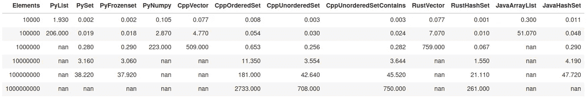
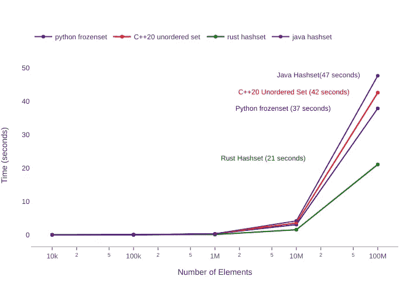

# 使用不同的抽象数据类型和编程语言比较算法性能

> 原文：<https://levelup.gitconnected.com/comparing-algorithm-performance-using-different-abstract-data-types-and-programming-languages-f3d2dba790f2>

我最近看到了微软在采访软件开发人员和数据工程师时使用的以下编程练习，我很好奇使用不同的抽象数据类型和编程语言实现这样一个算法会有什么表现:

> 给定一个未排序的整数数组，求最长的连续元素序列的长度。例如，给定[100，4，200，1，3，2]，最长的连续元素序列是[1，2，3，4]。返回其长度:4。你的算法应该以 O(n)复杂度运行。

算法的初始实现符合复杂度本身，特别是当只使用六个整数时。我开始好奇，使用不同的编程语言和特定的抽象数据类型，算法的性能特征会如何变化，并且随着数据规模的增大而变化(不仅仅是 6 个整数元素！).在使用几种语言实现算法后，下面是使用 Python 3.8、C++20、GCC v10.0.1、Rust 1.43.1 和 Java 14 对越来越多的整数元素进行的测量…

该表包含在完全相同的主机(运行 Ubuntu 20.04 的 System76 Oryx Pro 笔记本电脑)上使用不同的抽象数据类型执行算法的时间(以秒为单位)，这些抽象数据类型包含越来越多的标准整数类型。在出现“ *nan* ”的某些情况下，没有执行时间分析——在大多数情况下，已经很明显算法的实施是低效的。在其他情况下，由于算法无法在 64GB 内存的情况下执行，定时分析未能完成。在所有情况下，“ *nan* ”表示特定实施无法满足规模要求。

下面的图片展示了每种编程语言中性能最好的抽象数据类型，最多可达 1 亿个元素(*注意:Python 和 Java 没有超过这一点*)。

图 2:多种语言的最佳抽象数据类型

> **实用算法用例—地理空间和计算机视觉机器学习**

与此练习相关的一个常见用例是每天处理数十亿行移动位置数据*点*，这些点由纬度和经度值组成。识别这些*点的序列*并在规模和速度上使用适当的数据结构对于我们的一些分析是至关重要的。GDAL 是我们使用的一个通用地理空间库，它绑定了上述语言，允许我们在地理空间分析中有更大的灵活性。

计算机视觉人工智能机器学习(“AI/ML”)，特别是全运动视频(“FMV”)处理和机器学习推理是数据性能至关重要的另一个用例。这对于内存和 CPU/GPU 资源有限的嵌入式系统尤为重要。

> **节省成本的时间复杂性**

速度和效率之所以重要，有几个原因，不仅仅是获取 A 到 B 形式的数据或识别特定的模式。许多工作负载在云中运行，并利用分布式处理框架，因此使用大量昂贵的云资源最大限度地提高处理超大型数据集的效率意味着我们可以节省成本，同时仍能实现最佳性能结果。当每天处理数十亿行数据时，这些成本会在数周、数月和数年内显著增加。这意味着购买更少的保留实例(“RI”)，或者使用具有更少内存和 CPU 的较小实例。这不仅仅是“保持 CPU 的 100%利用率”，因为任何人都可以将 CPU 与坏代码联系起来，而是更微妙的——这是关于保持 CPU 以最有效的方式被利用。

> "为处理云中的大型数据集编写糟糕的代码意味着编写昂贵的代码."

我是否提到过，我们将节俭作为公司的核心价值观，并通过为我们代表客户管理的数据湖和算法节省大量成本的方式，将这一价值观传递给我们的客户？

> **基准准备**

为了创建各种大小的数据结构，随机生成的整数被填充到特定于语言的类似数组的数据结构中。这导致了从 10，000 开始到 1，000，000，000 个整数值结束的对数增长数据集的创建。随机数生成和初始数据填充*不是*计时结果的一部分，因为目的不是测量每种语言的随机数生成实现。使用语言默认的整数表示，对于有选项的语言选择 32 位表示。

在从类似数组的数据类型转换到另一种抽象类型(通常是散列的*集合*)的实验中，计时*被包含在*中，因为了解创建新数据类型的任何时间损失是否仍然有利于在一定规模上利用新数据结构的整体性能是很重要的。换句话说，为了随着时间的推移获得更好的性能，一个算法会愿意由于类型转换而招致初始性能损失吗？

考虑到算法的简单性，我们做了各种可能的尝试来在各种语言之间一致地实现算法*。*

尽可能使用默认编译器优化的*发布*与*调试*版本。

> **详细调查结果**

*   使用散列查找的*集合*抽象数据结构对于所有编程语言来说都是理想的。
*   Rust 和 C++20 使用特定的*集合*抽象数据类型，在任何规模的元素上表现都是最好的。
*   该算法最明显、最差的实现是使用 Python *List* 抽象数据类型。
*   当使用 *Set* up 时，Python 和 Java 的表现类似于 C++和 Rust 直到 Java 和 Python 的内存和垃圾收集成为问题，导致内存不足(“OOM”)程序崩溃。
*   显式控制内存，特别是使用指针和引用，对于保持内存恒定非常重要，从而允许算法扩展并包含更多数据。特别是对于 C++20 和 Rust，当其他语言的程序崩溃时，内存利用率仍然很低。
*   C++20 的*无序集*优于*有序集*容器。
*   C++20 的全新的 *contains* 方法没有明显的性能影响，尽管与维护多个迭代器相比，使用 *contains* 的 C++代码的可管理性得到了改善。
*   不可配置的原始数据类型内存大小，特别是整数类型，垃圾收集对 Python 很重要。我很少关注 Python 中原始数据类型的大小(或者说 Python 垃圾收集的大小)，但是这些类型和大小导致 Python 崩溃的程度比其他 languages⁴.要小
*   Python 的 Numpy 数组数据结构在这个特定场景中表现不佳。对于特定的用例，Numpy 数组是优秀的数据结构，但这不是其中之一。与 Python 的本地列表 structure⁵.相比，Numpy 查找特定值的速度至少慢 4-5 倍
*   我发现使用 Python 的原生*集合*和*冻结*集合抽象数据类型在性能上没有显著差异。
*   并不总是清楚关于 OpenJDK 14 Java 虚拟机发生了什么(“JVM")⁶”作为 CPU 核心将在算法的 Java 版本的执行期间的不同时间记录 100%的利用率。对于 Rust 和 C++，在程序执行期间，只有一个 CPU 内核得到了 100%的利用。
*   用于执行 Java 实现的最大堆大小是 52GB (Xmx52g)，在程序执行期间的某个时刻，程序仍然会由于内存不足而崩溃。

[https://gdal.org/](https://gdal.org/)

[https://en . Wikipedia . org/wiki/Set _(abstract _ data _ type)](https://en.wikipedia.org/wiki/Set_(abstract_data_type))

[https://en.cppreference.com/w/cpp/container/set/contains](https://en.cppreference.com/w/cpp/container/set/contains)

⁴[https://stack overflow . com/questions/10365624/sys-getsizeofint-returns-an-unreasonly-large-value](https://stackoverflow.com/questions/10365624/sys-getsizeofint-returns-an-unreasonably-large-value)

⁵[https://stack overflow . com/questions/13376970/](https://stackoverflow.com/questions/13376970/for-huge-arrays-is-numpy-slower-than-list)

https://openjdk.java.net/projects/jdk/14/[⁶](https://openjdk.java.net/projects/jdk/14/)