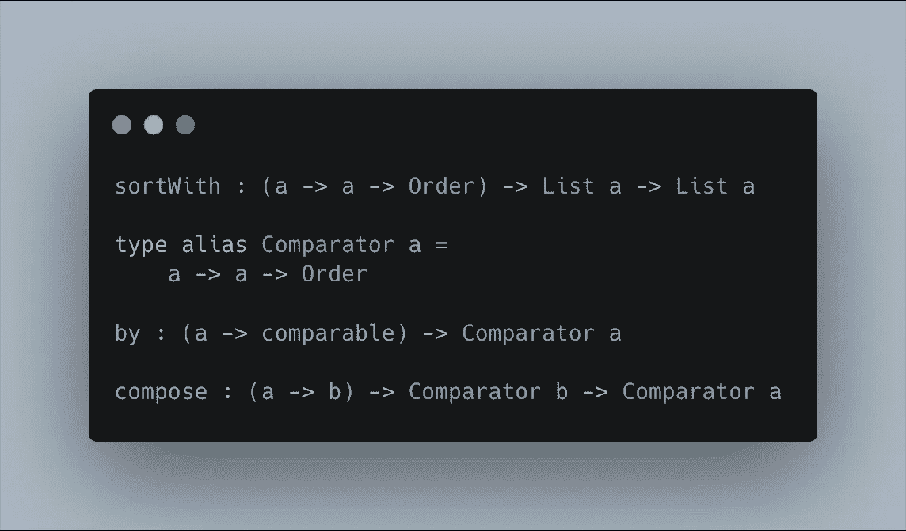

# Elm 中的比较和排序

> 原文：<https://levelup.gitconnected.com/comparing-and-sorting-in-elm-ec7a432df2dc>



在这篇短文中，我们将看看如何在 Elm 中对值进行比较和排序，目标是使用多种标准对记录进行排序。它假设您熟悉 Elm 的语法，并且基于 Elm 版本`0.19.1`。它还会链接到一点 Haskell，但是你不需要了解任何 Haskell 来理解这篇文章，所以可以随意忽略。

# `comparable`约束型变量

Elm 中有几个[约束类型变量](https://guide.elm-lang.org/types/reading_types.html#constrained-type-variables)，而`comparable`就是其中之一。这意味着(在撰写本文时)一个名为`comparable`的类型变量只能用`Int`、`Float`、`Char`、`String`和`comparable`值的列表/元组来“填充”。当你第一次遇到约束类型变量的时候，你会感到有点困惑，因为没有什么可以真正地将它们与常规类型变量区分开来，你只需要知道它们的存在。关于这一点已经有很多讨论，如果你有兴趣深入一点，还有一个[元问题](https://github.com/elm/compiler/issues/1039)跟踪类型系统扩展。

遇到这种限制的一个常见地方是内置的`Set`和`Dict`类型。`Set`中的元素必须是`comparable`，而`Dict`中的键必须是`comparable`。编译器给出了一些关于如何处理这个问题的建议，还有一些自定义的 [Elm 包](https://package.elm-lang.org)可以处理任何类型，各有利弊。

# 排序列表

[列表模块](https://package.elm-lang.org/packages/elm/core/latest/List)有三个[排序功能](https://package.elm-lang.org/packages/elm/core/latest/List#sort):

*   `sort : List comparable -> List comparable`如果列表中的所有元素都是上面提到的`comparable`类型之一，您可以使用这个非常方便的函数。
*   `sortBy : (a -> comparable) -> List a -> List a`如果你能把一个列表的所有元素映射到上面提到的`comparable`类型之一，你应该使用这个函数。如果您想按记录字段`comparable`排序，这尤其方便
*   `sortWith : (a -> a -> Order) -> List a -> List a`这是最灵活的，通过采用一个函数来完全控制排序，该函数接受两个任意类型的列表元素并返回一个`Order`。这是我们最终将使用的函数，使用多个标准对记录进行排序。

[Order](https://package.elm-lang.org/packages/elm/core/latest/Basics#Order) 表示两个值的相对排序，如果你曾经在 Haskell 中遇到过 [Ordering](https://hackage.haskell.org/package/base-4.12.0.0/docs/Data-Ord.html#t:Ordering) ，它的作用是一样的。与在一些传统/主流语言中使用整数相比，我个人更喜欢这种类型的明确性。要从两个`comparable`中得到一个`Order`，你可以调用`[Basics.compare](https://package.elm-lang.org/packages/elm/core/latest/Basics#compare)` [函数](https://package.elm-lang.org/packages/elm/core/latest/Basics#compare)

*快速说明一下，对于感兴趣的人来说，* `*Order*` */* `*Ordering*` *是幺半群，* `*Eq*` *是同一性的变体。这在按多个字段排序时非常方便，我们将在后面看到。*

# 按多个字段对记录进行排序

要按多个字段对记录列表进行排序，我们将从一个虚构的记录声明开始:

```
import Date exposing (Date)

type alias Person =
    { name : String
    , dateOfBirth : Date
    }
```

`Date`类型来自于便捷的`[justinmimbs/date](https://package.elm-lang.org/packages/justinmimbs/date/latest)` [模块](https://package.elm-lang.org/packages/justinmimbs/date/latest)，该模块也具有以下功能:

```
compare : Date -> Date -> Order
```

请注意，它的签名与第一个参数`List.sortWith`相匹配。要安装软件包，只需运行`elm install justinmimbs/date`。

在比较和排序`[NoRedInk/elm-compare](https://package.elm-lang.org/packages/NoRedInk/elm-compare/latest)`时，我们还将使用另一个非常方便的包。要安装它，只需运行`elm install NoRedInk/elm-compare`。关于`Compare`模块首先要知道的是`Comparator`类型别名:

```
type alias Comparator a =
    a -> a -> Order
```

这个类型为作为`List.sortWith`第一个参数的函数起了别名，模块的其余部分包含了`Comparator`方便的组合子。

有了这两个额外的模块，让我们创建一个函数，按照出生日期对一个`List Person`进行排序(最年轻的排在最前面)，如果两个日期相同，那么按照他们名字的字母顺序排序。`name`字段是一个`String`，它是一个`comparable`，但是为了使用`Compare`模块中的功能，我们需要一个`Comparator`。`[Compare.by](https://package.elm-lang.org/packages/NoRedInk/elm-compare/latest/Compare#by)` [功能](https://package.elm-lang.org/packages/NoRedInk/elm-compare/latest/Compare#by)带签名:

```
by : (a -> comparable) -> Comparator a
```

仅仅是:

```
import Compare exposing (Comparator)nameComparator : Comparator Person
nameComparator =
    Compare.by .name
```

接下来，我们将创建一个按日期排序的`Comparator Person`(首先是最近的日期):

```
dateOfBirthComparator : Comparator Person
dateOfBirthComparator =
    Compare.compose .dateOfBirth Date.compare |> Compare.reverse
```

这是事情变得更有趣的地方。`Compare.compose`函数有一个签名:

```
compose : (a -> b) -> Comparator b -> Comparator a
```

如果你是第一次看到类似的东西，这个签名看起来会很奇怪。你可能会想，*等等*如果我给它一个从`a -> b`开始的函数，我们怎么能从`Comparator b`开始，到`Comparator a`结束。理解它的关键是记住一个`Comparator`是一个函数的别名。用我们正在处理的类型替换类型变量会有所帮助:

```
compose : (Person -> Date) -> Comparator Date -> Comparator Person
```

然后展开`Comparator`类型别名来查看所涉及的函数类型:

```
compose :
    (Person -> Date)
    -> (Date -> Date -> Order)
    -> (Person -> Person -> Order)
```

换句话说，如果您给 compose 函数一个从`Person`到`Date`的方法和一个比较日期的方法，那么它返回一个可以比较人的函数。为了比较人，它将首先调用映射一个`Person`到一个`Date`(在每个`Person`)的函数，然后使用提供的比较函数比较这些日期。

*先不说这个，学榆树之前学过一点 Haskell 这个名字* `*compose*` *让我有点摸不着头脑。在 Haskell 中* `*compose*` *函数是* `*Contravariant*` *typeclass 上的一个函数，而* `*Contravariant*` *确实有一个* `[*Comparison*](https://hackage.haskell.org/package/contravariant-1.4/docs/Data-Functor-Contravariant.html#t:Comparison)` [*实例*](https://hackage.haskell.org/package/contravariant-1.4/docs/Data-Functor-Contravariant.html#t:Comparison) *。换句话说，如果你熟悉逆变函子，你可能会发现我们一直使用的* `*Comparator*` *类型别名就是一个例子。*

默认情况下，`Date.compare`函数按照从最早到最晚的顺序对日期进行排序，但是我们可以使用带有签名的`Compare.reverse`:

```
reverse : Comparator a -> Comparator a
```

这就把我们的`Comparator`取反了。这个函数的好处在于，我们不需要仅仅为了反转`List`而对`List`进行排序，关键的是，当按多个标准排序时，我们可以反转一个特定的`Comparator`

现在是时候制定一个考虑到前两者的`Comparator`了。

```
personComparator : Comparator Person
personComparator =
    Compare.concat [ dateOfBirthComparator, nameComparator ]
```

这使用了`Compare.concat`来制作一个`Comparator Person`，它首先基于`dateOfBirthComparator`来比较人，如果它产生了`Eq`的`Order`，它就使用`nameComparator`，这正是我们想要的！换句话说,`Compare.concat`将按顺序尝试列表中的每个`Comparator`,直到找到第一个不相等的结果，或者到达列表的末尾并认为它们相等。

*关于* `*Comparator*` *的一个快速提示作为一个幺半群，我将使用 Haskell 类型，这样我可以链接到文档。这就是* `*Ordering*` *是幺半群因而* `*Comparison*` *是幺半群派上用场的地方，* `*mconcat*` *上的* [*幺半群实例对于*](https://hackage.haskell.org/package/base-4.12.0.0/docs/Data-Functor-Contravariant.html#g:4) `[*Comparsion*](https://hackage.haskell.org/package/base-4.12.0.0/docs/Data-Functor-Contravariant.html#g:4)` *的作用与* `*Compose.concat*` *函数相同，这也是为什么* `*mempty*` *(或恒等式)可以是* `*Eq*` *的变体。在 Haskell Wiki* 的幺半群部分有一个 [喊出](https://wiki.haskell.org/Monoid#So_what.3F) *到此*

现在剩下要做的就是创建一个对人员列表进行排序的函数:

```
sortPeople : List Person -> List Person
sortPeople =
    List.sortWith personComparator
```

我们只需要将我们的`personComparator`传递给`List.sortWith`就可以了。

# 包扎

希望这对于如何在 Elm 中进行比较和排序有所启发。有了`Compare`模块，您可以构建复杂的定制排序，以优雅和可组合的方式与`List`一起使用。

*最初发表于*[T5【https://stacktracehq.com】](https://stacktracehq.com/blog/comparing-and-sorting-in-elm/)*。*