# 比较 Android 和 iOS TextView

> 原文：<https://levelup.gitconnected.com/comparing-android-ios-textview-b17f4177ad09>

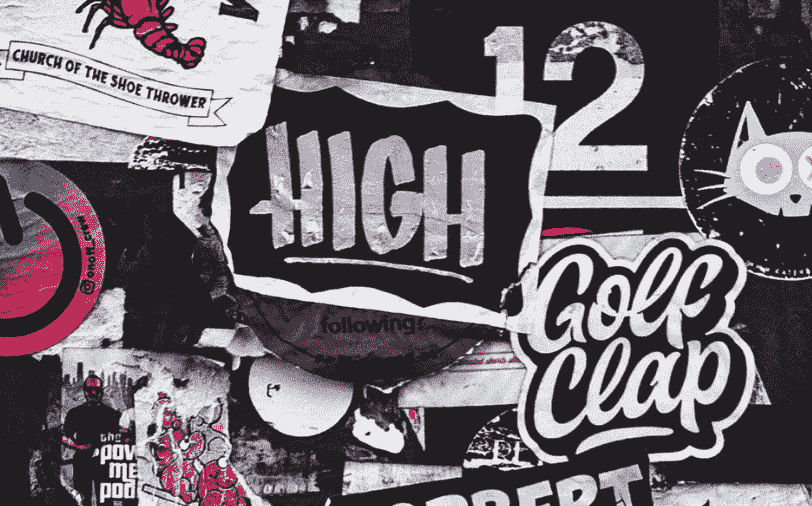

图片由[缪拉·翁德尔](https://unsplash.com/@muratodr)在 [Unsplash](https://unsplash.com/photos/EWDCeCUz8Ho) 拍摄

TextView 是 app 开发最基础的 UI 组件。iOS 和 Android 之间的差异使得很难从一个平台过渡到另一个平台。

我们来对比一下。

# 文本视图的类型

在**安卓**，我们有`TextView`。它们用于所有文本目的。

在 **iOS** 中，我们有`UILabel`和`UITextView`表现不同。一个是字面上的标签(较短的文本)，另一个是更长的文本(例如，通常超过一行)。

# 尺寸包装

众所周知，确定文本的大小并不容易。所以最好的方法是让系统根据文本的大小和长度来换行。

在 **Android** 中，这可以通过如下方式轻松实现。

```
<TextView
 **android:layout_width="wrap_content"
    android:layout_height="wrap_content"**
    android:text="Hello World!"
    android:background="@android:color/darker_gray"
    app:layout_constraintBottom_toBottomOf="parent"
    app:layout_constraintLeft_toLeftOf="parent"
    app:layout_constraintRight_toRightOf="parent"
    app:layout_constraintTop_toTopOf="parent" />
```

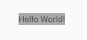

对于 **iOS UILabel** ，不需要明确的规模。我们只需要分配 centerX 和 centerY 约束，它就会显示出来。

```
let myText = **UILabel**()
myText.text = "Hello World!"
view.addSubview(myText)
myText.translatesAutoresizingMaskIntoConstraints = falsemyText.backgroundColor = .gray
NSLayoutConstraint.activate([
  myText.centerXAnchor.constraint(equalTo: view.centerXAnchor),
  myText.centerYAnchor.constraint(equalTo: view.centerYAnchor),
])
```

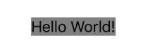

> 注意:如果我们按照 Android 将约束设置为 leading、top、trailing 和 bottom，UILabel 的大小将与约束匹配。(注意，我明确地测试了对齐情况，以使其居中对齐)。

```
let myText = **UILabel**()
myText.text = "Hello World!"
view.addSubview(myText)
myText.translatesAutoresizingMaskIntoConstraints = false
**myText.textAlignment = .center****.**
myText.backgroundColor = .gray
NSLayoutConstraint.activate([
  myText.leadingAnchor.constraint(equalTo: view.leadingAnchor),
  myText.topAnchor.constraint(equalTo: view.topAnchor),
  myText.trailingAnchor.constraint(equalTo: view.trailingAnchor),
  myText.bottomAnchor.constraint(equalTo: view.bottomAnchor),
])
```

使用上面的代码，它将获得与父视图(右图)完全匹配的大小，而不是像左图所示那样包装内容。

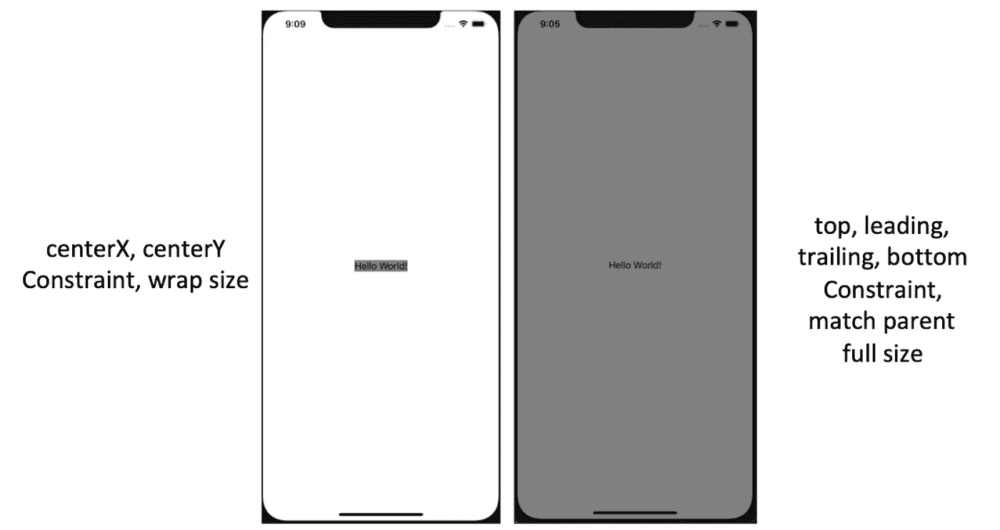

对于 **iOS UITextView** ，将需要明确的尺寸(即定义高度和宽度)。如果没有，我们将不得不做额外的编码来计算它的大小，如下所示。此外，我们还需要禁用滚动。

```
let myText = **UITextView**()
myText.text = "Hello World!"
view.addSubview(myText)
myText.translatesAutoresizingMaskIntoConstraints = falsemyText.backgroundColor = .gray
NSLayoutConstraint.activate([
  myText.centerXAnchor.constraint(equalTo: view.centerXAnchor),
  myText.centerYAnchor.constraint(equalTo: view.centerYAnchor),
])**// Explicit calculation of the size of UITextView** let fixedWidth = myText.frame.size.width
let newSize = myText.sizeThatFits(CGSize(
    width: fixedWidth, height: CGFloat.greatestFiniteMagnitude))
myText.frame.size = CGSize(
    width: max(newSize.width, fixedWidth), height: newSize.height)**myText.isScrollEnabled = false;**
```

有了这些，文本显示如下，周围有一点侧边填充。

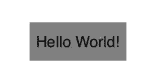

# 文本换行

有了自动换行大小的文本，我们想看看他们是否能自动换行。

我们使用的文本是

> 测试一个很长很长的文本，超过一行，看看它是否自动换行

在 Android 中，我们将它自动包装在界面的末端。

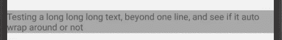

对于 iOS UILabel ，它不换行。相反，它被切断了。

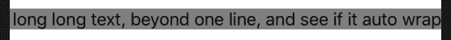

对于 **iOS UITextView** 也是一样，不换行。它被切断了。

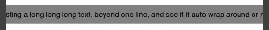

## 在 iOS 上实现文本换行

为了使包装成为可能，我们必须做以下工作。

对于 **iOS UILabel** ，我们需要设置`numberOfLines = 0`并且也有一个明确的大小。

```
let myText = **UILabel**()
myText.text = "Hello World!"
view.addSubview(myText)
myText.translatesAutoresizingMaskIntoConstraints = falsemyText.backgroundColor = .gray
**myText.numberOfLines = 0**
NSLayoutConstraint.activate([
  myText.centerXAnchor.constraint(equalTo: view.centerXAnchor),
  myText.centerYAnchor.constraint(equalTo: view.centerYAnchor),
 **myText.heightAnchor.constraint(equalToConstant: 60),
  myText.widthAnchor.constraint(equalToConstant: 400),** ])
```

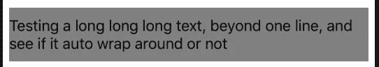

对于 **iOS UITextView** ，我们只需要为它设置显式大小即可。

```
let myText = **UITextView**()
myText.text = "Hello World!"
view.addSubview(myText)
myText.translatesAutoresizingMaskIntoConstraints = falsemyText.backgroundColor = .gray
NSLayoutConstraint.activate([
  myText.centerXAnchor.constraint(equalTo: view.centerXAnchor),
  myText.centerYAnchor.constraint(equalTo: view.centerYAnchor),
 **myText.heightAnchor.constraint(equalToConstant: 60),
  myText.widthAnchor.constraint(equalToConstant: 400),** ])
```

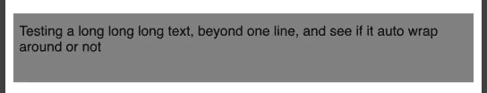

# 默认文本对齐方式

没有设置文本对齐，但比文本大一些，它们的文本对齐如下。

在**安卓**中，是顶部开始(左)对齐

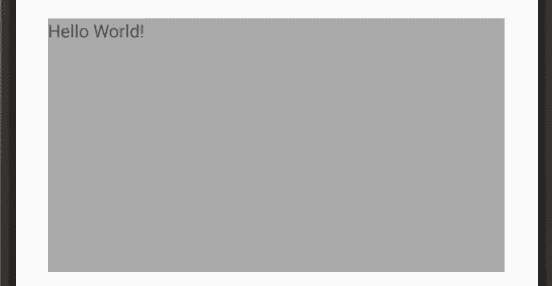

对于 **iOS UILabel** ，它是顶部居中对齐的

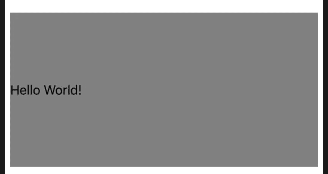

对于 **iOS UITextView** ，它是左上对齐的

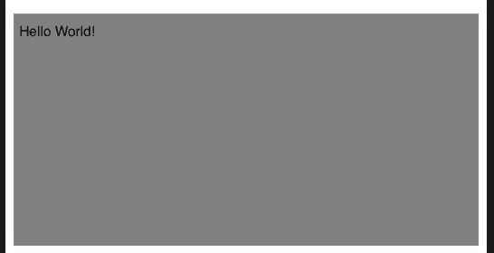

# 滚动文本

有时文本比文本视图的高度还长。我们希望用户有能力滚动。

在 **Android** 中，我们需要用一个`ScrollView`来包装`TextView`。

```
**<ScrollView
    android:layout_width="360dp"
    android:layout_height="100dp">**
    <TextView
        android:layout_width="match_parent"
        android:layout_height="match_parent"
        android:background="@android:color/darker_gray"
        android:text="... long text ..." />
**</ScrollView>**
```

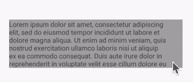

对于 **iOS UITextView** ，一旦我们设置了`UITextView`的大小，它现在默认是可滚动的。

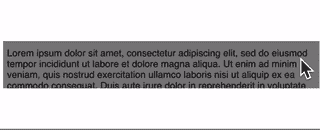

对于 iOS UILabel ，让它可滚动是没有意义的，因为标签应该总是可见的。如果我们想让它可滚动，使用`UITextView`。

总之，一张表

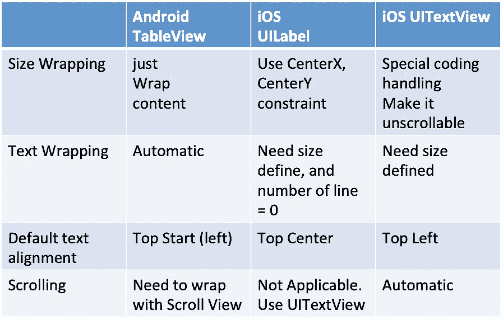

我相信他们之间有更多的不同。请随意与我分享。

感谢阅读。你可以在这里查看我的其他话题[。](https://medium.com/@elye.project/)

关注我的 [*中*](https://medium.com/@elye.project)*[*Twitter*](https://twitter.com/elye_project)*[*【脸书】*](https://www.facebook.com/elyeproj/) 或 [*Reddit*](https://www.reddit.com/user/elyeproj/) 获取关于移动开发等相关话题的小技巧和学习。~Elye~**