# 比较 API 架构风格:SOAP vs REST vs GraphQL vs RPC

> 原文：<https://levelup.gitconnected.com/comparing-api-architectural-styles-soap-vs-rest-vs-graphql-vs-rpc-84a3720adefa>

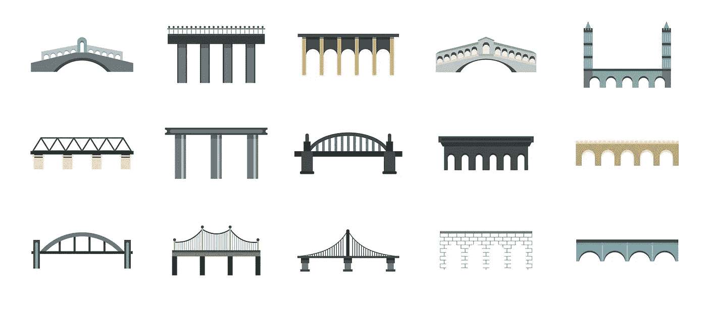

两个独立的应用程序需要一个中介来相互通信。因此，开发人员经常搭建桥梁——应用程序编程接口——以允许一个系统访问另一个系统的信息或功能。

为了快速和大规模地集成应用程序，API 使用协议和/或规范来定义通过网络传递的消息的语义和语法。这些规范构成了 API 架构。

随着时间的推移，已经发布了不同的 API 架构风格。它们都有自己的标准化数据交换模式。大量的选择引发了关于哪种建筑风格是最好的无休止的争论。

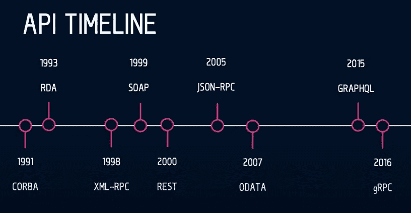

*API 风格随时间变化，来源:* [*罗布克劳利*](https://twitter.com/robdcrowley?lang=en)

今天，许多 API 消费者将 REST 称为“*安息*”，为 GraphQL 欢呼，而十年前，REST 成为取代 SOAP 的赢家是一个反向故事。这些观点的问题在于，他们片面地挑选技术本身，而不是考虑它的实际属性和特征如何与手头的情况相匹配。

在本文中，我们将保持客观，按照出现的顺序讨论四种主要的 API 风格，比较它们的优缺点，并强调每种风格最适合的场景。

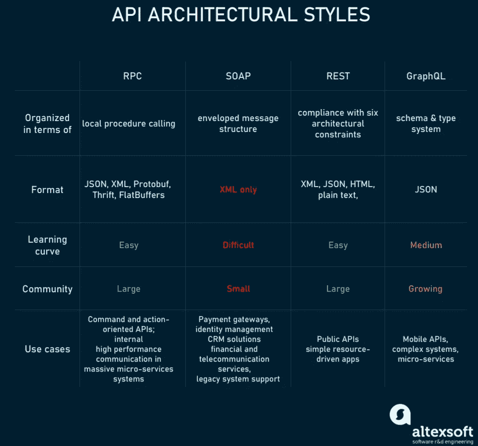

*四大 API 风格对比*

# 远程过程调用(RPC):调用另一个系统上的函数

**远程过程调用**是一种规范，允许在不同的上下文中远程执行函数。RPC 扩展了本地过程调用的概念，但是将它放在 HTTP API 的上下文中。

最初的 XML-RPC 是有问题的，因为确保 XML 有效载荷的数据类型是困难的。因此，后来一个 RPC API 开始使用一个更具体的 JSON-RPC 规范，这被认为是 SOAP 的一个更简单的替代方案。 [gRPC](https://grpc.io/) 是 Google 在 2015 年开发的最新 RPC 版本。gRPC 支持负载平衡、跟踪、健康检查和身份验证，非常适合连接微服务。

## RPC 如何工作

客户端调用远程过程，将参数和附加信息序列化为消息，并将消息发送到服务器。收到消息后，服务器反序列化其内容，执行请求的操作，并将结果发送回客户端。服务器存根和客户机存根负责参数的序列化和反序列化。

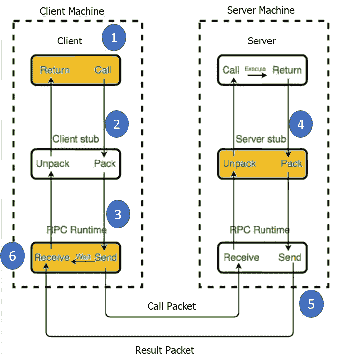

*远程程序调用机制，来源:* [*Guru99*](https://www.guru99.com/remote-procedure-call-rpc.html#1)

## RPC 优点

**直白简单的交互。RPC 使用 GET 来获取信息，并为其他所有事情发送信息。服务器和客户端之间的交互机制归结为调用端点并获得响应。**

**易于添加的功能。如果我们对我们的 API 有了新的需求，我们可以很容易地添加另一个端点来执行这个需求:1)编写一个新的函数，并把它放在一个端点之后，2)现在客户端可以点击这个端点并获得满足设置需求的信息。**

**高性能。**轻量级有效载荷在网络上轻松运行，提供高性能，这对于共享服务器和在工作站网络上执行的并行计算非常重要。RPC 能够优化网络层，并使其非常高效，每天在不同的服务之间发送大量消息。

## RPC Cons

**与底层系统紧密耦合。**API 的抽象级别有助于其可重用性。它与底层系统越紧密，它对其他系统的可重用性就越低。RPC 与底层系统的紧密耦合不允许在系统功能和外部 API 之间有一个抽象层。这引发了安全问题，因为很容易将底层系统的实现细节泄露到 API 中。RPC 的紧密耦合使得可伸缩性需求和松散耦合的团队难以实现。因此，客户端要么担心调用特定端点可能产生的副作用，要么试图找出调用哪个端点，因为它不理解服务器如何命名其函数。

**可发现性低。**在 RPC 中，无法自省 API 或发送请求，也无法根据请求理解要调用什么函数。

**功能爆炸。**创建新功能太容易了。因此，我们没有编辑现有的函数，而是创建了新的函数，结果产生了一大串难以理解的重叠函数。

## RPC 用例

RPC 模式大约在 80 年代开始被使用，但是这并没有自动使它过时。像谷歌、脸书( [Apache Thrift](https://thrift.apache.org/) )和 Twitch ( [Twirp](https://twitchtv.github.io/twirp/docs/intro.html) )这样的大公司正在内部使用 RPC 高性能变量来执行极高性能、低开销的消息传递。他们的海量微服务系统，要求内部通讯在短消息整理的同时要清晰。

**命令 API。**RPC 是向远程系统发送命令的合适选择。例如，Slack API 非常注重命令:加入通道、离开通道、发送消息。因此，Slack API 的设计者以类似 RPC 的风格对其建模，使其小巧、紧凑且易于使用。

**内部微服务的客户专用 APIs】。在单个提供者和消费者之间进行直接集成，我们不想像 REST API 那样花费大量时间通过网络传输大量元数据。gRPC 和 Twirp 具有较高的消息速率和消息性能，是微服务的理想选择。gRPC 在幕后使用 HTTP 2，能够优化网络层，使其在不同服务之间每天发送大量消息时非常高效。然而，如果你的目标不是高网络性能，而是发布高度独特的微服务的团队之间的稳定 API 联系，REST 将确保这一点。**

# 简单对象访问协议(SOAP):使数据作为服务可用

[**SOAP**](https://www.altexsoft.com/blog/engineering/what-is-soap-formats-protocols-message-structure-and-how-soap-is-different-from-rest/?utm_source=MediumCom&utm_medium=referral&utm_campaign=shared#soap-use-cases) 是一种 XML 格式的、高度标准化的 web 通信协议。微软在 XML-RPC 一年后发布的 SOAP 继承了它的很多东西。当 REST 出现时，它们首先被并行使用，但很快 REST 赢得了流行度竞赛。

## 肥皂是如何工作的

XML 数据格式落后于许多形式。再加上庞大的消息结构，这使得 SOAP 成为最冗长的 API 风格。

SOAP 消息由以下部分组成:

*   开始和结束每封邮件的信封标签，
*   包含请求或响应的正文
*   如果消息必须确定任何细节或额外要求，则消息头
*   一种故障，通知在整个请求处理过程中可能发生的任何错误。

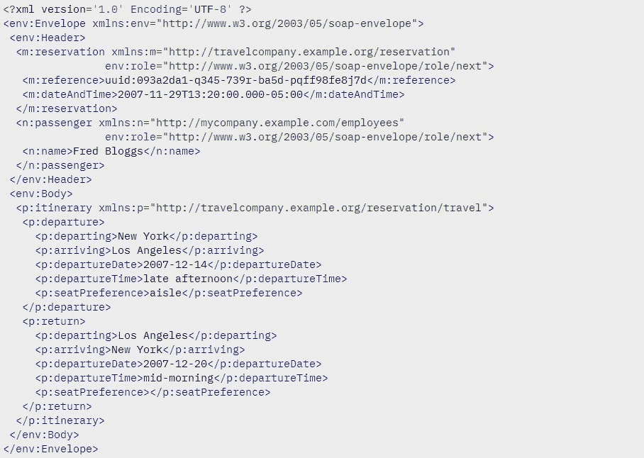

*SOAP 消息的一个例子。来源:* [*IBM*](https://www.ibm.com/support/knowledgecenter/en/SSMKHH_10.0.0/com.ibm.etools.mft.doc/ac55780_.htm)

SOAP API 逻辑是用 Web 服务描述语言(WSDL)编写的。这种 API 描述语言定义了端点，并描述了所有可以执行的过程。这允许不同的编程语言和 ide 快速建立通信。

SOAP 支持有状态和无状态消息传递。在有状态的场景中，服务器存储接收到的信息可能非常多。但是对于涉及多方和复杂交易的操作来说，这是合理的。

## 肥皂专家

与语言和平台无关。创建基于 web 的服务的内置功能允许 SOAP 处理通信，并使响应独立于语言和平台。

**绑定多种传输协议。** SOAP 在传输协议方面非常灵活，可以适应多种场景。

**内置错误处理。** SOAP API 规范允许返回带有错误代码及其解释的重试 XML 消息。

**多个安全扩展。**通过与 WS-Security 协议集成，SOAP 满足了企业级的事务质量。它提供了交易内部的私密性和完整性，同时允许在消息级别进行加密。

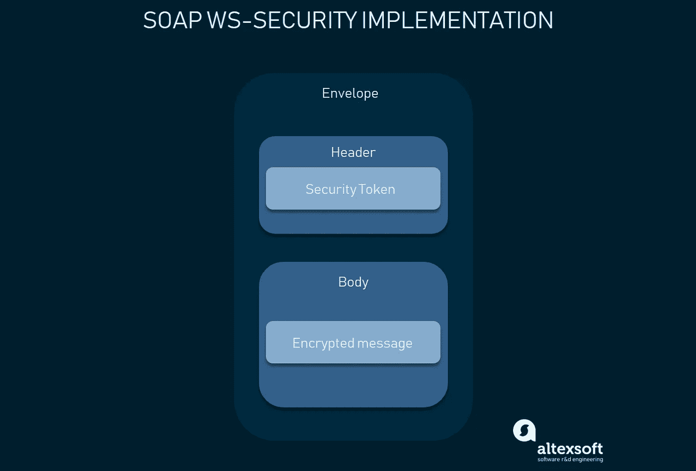

*SOAP 消息级安全:头元素和加密体中的认证数据*

## 肥皂骗局

如今，许多开发人员对必须集成 SOAP API 的想法感到不寒而栗，原因有几个。

**仅 XML。** SOAP 消息包含大量元数据，并且只支持请求和响应的冗长 XML 结构。

**重量级。**由于 XML 文件很大，SOAP 服务需要很大的带宽。

**狭义的专业知识。**构建 SOAP API 服务器需要深入理解所有相关的协议及其高度受限的规则。

**繁琐的消息更新。**僵化的 SOAP 模式需要额外的努力来添加或删除消息属性，从而降低了采用速度。

## SOAP 用例

目前，SOAP 架构最常用于企业内部集成或与他们信任的合作伙伴集成。

**高度安全的数据传输。** SOAP 严格的结构、安全性和授权能力使其成为在 API 和客户端之间执行正式软件合同的最合适的选择，同时遵守 API 提供者和 API 消费者之间的法律合同。这就是为什么金融组织和其他企业用户选择 SOAP 的原因。

# 表述性状态转移(REST):使数据作为资源可用

REST 是一种自解释的 API 架构风格，由一组架构约束定义，旨在被许多 API 消费者广泛采用。

今天最常见的 API 风格最初是由 Roy Fielding 在 2000 年的博士论文中描述的。REST 使服务器端数据可用，用简单的格式表示，通常是 JSON 和 XML。

## 休息是如何工作的

REST 不像 SOAP 那样被严格定义。RESTful 架构应该遵守六个架构约束:

*   **统一接口:**允许以统一的方式与给定的服务器交互，而不管设备或应用程序类型如何
*   **无状态**:处理请求本身所包含的请求的必要状态，服务器不存储任何与会话相关的内容
*   **缓存**
*   **客户端-服务器架构:**允许任何一方独立发展
*   **分层系统**的应用
*   服务器向客户端提供可执行代码的能力

事实上，有些服务只是在一定程度上是 RESTful 的。它们以 RPC 风格为核心，将较大的服务分解成资源，并有效地使用 HTTP 基础设施。但是关键部分是使用超媒体 aka HATEOAS，即[超文本的缩写，作为应用程序状态的引擎](https://en.wikipedia.org/wiki/HATEOAS)。基本上，这意味着对于每个响应，REST API 都提供了元数据，链接到所有关于如何使用 API 的相关信息。这就是实现客户端和服务器解耦的原因。因此，API 提供者和 API 消费者都可以独立发展，而不会妨碍他们之间的交流。

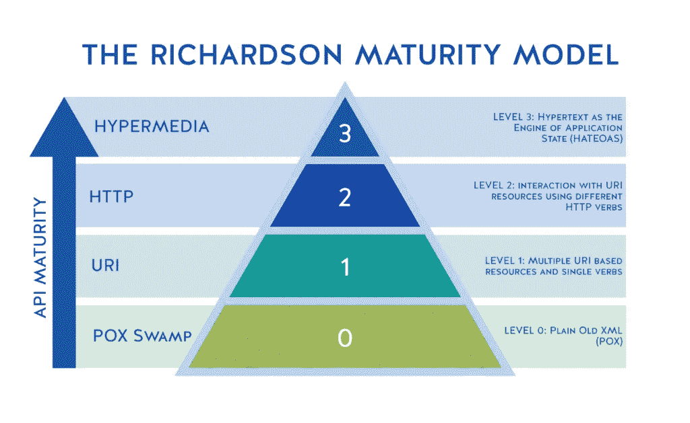

*Richardson 成熟度模型作为实现真正完整和有用的 API 的标杆，来源:*[*Kristopher Sandoval*](https://nordicapis.com/what-is-the-richardson-maturity-model/)

“睡眠是休息的一个重要特征。真的是让休息休息。由于大多数人不使用 HATEOAS，他们实际上使用 HTTP RPC，"这是在 [Reddit](https://www.reddit.com/r/golang/comments/7qvi0w/twirp_a_sweet_new_rpc_framework_for_go_twitch_blog/dstkrnm/) 上表达的一些激进观点。的确，HATEOAS 是 REST 最成熟的版本。然而，要求比现在通常使用和构建的 API 客户机更高级和更智能的 API 客户机是很难实现的。因此，即使今天非常好的 REST APIs 也不总是这样做。这就是为什么 HATEOAS 主要是作为 RESTful API 设计的长期发展的一个愿景。

当一个服务实现了 REST 的一些特性和 RPC 的一些特性时，REST 和 RPC 之间可能真的存在一个灰色地带。REST 是基于资源或名词而不是基于动作或动词。

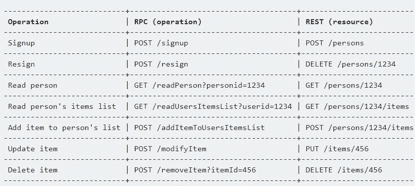

*以动词为中心的 RPC 中的操作与以名词为中心的 REST 中的操作相反*

在 REST 中，事情是使用 HTTP 方法完成的，比如 GET、POST、PUT、DELETE、OPTIONS，希望还有 PATCH。

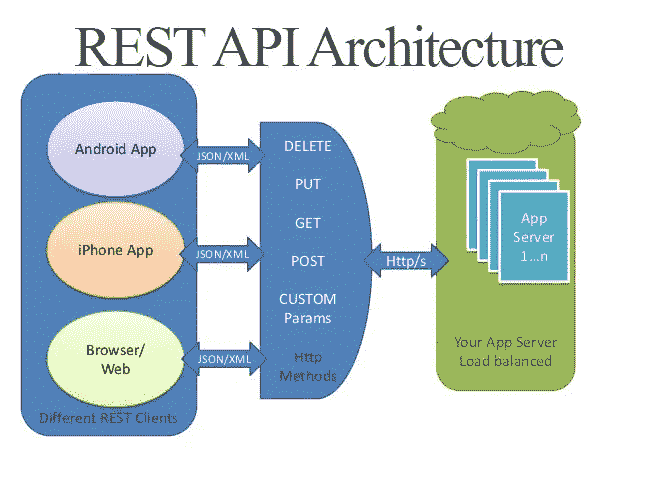

*来源:Thomas Davis*

## 休息专家

**分离的客户端和服务器。**REST 尽可能地将客户端和服务器解耦，比 RPC 提供了更好的抽象。具有抽象层次的系统能够封装其细节，以便更好地识别和维护其属性。这使得 REST API 足够灵活，可以随着时间的推移而发展，同时保持一个稳定的系统。

**可发现性。**客户机和服务器之间的通信描述了一切，因此不需要外部文档来理解如何与 REST API 交互。

**缓存友好。REST 重用了许多 HTTP 工具，是唯一允许在 HTTP 级别缓存数据的样式。相比之下，任何其他 API 上的缓存实现都需要配置一个额外的缓存模块。**

**多种格式支持。**支持多种格式存储和交换数据的能力是 REST 目前成为构建公共 API 的主流选择的原因之一。

## 其余缺点:

**没有单一的休息结构。**构建 REST API 没有确切的正确方法。如何对资源建模以及对哪些资源建模将取决于每个场景。这使得 REST 在理论上简单，但在实践中很难。

**大有效载荷。REST 返回了大量丰富的元数据，这样客户端就可以从应用程序的响应中了解应用程序状态的所有必要信息。对于具有大量带宽容量的大型网络管道来说，这种喋喋不休并不是什么大问题。但事实并非总是如此。这是脸书在 2012 年提出 GraphQL 风格描述的关键驱动因素。**

**超量提取和欠量提取问题。REST 响应要么包含太多的数据，要么包含的数据不够多，通常会产生对另一个请求的需求。**

## REST 用例

**管理 API。**专注于管理系统中的对象并面向许多消费者的 API 是最常见的 API 类型。REST 有助于这样的 API 具有很强的可发现性，很好的文档化，也很适合这种对象模型。

简单的资源驱动的应用程序。 REST 是连接资源驱动的应用程序的一种有价值的方法，它不需要查询的灵活性。

# GraphQL:只查询需要的数据

它需要多次调用 REST API 来返回所需的人员。所以 GraphQL 的发明是为了改变游戏规则。

[**GraphQL**](https://www.altexsoft.com/blog/engineering/graphql-core-features-architecture-pros-and-cons/?utm_source=MediumCom&utm_medium=referral&utm_campaign=shared) 是一种描述如何进行精确数据请求的语法。对于有许多复杂实体相互引用的应用程序数据模型来说，实现 GraphQL 是值得的。

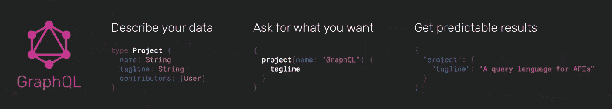

*如何从 GraphQL 端点只检索需要的数据，来源:* [*Mohit Tikoo*](https://medium.com/@mohittikoo/rest-vs-graphql-will-graphql-do-to-rest-what-xml-did-to-json-c99e4fa639c3)

这些天来，GraphQL 生态系统正在随着诸如 Apollo、GraphQL 和 GraphQL Explorer 之类的库和强大工具而扩展。

## GraphQL 如何工作

GraphQL 从构建一个*模式*开始，这个模式描述了您可能在 GraphQL API 中进行的所有查询以及它们返回的所有*类型*。模式构建是困难的，因为它需要模式定义语言(SDL)中的强类型。

在查询之前有了模式，客户端可以验证他们的查询，以确保服务器能够响应它。到达后端应用程序后，GraphQL 操作将根据整个模式进行解释，并使用前端应用程序的数据进行解析。向服务器发送一个大规模的查询，API 返回一个 JSON 响应，其中包含我们所请求的数据的确切形状。

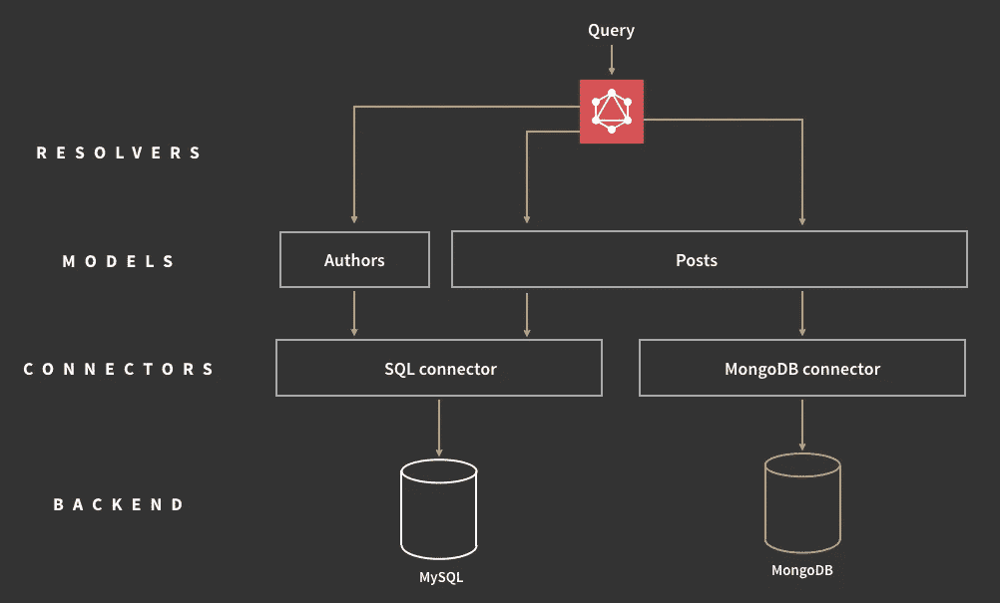

*graph QL 中的查询执行，来源:*[*Jonas Helfer*](https://www.apollographql.com/blog/graphql-explained-5844742f195e)

除了 RESTful CRUD 操作，GraphQL 还有*订阅*，允许来自服务器的实时通知。

## GraphQL pros

**类型化模式。** GraphQL 提前公布自己能做什么，提高了可发现性。通过将客户机指向 GraphQL API，我们可以发现哪些查询是可用的。

**非常适合类似图表的数据。**深入链接关系但对平面数据不利的数据。

**没有版本。版本控制的最佳实践是根本不对 API 进行版本控制。**

虽然 REST 提供了多个 API 版本，但 GraphQL 使用一个不断发展的版本，该版本提供了对新特性的持续访问，并有助于创建更干净、更易维护的服务器代码。

**详细错误信息。与 SOAP 类似，GraphQL 提供了发生的错误的细节。它的错误消息包括所有解析器，并引用出错的确切查询部分。**

**灵活的权限。** GraphQL 允许有选择地公开某些功能，同时保留私人信息。与此同时，REST 架构不显示部分数据。要么全有，要么全无。

## 图表一致性

**性能问题。** GraphQL 用复杂性换取了强大的功能。在一个请求中有太多嵌套字段会导致系统过载。因此，对于复杂查询，REST 仍然是更好的选择。

**缓存复杂性。**由于 GraphQL 没有重用 HTTP 缓存语义，它需要定制缓存。

**大量的发展前教育。没有足够的时间来搞清楚 GraphQL 利基操作和 SDL，许多项目决定遵循众所周知的 REST 之路。**

## GraphQL 用例

**移动 API。**在这种情况下，网络性能和单消息有效载荷的优化很重要。因此，GraphQL 为移动设备提供了更有效的数据加载。

**复杂系统和微服务。** GraphQL 能够将多系统集成的复杂性隐藏在其 API 背后。聚合来自多个地方的数据，将它们合并到一个全局模式中。这与[传统基础设施](https://www.altexsoft.com/whitepapers/legacy-system-modernization-how-to-transform-the-enterprise-for-digital-future/?utm_source=MediumCom&utm_medium=referral&utm_campaign=shared)或随时间扩展的第三方 API 尤其相关。

# 哪种 API 模式最适合您的用例？

每个 API 项目都有不同的需求和需要。通常，架构选择取决于

*   正在使用的编程语言，
*   你发展的环境，以及
*   你必须节约的资源，包括人力和财力。

了解了每种设计风格的所有权衡之后，API 设计者可以选择最适合项目的风格。

凭借其紧密耦合，RPC 适用于内部微服务，但它不是强大的外部 API 或 API 服务的选项。

SOAP 很麻烦，但是它丰富的安全特性对于计费操作、预订系统和支付来说仍然是不可替代的。

REST 具有最高的抽象和最好的 API 建模。但是，它往往更重，更健谈——如果你在移动设备上工作，这是一个缺点。

GraphQL 在数据获取方面向前迈进了一大步，但并不是每个人都有足够的时间和精力来掌握它。

在一天结束时，尝试一些具有特定风格的小用例是有意义的，看看它是否适合您的用例并解决您的问题。如果是的话，试着扩展一下，看看它是否适合更多的用例。

*最初发表于 AltexSoft tech 博客“* [*比较 API 架构风格:SOAP vs REST vs graph QL vs RPC*](https://www.altexsoft.com/blog/soap-vs-rest-vs-graphql-vs-rpc/?utm_source=MediumCom&utm_medium=referral&utm_campaign=shared)