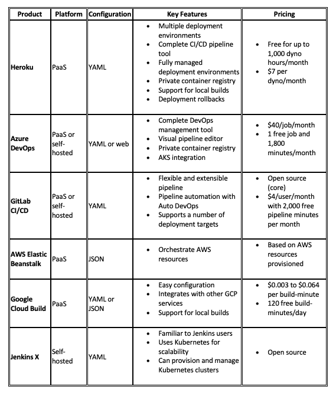

# 比较容器管道

> 原文：<https://levelup.gitconnected.com/comparing-container-pipelines-3ff5ee8ddd26>


# 介绍

容器给 DevOps 带来了巨大的转变，它允许团队比以前更快地交付代码。然而，我们仍然必须经历构建、打包和部署这些容器的过程。这就是我们使用容器管道的原因。

然而，对于容器管道，有许多不同的选择。我们如何知道使用哪一个？在本文中，我们将比较六种选择，并介绍每种选择的配置、优点、局限性和定价。

# 什么是容器管道？

首先，让我们谈谈什么是真正的容器管道。管道有助于软件开发过程中各个阶段的自动化，尤其是持续集成和持续交付(CI/CD)。

容器管道自动化了容器部署过程中的每个阶段，从构建初始映像到部署到生产。

通常，整个容器管道由三个阶段组成:

*   集成:变更被签入源代码控制，触发构建过程和单元测试。
*   验收测试:将容器部署到测试环境中，并验证其功能。
*   部署:将经过全面测试的最终映像部署到生产环境中。

容器管道工具通常至少提供三种中的两种，但它们可以有所不同。

现在让我们看看我们的六个选择。

# 1.赫罗库

Heroku 是一个完整的集装箱管道，利用[码头工人](https://www.docker.com/)。您可以在同一个平台上构建、测试、验证和部署容器，而无需提供硬件或利用不同的服务提供商。

**配置**

Heroku 应用程序是使用一个 [heroku.yml](https://devcenter.heroku.com/articles/build-docker-images-heroku-yml) 清单配置的，它定义了构建和部署容器所需的步骤。具有自定义 docker 文件的应用程序清单可能如下所示:

```
build:
  docker:
    web: Dockerfile
```

要使用 Git 部署这个容器，只需运行:

```
$ heroku stack:set container$ git add heroku.yml$ git commit -m "Add heroku.yml"$ git push heroku master
```

Heroku 还支持[管道](https://devcenter.heroku.com/articles/pipelines)，它允许您将一个容器部署到多个不同的环境中，以反映连续交付工作流中的各个阶段。例如，在部署到生产环境之前，您可以使用管道来测试临时环境中的更改。

**优点和局限性**

Heroku 非常容易使用，整个管道只需要一个 YAML 文件。它是完全托管的，提供了测试和部署变更的多种环境，甚至允许您在部署失败的情况下[回滚变更](https://devcenter.heroku.com/articles/releases#rollback)。

然而，并不是所有的 Heroku 特性都支持 Docker 部署。例如，您不能使用 [Heroku CI](https://devcenter.heroku.com/articles/heroku-ci#docker-deploys) 来运行您的应用程序的测试套件，这意味着要么在构建映像的同时运行测试套件，要么使用[多阶段构建](https://docs.docker.com/develop/develop-images/multistage-build/)。您也不能使用[管道提升](https://devcenter.heroku.com/articles/pipelines#promoting)将容器从一个管道阶段提升到下一个管道阶段。相反，您必须将容器重新部署到目标阶段。

**定价**

Heroku [为一个 web dyno 和一个 worker dyno 提供了一个每月 1000 小时的免费计划](https://www.heroku.com/pricing)。付费计划起价为每月 7 美元，并提供额外的功能，如更大容量的 dyno 和改进的可扩展性。有关更多信息，请参见 Heroku 的[定价页面](https://www.heroku.com/pricing)。

**我的拍摄**

Heroku 是一个非常简单且经济高效的容器管道解决方案。它让您能够完全控制 CI/CD 流程，同时提供一个完全受管理的环境。有了免费层和[免费标准支持](https://www.heroku.com/pricing#support)，值得一试。

# 2.Azure DevOps

[Azure DevOps](https://azure.microsoft.com/en-us/services/devops/) 是微软针对项目管理、源代码管理(SCM)和 CI/CD 的一体化服务。它允许您控制 DevOps 生命周期中的几乎每个阶段，同时提供许多高级的特定于容器的功能，包括私有[容器注册中心](https://azure.microsoft.com/en-us/services/container-registry/)和与 Azure Kubernetes 服务(AKS)的集成。Azure Pipelines 提供平台的 CI/CD 服务。

**配置**

所有的 Azure DevOps 都可以使用基于 web 的用户界面来管理，但你也可以使用签入你的应用程序源代码的基于 YAML 的清单来配置 Azure 管道。web UI 允许您管理和跟踪部署环境和发布版本、工件等等。

**优点和局限性**

如果你的团队已经在使用 Azure，那么 Azure DevOps 就是你现有工作流程的自然延伸。它支持托管和本地安装，还支持许多 Azure 部署目标，包括 Azure App Service、Kubernetes 和 Azure Functions。

然而，与其他服务(包括 Azure 服务)的集成并不简单。在 Azure DevOps 中配置一个集成需要你复制和粘贴值，甚至从 Azure Container Registry 这样的服务中复制和粘贴值，这使它感觉不那么内聚，并且更难设置。

**定价**

Azure Pipelines 提供了一个免费层，包含一个免费并发 CI/CD 作业和每月 1800 分钟。额外的工作花费 40 美元，托管工件(如图像)每月每 GB 花费 2 美元。像 Azure Boards 这样的附加服务需要额外的月费。要了解更多信息，请访问 [Azure DevOps 服务定价](https://azure.microsoft.com/en-us/pricing/details/devops/azure-devops-services/)页面。

**我的拍摄**

Azure DevOps 非常适合想要一体化 DevOps 管理解决方案的团队，或者已经在使用 Azure 的团队。通过将它集中在一个位置，它极大地简化了开发生命周期。然而，它可能很难设置，并且对于只需要基本容器管道的团队来说可能过于复杂。

# 3.GitLab CI/CD

GitLab 最初是一个开源的 SCM，但很快成长为一个完整的 DevOps 管理解决方案。像 Azure DevOps 一样，它提供了项目管理、私有容器注册和编排的构建环境(包括 Kubernetes)等功能。

**配置**

GitLab CI/CD 由 [GitLab Runner](https://docs.gitlab.com/runner/) 提供支持，它在一个自包含的环境中执行 CI/CD 管道中的每个步骤。通过[完成配置。gitlab-ci.yml](https://docs.gitlab.com/ee/ci/yaml/README.html) manifest，它支持一些高级配置，包括条件逻辑和导入其他清单。

或者，您可以使用 [Auto DevOps](https://docs.gitlab.com/ee/topics/autodevops/) 在没有配置的情况下自动化您的整个管道。GitLab 使用 [Heroku buildpacks](https://devcenter.heroku.com/articles/buildpacks) (通过 [Herokuish](https://github.com/gliderlabs/herokuish) )自动确定如何基于源代码(在本例中是 Dockerfile)构建您的应用程序。Auto DevOps 可以自动运行单元测试，执行代码质量分析，并扫描图像以发现安全问题。

对于部署，GitLab 使用 [dpl](https://github.com/travis-ci/dpl) 工具，该工具支持广泛的提供商，包括云平台和 Kubernetes 集群。

**优点和局限性**

GitLab 提供了一个极其灵活的管道，您可以使用内置工具自行配置或完全自动化。YAML 配置允许更大范围的项目结构和步骤，例如创建项目依赖关系和[合并来自不同项目的多个管道](https://docs.gitlab.com/ee/ci/pipelines.html#multi-project-pipelines-premium)。因为 GitLab 使用现有的开源工具，如 Herokuish 和 dpl，所以它支持广泛的项目类型、语言和部署目标。

虽然 GitLab 可以将 Runners 和工件部署到现有的环境中，但是它不能自己供应或维护那些环境(Google Kubernetes 引擎和 Amazon Elastic Kubernetes 服务除外)。它也缺乏图形化的管道配置工具，这使得管道管理不如 Azure Pipelines 等工具直观。

**定价**

GitLab 使用开放核心模型:它提供一个开源基础版本和一个带有附加功能的付费企业版本。对于付费计划，[定价](https://about.gitlab.com/pricing/#gitlab-com)根据用户数量、每月运行 CI 渠道的分钟数以及对特定功能的访问情况进行分级。所有计划包括无限的代码库、项目规划工具和每月 2000 分钟的免费管道时间。付费计划从每个用户每月 4 美元到每个用户每月 99 美元不等。

**我的拍摄**

GitLab 是一个非常通用和强大的 CI/CD 工具，包含非常有用的功能。开源版本的功能足够丰富，可以与许多商业选项竞争，同时还允许您进行自我托管。但是，它要求您维护一个单独的部署环境。

# 4.AWS 弹性豆茎

弹性豆茎与其说是一个管道，不如说是一个编排 AWS 资源的工具。它可以自动供应、负载平衡、扩展和监控 ECS 容器、S3 存储桶和 EC2 实例等资源。这允许您根据自己的特定需求在 AWS 中创建一个完全定制的管道。

**配置**

Beanstalk 配置描述了如何部署容器以及部署容器的环境。这在一个 [Dockerrun.aws.json](https://docs.aws.amazon.com/elasticbeanstalk/latest/dg/create_deploy_docker_v2config.html) 文件中定义。Beanstalk 引入了独特的[概念](https://docs.aws.amazon.com/elasticbeanstalk/latest/dg/concepts.html)，例如:

应用程序:Beanstalk 组件的逻辑集合，比如环境和版本。应用程序版本:源代码的可部署版本。环境:运行应用程序版本所需的 AWS 资源集。优点和局限性

Beanstalk 不仅对于 Docker，而且对于 AWS 都是一个非常强大的工具。它提供自动扩展、滚动更新、监控和发布管理。它还允许您直接访问和管理资源。

然而，Beanstalk 比普通管道更复杂。您需要在映像存储库中预构建和托管 Docker 映像，除非您使用的是[单容器环境，](https://docs.aws.amazon.com/elasticbeanstalk/latest/dg/single-container-docker.html)和容器版本与环境紧密耦合。您只能通过 Beanstalk CLI 触发更新；因此，如果容器出现故障，您需要使用 Beanstalk 控制台手动解决它。

**定价**

Beanstalk 本身是免费的，但是它提供的 AWS 组件是按正常价格定价的。例如，如果您为您的环境配置了 ECS 节点和 ELB 负载平衡器，您将像正常调配一样为节点和负载平衡器付费。

**我的拍摄**

有了大量可用的 AWS 服务，Beanstalk 提供了管理所有这些服务的好方法。当作为编排工具使用时，它可能非常强大，但是作为容器管道使用时，它可能太复杂了。

# 5.谷歌云构建

[Cloud Build](https://cloud.google.com/cloud-build) 是构建在谷歌云平台(GCP)上的一个相对基础的容器 CI 服务。它可以直接从源代码或 other 文件构建映像，并直接部署到 GKE、云运行和其他 GCP 服务。

**配置**

云构建是通过一个 [cloudbuild.yaml](https://cloud.google.com/cloud-build/docs/build-config) (或 JSON)文件配置的。您可以定义构建图像的过程，以及存储结果图像的位置。例如，构建 Docker 映像并将其推送到 Google Container Registry 非常简单:

```
steps:
- name: gcr.io/cloud-builders/docker
  args: ['build', '-t', 'gcr.io/$PROJECT_ID/myimage', '.']
images: ['gcr.io/$PROJECT_ID/myimage']
```

云构建支持[触发器](https://cloud.google.com/cloud-build/docs/running-builds/create-manage-triggers)，它自动启动对源代码的构建。

**好处和局限**

云构建灵活[与其他 GCP 服务](https://cloud.google.com/cloud-build/docs/how-to#deploying-builds)集成，包括 GKE、应用引擎和云运行。您可以直接控制构建机器的大小和容量，还可以通过[缓存图像层](https://cloud.google.com/cloud-build/docs/kaniko-cache)来加快构建速度。您还可以运行[本地构建](https://cloud.google.com/cloud-build/docs/build-debug-locally)来验证或调试您的构建，然后再推进到云运行。

因为云构建是围绕 GCP 构建的，所以它只支持有限数量的部署目标。将容器部署到其他平台是可能的，但是需要额外的步骤。另外，和 GitLab 一样，Cloud Build 也没有可视化的管道配置工具。

**定价**

[定价](https://cloud.google.com/cloud-build/pricing)基于您的构建机器的大小和构建时间。一个标准的 n1-standard-1 实例每构建分钟花费 0.003 美元，在 n1-highcpu-32 实例上高达 0.064 美元。在 n1-standard-1 实例上，您每天还可以获得 120 分钟的免费构建时间。

**我的拍摄**

云构建相对简单，但这也是它的优势之一。它很快，容易学习，相当便宜，并与其他 GCP 服务很好地集成。如果您已经有了一个部署环境，或者已经利用了 GCP，我建议您尝试一下。

# 6.詹金斯 X

[Jenkins](https://jenkins-x.io/) 是目前最流行的 CI/CD 工具之一，Jenkins X 通过添加全面的 Kubernetes 集成进一步扩展了它。Jenkins X 不仅可以部署到 Kubernetes，还可以为您提供和管理 Kubernetes 集群。

**配置**

Jenkins X 管道建立在 [Tekton 管道](https://tekton.dev/)之上，帮助在 Kubernetes 上运行 CI/CD 管道。您可以使用一个 [jenkins-x.yml](https://jenkins-x.io/docs/reference/pipeline-syntax-reference/) 文件来配置您的管道(与传统的 Jenkinsfile 相比)。Jenkins X 还提供了[构建包](https://jenkins-x.io/docs/reference/components/build-packs//)，可以帮助将源代码打包成映像，然后部署到 Kubernetes。

**优点和局限性**

Jenkins X 利用两个流行的现有项目——Jenkins 和 Kubernetes——创建一个可扩展的 CI/CD 平台。它可以自动化整个 CI/CD 渠道，并支持预览环境和渠道促销。因为它包括 Jenkins，所以它可以访问整个 Jenkins 开发人员社区。

然而，Jenkins X 需要 Kubernetes，并且对集群如何配置非常固执己见。命令行工具自动化了这个过程的大部分，但这是一个重要的考虑因素。

**定价**

Jenkins X 是开源的。

**我的拍摄**

对于使用詹金斯的球队来说，詹金斯 X 会感觉是一个自然的进程。它有一些严格的限制和要求，但是对于使用 Kubernetes 的团队来说，拥有一个能够与您的基础设施进行本机集成的工具是一个好处。

# 结论

让我们快速对比一下:



对于希望在稳定的环境中简单地部署和托管 Docker 容器的团队来说，Heroku 是无可匹敌的。它提供了一个快速且可配置的平台，支持广泛的集成，并拥有一个庞大的第三方附加组件市场。Elastic Beanstalk 在编排 AWS 资源的能力方面紧随其后，是具有更复杂需求的团队的推荐选择。

对于容器 CI，GitLab 可以说是最全面的选择，因为它有大量的特性、自动开发能力和开放核心模型。Google Cloud Build 利用了 Google Cloud Platform 的速度和容量来实现快速构建，Jenkins X 受益于成为 Jenkins 项目的一部分。大多数这些服务要么是开源的，要么提供免费试用，所以我们建议尝试一下，看看哪个最适合您的工作流程。