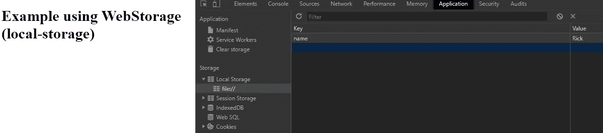
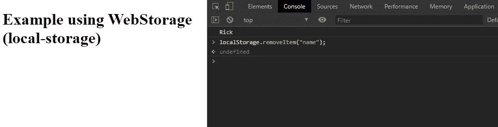
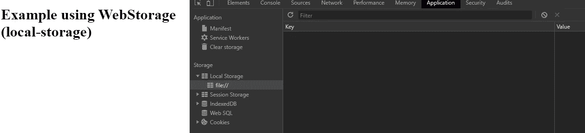
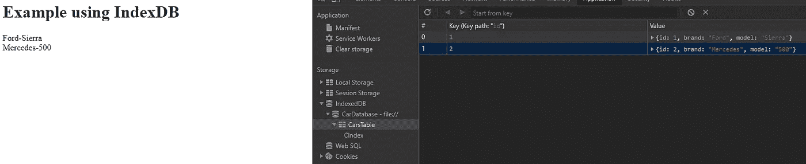

# 比较使用 JavaScript 在客户端存储数据的不同方式

> 原文：<https://levelup.gitconnected.com/comparing-different-ways-to-store-data-on-the-client-side-with-javascript-37cde47ee003>

从老式饼干到新的替代品。


安东尼的磁带影像

现在，浏览器支持不同的方式在用户的计算机上存储数据，然后在必要时检索数据，让您保存数据进行长期存储，保存用户特定的设置，保存网站供脱机使用，等等。客户端存储由 JavaScript APIs 组成，允许您在客户端存储不同类型的数据，然后在需要时检索这些数据。这篇文章描述了这些方法的基本原理。

## 索引

*   饼干
*   Web 存储 API(本地存储和会话存储)
*   索引数据库
*   缓存存储

## 饼干

HTTP cookie 或 cookie 只是数据，存储在计算机上的小文本文件中，它们是 web 上常用的客户端存储的最早形式。

Cookies 是由网景通信公司的创始工程师 Lou Montulli 于 1994 年设计的，它使电子商务购物车成为可能。最初，cookies 被所有支持的浏览器默认接受，很少有终端用户知道它们的存在会带来风险。

因为这是一项古老的技术，所以它有许多影响用户安全和隐私的问题。这些问题非常严重，以至于当您第一次访问一个网站时，您会收到一条警告消息，告知您是否允许它使用 cookies 来存储数据。

这种大量的安全问题和它无法存储复杂数据的能力使它不适合今天使用，特别是当有更好和更现代的方法来存储数据时。

## Web 存储 API

Web 存储或 DOM 存储提供了用于存储客户端数据的 web 应用程序和 API，支持持久数据存储，与 cookies 相当，但具有更好的编程接口、更大的容量(至少 5MB)，并且没有信息存储在请求头中或传输到服务器。

Web 存储是基于源的(基于域和协议)。来自同一个源的所有页面可以存储和访问相同的数据。

[网络存储 API](https://developer.mozilla.org/en-US/docs/Web/API/Web_Storage_API) 使用起来很简单。您存储简单的数据键值对，并在需要时检索这些值。

要存储对象，您必须将它们转换为字符串。为此，我们在传递给 setItem()之前使用 JSON.stringify()方法:

```
const car = {
    brand: "Ford",
    model: "Sierra",
}window.localStorage.setItem('car', JSON.stringify(car));
```

要再次使用该值，您必须将其转换回对象:

```
JSON.parse(window.localStorage.getItem('car'));
//{brand: "Ford", model: "Sierra"}
```

浏览器中的两种结构包含两种主要的 web 存储类型:本地存储和会话存储。第一种方法在浏览器关闭然后重新打开后仍然保存数据，第二种方法在浏览器打开时保存数据。

使用 localStorage 的示例:

1:检查浏览器支持。
2:将值“Rick”存储在密钥名称中
3:通过关键字“name”检索值
4。如果您的浏览器不支持 Web 存储 API，请记录一个错误。

使用以下代码创建一个 exampleWebStorage.html 文件，并使用浏览器打开它:

```
<!DOCTYPE html>
<html>
<body><h1>Example using WebStorage (local-storage)</h1><script>//1
 if (typeof(Storage) !== "undefined") {//2
  localStorage.setItem("name", "Rick");

  //3 
  console.log(localStorage.getItem("name"));
  //Rick}else{
  //4   
  console.log("your browser doesn’t support local storage!");    
}</script></body>
</html>
```

现在，如果你在 chrome 等现代浏览器中加载 index.html 文件，并在应用程序选项卡中打开开发工具，你可以看到你的键值“名称”存储在你的浏览器本地存储中:



DevTools 应用程序选项卡

然后，在控制台选项卡的开发工具中执行以下命令，从 localStorage 中删除“name”属性:

```
localStorage.removeItem("name");
```



开发工具控制台选项卡

最后的结果是:



DevTools 应用程序选项卡

sessionStorage 对象等效于 localStorage 对象，但它只存储一个会话的数据，当用户关闭浏览器选项卡时，数据将被删除。

如果您使用 npm 或另一个依赖项管理器，您可以使用构建在 Web 存储 API 之上的许多库中的一个，它为我们使用 Web 存储提供了有用的帮助方法。

## 索引数据库

IndexedDB 是一个 NoSQL 数据库(基本上是一个简单的平面文件数据库)，您可以在所有现代浏览器上使用它来存储“无限”数量的数据，并像在 NoSql 数据库中一样进行查询。(如果要用 SQL，就不能用 IndexDB。)

之前我们有 WebSQL，一个围绕着 [SQLite](https://www.sqlite.org/index.html) 的包装器，但是现在这个已经被弃用，并且在一些现代浏览器上不受支持。此外，它从来都不是一个公认的标准，所以它不应该被使用。

在 IndexDB 中，一个数据库对于一个域是私有的，因此任何其他站点都不能访问其他 IndexedDB 存储。IndexDB 支持事务和版本控制，他的 API 大部分是异步的，这意味着进行昂贵的操作不会阻塞 UI 线程，从而给用户带来糟糕的体验。

IndexDB 使用商店的概念。一个存储区包含几个具有唯一键的项目，该键表示可以识别一个对象的方式。

在我们的商场，我们可以使用一组数据，如:

*   数字
*   线
*   目标
*   数组
*   日期

让我们看一个例子。用下面的代码创建一个 exampleIndexDB.html 文件(或者你想要的任何名字),并用你的浏览器打开它:

*注意，我们使用事件监听器，因为 IndexedDB 使用异步 API。*

```
<!DOCTYPE html>
<html>
<body><h1>Example using IndexDB</h1><div id="divId"></id><script>
let myRId= document.getElementById('myResultId');
let i = 0;
const versionDB = 1;//1
let indexedDB = window.indexedDB || window.mozIndexedDB || window.webkitIndexedDB || window.msIndexedDB || window.shimIndexedDB;//2
var open = indexedDB.open("CarDatabase", versionDB);//3
open.onupgradeneeded = function(){
 let db = open.result;
 let store = db.createObjectStore("CarsTable", {keyPath: "id"});
 let index = store.createIndex("CIndex", ["brand", "model"]);
};//4
open.onsuccess = function(){//5
 let db = open.result;//6
 let tx = db.transaction("CarsTable", "readwrite");//7
 let store = tx.objectStore("CarsTable");//8  
 let index = store.index("CIndex");//9
 store.put({id: 1, brand: "Ford", model: "Sierra"});
 store.put({id: 2, brand: "Mercedes", model: "500"});

 //10
 let getAll = store.getAll();getAll.onsuccess = function(){
  for(i=0; i<getAll.result.length ;i++)
    divId.innerHTML += getAll.result[i].brand+"- 
    "+getAll.result[i].model+
    " <br>";
 }//11 
 tx.oncomplete = function(){
  db.close();
 };}</script></body>
</html>
```

1.  获取 indexDB。我们包括您想要测试的实现的前缀。
2.  我们在版本 1 中打开一个名为 CarDatabase 的数据库，并返回一个对数据库的请求(异步请求)。
3.  *IDBOpenDBRequest* 接口的“onupgradeneeded”属性是“upgradeneeded”事件的事件处理程序，当加载版本号大于现有存储数据库的数据库时触发。
4.  *IDBRequest* 接口的“onsuccess”事件处理程序处理成功事件，该事件在请求的结果成功返回时触发。
5.  启动一个事务并进行读取操作。
6.  对于只读属性，如果请求失败并且结果不可用，则抛出 *InvalidStateError* 异常。
7.  *IDBTransaction* 接口的 objectStore()方法返回一个已经添加到该事务范围的 Store 对象。
8.  *idbobobjectstore*接口的 index()方法在当前对象存储中创建一个命名索引。
9.  补充一些数据。
10.  查询以获取所有数据。
11.  *IDBTransaction* 接口的“oncomplete”事件处理程序处理完成事件，该事件在事务完成时触发。



通过 id 从数据库中删除记录:

```
store.delete(2);
```

# 缓存存储

CacheStorage 是浏览器中使用的一种存储机制，用于存储和检索网络请求-响应，不应与浏览器缓存混淆。它保存了一对请求和响应对象——请求作为键，响应作为值。

虽然我们习惯于将 CacheStorage 与服务工作者联系起来，但是 CacheStorage 并不是服务工作者 API。尽管如此，它使服务人员能够缓存网络请求-响应，以便在用户没有连接时提供离线功能。

CacheStorage 也可以在 DOM 中用作存储工具。

让我们看一个在 DOM 中使用 CacheStorage 的例子。用下面的代码创建一个 exampleCS.html 文件(或者你想要的任何名字),并用你的浏览器打开它:

```
<!DOCTYPE html>
<html>
<body><h1>Example using WebStorage (local-storage)</h1><script>**const CACHE_NAME = 'myCache’;**//1
 if ('caches' in window) {//2
  caches.open(CACHE_NAME).then((cache) => {

    console.log("Cached created");

    //3  
    cache.add("Character", { name: "Rick", lastName: "grimes"   
    }).then( () => console.log("character added"));}).catch((err) => {
      //error
  })}</script></body>
</html>
```

1.  检查浏览器支持。
2.  我们使用带有缓存名称的“open”方法在缓存列表中搜索缓存名称。如果缓存存在，则返回引用缓存名称的缓存，否则创建新的缓存。
3.  向缓存中添加一个条目。

重试缓存中的条目:

```
function get(cacheName, entry) {
  return window.caches.open(cacheName).then(function(cache) {
    return cache.match(entry);
  });
}
```

从缓存中删除条目:

```
function remove(cacheName, entry) {
  return window.caches.open(cacheName).then(function(cache) {
    return cache.delete(entry);
  });
}remove("Rirck");
```

## 结论

在这篇短文中，我们回顾了在客户端持久化数据的最常见方式。正如我们在不同的例子中看到的，所有形式的缓存都非常容易使用，但是在 indexDB 和 CacheStorage 中，存储限制更大。

使用会话存储，数据仅在页面会话期间可用，但在其他情况下，数据会一直存在，直到被显式删除。最后，这完全取决于你需要什么。对于不需要存储大量数据的简单事情，使用 Web Storage API 可能已经足够了，但在其他情况下，可能需要使用 IndexDB。

尽管您可以在 DOM 中使用 CacheStorage，但是它也可以用于服务工作者。相反，web 工作人员或服务工作人员无法访问 LocalStorage/SessionStorage。

## 参考

[](https://developer.mozilla.org/) [## MDN Web 文档

### MDN Web Docs 站点提供了关于开放 Web 技术的信息，包括 HTML、CSS 和用于这两个网站的 APIs

developer.mozilla.org](https://developer.mozilla.org/) 

感谢你阅读我的文章，照顾好自己！