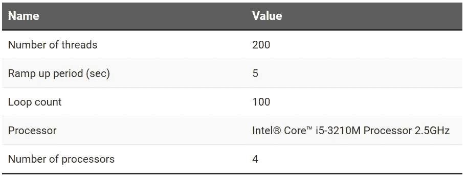
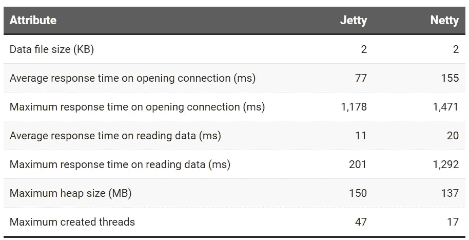
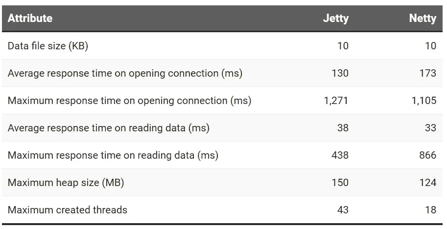
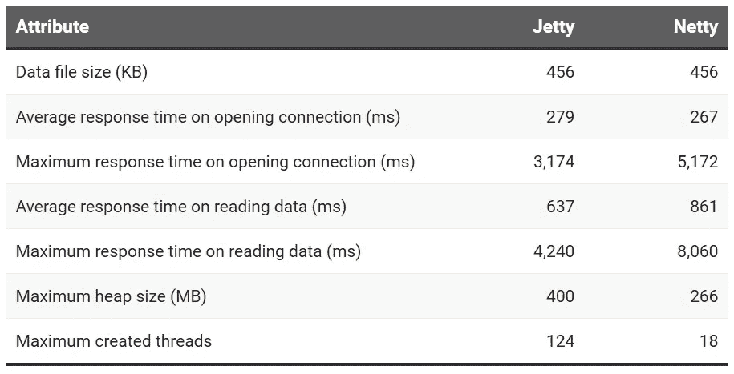

# 比较 Java WebSockets: Jetty 与 Netty

> 原文：<https://levelup.gitconnected.com/comparing-java-websockets-jetty-vs-netty-ba128ddca313>


学分: [Symphony Solutions](https://symphony-solutions.com/)

本文向我们展示了使用标准测试工具比较 Java 中两个 WebSocket 实现 Jetty 和 Netty 的一步一步的过程。

我们将通过以下属性来比较这两种实现:平均和最大响应时间、内存消耗、小数据、平均数据和大数据的最大使用线程数。

# 你需要什么

*   Java 8
*   JMeter 5.1.1
*   Java IDE
*   Maven 3
*   VisualVM 或任何 Java 分析器

# 你将使用什么

我们将使用两个 WebSocket 实现:

*   【Eclipse 基金会的码头
*   [Netty 开源 Java 实现的 Socket。IO 服务器](https://github.com/mrniko/netty-socketio)。

# 下载源

首先，你需要从[https://github.com/vhavryk/compare-jetty-netty](https://github.com/vhavryk/compare-jetty-netty)下载源代码。

我已经更改了两个项目的演示，以便使用 [JMeter](https://jmeter.apache.org/) 正确运行负载测试。我在两个项目中都添加了一个新文件 [DataFileLoader](https://github.com/vhavryk/compare-jetty-netty/blob/main/native-jetty-websocket-example/src/main/java/org/eclipse/jetty/demo/DataFileLoader.java) ，它使用 env 变量**“data-file-name”从文件中加载数据。**稍后，我们将使用数据从服务器发送到客户端(JMeter)。

# Jetty WebSocket 服务器

我改了两个文件 [EventServer](https://github.com/vhavryk/compare-jetty-netty/blob/main/native-jetty-websocket-example/src/main/java/org/eclipse/jetty/demo/EventServer.java) 和 EventSocket:

因此，我们可以在连接打开后将数据从服务器发送到客户端。
要构建一个项目，我们需要转到[**native-jetty-web socket-example**](https://github.com/vhavryk/compare-jetty-netty/tree/main/native-jetty-websocket-example)文件夹并运行命令:

```
**mvn clean install**
```

转到**目标**文件夹并运行命令:

```
**java -Ddata-file-name=small.json jar native-jetty-websocket-example-1.0-SNAPSHOT.jar**
```

之后，Jetty 服务器开始使用 small.json 文件中的数据。

# Netty 网络套接字服务器

我已经更改了一个文件 [ChatLauncher](https://github.com/vhavryk/compare-jetty-netty/blob/main/netty-socketio-demo/server/src/main/java/com/corundumstudio/socketio/demo/ChatLauncher.java) :

我添加了对重用地址的支持，以解决 JMeter WebSocket 插件的问题。此外，我将数据接收者从“所有客户端”更改为“一个连接的客户端”。要构建项目，我们需要转到[**netty-socketi o-demo/server**](https://github.com/vhavryk/compare-jetty-netty/tree/main/netty-socketio-demo/server)文件夹并运行命令:

```
**mvn clean install**
```

之后，转到**目标**文件夹并运行命令:

```
java -Ddata-file-name=large.json -jar demo-1.0.0-SNAPSHOT.jar
```

Netty 服务器开始使用 large.json 文件中的数据。

# 负载测试配置

我们将使用 [JMeter 工具](https://jmeter.apache.org/)在 [JMeter WebSocket 采样器](https://bitbucket.org/pjtr/jmeter-websocket-samplers/src/master/)的帮助下对两台服务器进行负载测试。
我为 Netty 和 Jetty 服务器创建了两个不同的 JMeter 场景，因为 Jetty 服务器需要三个帧来读取数据，而 Netty 服务器需要五个帧。你可以在 [**JMeter**](https://github.com/vhavryk/compare-jetty-netty/tree/main/jmeter) 文件夹**中找到这两种场景。**此外，请忽略 Netty 场景中的错误，因为我们使用的插件与 Netty WebSocket 实现不完全兼容，它不能正确处理 close 事件的响应。

一般负载测试配置如下表所示:



# 负载测试方法

我们将从负载测试中收集以下数据:

*   数据文件大小(KB) —服务器将发送给客户端的数据
*   打开连接的平均响应时间(毫秒)
*   打开连接的最大响应时间(毫秒)
*   读取数据的平均响应时间(毫秒)
*   读取数据的最大响应时间(毫秒)
*   最大堆大小(MB)
*   创建的最大线程数

收集这些数据将通过以下步骤完成:

1.  使用-Ddata-file-name={filename}参数运行服务器
2.  运行 JMeter 并从 JMeter 文件夹中打开相应的场景
3.  运行方案并收集聚合报告数据
4.  运行 VisualVM 或任何 Java profiler 并连接到服务器
5.  运行场景并收集监控数据:内存和创建的线程数
6.  关闭/停止探查器和服务器。
7.  对下一个数据文件重复这些步骤。

我已经完成了所有的步骤并收集了 [**报告**](https://github.com/vhavryk/compare-jetty-netty/tree/main/reports) 文件夹中的信息。
接下来，我们将分析结果。

# 小数据负载测试分析



如您所见，对于小文件，Jetty 的响应时间比 Netty 短。最大堆大小是可比的。但是 Netty 使用的线程更少。

**获胜者:突堤**

# 有中间数据的负载测试分析



这种情况下没有明显的赢家:

*   Jetty 在打开连接方面稍好一些，但是消耗更多的内存和使用更多的线程。

# 大数据负载测试分析



在这种情况下，我们有两个赢家:

*   就响应时间而言，Jetty 更好。
*   Netty 在内存消耗和线程数量方面更胜一筹。

# 一般分析

根据聚合报告，我们可以发现 Netty 的最大响应时间比 Jetty 长，但消耗的内存和创建的线程更少。两个服务器都在努力争取最大时间，尤其是 Netty。因此，要在生产中使用这些服务器，您需要找到处理从服务器到客户端(使用超时和重试)或/和服务器的长响应的解决方案。

# 最后的话

一般来说，没有明显的赢家，但是对于客户端到服务器的数据传输中的小数据量(小于 2KB)，最好使用 Jetty。对于平均数据大小或任何超过 10KB 的数据，由于内存和线程的最佳使用，最好使用 Netty。