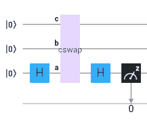
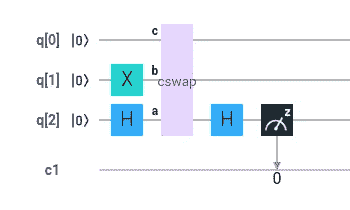
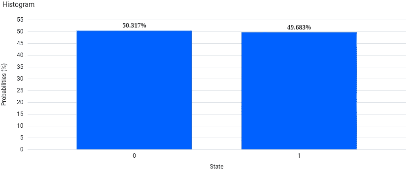
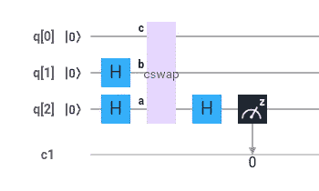
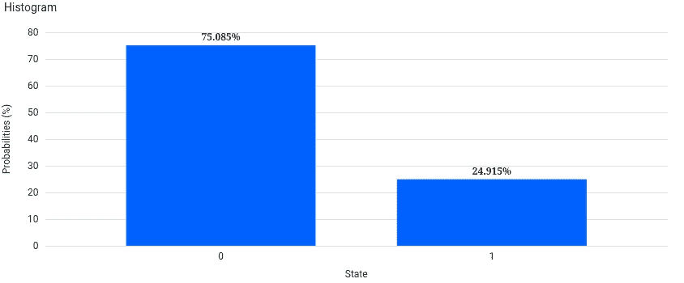
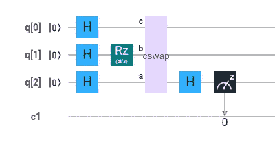
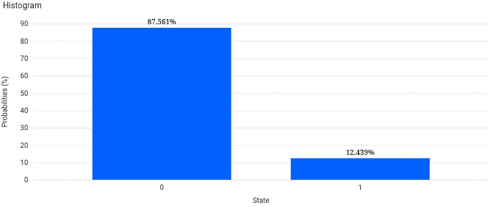

# 比较量子态

> 原文：<https://levelup.gitconnected.com/comparing-quantum-states-c6445e1e46fd>

交换测试是作为一种比较两个量子态的方法提出来的，但是我看到的文献并没有解释如何量化这种差异。然而，你可以从这个实验中获得更多的信息，而不仅仅是简单地确定状态是否相同。

上面的电路显示了标准的交换测试。在这个例子中，上面的两个量子位是你要比较的，下面的量子位是你要测量的。cswap 操作是一个 Fredkin(受控交换)门，它对 ancilla 量子位(被测量的那个)进行控制。

它的工作方式是，如果你测量两个相同的量子比特，就像上面的两个基态量子比特，你会以 1 的概率测量到 0。量子位元的差异越大，机率就越低。但是，概率不会以 1 比 1 的比率下降；相反，差值在 0 和 1 测量值之间平均分配。因此，0 表示相似性，0 和 1 表示差异。

如果我们使用极性相反，一个量子位处于基态，另一个量子位应用了泡利-X(非)门，我们可以看到比较两个最大相反状态的结果。

这个模拟显示了 50/50 的分割。这两种状态之间没有相似性(“重叠”)，因此整个差异测量为 0 或 1 的概率相等。

如果我们使用 Hadamard 门代替 Pauli-X(非)门，第二个量子位旋转到|+>态。第一量子位通常以 1 的概率测量 0，而第二量子位通常以相等的概率测量 0 和 1。

该模拟将相似性(“重叠”)显示为一半。因此，一半结果是概率为 1 的 0，另一半在 0 和 1 之间平分。换句话说，这是相似性的 50% 0 和差异的 50% 0/1 分割(25% 0 和 25% 1)。最终结果就是这种 75/25 的分成。

有趣的是，互换测试是基础不可知的。如果我们将两个量子位旋转到|+>，然后绕 z 轴旋转第二个量子位π/3，电路的工作原理是一样的。

可以，中间的量子位可以一步旋转。当测量 z 基时，我简单地使用了两个步骤来显示相同的概率。

这个模拟需要一些旋转的知识，但是π/3 旋转影响 25%的概率。这个直方图显示两个量子位有 75%相似。75%的重叠测量值为 0，概率为 1，25%的差异在 0 (12.5%)和 1 (12.5%)测量值之间平均分配。

通过观察这些直方图，很明显，我们可以了解更多关于两个量子位的信息，而不仅仅是它们是否相同。事实上，只有一个基础不同的两个量子位告诉我们它们的角度差；将 1 测量值加倍，得到两个状态的 1 测量值之差，可以使用三角学将其转换为弧度。

回头看第一张直方图，测到 1 的概率是. 5；两个量子位的 1 测量值通常相差(1)的两倍。基态测量 1 的概率为 0，激发态测量 1 的概率为 1。回头看第二个直方图，测到 1 的概率是. 25。将该值加倍到 0.5，我们得到基态测量值为 1 的概率为 0，而|+>态测量值为 1 的概率为 0.5。回头看第三个直方图，测到 1 的概率大概是 12.5%。加倍到 25%并测量 y 基数，我们得到第一个量子位测量 1 的概率为 50%，第二个量子位测量 1 的概率为 75%。你也可以测量 x 基，看到第一个量子位测得 1 的概率为 0，第二个量子位测得 1 的概率为. 25，两者相差 25%。

当状态在一个以上的基础上不同时，数学变得有点困难，但是实验表明电路继续相同地工作。例如，我将一个量子位π/3 向下旋转 4pi/3 左右，将另一个量子位π/3 向下旋转π/3 左右，以获得两个没有重叠且所有 3 个碱基都不同的状态。结果类似于第一个直方图，显示没有重叠，测量 0 或 1 的概率相等。