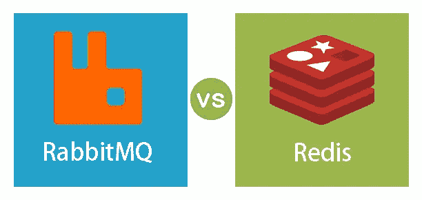

# RabbitMQ 对 Redis 队列的适用性比较

> 原文：<https://levelup.gitconnected.com/comparing-suitability-of-rabbitmq-over-redis-queue-82c538e21b7>



RabbitMQ vs Redis

# 议程

在构建工作队列时，RabbitMQ 和 Redis 是作为消息代理的可用选择。

Redis 没有内置的队列数据结构。然而，它内置了对列表的支持，Redis 列表允许在列表的两端插入和删除。因此，这个列表可以用作 FIFO 队列。

Resque 以及 [python-rq](https://github.com/rq/rq) 使用 Redis 作为队列。

在本文中，我们试图理解 RabbitMQ 比 Redis 队列更好的情况。

我们期望以下先决条件:
- RabbitMQ 安装
- Redis 安装
- Python 安装

使用 Docker 容器运行 RabbitMQ 和 Redis 非常简单，所以如果您没有 RabbitMQ 或 Redis 安装，可以使用 Docker 方法。

我们将讨论一个实际的例子，并使用 Python 来构建它。因此，熟悉 Python 会有所帮助。

然而，我们会尽量少用 Python，即使你不熟悉，你也应该能够理解。

# RabbitMQ 可以更可靠

RabbitMQ 内置了对消息确认的支持。因此，只有当消费者/工作者向 RabbitMQ 确认它已经处理了消息时，才从队列中删除消息。

如果处理消息的消费者/工作者崩溃，消息将留在队列中，并被分派给下一个消费者。这确保了没有消息未被处理或丢失。从而确保高可靠性。

如果使用 Redis 列表，工人通常会从列表中弹出。Redis 没有确认机制。因此，消费者/工作者没有办法向 Redis 确认消息的处理状态。
如果工作者在处理消息时崩溃，Redis 没有办法知道这个消息没有被处理。因此，它不能传递给下一个工人。

我们来看一个例子。

## Redis 方法

我们将编写一个发布队列的发布者和一个从队列中消费的消费者。让我们首先采用 Redis 方法。

让我们创建一个名为 *redis_publisher.py* 的文件。它应该如下所示:

这里，我们创建一个名为 *hello* 的 Redis 列表，并在这个列表中推送一条消息。我们从清单的左侧推进，将从右侧消费。因此，这个列表的行为就像一个队列。

你需要确保软件包 *redis* 已经安装。此外，确保在本地主机的端口 6379 上运行一个 *redis-server* 。否则，相应地修改代码以连接到正确的主机和端口。

尝试调用此脚本，以确保发布者端的一切工作正常。

```
$ python redis_publisher.py hello redis
```

您应该会看到以下输出:

```
Message sent: hello redis
```

让我们创建一个名为 *redis_consumer.py* 的文件。它应该如下所示:

我们不断地从名单的右边冒出来。为了模拟一个耗时的任务，我们做了一个 *time.sleep()* 和消息长度一样多的秒数。

让我们从消费者开始。在新的终端上启动它。

```
$ python redis_consumer.py
```

您应该会在用户终端上看到以下内容。

```
Received: hello redis
Processed: hello redis
```

此外，在“已接收:你好 redis”和“已处理:你好 redis”之间应该有 11 秒钟的停顿。这是因为 time.sleep()代码。

从上一个终端，再次触发生产者。

```
$ python redis_publisher.py redis vs rabbitmq
```

同样的信息应该打印在用户终端上。

```
Received: redis vs rabbitmq
Processed: redis vs rabbitmq
```

我们来发布一条长消息。这是为了确保消费者需要很长时间来处理此消息。

```
$ python redis_publisher.py does redis have message acknowledgement
```

消费终端应该已经打印出来了。

```
Received: does redis have message acknowledgement
```

让我们通过按 Ctrl+c 来中断消费者。这是为了模拟消费者崩溃。

此时，我们可以假设消费者在处理消息时崩溃了。在一个好的面向消息的解决方案中，我们期望消费者有一种方式来确认队列的消息处理的完成。并且只有在接收到确认之后，队列才应该驱逐消息。

然而，我们在使用 Redis 时没有这样的选项。

让我们再次启动消费者。

```
$ python redis_consumer.py
```

从发布者终端发布另一条消息。

```
$ python redis_publisher.py next message
```

您会看到在用户终端上打印了以下内容。

```
Received: next message
Processed: next message
```

因此，消费者崩溃时正在处理的早期消息丢失了。

## RabbitMQ 方法

继续之前，先熟悉一下[https://www.rabbitmq.com/tutorials/tutorial-one-python.html](https://www.rabbitmq.com/tutorials/tutorial-one-python.html)。这将确保您对 RabbitMQ 连接、通道、交换和队列有一个基本的了解。

让我们为 rabbitmq 创建发布者代码。让我们称这个模块为*rabbit MQ _ publisher . py .* 它看起来应该是这样的:

这里，我们创建了一个名为“hello”的队列，并在这个队列中推送一条消息。

您需要确保软件包“pika”已安装。此外，确保 rabbitmq 正在本地主机上运行。否则，相应地修改代码以连接到正确的主机和端口。

尝试调用此脚本，以确保发布者端的一切工作正常。

```
$ python rabbitmq_publisher.py hello rabbit
```

您应该会看到以下输出:

```
Message sent: hello rabbit
```

让我们创建一个名为 *rabbitmq_consumer.py* 的文件。它应该如下所示:

我们通过标记`auto_ack=False`禁用了通道上的自动确认。

此外，我们在回调方法中使用了`basic_ack`,这将确保一旦消费者处理了消息，就发送手动确认。

让我们从消费者开始。在新的终端上启动它。

```
$ python rabbitmq_consumer.py
```

您应该会在用户终端上看到以下内容。

```
Received: hello rabbit
Processed: hello rabbit
```

从上一个终端，再次触发生产者。

```
$ python rabbitmq_publisher.py redis vs rabbitmq
```

同样的信息应该打印在用户终端上。

```
Received: redis vs rabbitmq
Processed: redis vs rabbitmq
```

我们来发布一条长消息。这是为了确保消费者需要很长时间来处理此消息。

```
$ python rabbitmq_publisher.py does rabbitmq have message acknowledgement
```

消费终端应该已经打印出来了。

```
Received: does rabbitmq have message acknowledgement
```

让我们通过按 Ctrl+c 来中断消费者。这是为了模拟消费者崩溃。

此时，我们可以假设消费者在处理消息时崩溃了。

让我们开始另一个消费者。

```
$ python rabbitmq_consumer.py
```

您会注意到，这个消费者收到的消息与之前崩溃的消费者未处理的消息相同。输出将证实这一点。

```
Received: does rabbitmq have message acknowledgement
```

在 42 秒的 time.sleep()之后，您将看到处理后的消息。

```
Processed: b’does rabbitmq have message acknowledgement’
```

然后`ch.basic_ack`将从消费者端被触发，RabbitMQ 将意识到消费者已经完成了消息的处理。然后只有这条消息会被从队列中清除。

这表明 RabbitMQ 在这种可靠性至关重要且未处理的消息不应丢失的场景中可能是更可靠的解决方案。

# RabbitMQ 允许更好的路由

由于交换的概念，RabbitMQ 具有更好的路由能力。消息从不直接发送到队列，而是发送到交换。并且基于交换类型和其他参数交换路由到一个或多个队列。

假设我们正在开发一个 web 应用程序。这个应用程序允许用户注册。
目前用户注册时需要发送一封欢迎邮件。由于发送电子邮件是一个网络呼叫，可能会很耗时，因此它是由一个工人执行的。因此，应用程序将用户 id 添加到队列中，工作人员订阅该队列，并在消息添加到队列中时采取适当的操作。

假设明天需求发生变化，除了欢迎电子邮件之外，还需要在注册时向用户发送一条 sms 消息。因此，我们将增加另一个工人来处理它。但是我们也将不得不引入一个新的队列，生产者代码将不得不在另一个队列上添加相同的消息。

本质上，因为我们希望在一个事件上执行更多不同的工作单元，所以我们将创建相应的 workers。但是我们还需要创建对应于每个工人的相关队列。

让我们看看它的实际效果。创建一个名为*的文件 redis_user_signup.py* 。这模拟了用户的注册，因此为用户生成了一个数据库 id。该数据库 id 被添加到 Redis 队列中。

让我们添加将从该队列中读取并模拟发送电子邮件的工人。我们姑且称这个模块为 *redis_email.py* 。

让我们通过运行 *redis_user_signup.py* 来触发用户注册。

```
$ python redis_user_signup.py
```

输出将类似于:

```
User signed up. Id: 7384
```

让我们在另一个终端上启动 worker。

```
$ python redis_email.py
```

输出应该如下所示:

```
Received User Id: 7384
Sent email to user 7384
```

两行输出之间应该有 2 秒钟的停顿。这是因为“time.sleep()”代码。

比方说，现在我们希望用户注册时也能发送短信。我们需要再定义一个队列，并修改生成器代码，以便向该队列添加一个条目。

修改后的代码如下所示:

让我们添加另一个工作者，它将从队列“sms”中消费，并模拟发送 sms。我们姑且称这个模块为 *redis_sms.py* 。它看起来像下面这样:

再次调用脚本 *redis_user_signup* ，以便一条消息在队列 *email* 上排队，另一条消息在队列 *sms* 上排队。

```
$ python redis_user_signup.py
```

输出将类似于:

```
User signed up. Id: 1176
```

在另一个终端上启动消费者 *redis_email.py* 。

```
$ python redis_email.py
```

您将看到以下类型的输出。

```
Received User Id: 1176
Sent email to user 1176
```

在另一个终端上启动消费者 *redis_sms.py* 。

```
$ python redis_sms.py
```

您将看到以下类型的输出。

```
Received User Id: 1176
Sent sms to user 1176
```

如果我们希望发生更多的动作，比如说发送一条 whatsapp 消息，那么我们将不得不引入另一个队列和工人。现在，发送 whatsapp 信息是消费者关心的事情。但是，我们还必须修改生成器代码，以便将消息排入相关队列。因此，它导致了紧密耦合的应用程序。

应该有一种更好的方法，生产者不需要修改，任何对此事件感兴趣的消费者都可以得到消息并据此采取行动。

从而进入 RabbitMQ 及其扇出交换机制。

使用 RabbitMQ，我们将编写生产者代码。生产者将消息发布到交易所。交换将是一个**扇出**交换。因此，任何订阅这种交换的消费者都能得到消息。

让我们在模块*rabbit MQ _ user _ sign up . py*中编写生产者代码

让我们在模块 *rabbitmq_email.py* 中编写邮件发送代码

触发消费者代码，以便它开始监听绑定到交换的队列。

```
$ python rabbitmq_email.py
```

在另一个终端上，触发发布者，以便发生用户注册，并且用户 id 被发布到交换。

```
$ python rabbitmq_user_signup.py
```

您应该会在用户终端上看到以下输出，即 *rabbitmq_email.py* 。

```
Received User Id: b’396'
Sent email to user b’396'
```

您会注意到，publisher 不必担心运行消费者 rabbitmq_email 的队列。生产者只是关心一个交换。消费者创建了一个队列，并将其绑定到交换中，这样就可以得到任何添加到交换中的消息的通知。

让我们添加另一个通知代码，即注册时向用户发送短信的代码。因此用下面的代码创建一个模块 *rabbitmq_sms.py* 。

在另一个终端上启动此消费者。

```
$ python rabbitmq_sms.py
```

触发发布者，以便模拟用户注册。

```
$ python rabbitmq_user_signup.py
```

您会注意到消息被打印在两个消费者的终端上。

以下内容应打印在 *rabbitmq_email.py* 终端上。

```
Received User Id: b’5174'
Sent email to user b’5174'
```

并且在 *rabbitmq_sms.py* 终端上应该打印出以下内容。

```
Received User Id: b’5174'
Sent sms to user b’5174'
```

这证实了预订交换的两个消费者都得到通知。您一定已经注意到，发布者代码不需要任何更改。

因此，发布者和消费者现在是分离的。
如果我们想在用户注册时发送另一种通知，比如 whatsapp 消息，那么可以定义多一个消费者。然而，发布者不需要知道它，因此将保持与消费者的分离。

这说明了在多个消费者想要订阅一个事件的场景中，RabbitMQ 是一个更好的选择。此外，RabbitMQ 在这种情况下会带来更好的解耦解决方案。

# 外卖食品

*   RabbitMQ 支持消息确认。因此，在某些情况下，它可以帮助构建容错和可靠的解决方案。
*   RabbitMQ 有更好的路由机制。一个这样的例子是扇出交换，它可以帮助构建解耦的生产者和消费者。

# 分级编码

感谢您成为我们社区的一员！在你离开之前:

*   👏为故事鼓掌，跟着作者走👉
*   📰查看[升级编码出版物](https://levelup.gitconnected.com/?utm_source=pub&utm_medium=post)中的更多内容
*   🔔关注我们:[Twitter](https://twitter.com/gitconnected)|[LinkedIn](https://www.linkedin.com/company/gitconnected)|[时事通讯](https://newsletter.levelup.dev)

🚀👉 [**加入升级人才集体，找到一份惊艳的工作**](https://jobs.levelup.dev/talent/welcome?referral=true)