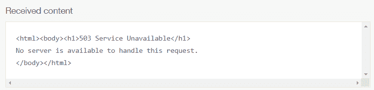

# 比较合成监控产品

> 原文：<https://levelup.gitconnected.com/comparing-synthetic-monitoring-products-d8ac033e7437>

展望 2021 年，合成监控在了解您的应用或网站的性能方面将一如既往地重要。**但是你的合成监听系统只能和你正在使用的工具一样好**而且有很多*产品可供选择*。因为选择最适合你的是至关重要的，选择可能是压倒性的。价格、安装简易性、精确度等因素在最佳解决方案中发挥着重要作用。

在本文中，我回顾了六种流行的综合监控选择:Updown.io、UptimeRobot、StatusCake、Site24x7、Pingdom 和 DataDog，并在现实环境中对它们进行了一些测量，以了解每种产品的性能。然后，我在 DigitalOcean 上建立了一个典型的示例部署，并对每个产品运行了五天的测试。最后，我收集了度量标准，并将它们相互比较，以确定哪个工具是最好的。

先说一点背景。

# 综合监控

[综合监控](https://en.wikipedia.org/wiki/Synthetic_monitoring)是模拟最终用户可能在你的网站或应用上做什么，然后监控该网站或应用的性能。这是衡量最终用户可用性的重要工具。当一个 bug 或回归攻击到你的活动站点时，阻止这种影响就太晚了。但是，这些工具可以帮助您快速解决问题并控制损失。

最常见的综合监控类型之一是使用外部托管的工具定期打开一个站点或 URL，并确定它是否正确加载以及需要多长时间做出响应。“适当地”可以在测试创建期间定义，数据的处理方式因产品而异，但通常包括一些功能，如故障截图、确定页面加载速度下降的瀑布延迟，甚至是完全合成的工作流，如作为用户登录并执行事务。

虽然可以通过本地化测试推出您自己的综合监控，但没有任何产品可以替代使用[最后一英里](https://en.wikipedia.org/wiki/Last_mile)监控来准确报告您的客户所看到的内容——并且来自公正的来源。这就是为什么 DevOps 团队倾向于依赖这些产品来帮助关联他们监控范围之外的问题，并在用户看到影响时进行验证，即使系统认为它们是健康的。

# 考虑

现在来看看我用来比较产品的考虑因素。您的产品和您的监控工具之间的关系有望存在很长一段时间。因此，第一次就把事情做好是很重要的，因为监控服务中的误判可能是客户成功和客户不信任的区别。因此，我们将使用六个关键要求来比较我们的服务，任何企业和团队在承诺成为您产品成功的合作伙伴之前都应该考虑这些要求:

1.  定价
2.  设置简易性
3.  准确(性)
4.  第 2 天可操作性
5.  通知渠道集成
6.  应用性能指标(APM)集成

让我们更详细地看一下每一项。

1.定价

与许多商业决策一样，我们首先考虑的是价格。没有理由使用一开始成本很低，但随着时间的推移会导致成本过高的服务。因此，我们将明确地查看每个站点每月的成本。

2.设置简易性

下一个最大的考虑因素是服务的监控、警报和管理涉及到多少工作。如果太难，你的团队可能甚至不会使用你最初付费的服务。不幸的是，在确定“难度”作为关键绩效指标时存在许多变量。这里，我们将根据找到创建、编辑和删除基本合成测试的选项的难度给出 1-5 分(5 分是最好的)。

3.准确(性)

如果不断发出警报，它们会滋生不信任感和自满或“警报疲劳”，通常会困扰操作人员和开发人员。如果一棵树在森林里倒下，每个人每 10 分钟就能听到一次，持续几天，真的有人在监控吗？对立面也是如此。如果没有警报响起，你的站点真的被监控过吗？这里有许多考虑因素，所以我会根据以下指标给它打 1-5 分(5 分是最好的):

*   从检测到故障到尝试升级的时间在 15 分钟之内
*   从故障警报升级到寻呼机工作发送文本消息的时间在 5 分钟之内
*   从失败注入到通知开发人员的时间在 20 分钟以内
*   24 小时内错误警报的百分比低于 1%
*   检测到的肯定故障的百分比超过 99%

4.第 2 天可操作性

实现和报告只是任何可观测性平台的第一步，但你的人类队友最关心的是如何容易地利用和解释结果。虽然这是一个更主观的分析，但它同样重要。这将取决于是否能够轻松直观地导航到某个警报，并确定失败的原因。

5.通知渠道集成(松弛、不一致、电子邮件、传呼机职责等)

用户应该能够在他们感觉最舒适的地方获得通知，不同类型的系统可能需要不同类型的警报严重性。周末给工程师打电话解决吉拉故障可能不重要，但当整个网站瘫痪时，让所有人尽快行动起来是非常重要的。我们将对懈怠、不和谐、电子邮件和页面责任整合进行特别加权，得分为 1-10(10 为最佳)。我在这里用 10 而不是 5 来更准确地说明可能的集成范围。

6.APM 集成

最后，我们将考虑事故分类的难度。也就是说，这些产品中的每一个都提供了回接到您的核心监控系统的选项，以实现更好的相关性和根本原因分析吗？

# 我们的测试

*APM 集成测试*

为了公平地测试每个监控服务，我在三个不同的数据中心(旧金山、纽约和伦敦)的 DigitalOcean 上为网站边缘组件构建了一个通用范例。我使用了 DigitalOcean 负载平衡器和 CloudFlare 地理路由边缘代理。每个测试都将针对这个设置运行，以确定站点可用性、状态代码和响应时间。服务本身是一个运行在 Debian 10 主机上的简单 Nginx 容器。

我们将通过在单个容器上部分关闭服务 20 分钟，然后在所有容器上完全关闭 30 分钟来注入故障。之后，我们将确定每个服务捕获故障和发出警报需要多长时间。代理将使用类似的配置进行设置。

通过关闭各种主机上的服务，我们可以模拟代码部署或应用程序故障，这足以将服务从 DigitalOcean 和 CloudFlare 中配置的负载平衡器中取出。基于我们的设计，我们应该对这样的错误具有极强的弹性，并且在我们的部署中非常敏捷。但是，作为经验丰富的管理员，我们知道即使是这种级别的分发和弹性也是有限的，我们的故障保护最后一英里监控会提醒我们注意关键的客户影响。

由于每个产品的试用帐户允许的时间有很大的不同，我们将通过将每个服务设置为 15 分钟阈值警报和多个故障，然后在适用的情况下发出警报，来创造公平的竞争环境。每个产品应该能够在我们部署期间检测到站点不再可达时通知我们。在理想情况下，我们的部分部署(尽管它们可能会导致一些延迟或容量减少)不应该影响任何客户，因此不应该发出停机警报。

# 比较

我们已经做好了准备，现在让我们部署产品，看看每个产品的性能如何。我将为每个产品提供一个汇总表，包括设置细节、指标/结果，然后是总体印象。最后，我会总结一下我对哪个产品最好的想法。

# 1.向上向下。超正析象管(Image Orthicon)

*   价格/月—0.07 美元
*   设置简易性— 5
*   精确度— 4
*   可操作性—失败
*   通知渠道— 6
*   APM 集成—否

一家相对较小的法国公司， [Updown](https://updown.io/) 的目标是提供一个价格低廉且用户友好的工具，具有简单、流畅的界面。

## 设置

设置非常简单:添加一个 URL 和一些设置，我就可以用一个漂亮的仪表盘来监控我的网站。由于选项的位置看不见、想不到，以及可用选项的数量有限，配置通知的分数受到了影响。为了配置 Pagerduty，我必须在工具本身提供的 SMS 通知选项中设置一个自定义的 webhook 或 trust。

## 衡量标准和结果

*向上向下度量和结果*

我配置的其他通知提供了问题的简明摘要，但是该工具不像列表中的其他工具那样提供任何返回原始警报的直接途径。此外，在手动浏览该网站并深入了解警报本身后，除了上面图像中提供的数据之外，我无法轻松缩放或收集更多数据。

**整体印象**

该工具专门用于通知问题。然而，除此之外，还严重依赖非附属的第三方工具。

也就是说，使用这种工具进行监控的成本非常低廉，而且进入门槛如此之低，如果您愿意找到合适的方法来设置像 Pagerduty 这样的双向升级方法，那么它仍然值得考虑。

# 2.UptimeRobot

*   价格/生产订单——2 美元
*   设置简易性— 5
*   准确度— 5
*   可操作性—失败
*   通知渠道— 10
*   APM 集成—否

凭借简单的监控、简单的设置和针对入门级显示器的自由层引导选项， [UptimeRobot](https://uptimerobot.com/) 是快速实施站点监控的低门槛选项。

## 设置

测试配置非常简单，但是，这是您在这个工具的主界面中真正能做的。很难找到升级点，因为它们嵌套在全局配置中。但他们确实提供了许多预设的设置选项，让我的通知设置变得轻而易举。

## 衡量标准和结果

*UptimeRobot 指标和结果*

升级非常迅速，没有任何误报。这两次停机都发生了，只有在后一次完全停机时才发出警报。不幸的是，深入研究 ale 产品发现 ert 本身有些模糊，因为我看不到故障发生在哪里。摘要仅显示了响应时间和时间戳的粗略图表。没有缩放功能，这意味着它只能作为*开始*调查的触发器，而不是深入调查的真正线索。

**总体印象**

安装非常简单，价格也非常合理。通过准确的升级，这涵盖了我在合成监视器中想要的所有东西的基线。不幸的是，由于缺乏理解故障本质的功能，这个工具最好用作实际工作的触发器，而不是烟枪的发现者。

# 3.StatusCake

*   价格/生产订单——2 美元
*   设置简易性— 4
*   精确度— 3
*   可操作性—通过
*   通知渠道— 10
*   APM 集成—否

[status take](https://www.statuscake.com/)是一款全面的监控解决方案，专门用于网络健康检查。由于免费层选项是最便宜的选项，它是一个很好的起点解决方案。

## 设置

StatusCake 对如何创建新的测试有清晰的说明。然而，由于其非常繁忙的界面，它失去了一些点。但是在最初的颜色冲击之后，导航窗格中的工作流变得简单易懂。警报集成为我需要的一切提供了许多通知选项。

## 衡量标准和结果

*状态记录指标和结果*

虽然仪表板本身的信息显示简洁，消息清晰，但我没有收到任何失败测试的警告。不清楚这是由于不正确的配置还是由于测试持续时间短(❤0 分钟)。但是没有一个触发器来引起我对这个警告的注意，这个工具没有太大的帮助。

## 总体印象

用户界面非常繁忙，配色方案令人分心。另一方面，对任务的关注和创建工作流的简易性使得导航选项变得简单易懂。事实上，它似乎很容易配置，这使得它有点失望，没有任何升级执行。

# 4.24x7 站点

*   价格/月——0.9 美元
*   设置简易性— 3
*   精确度— 4
*   可操作性—通过
*   通知渠道— 10
*   APM 集成—是

[Site24x7](https://www.site24x7.com/) 提供一套软件来监控从 Windows 服务器到 Cron 作业的一切。它标榜自己是一个一站式商店，为您的所有监测需求提供几个包容性的月度计划。

## 设置

最初，Site24x7 为我添加第一个显示器提供了一个非常容易遵循的工作流程，然而，此后的每次添加都需要一些先决知识。他们确实为第一次使用的用户提供了一些教程，但是，众多的选项可能会让人不知所措。

一旦我找到了第三方集成和网页速度(浏览器)工具集的一般流程，我就能够从大量精心策划和预先配置的通知选项中进行选择。

## 衡量标准和结果

*24x7 站点指标和结果*

该工具检测到部署的部分中断，表现为页面加载时间和各个地区的 500 的大峰值。

这很好地平衡了对警报的敏感度，因为我能够根据情况看到不同的行为。在收集了本周的剩余指标后，我没有发现任何其他问题。

## 总体印象

Site24x7 在功能上有点过于拥挤，导致它在工作流方法上显得固执己见。然而，由于其过多的定制，它是一个强大的功能丰富的工具。

该产品在准确性上有所下降。虽然这两个事件都被标记为“警报”，但我没有收到任何 Pagerduty 升级，这导致了故障诊断的延迟。警报中的 RCA 提供了故障的清晰截图，并为开始调查提供了良好的指导。有了用于集成应用程序监控的额外工具集，这将是您武器库中的一个强大工具。

# 5.Pingdom

*   价格/mo—1 美元(或随着规模的扩大而降低)
*   设置简易性— 5
*   精确度— 4
*   可操作性—通过
*   通知渠道— 10
*   APM 集成—是

[Pingdom](https://www.pingdom.com/) 是网络安全管理软件产品家族中的知名产品，专门从事合成监控和用户工作流测试。它已经存在了很长时间(大约 15 年)，是为了简单和切中要点而构建的。Pingdom 内置了针对 APM 的网络安全管理软件产品应用程序集成和与大多数平台相关的广泛的 webhook 功能，提供了多种集成选项。

## 设置

设置非常简单。只需点击几下，填写一个简单的 web 表单，我就可以看到我的测试和我想要配置的所有网站的概要视图。通过选择侧边栏中的“Integrations ”,我可以设置上报方法，并通过 webhook 界面配置 Pagerduty、Slack 和 Discord。

## 衡量标准和结果

*Pingdom 指标和结果*

Pingdom 捕捉到了一次长时间的中断，但是没有捕捉到在此之前不久触发的部分中断。这可能是因为在我的模拟部署期间，一些地区报告正常，而其他地区则不正常。

*乒坛报道*

## 总体印象

我过去使用过 Pingdom，它们变得越来越好，越来越可靠。专注于 web 监控，没有额外的混乱，流程易于理解，产品的整体易用性很高。然而，我将 Pingdom 的准确度评为 4 级，因为在我的默认设置下，我没有收到任何触发的页面责任警报。我确实通过 Slack 和 Discord 收到了快速和相关的通知，并提供了易于跟踪的根本原因分析，以了解问题所在。因为 Pingdom 提供了全权委托的 webhook 集成模式，所以集成(定制的和基于服务的)几乎是无穷无尽的。

通过深入研究警报，我能够清楚地了解监视器在哪里发出警报，让我直接了解问题可能出在哪里，并让我了解故障的性质和影响。

网络安全管理软件产品产品家族中也有许多集成，有望通过根本原因分析管道帮助我更快地找到原因。

# 6.数据狗

*   价格/月—5 美元
*   设置简易性— 2
*   准确度— 5
*   可操作性—通过
*   通知渠道— 10
*   APM 集成—是

[DataDog](https://www.datadoghq.com/) 是这个列表中比较知名的产品之一，已经存在了大约 10 年(在撰写本文时)。这是一个包罗万象的选项，具有强大的基础架构和许多配置和定制选项。有了这样的曲目，他们的座右铭“查看任何堆栈、任何应用程序、任何规模、任何地方”绝对符合要求。

## 设置

这个产品是迄今为止最复杂的设置。它设计有大量的选项和产品。就其预装集成、监控选项、分析和仪表板而言，其高昂的价格带来了巨大的可配置性。我在设置通知渠道时遇到的唯一障碍是在所有选项中寻找我想要使用的集成。

## 衡量标准和结果

*数据狗指标和结果*

凭借高昂的价格，DataDog 提供了您所期望的数据完整性和报告粒度。DataDog 迅速通知了我的所有沟通渠道，通过在所有渠道提供易于跟踪的链接，提供了关于谁、什么和哪里发生了影响的明确信号。

## 总体印象

测试设置需要深入研究几个产品，然后才能找到正确的上下文(在“UX 监控”下，而不是“产品”窗格中的“监视器”下)。很明显，DataDog 目录中的广泛产品可以集成和微调，不仅可以推动分类，还可以通过代码部署终止开关和 API 触发的工作流等功能实现自动化缓解。

也难怪 DataDog 是一个如此受业内欢迎的品牌。但是，如果不仔细考虑，其成本会很快超出预算。

# 最终结果

每种服务都有优点和缺点，但根据我们的数据，我们可以得出一些结论，并推荐其中的三种产品:

尽管在事件的分类和诊断方面有所欠缺，**向上向下。IO** 是最经济实惠的基本通知选项。作为简单架构或非关键应用的补充服务，这是一个极好的选择**。**

**UptimeRobot** 有一个简单的工作流程，带有易于理解的升级挂钩，用于发出警报。如果你正在寻找一款**能让你在应用生命周期的早期**就投入使用的产品，这可能是一个可靠的、价格合理的选择。但是，随着您进入生产场景，您可能需要与其他开源分析工具合作来跟踪应用程序行为的细节。

**Pingdom** 脱颖而出成为**在成本和功能上的最佳平衡**；创建和维护警报很容易，其 webhooks 无处不在的特性允许轻松的升级集成。再加上与网络安全管理软件产品 APM 套件其余部分的集成，它们与 DataDog 的产品不相上下，但成本更低。

值得注意的是，我能够在每家公司各自的试用期内免费建立这个基础设施并进行测试。所有联系我的销售团队都很有帮助，但没有过度侵犯，这在我们的行业中是一种罕见而令人愉快的特质。从这个实验中，我可以推荐的一个关键要点是，亲自尝试所有这些方法，看看哪种方法最适合您独特的使用情形。