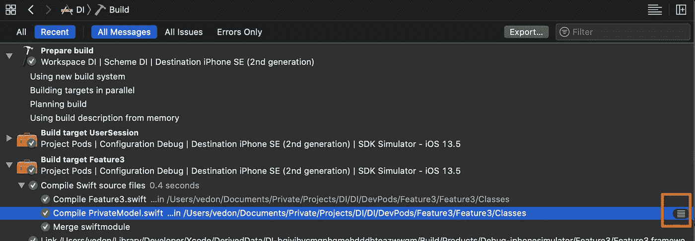
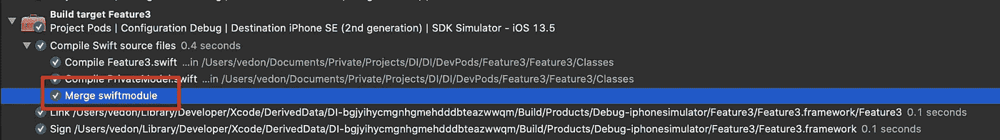
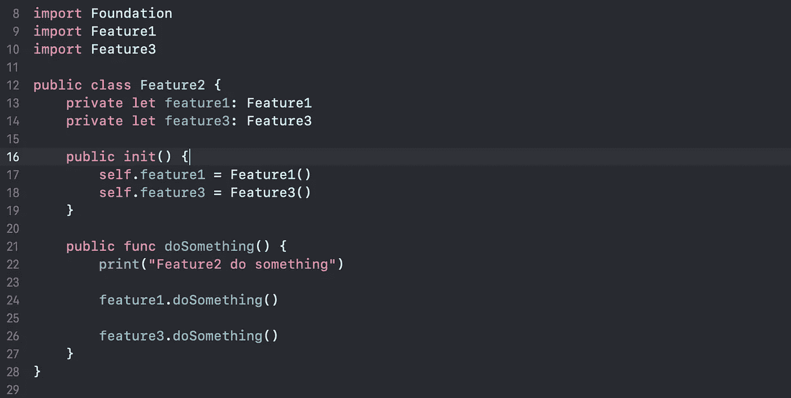

# 混合 Objective-C 和 Swift 的编译时间

> 原文：<https://levelup.gitconnected.com/compilation-time-that-mixing-objective-c-with-swift-d5adab04c5d>

我之前的[文章](/dependency-injection-in-swift-bc16d66b038b)描述了如何在一个纯粹的 Swift 项目中使用阿迪模式来减少编译时间并使您的代码松散耦合。今天我们就来深挖一下 build 系统是如何决定哪些文件应该重新编译，找出减少编译时间的最佳方法在混合 Objective-C 和 Swift 的时候，你的体验和我的不一样，但是一些有用的小技巧可能对你有用。如果我做错了什么，请纠正我。

# 摘要

```
**1\. The Context Of Swift Compiler
**  1.1\. Swift Driver, Frontend jobs
  1.2\. Demo profiling of dependency analysis2\. Compilation time
  2.1\. The bad cases of compilation time
  2.2\. The ways to fix compilation time issue
```

# Swift 编译器的背景

我只挑选 Swift 编译器的相关上下文作为您阅读本文之前的基本必备知识。

## [Swift 驱动](https://github.com/apple/swift-driver)，前端作业

Swift 的编译器驱动程序是一个协调将 Swift 源代码编译成各种编译结果的程序:可执行文件、库、目标文件、Swift 模块和接口等。*驱动程序*是当你调用`swift`或`swiftc`时运行的程序。这实际上本身并没有编译任何东西；相反，它调用其他工具来产生期望的输出。例如 ***前端。***

*前端*是实际编译代码的程序(在解释器模式下，通过 JIT 执行代码)`.`Xcode 构建系统在你点击 command+B 后会做很多工作，你可以在 Xcode 报告导航器(Command + 9)上查看。第一个命令是`**swift -frontend.**`


正常的 Swift 编译从与输入文件一样多的*前端作业*开始。Swift 前端的每次调用都会解析模块中的每个文件，但也会有一个特定文件被标记为*主文件。*一个作业只负责编译它的主文件，并且只做编译该文件所需的工作，对模块中其他文件的声明进行惰性类型检查。例如，下面的图片描述了由编译 Feature3.swift 和 PrivateModel.swift 组成的前端作业。


这两个文件也被视为主要文件。(**swift-frontend-c-primary-file feature 3 . swift**)前端作业发出诊断、目标文件、依赖信息和*部分模块文件。*构建系统负责生成 Feature3-OutputFileMap.json 文件指定的这些文件，这些文件放置在**/Users/vedon/Library/Developer/Xcode/derived data/DI-bgjyihycmgnhgmehddbteazwwqm/Build/intermediates . no index/pods . Build/Debug-iphone simulator/feature 3 . Build/Objects-normal/x86 _ 64**文件夹中。


功能 3-输出文件映射

特殊的`""`条目用于应用于整个构建的输出。下图是 Feature3-master.swiftdeps 的内容。


功能 3-master.swiftdeps

我们可以查看 PrivateModule.swift 的 Xcode build 命令，看看 Xcode 是如何生成这些文件的。



移除不必要的构建信息

这些文件位于路径/Library/Developer/Xcode/derived data/DI-bgjyihycmgnhgmehddbteazwwqm/Build/intermediates . no index/pods . Build/Debug-iphone simulator/feature 3 . Build/Objects-normal/x86 _ 64


我找到了一些文件扩展名的解释。

## *.d

按照命令(emit-dependencies-path)的意思记录源文件的依赖文件路径。


## *.swiftdeps

Swift 编译器使用扩展名为"的文件。swiftdeps”在单个模块中存储关于跨文件依赖关系的信息。这些文件在编译开始时被读入，以计算依赖图，并随着编译的进行而更新(和重新读取)。但是，因为这些文件在每次构建时都会更新，所以依赖关系分析的问题很难重现——输入已经丢失。

## *.swift 模块

Swift 没有头文件；相反，它使用一种生成的二进制格式，称为 *Swift 模块文件，相当于头文件*。前端为项目中的每个源文件生成一个“部分”模块，就像为每个源文件生成一个. o 文件一样。对于 N 个前端作业，有必要将所有部分模块文件缝合在一起。这项工作也由前端在一个称为“模块合并”的步骤中执行。模块合并只会生成一个合并的模块文件(以及带有扩展名的文档文件)。swiftdoc)，然后可以在以后的构建中导入它。



## ***。swiftsoureinfo**

我找不到这个文件的规范声明，但我认为这个文件用来记录编译文件信息，除了标记为 private。文件内容可能包括文件的修改时间、文件路径、Swift 编译器版本等。

如果您在已编译文件的类中添加一些新的空行，您的 swiftsourceinfo 数据存储在 CodeResource 文件(*。framework/_ code signature/code resource)将被更改。


代码资源

## 依赖性分析的演示分析

我的[演示](https://github.com/vedon/DI)的依赖图如下所示。feature2 有 Feature3 的一些依赖项，因此由于这些依赖项的修改，一些文件将被重新编译。但是 Xcode 是如何决定哪些文件应该重新编译的呢？


[https://level up . git connected . com/dependency-injection-in-swift-BC 16d 66 b 038 b](/dependency-injection-in-swift-bc16d66b038b)

Swift 的模块内依赖性分析基于“提供”/“依赖”系统，该系统最终试图证明哪些文件不需要重建。如上所述，文件扩展名为。存储跨文件依赖关系。让我们看看 Feature2.swiftdeps 和 Feature2.swift 的源代码。



如果你没有读过[依赖分析](https://github.com/apple/swift/blob/master/docs/DependencyAnalysis.md)，我强烈推荐你读一读。到目前为止，我只关注**外部依赖**，它们是使用一个特殊的`depends-external`集合来跟踪的。这些依赖关系引用模块外部的文件。Swift 驱动程序专门解释这个集合，并决定跨模块的依赖性是否已经改变。出于好奇，我修改了内容，在/opengles . framework/Headers/opengles . API notes 文件中添加了空行，这将导致整个项目重新构建。为什么？


我检查了我所有的 swiftdeps 文件，发现它们都依赖于 OpenGLES.apinotes，最后要提到的是 interface-hash 注释，顾名思义，就是为 Feature2.swift 文件生成的哈希值。根据我的分析，如果您添加新属性、新函数、添加扩展或修改现有的方法签名等，哈希值将会改变，但不包括修改函数体。


每个文件都有一个它“提供”什么和“依赖”什么的列表，当一个文件被触动时，每个“依赖”第一个文件“提供”什么的文件都需要重建。从演示的角度来看，Feature2 依赖于 Feature3 提供的，所以如果 Feature3 提供了更改，Feature2 将重新构建，也就是说，接口散列被更改了。

## 结论

添加属性、函数、扩展或修改现有方法签名所有会改变接口哈希值的内容都将导致相应的 swift 模块文件改变，依赖于此修改模块的模块将重新构建。

# 编译时间


## 编译时间的坏例子

我想把编译时间的糟糕情况分成两种类型，跨模块(粗粒度)和模块内(细粒度)。

## **跨模块**

模块 A 依赖于模块 B，如果模块 B 指定的接口之一发生变化，模块 A 将重建所有文件。


上面的图片显示了两个模块之间的编译信息。你可能会说，将 B.swift 标记为 private will 会破坏编译链。对不起，它不起作用。私有的 B.swift 文件仍然被视为由[输出文件映射](https://github.com/apple/swift/blob/master/docs/Driver.md)指定的前端作业之一。您也可以打开相应的*-master.swiftdeps 文件以获得更多详细信息。例如构建时间。


如果你有很多模块，并且没有很好地处理它们之间的依赖关系，那么在你修改了一行代码之后，你会毁了你的一天。

## 模块内

如果文件的引用接口被更改，文件将被重新编译。


*   如果 B.swift 或 C.swift 接口被更改，A.swift 将被重新编译。
*   如果 E.swift 接口被更改或影响 E.swift 接口的 C.swift 接口被更改，D.swift 将被重新编译。

如果您有许多 swift 文件依赖于 C.swift 文件，并且 C.swift 文件经常被修改，那么在您修改 C.swift 文件上的一行代码后，您将毁了您的一天。所以，你应该注意像 Util.swift 这样的东西，它允许你在里面放任何东西。

更多信息，请访问[级联与非级联依赖关系](https://github.com/apple/swift/blob/master/docs/DependencyAnalysis.md)。

## 解决编译时间问题的方法

如果编译时间问题发生在跨模块中，我使用的解决方法是使用依赖注入和 DIP 设计模式。更多信息请访问我的[以前的文章](/dependency-injection-in-swift-bc16d66b038b)。如果编译时间问题发生在模块内，问题会变得复杂。我对纯 Swift 模块有一些建议。

*   遵循[界面分离原则](https://en.wikipedia.org/wiki/Interface_segregation_principle)。不要把所有东西都放在一个 swift 文件中。例如 Util.swift
*   你的源文件的接口应该设计成通用的，以减少接口的数量并保持稳定性。

许多模块将 Objective-C 与 Swift 混合使用。苹果公司的建议如下。


Swift 调用 Objective-C 使用桥接头和 Objective-C 调用 Swift 使用生成头是减少编译时间的关键。通过 Objective-C 私有所有不需要的东西，以减少通过生成的头文件暴露的接口。


私有所有不需要的东西。您可以添加一些像 MyViewController+internal.h 这样的私有头来隐藏其他类不使用的 MyNetworkManager 属性。


感谢阅读，任何建议都会有帮助。

# 参考

[Swift 编译器](https://swift.org/swift-compiler/#compiler-architecture)

[Xcode 中的 WWDC 2018 建设更快](https://developer.apple.com/videos/play/wwdc2018/408/)

[加速 Xcode 编译时间的高级技术](https://bytes.swiggy.com/advanced-techniques-to-speed-up-the-compile-time-in-xcode-27819cb3be59)