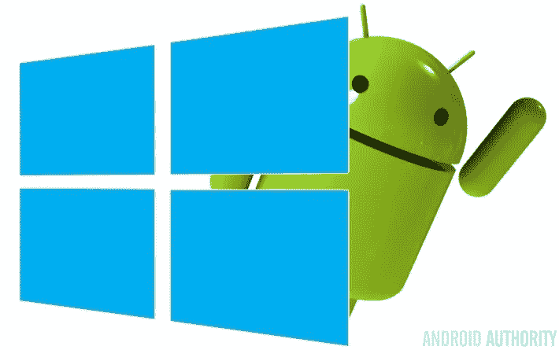

# 使用微软应用中心编译 React 原生应用

> 原文：<https://levelup.gitconnected.com/compile-react-native-with-expokit-easily-46e9e94abb97>

## 让我向您展示如何使用微软应用中心轻松构建 React 原生应用。你基本上可以忘记 Android Studio 和 XCode。

特雷弗·克里夫兰在 [Unsplash](https://unsplash.com/?utm_source=unsplash&utm_medium=referral&utm_content=creditCopyText) 上的照片

*TL；DR:*[*微软应用中心*](https://appcenter.ms/) *在云中提供构建服务器，并允许轻松分发和测试运行(在真实设备上)。对于 Expo 用户来说，这是我发现的最好的方式来构建一个独立的应用程序，同时仍然保留添加自定义本机代码的能力。*

这是我上一篇文章的延续，在那篇文章中我描述了[世博平台](https://expo.io/)的基本功能。Expo 可以解决移动开发中面临的许多初始问题，但当您的应用程序需要不常见的功能时，它不是终极武器。但是要注意的是，作为一名 JavaScript 开发人员，分离可能会给你带来巨大的麻烦。

*更新:如果你觉得和 ExpoKit 的战斗要失败了，你可以* [*彻底抛弃它*](https://medium.com/@DanielKrejci/how-i-ditched-expo-for-pure-react-native-fc0375361307) *。*

# 什么是 ExpoKit，为什么需要它？

Expo SDK 包含一个名为 ExpoKit 的运行时，它能够从 Expo 服务器下载 JS 包并为用户运行。在正常情况下，ExpoKit 内置于 Expo 应用程序中，将在项目的开发、筹备和测试阶段使用。

现在，假设您已经习惯了 Expo 本身，并且喜欢它能够轻松发布您的代码并与其他人共享的能力。构建独立的应用程序已经变得轻而易举。然而，在某个时候，你决定给你的应用添加一个 Expo SDK 和 React Native 都没有覆盖的新特性。现在该怎么办？

在这种情况下，您需要将 [**拆下来，以 ExpoKit**](https://docs.expo.io/versions/latest/guides/detach.html#1-install-exp) 。换句话说，这意味着您仍然可以使用 ExpoKit 的功能来下载和提供 JS 包，但是您也可以修改应用程序的本机代码。ExpoKit 将成为您的本地应用程序的另一部分。

明显的缺点是，从现在开始，你必须自己构建应用程序的原生部分。Expo build 服务器无法处理自定义本机代码。这意味着回到 Android Studio / XCode，对吗？不完全是。:)

分离到 ExpoKit 是一个简单的自动化过程。你可能不会在 MacOS 上遇到任何问题。对于 Windows 和 Linux 的人来说，肯定有一个很大的障碍。**没有 Mac 电脑你无法启动 iOS 项目**。详细原因我不清楚，姑且说:是苹果。

最简单的解决方案可能是请一些有 Mac 的朋友帮你做，或者尝试在云端租一台 Mac 机。好的一面是，你只需要这样做一次。仅仅因为这个原因而购买 Mac 很可能是矫枉过正。

# 微软应用中心提升了一些重量

一开始我也不相信它:微软怎么能解决像为 Android 和 iOS 开发移动应用这样的事情呢？和往常一样，对于 iOS 来说，路径并不完全明显，你也无法避免为开发者许可付费。宣传够了，让我们深入探讨我在使用这个平台时遇到的各种问题。

[微软应用中心](https://appcenter.ms/) (AC 从现在开始)非常容易设置:

*   创建一个帐户。
*   添加一个 app ( *每个平台单独*)。
*   将其连接到某个源代码控件( *GitHub，BitBucket…* )。
*   配置 build ( *缺省工作正常*)。

每次你把代码放入链接的存储库，它都会为你创建一个版本，并在准备好的时候通知你。每个存储库分支也可以有不同的配置。这有点类似于用 Expo 构建独立的应用程序，但是你有更细粒度的控制，你还可以看到整个过程的完整日志。这不是很棒吗？

*官方入门指南会告诉你在你的项目中加入额外的模块(如移动中心崩溃)。请注意，这些不是强制性的。只有当您想要开始使用平台提供的扩展服务时，才添加它们。我建议先尝试一个简单、基本的构建。*

# Android 路径充满了陷阱

既然我是一个 Windows + Android 的家伙，自然我先走了这条路。

## 问题#1 …打开罐子

我遇到的第一个问题是一个错误消息:*无法找到或加载主类 org . grad le . wrapper . gradlewrappermain .*

*一些人在屏幕上搜索和尖叫(这没有帮助)，几个小时后…*

问题是 Git 全局忽略了*。默认的 jar 文件(废话！).解决方法很简单。编辑*。gitignore 项目根目录下的*文件(不是 android 文件夹)并添加**！*.罐子**。如果愿意，您可以更明确，但是要记住。 *expo-source* 文件夹也包含必要的罐子。

***提示*** *:要列出 Git 当前忽略的文件(也列出 node _ modules)使用命令:* **Git ls-files-others-ignored-exclude-standard-directory***。*

## 问题#2 …去掉连字符

这不完全是软件本身的问题，但值得一提，因为我花了一些时间才弄明白。您在 *app.json* 文件中指定的[包名](https://docs.expo.io/versions/latest/guides/configuration.html#package)不能有任何连字符。它会在构建过程中产生一些非常奇怪的错误。当你用 Expo 构建独立的应用程序时，你甚至会被它烧伤。确保在分离之前有一个正确的名称**，因为该名称会被复制到生成的其他几个文件中。这可能也适用于 iOS，但我没有测试过。**

## 问题#3 …需要全球包装

这是最糟糕的一次。您将得到一个神秘的错误，如，*启动进程“命令”时出现问题。/.Expo-source/Android/detach-scripts/prepare-detached-build . sh*。

查看引用的文件，您会看到两行代码实际上只是执行命令*exp prepare-detached-build*。如果您尝试在本地运行它，您会看到它只是将一个开发 URL 写入一个 java 文件，而且运行得很好。

过了一会儿，我才意识到 exp 实际上并没有安装在 AC 中。我试图使用自定义脚本安装它，希望它能解决问题…长话短说，它没有。至少目前没有。

*我正在与支持团队沟通此事，以防他们能提供帮助，如果有解决方案，我会在这里添加更新。*

经过一个不眠之夜(不是真正的不眠之夜)，我突然想到。为什么我需要一个开发 URL 来构建我的应用程序的发布版本？所以我目前的解决方案是将整个构建步骤从***Android/app/build . gradle***文件中移除。我甚至认为这不应该在那样的 CI 环境中执行。

## 问题 4 …在这里签名

在这些问题被解决后，AC 制作了我可以轻松下载的 APK 文件。我急忙试图把它安装到我真正的手机上，看看我的劳动成果。哦不！即使启用了开发人员模式，也不可能安装未正确签名的 APK。叹息…

*要轻松地将 APK 安装到您连接的手机(或模拟器)上，您只需运行* **adb 安装路径/to/build.apk** 。

幸运的是，空调也使这一部分变得更容易。您唯一需要做的就是生成一个**密钥库**文件，并将其上传到 AC 中的配置对话框。

要生成密钥库文件，您可以使用 [Android Studio](https://developer.android.com/studio/publish/app-signing.html#generate-key) 或命令行实用程序 **keytool** 。对于 Windows 用户，这是与 JDK 一起安装的。Mac 用户可以开箱即用。您可以找到描述如何生成密钥库文件的[各种](https://stackoverflow.com/questions/3997748/how-can-i-create-a-keystore) [来源](https://coderwall.com/p/r09hoq/android-generate-release-debug-keystores)。

*给我们 Windows 同志一个小提示:用* [*巧克力*](https://chocolatey.org/) *安装你的软件。简单多了。没有谷歌，没有点击接受，没有下载…只是* **choco 安装 jdk8 AndroidStudio**

## 问题#5 …用 Expokit 开发

其他一切都很顺利。我的应用程序在我的设备上运行，并从 Expo 服务器下载 JS 包。发布新版本的 JS 如预期的那样更新了应用程序。

显然，这不是一个非常有效的发布方式，每次你想检查代码是否工作。这个简单的解决方案在 [expo 文档](https://docs.expo.io/versions/v20.0.0/guides/expokit.html#1-check-js-dependencies)中有描述，它本质上解释了每次你想开发你的应用时，你应该让 Android Studio 运行并构建本地代码。考虑到我的构建现在是由 AC 创建的，我为什么要用另一个工具呢？

exp 实用程序生成的开发 URL 不起作用，至少对我来说是这样。我必须在本地运行 *exp start* ，然后将提供的 URL 复制到一个 Java 文件中，将其推送到 AC，并获得一个调试版本。之后，我可以在我的设备上安装创建的 apk，它工作得很好。URL 不会随着时间的推移而改变，所以在您需要以其他方式改变本机代码之前，您不需要担心这个问题。

# iOS 路径有点曲折

如前所述，第一个障碍当然是启动 iOS 项目。幸运的是，我找到了一个能帮我做这件事的朋友。

## 问题#1 …没有索引文件

考虑到 Android 不需要索引文件，这是一个有点奇怪的问题。对于 iOS build，需要在项目的根目录下创建 *index.ios.js* 文件，这个文件正好可以导出原来来自 Expo 的 App.js。

## 问题#2 …又是开发 URL

这也是我在 Android 版本中遇到的问题。AC 环境无法访问 *exp* 实用程序，所以我使用了与 Android 相同的解决方案。只需在 *ios/ < name >中找到“筹办世博会”。xcodeproj/project.pbxproj* 并移除(注释掉)整行。或许在 XCode 中可以做到这一点，但我无法验证:)

## 问题#3 …付款并签名

此时，我已经成功地完成了一个构建，然而，在下载和检查结果后，我惊讶地发现一些奇怪的 xcarchive 文件，而不是预期的 IPA 文件。类似地，由于您需要一个 Apple 开发者帐户来构建 Expo 独立应用程序，因此您也需要一个帐户来获得可用于签署构建的证书。在那之前，你甚至不能在自己的设备上安装应用程序。我爱苹果…

*我目前不太需要这个，所以我尽可能推迟向苹果付款。让我知道在评论中，如果你能够推动它通过成功。*

# 自定义原生代码呢？

最后，我们得到了我做这一切的主要原因。老实说，对于像我这样的 JavaScript 人来说，这简直是一场噩梦。我确实设法包含了一个用于后台地理定位的库(*这是我在 Android 平台上分离*的主要原因(*在经历了许多痛苦的时刻*)。对于 iOS，这是我目前正在输掉的战斗。AC 由于一个非常奇怪的错误而失败，我找不到任何人可以帮我解决这个问题。我想我缺少 XCode，我可以用它来调试问题，这可能是主要的障碍。

**列出 Android 依赖关系**(解决版本问题)*CD Android&&grad Lew app:依赖关系*

# 结论

当然，也有我想放弃的时候。现在我很高兴它成功了，至少对 Android 来说是这样，而且我可以继续随心所欲地开发应用程序，而不用在本地编译程序。希望开发团队能在可预见的将来改进错误报告。

## 应用中心可以做得更多

令人惊讶的是，它不仅仅是一个建筑工具。您还可以使用它来:

*   作为构建的一部分运行你的单元测试，或者甚至让你的应用在真实的设备上进行测试以避免最初的崩溃。请注意，这将为整个构建增加大约 10 分钟的时间。
*   为发布您刚刚构建的版本设置各种规则，并让不同的人员/测试人员组收到关于它的电子邮件。
*   使用模块构建您的应用程序，将崩溃报告直接发送到 AC 控制台。还有一个分析模块。我也没有测试过，但它可能会比仅仅用 Sentry 进行 JS 报告要好。
*   将其用作推送通知的处理程序。这也可以由 Expo 来处理，所以没有什么太令人兴奋的，但知道有一个替代的解决方案是很好的。
*   将它用于 CodePush，如果您出于某种原因厌倦了 ExpoKit，这可以是一种替代方法。

感谢世博，感谢微软。:)