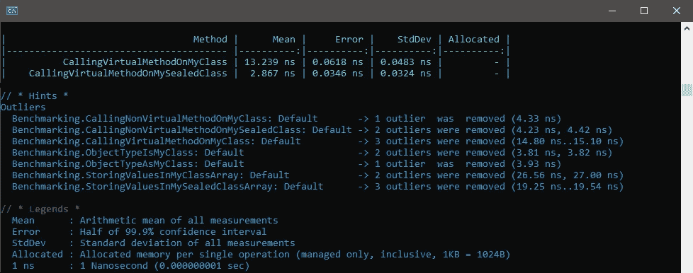
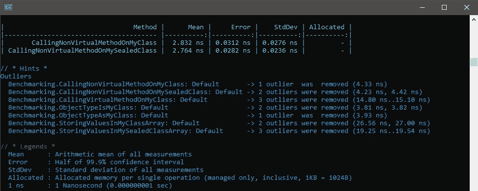
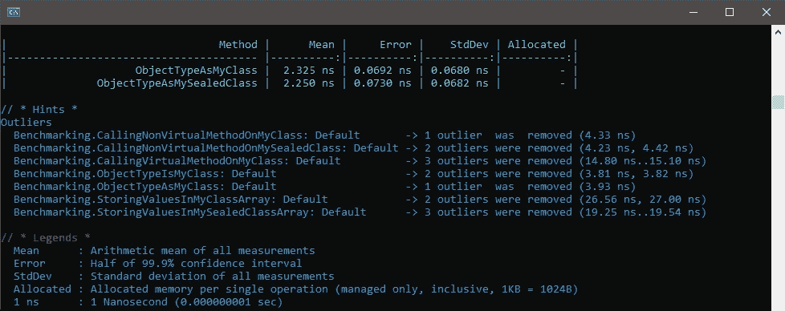
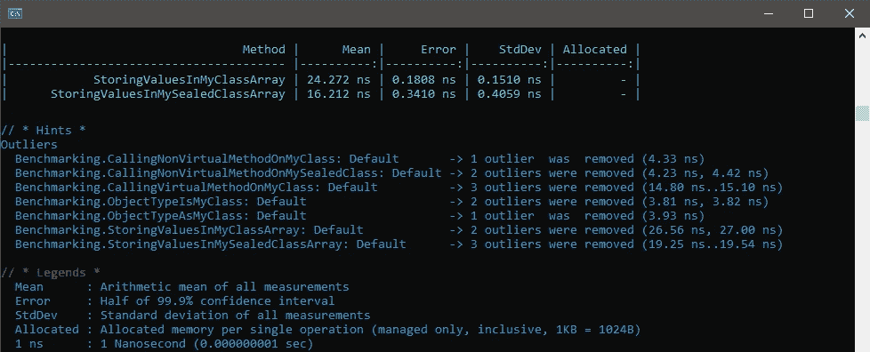

# 编译器友好代码:在。NET C#

> 原文：<https://levelup.gitconnected.com/compiler-friendly-code-sealed-keyword-in-net-c-b363fbcd1e35>

## 最佳实践

## Why & When Sealed 关键字可以提高。NET C#


**编译器友好代码:在。NET C#** 。图片由[艾哈迈德·塔里克](https://medium.com/@eng_ahmed.tarek)拍摄

编写编译器友好的代码意味着什么？

任何。NET 代码经过一个以上的阶段，直到最后到达机器码。由于在这个过程中涉及到许多因素，当我们第一次编写代码时，可能会错过许多细节。

然而，我们写的代码越清晰和确定，编译器就越能帮助我们并生成优化的机器码。

在本文中，我们将讨论一个帮助编译器优化代码的例子。这种方式是；使用**密封关键字**。

说够了，让我们来看一个例子…

[](https://medium.com/subscribe/@eng_ahmed.tarek) [## 🔥订阅艾哈迈德的时事通讯🔥

### 订阅艾哈迈德的时事通讯📰直接获得最佳实践、教程、提示、技巧和许多其他很酷的东西…

medium.com](https://medium.com/subscribe/@eng_ahmed.tarek) 

# 背景调查

如果您是. NET 开发人员，甚至是初学者，您现在应该知道在。名为`sealed`的. NET 框架。

这个关键字可以用在**类定义**中，这意味着该类不能被任何其他类继承。看起来是这样的:

```
public sealed class MyClass {}
```

或者甚至在**方法声明**中，这意味着该方法不能被子类中的任何其他方法覆盖。换句话说，它在使用它的级别打破了方法重写系列。看起来是这样的:

```
public sealed override void MyMethod() {}
```

因此，我们由此可以理解的是，当我们使用`sealed`关键字时，我们实际上是在向编译器承诺，我们没有任何继承一个类或重写一个方法的意图。

说到这里，现在让我们看看这对编译器有什么意义。


**基本代码**。图片由 [Ahmed Tarek](https://medium.com/@eng_ahmed.tarek) 提供

让我们从整个解释中使用的一些基本代码开始。

## 基类

```
public class BaseClass
{
    public virtual void DoSomething()
    {
    }

    public void DoSomethingElse()
    {
    }
}
```

这是我们将用作顶级父类的基类。

在这个类中，我们定义了以下成员:

*   `public virtual void DoSomething()`法。
*   `public void DoSomethingElse()`方法。

## 我的班级

```
public class MyClass : BaseClass
{
    public override void DoSomething()
    {
    }
}
```

这是从`BaseClass`继承的类，但是在定义中没有使用`sealed`关键字。

在这个类中，我们覆盖了从父类`BaseClass`继承的`DoSomething`方法。

## MySealedClass

```
public sealed class MySealedClass : BaseClass
{
    public override void DoSomething()
    {
    }
}
```

这是从`BaseClass`继承的类，但是这次我们在定义中使用了`sealed`关键字。

在这个类中，我们覆盖了从父类`BaseClass`继承的`DoSomething`方法。

现在，让我们来看看使用`MyClass`和`MySealedClass`类之间是否有任何不同——从编译器的角度来看。


**调用虚拟方法**。图片由[艾哈迈德·塔里克](https://medium.com/@eng_ahmed.tarek)拍摄

## 调用虚拟方法

从编译器的角度来看，为了验证在`MyClass`和`MySealedClass`类上调用虚拟方法的**之间是否有任何不同，我们将创建一个**基准**项目。**

```
[MemoryDiagnoser(false)]
public class Benchmarking
{
    private readonly int NumberOfTrials = 10;
    private MyClass _myClassObject = new MyClass();
    private MySealedClass _mySealedClassObject = new MySealedClass();

    [Benchmark]
    public void CallingVirtualMethodOnMyClass()
    {
        for (var i = 0; i < NumberOfTrials; i++)
        {
            _myClassObject.DoSomething();
        }
    }

    [Benchmark]
    public void CallingVirtualMethodOnMySealedClass()
    {
        for (var i = 0; i < NumberOfTrials; i++)
        {
            _mySealedClassObject.DoSomething();
        }
    }
}
```

现在，运行这个**基准**项目，我们会得到以下结果。



**调用虚拟方法结果**。图片由[艾哈迈德·塔里克](https://medium.com/@eng_ahmed.tarek)拍摄

正如我们在这里可以注意到的，在密封类上调用虚方法的性能要比在非密封类上调用它好得多。

但是为什么呢？！！！让我告诉你。

**非密封类上**

在调用从`MyClass`类创建的对象上的虚拟方法时，此时编译器不知道是否有一些代码用`MyClass`类的子类的新实例重新初始化了`_myClassObject`对象。这个假设是有效的，因为`MyClass`类不是密封的，这意味着它可以被继承。

基于这样的假设，编译器不能在编译时决定`DoSomething`方法的实际实现是由`MyClass`类还是它的任何其他子类提供的。

因此，编译器将编写一些指令——在运行时执行——在执行`DoSomething`方法时检查哪个实现是正确的。**这肯定会花费更多的处理和时间**。

注意:正如你注意到的，编译器会怀疑某些代码可能会重新初始化对象。您可能认为将字段标记为`readonly`会解决问题，但实际上不会，因为对象仍然可以在构造函数中重新初始化。

**在密封类上**

在调用从`MySealedClass`类创建的对象上的虚拟方法时，编译器不知道是否有一些代码用新的实例重新初始化了`_mySealedClassObject`对象。然而，编译器确信，即使发生了这种情况，实例仍然是`MySealedClass`类，因为它是`sealed`，这意味着它永远不会有任何子类。

基于此，编译器将在编译时决定`DoSomething`方法的实际实现。**这肯定比等待运行时间**要快得多。


**调用非虚拟方法**。图片由[艾哈迈德·塔里克](https://medium.com/@eng_ahmed.tarek)拍摄

## 调用非虚拟方法

从编译器的角度来看，为了验证在`MyClass`和`MySealedClass`类上调用非虚方法是否有任何不同，我们将创建一个**基准**项目。

```
[MemoryDiagnoser(false)]
public class Benchmarking
{
    private readonly int NumberOfTrials = 10;
    private BaseClass _baseClassObject = new BaseClass();
    private MyClass _myClassObject = new MyClass();
    private MySealedClass _mySealedClassObject = new MySealedClass();
    private MyClass[] _myClassObjectsArray = new MyClass[1];
    private MySealedClass[] _mySealedClassObjectsArray = new MySealedClass[1];

    [Benchmark]
    public void CallingNonVirtualMethodOnMyClass()
    {
        for (var i = 0; i < NumberOfTrials; i++)
        {
            _myClassObject.DoSomethingElse();
        }
    }

    [Benchmark]
    public void CallingNonVirtualMethodOnMySealedClass()
    {
        for (var i = 0; i < NumberOfTrials; i++)
        {
            _mySealedClassObject.DoSomethingElse();
        }
    }
}
```

现在，运行这个**基准**项目，我们会得到下面的结果。



**调用非虚方法结果**。图片由[艾哈迈德·塔里克](https://medium.com/@eng_ahmed.tarek)拍摄

正如我们在这里可以注意到的，在密封类上调用非虚方法的性能比在非密封类上调用要好。

然而，没有科学证据说明为什么会发生这种情况，实际上再次运行相同的基准项目可能会得到相反的结果。

因此，这种差异很可能是由基准框架本身造成的，因为差异太小，可以忽略不计。


**型式检查**。图片由[艾哈迈德·塔里克](https://medium.com/@eng_ahmed.tarek)拍摄

## 类型检查

从编译器的角度来看，为了验证在`MyClass`和`MySealedClass`类上使用 `**is**` **操作符**检查对象类型的**之间是否有任何区别，我们将创建一个**基准**项目。**

```
[MemoryDiagnoser(false)]
public class Benchmarking
{
    private readonly int NumberOfTrials = 10;
    private BaseClass _baseClassObject = new BaseClass();

    [Benchmark]
    public bool ObjectTypeIsMyClass()
    {
        for (var i = 0; i < NumberOfTrials; i++)
        {
            var x = _baseClassObject is MyClass;
        }

        return true;
    }

    [Benchmark]
    public bool ObjectTypeIsMySealedClass()
    {
        for (var i = 0; i < NumberOfTrials; i++)
        {
            var x = _baseClassObject is MySealedClass;
        }

        return true;
    }
}
```

现在，运行这个**基准**项目，我们会得到下面的结果。


**型式检验结果**。图片由[艾哈迈德·塔里克](https://medium.com/@eng_ahmed.tarek)

正如我们在这里可以注意到的，在密封类上检查对象类型的性能比在非密封类上调用它要好。

但是为什么呢？！！！让我告诉你。

**非密封类上**

在检查对象的类型是否为`MyClass`类时，编译器需要检查对象的类型是否为`MyClass`类或其任何子类。

因此，这导致更多的指令和更多的处理和时间。

**上密封类**

在检查对象的类型是否是`MySealedClass`类时，编译器需要检查对象是否只是类型`MySealedClass`类，而不是其他。这是因为`MySealedClass`类是密封的，这意味着它永远不会有任何子类。

因此，这导致更少的指令和更少的处理和时间。


**型铸造**。图片由[艾哈迈德·塔里克](https://medium.com/@eng_ahmed.tarek)拍摄

## 铅字铸造

从编译器的角度来看，为了验证在`MyClass`和`MySealedClass`类上使用 `**as**` **操作符**对一个对象进行**转换是否有任何不同，我们将创建一个**基准**项目。**

```
[MemoryDiagnoser(false)]
public class Benchmarking
{
    private readonly int NumberOfTrials = 10;
    private BaseClass _baseClassObject = new BaseClass();

    [Benchmark]
    public void ObjectTypeAsMyClass()
    {
        for (var i = 0; i < NumberOfTrials; i++)
        {
            var x = _baseClassObject as MyClass;
        }
    }

    [Benchmark]
    public void ObjectTypeAsMySealedClass()
    {
        for (var i = 0; i < NumberOfTrials; i++)
        {
            var x = _baseClassObject as MySealedClass;
        }
    }
}
```

现在，运行这个**基准**项目，我们会得到下面的结果。



**型铸造结果**。图片由[艾哈迈德·塔里克](https://medium.com/@eng_ahmed.tarek)

正如我们在这里注意到的，在密封类上转换对象的性能比在非密封类上调用它要好。

但是为什么呢？！！！让我告诉你。

**非密封类上**

在将对象转换为`MyClass`类时，编译器需要检查对象是属于类型`MyClass`类还是它的任何子类。

因此，这导致更多的指令和更多的处理和时间。

**在密封类上**

在将对象转换为`MySealedClass`类时，编译器需要检查对象是否只是类型`MySealedClass`类，而不是其他。这是因为`MySealedClass`类是密封的，这意味着它永远不会有任何子类。

因此，这导致更少的指令和更少的处理和时间。


**将对象存储在数组**中。图片由[艾哈迈德·塔里克](https://medium.com/@eng_ahmed.tarek)拍摄

## 将对象存储在数组中

为了验证在`MyClass`和`MySealedClass`类上**在数组**中存储一个对象是否有任何不同，我们将创建一个**基准**项目。

```
[MemoryDiagnoser(false)]
public class Benchmarking
{
    private readonly int NumberOfTrials = 10;
    private MyClass _myClassObject = new MyClass();
    private MySealedClass _mySealedClassObject = new MySealedClass();
    private MyClass[] _myClassObjectsArray = new MyClass[1];
    private MySealedClass[] _mySealedClassObjectsArray = new MySealedClass[1];

    [Benchmark]
    public void StoringValuesInMyClassArray()
    {
        for (var i = 0; i < NumberOfTrials; i++)
        {
            _myClassObjectsArray[0] = _myClassObject;
        }
    }

    [Benchmark]
    public void StoringValuesInMySealedClassArray()
    {
        for (var i = 0; i < NumberOfTrials; i++)
        {
            _mySealedClassObjectsArray[0] = _mySealedClassObject;
        }
    }
}
```

现在，运行这个**基准**项目，我们会得到下面的结果。



**将对象存储在数组结果中**。图片由[艾哈迈德·塔里克](https://medium.com/@eng_ahmed.tarek)拍摄

正如我们在这里可以注意到的，将对象存储在密封类的数组中比在非密封类中调用它的性能要好。

但是为什么呢？！！！让我告诉你。

在进入细节之前，让我首先提醒你一个重要的观点；**数组**是**协变**。

这意味着如果我们定义了以下类:

```
public class A {}
public class B : A {}
```

那么下面的代码将是有效的:

```
A[] arrayOfA = new B[5];
```

此外，我们可以将`arrayOfA`中的一个项目设置为`B`的一个实例，如下所示:

```
arrayOfA[0] = new B();
```

说到这里，让我们继续我们的主题。

**非密封类上**

在`_myClassObjectsArray`数组中设置一个项目时，编译器需要检查我们正在使用的实例`_myClassObject`是属于类型`MyClass`类还是它的任何子类。

因此，这导致更多的指令和更多的处理和时间。

**上封类**

当在`_mySealedClassObjectsArray`数组中设置一个项目时，编译器需要检查我们正在使用的实例`_mySealedClassObject`是否仅仅属于类型`MySealedClass`类，而不是其他。这是因为`MySealedClass`类是密封的，这意味着它永远不会有任何子类。

因此，这导致更少的指令和更少的处理和时间。


**早期故障检测**。图片由[艾哈迈德·塔里克](https://medium.com/@eng_ahmed.tarek)拍摄

## 早期故障检测

除了通过使用`sealed`关键字可以获得性能提升之外，我们还可以避免一些运行时故障。让我给你看一个例子。

如果我们编写以下代码:

```
public void Run(MyClass obj)
{
    _ = _baseClassObject as IMyInterface;
}
```

编译器——在设计时——不会显示任何警告或错误，因为实际上`obj`可以是类型`MyClass`类或它的任何子类。因此，编译器需要等待运行时进行最终检查。

当然，如果在运行时`obj`的真实类型没有实现`IMyInterface`，这将导致运行时异常。

但是，如果我们编写以下代码:

```
public void Run(MySealedClass obj)
{
    _ = _baseClassObject as IMyInterface;
}
```

编译器会在设计时显示一个错误(CS0039 ),因为`obj`只能是类型`MySealedClass`类，不能是其他类型。因此，编译器可以立即检查`MySealedClass`类是否实现了`IMyInterface`。

因此，这意味着使用 sealed 关键字使编译器能够在设计时执行适当的静态更改。


**最终想法**。照片由[肯尼·埃利亚松](https://unsplash.com/@neonbrand?utm_source=unsplash&utm_medium=referral&utm_content=creditCopyText)在 [Unsplash](https://unsplash.com/?utm_source=unsplash&utm_medium=referral&utm_content=creditCopyText) 上拍摄，由[艾哈迈德·塔雷克](https://medium.com/@eng_ahmed.tarek)调整

# 最后的想法

我总是建议尽可能使用 sealed 关键字。

这不仅是为了您可能获得的性能提升，也是因为从设计的角度来看，这是一个最佳实践，因为微软实际上正在考虑让所有的类默认密封。

最后，我希望你喜欢读这篇文章，就像我喜欢写它一样。


# 希望这些内容对你有用。如果您想支持:

如果您还不是**中型**会员，您可以使用 [**我的推荐链接**](https://medium.com/@eng_ahmed.tarek/membership) ，这样我就可以从**中型**中获得您的一部分费用，您无需支付任何额外费用。订阅
[**我的简讯**](https://medium.com/subscribe/@eng_ahmed.tarek) 将最佳实践、教程、提示、技巧和许多其他很酷的东西直接发送到您的收件箱。


# 其他资源

这些是你可能会发现有用的其他资源。

[](/why-split-large-methods-into-smaller-ones-7b71f26f8745) [## 为什么要把大方法分成小方法呢？！

### 学习何时将大方法分解成小方法，让不可能变成可能。

levelup.gitconnected.com](/why-split-large-methods-into-smaller-ones-7b71f26f8745) [](/template-method-design-pattern-in-net-c-73d0be82571e) [## 中模板方法设计模式的分析。NET C#

### 中学习模板方法设计模式。NET C#并探索不同的可能性。

levelup.gitconnected.com](/template-method-design-pattern-in-net-c-73d0be82571e) [](/unit-testing-best-practices-in-net-c-3117ea4010b9) [## 中的单元测试最佳实践。NET C#

### 中单元测试的提示、技巧和最佳实践。NET C#使用 NUnit 和 Moq

levelup.gitconnected.com](/unit-testing-best-practices-in-net-c-3117ea4010b9) [](/mistakes-made-by-developers-79af38b070b7) [## 开发人员犯的错误

### 这些是开发人员最常犯的错误。

levelup.gitconnected.com](/mistakes-made-by-developers-79af38b070b7) 