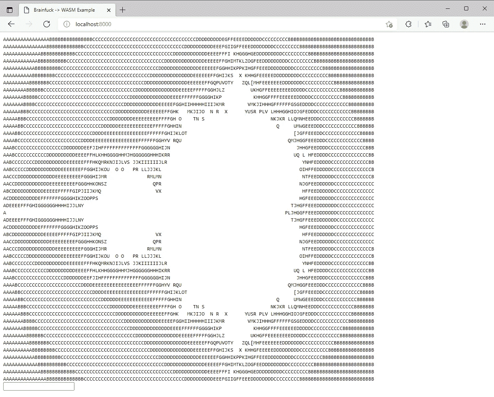

# 用 Go 编译 Brainf***到 WebAssembly

> 原文：<https://levelup.gitconnected.com/compiling-brainf-to-webassembly-with-go-8838519e3c8b>



Mandelbrot 使用 WebAssembly 在网页上运行。曼德勃罗集分形浏览器。

## 编写编译器和 WebAssembly 的介绍。

Go 是一种最小化的语言，与 Haskell 或 C++等其他语言相比，它可能使得编写编译器或解释器更难概念化。今天，我想向您展示 Go 如何成为学习编译器编写的有效工具，此外，我们还可以通过编写自己的编译器来探索 WebAssembly 所提供的一些功能。

首先，理解我们的输入语言 Brainfuck 及其工作原理非常重要。它是最著名的深奥编程语言，1993 年首次上传到 Aminet，试图编写尽可能小的编译器。Brainfuck 本质上是一个非常基本的图灵机，在一个被称为*细胞*或*磁带*的无限大的一维字节数组上运行。Brainfuck 的 8 个操作移动光标，修改单元格，比较单元格值。

```
These are the 8 characters/operations of all Brainfuck programs:
+     increment the cell being pointed to
-     decrement the cell being pointed to
>     move the cursor right one cell
<     move the cursor left one cell
.     print the cell's value as an ASCII character
,     read the next character input from user into cell
[     jump to matching closing bracket if cell is zero
]     jump to matching opening bracket if cell is NOT zeroThe below is a multiplication of cell 1 to cell 2 resulting in 36:
++++++++ set cell 1 to 8
[        jump to closing bracket if the current cell is 0
  >      go right to cell 2
  ++++   increment four times
  <      go back to cell 1
  -      decrement cell 1
]        jump to opening bracket if the current cell is not 0
>        go to cell 2
.        prints '$'
>,.      go to cell 3; read an input; print it out
```

Brainfuck 是第一代编译器的有力竞争者，因为它只需要很少的解析和代码生成魔法就能让事情运转起来。我们将瞄准 WebAssembly (WASM)来生成可移植的和优化的 Brainfuck 程序，这些程序可以在 web 浏览器上运行。WebAssembly 是现代 web 浏览器的一种新的二进制语言。它比 JavaScript 更小，执行速度更快。

WebAssembly 需要 JavaScript 来与 DOM 交互。在 WebAssembly 中，您可以导入和导出函数、常数，甚至程序使用的内存。虽然 WASM 是一种二进制格式，这将是复杂的，但非常有可能直接编译成，它只是更容易修复代码生成问题，如果我们生成 WebAssembly 的文本等效，称为 WAT，或 WebAssembly 文本。所以，让我们熟悉一下 WAT 语法，因为这是我们的 Go 程序将要发出的代码。

这是一个简单的 WebAssembly 程序，导出两个函数: *add* 和 *mul* 。两个函数都接受两个 i32 参数并返回一个 i32。你可能注意到我用不同的语法编写了函数。也就是说， *add* 使用的是 [S-expression 语法](https://webassembly.github.io/spec/core/text/instructions.html#folded-instructions)。两者都有效，但 S 表达式风格通常是首选。

这是怎么回事？WebAssembly 是一种类似 Forth 的基于堆栈的语言，其中有一个隐式的值堆栈，您可以推送和弹出这些值。在*的末尾添加*和 *mul* ，这意味着我们将在堆栈上留下一个项目作为我们的返回值。我们留下的那个值是调用`i32.add`或`i32.mul`的结果。在我们的 *mul* 函数中，我们将`$a`的值推入堆栈，然后将`$b`的值放在它的顶部。当我们随后调用`i32.mul`时，它从堆栈中弹出两个参数，并推送结果；`$a`乘以`$b`。*添加*跟风。

WebAssembly 实际上不知道 JavaScript 或任何其他语言的存在。WebAssembly 只有 32 位和 64 位整数和浮点、函数、表和连续的内存数组。为了与 JavaScript 共享函数或数据，您将事物标记为导入或导出。导出的项位于 WebAssembly 代码的本地，但可以从 JavaScript 访问。导出的项通常是在 WebAssembly 中声明的函数，您可能希望从 JavaScript 调用这些函数。导入的项目对于 JavaScript 是本地的，但从 WebAssembly 是可读/可写的。导入项通常是 JavaScript 中声明的全局变量或内存。

这里我们从 JavaScript 导入内存(一个 64KB 的页面)、全局单元格指针值和 IO 函数。 *putChar* 将接收一个 Unicode 字符值并打印到网页上。getChar 将返回用户输入的下一个 8 位字符。这两个函数是我们的 WebAssembly 程序对外界的唯一窗口，甚至它们也受我们如何在 JavaScript 中实现它们的控制。

最后，我们声明并导出我们的主函数， *runBrainfuck* 。当我们从 JavaScript 调用这个函数时，我们生成的 Brainfuck 程序将被执行。我们从 JavaScript 导入的内存将被用作我们的磁带。我们使用像`i32.store8`和`i32.load8_u`这样的函数向我们的单元写入和读取 8 字节的内存。

在上面，我包含了 index.html 页面和 main.js 代码，作为 WebAssembly 模块的接口。在 JavaScript 中，我们声明了*内存*和 *cellptr* 常量，并将它们包含在 *importObject 中。我们还在那里定义了 *putChar* 和 *getChar* 的函数。在底部，我们获取我们的 WebAssembly 模块，给它我们的 *importObject* ，然后调用`runBrainfuck()`。*

如果我们重温一下我们之前的 WebAssembly 模板，我们可以清楚地看到我们是如何从 JavaScript 对象中导入这些类型的:

我希望现在我已经清楚了 WebAssembly 与我们的网页和 JavaScript 的关系。现在我们可以看看一个 Brainfuck 程序，以及我们期望它如何转化为 WebAssembly。

```
+++++++++++++ 13
[>+++++<-]    times 5
>.+.+.        ABC
```

这个程序将第一个单元格的值设置为 13，然后当第一个单元格不为空时，它将第二个单元格加 5，并减少第一个单元格。此操作的结果是清除第一个单元，留下第二个单元，结果为 13 乘以 5。最后，程序打印 ASCII 字符 65，加 1，打印 66，加 1，打印 67。结果是输出“ABC”。我们将把这个程序翻译成 WebAssembly，看看这些基本功能是如何工作的。

首先，如果你直接做，把 13 加到内存的第一个字节是很简单的:

```
(i32.const 0)
(i32.store8 (i32.add (i32.load8_u 0) (i32.const 13)))
```

我们将想要存储的内存的字节索引压入，然后我们将常量 13 压入单元格 0 处的字节。这两个值放入堆栈后，我们调用`i32.store8`用新值更新单元格。我们可以使用全局变量来告诉我们当前指向哪个单元格:

```
(global.get $cellptr)
(i32.add (i32.load8_u (global.get $cellptr) (i32.const 13)))
(i32.store8)
```

我在这里展开了表达式，因为它溢出了行。

如果您的编译器知道重复出现的'+'和'-'应该合并成一个完整的加法或减法，那么上面的代码将会产生什么结果。换句话说，如果你让编译器优化输入程序，它会产生更少的指令。更直接的翻译应该是:

```
(global.get $cellptr)
(i32.add (i32.load8_u (global.get $cellptr) (i32.const 1)))
(i32.store8)(global.get $cellptr)
(i32.add (i32.load8_u (global.get $cellptr) (i32.const 1)))
(i32.store8)(global.get $cellptr)
(i32.add (i32.load8_u (global.get $cellptr) (i32.const 1)))
(i32.store8)... ten more times
```

但是为了可读性，我们将假设我们的程序是优化的。

现在我们需要看看循环我们的程序。在 Brainfuck 代码中，我们在单元格 0 不为空时循环。当它不为空时，我们将增加单元格指针，使其指向内存中的下一个单元格。然后加上 5，回到第一个单元格，减去 1，然后检查我们是否应该再次循环。我在这里实现了该行为:

这实际上是我们实现编译器所需的每一条指令。与其他函数或全局变量一样，`block`也有自己的标签。当你使用带有块标签的`br`或`br_if`语句时，它实际上将完全退出那个块。这种行为与`loop`相反，它只会在`br`或`br_if`语句时重复。我用一个块包装这个循环，这样如果当前单元格是空的，它将跳过这个块。否则，循环运行一次，检查相反的条件以确定循环是否应该再次运行，等等。

其他新说明应该是不言自明的，但如果不是，请阅读 [WebAssembly 参考](https://webassembly.github.io/spec/core/exec/index.html)。可以是技术性的，但是很得心应手！

在程序的最后部分，我们在修改第一个单元格的值时调用了三次 *putChar* 。外部或内部调用函数的工作方式与使用标准指令完全相同:您将作为*参数的值*推送到函数，这些值将被弹出，留在堆栈上的是返回值(如果有的话)。

现在我们可以把这个例子编译成 WASM，并在我们的浏览器中试用。您可能还记得，我之前提到过 WASM 是二进制格式，而 WAT 是文本格式。你可以从 WebAssembly 二进制工具包下载很多很棒的工具，但是也就是说`wat2wasm`对于将我们的 WAT 文件转换成 WASM 特别有用。如果你想继续学习，你应该下载这个工具包并把它添加到你的路径中:[发布 web assembly/wabt(github.com)](https://github.com/WebAssembly/wabt/releases)

现在收集之前的 index.html 和 main.js 文件，以及这个程序(称之为 brainfuck.wat)，并把它们都放在一个目录中。打开终端中的目录，首先执行`wat2wasm brainfuck.wat -o brainfuck.wasm`。输出文件名“brainfuck.wasm”很重要，因为这正是 JavaScript 要寻找的文件。现在，您应该在项目目录下启动一个 web 服务器。一个简单的方法是用 Python: `python -m http.server`。

现在假设一切顺利，你可以打开浏览器，进入`localhost:8000`，查看 Brainfuck 程序的输出！所以，让我们用 Go 来写我们的编译器，这样我们就不用再手动翻译脑残程序了。提示:刷新网页时使用 Ctrl + F5，因为这将强制刷新缓存的资源。

从标准设置开始:

```
package mainfunc main() {}
```

我们将从解析命令行参数开始，并通过将输入文件读入字符串来准备输入文件。我们的编译器将有一个单独的标志:`-o` ，它设置输出文件名。程序总是希望输入文件跟在参数后面。所以我们的用法是`brainfuck2wasm [options] input_file`或者开发时:`go run main.go [options] input_file`。

下面是执行此操作的程序:

现在我们需要将编译好的程序写入输出文件`f`。首先，我们需要一个输出程序的模板。为此，我们将使用一个常数:

以及生成指令的功能:

现在可以将每个脑残角色映射到等价的 WAT 指令。正如我们已经讨论过如何为 Brainfuck 程序编写等价代码，我们可以填写简单的指令:

这是一个函数编译器，用于不包含循环的 Brainfuck 程序。循环有点棘手，因为我们为它们使用生成的标签，所以我们必须跟踪它们的标签名。对于循环，我们需要跟踪两件具体的事情:

*   下一个标签号，因为每个标签都是唯一的。$label$0，$label$1，等等。
*   当前*循环深度*的标签号(一个索引)。因为顺序循环增加了这个索引，所以深度并不总是等于它。使用`map[int]int`很容易解决这个问题，其中键是当前嵌套循环的循环深度，值是标签索引。

以下代码使用上述要点实现循环:

当循环开始时，为块和循环创建不同的标签。我们给`loopDepth`、`labelIdx`(因为没有更好的名字)的`loopDepthLabelIdxs`添加一个键、值对。对于我们正在生成的任何给定深度的循环，我们可以知道使用什么样的正确标签索引。然后，我们只是在结束之前增加标签索引和循环深度。

当一个循环被关闭时(或者确定是否再次循环)，我们递减循环深度，并生成“如果再次循环”指令。我们不需要从映射中删除键，因为在一个有效的程序中，如果一个循环已经被正确地打开，它们应该总是被覆盖。我将让读者挑战让编译器报告无效程序的错误。

现在我们有一个全功能的 Brainfuck 编译器，它可以生成 WebAssembly 文本程序。从现在开始，您基本上已经完成了这篇文章，所以我将提出一些挑战:

*   实现编译错误，让用户知道他们的程序是无效的，以及*为什么*它们是无效的。
*   阅读一些 WebAssembly 规范，并使其在用户到达其内存末尾时扩展。Brainfuck 只是在无限大小的内存上完成图灵，所以尽力而为很酷。
*   优化生成的程序。如果你不确定从哪里开始，考虑读写内存可能是最慢的。理想情况下，对内存中同一单元的多次写入应该组合成一次。当一个单元格被多次读取时，考虑保留一个变量。这里有无数的优化机会。

作为对你已经完成的编译器的奖励，我将加入缩进。本质上，您只需预先定义一行应该缩进多少，然后乘以嵌套深度:

谢谢你花时间了解我的最新项目。所有的代码都在 GitHub 上，如果你需要一些帮助或提醒，还有一个简短的自述如何使用这个项目。我鼓励你去尝试挑战！

fivemoreminix/brainfuck2wasm:一个用 Go 编写的 Brainfuck to WebAssembly 编译器。(github.com)