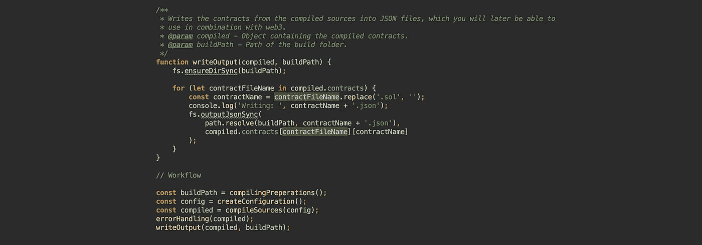
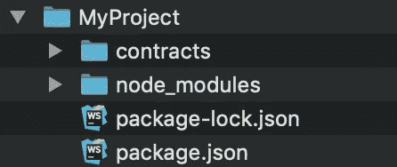
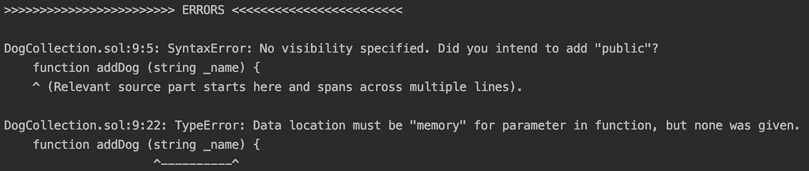
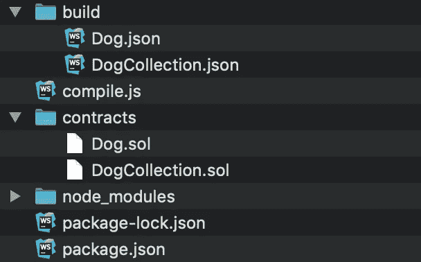
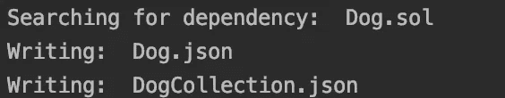

# solc-js:用 JavaScript 在本地编译以太坊智能合约

> 原文：<https://levelup.gitconnected.com/compiling-ethereum-smart-contracts-locally-0-5-2-0-5-x-ebfea0aed3a9>



## 本教程将带你在本地环境中编译 Solidity 契约。(坚实度 0 . 5 . 2–0.5 . x)

在为 Ethereum 平台开发时，能够使用 solc 编译器是一项重要的技能，尤其是当您不想依赖像 Remix 这样的基于 web 的 ide 时。了解如何使用 solc 将有助于您理解开发智能合同的工具链。在本教程中，您将学习如何使用`solc-js`来编译两个非常简单的智能合约。

# **安装依赖关系:**

您将使用 solc-js 编译两个简单的智能契约。首先你需要[安装 Node.js](https://nodejs.org/en/download/) 。

安装 Node.js 后，创建一个项目文件夹并初始化项目。

```
mkdir MyProject // creating the project folder
cd MyProject
npm init // npm will guide you trough the initialisation process
```

让我们也安装一些稍后需要的依赖项。

```
npm install solc fs-extra path
```

在我们的项目文件夹中创建一个新文件夹`contracts`，它将包含智能合同。您的文件夹结构现在应该看起来像这样:



# **智能合约**

现在您将创建 2 个非常简单的智能契约`DogCollection.sol`，它从`Dog.sol`的状态变量中收集 Dog 类型的智能契约。为了使本文简单，在 contracts 文件夹中创建这两个文件，并复制源代码。

狗集合. sol

狗狗. sol

# 编译智能合同

现在有趣的部分可以开始了！在项目文件夹的根目录下创建一个名为`compile.js`的 JavaScript 文件。这个文件将包含所有的代码，你将需要编译我们的 Solidity 智能合同。我会解释每一步。

在文件的顶部，导入先前安装的 node_modules。接下来的几个代码片段将由不同的函数组成，在文件的最后，这些函数将用于创建编译我们的智能合同的工作流。

在编译之前，需要定义一个构建路径，并删除旧的编译源代码。

要使用`solc`编译器，需要一个配置对象。该对象包含应该编译的每个智能协定的名称和来源。我们只关心入口点，而不关心 Solidity 文件内部的`import`语句中使用的入口点，Solidity 文件将在后面处理。编译器特别需要被告知为我们编译`DogCollection.sol`，而不是`Dog.sol`，因为它只被导入到`DogCollection.sol`中。您可以为想要编译的每个智能协定重复此步骤。

GetImports 处理智能合约的导入。`DogCollection.sol`导入`Dog.sol`，因此我们必须将`Dog.sol`声明为依赖项。

最后，可以添加编译智能合同的方法。为编译器方法提供作为回调的`getImports`函数，以搜索在`import`语句中声明的智能契约。在这个例子中，`DogCollection.sol`导入了`Dog.sol`。将编译方法包装在一个`try — catch`中，以防出错。编译成功后，将返回一个包含编译后的源代码和潜在错误的对象。

如上一段所述，包含已编译的智能合约的对象也包含潜在的错误。幸运的是`solc`已经对错误信息进行了格式化，以便于阅读。



错误输出示例。

编译并处理潜在错误后，再次创建`build`文件夹。编译后的源代码包含`abi`、`bytecode`等，在循环每个编译后的契约后，作为 JSON 文件写入构建文件夹。

最后在`compile.js`底部将以上创建的功能组合成一个工作流。

对文件夹结构进行快速比较。编译后，它应该看起来像这样:



# 让它做这件事！

让你自己编写的编译程序来一次旋转。在项目文件夹中，在终端中键入以下内容:

```
node compile
```

结果应该是这样的:



# Compile.js:完整源代码

对于只想复制粘贴完整源码的:[https://github . com/DodoTheDeveloper/solc-js-compile-0 . 5 . 2-0.5 . x](https://github.com/DodoTheDeveloper/solc-js-compile-0.5.2-0.5.x)

# 结论

现在你知道如何借助 Node.js 和`solc-js`在本地编译智能合约了。通过分而治之，你把一个相当复杂的主题分解成小的、更容易理解的部分，当结合起来的时候，给了我们一个为以太坊平台开发的强大工具。

[](https://levelup.gitconnected.com)[](https://gitconnected.com/learn/solidity) [## 学习坚固性-最佳坚固性教程(2019) | gitconnected

### 14 大坚实教程-免费学习坚实。课程由开发人员提交和投票，使您能够…

gitconnected.com](https://gitconnected.com/learn/solidity) [](https://gitconnected.com/learn/javascript) [## 学习 JavaScript -最佳 JavaScript 教程(2019) | gitconnected

### 前 65 名 JavaScript 教程-免费学习 JavaScript。课程由开发人员提交并投票，从而实现…

gitconnected.com](https://gitconnected.com/learn/javascript)