# CompletableFuture:异步编程的新时代

> 原文：<https://levelup.gitconnected.com/completablefuture-a-new-era-of-asynchronous-programming-86c2fe23e246>


*异步编程*是一种并行编程的形式，允许一个工作单元独立于主应用线程运行。当工作完成时，它通知主线程(以及工作是完成还是失败)。

另一方面，在一个*同步*编程模型中，事情一次发生一件。当我们调用一个执行长时间运行的动作的函数时，它会在该动作执行并返回的时间内阻塞我们的程序，并且只有在该动作完成并且可以返回结果时才解除阻塞主应用程序线程。

等待动作完成在同步模型中是*隐式*，而在异步模型中是*显式*，在我们的控制下。

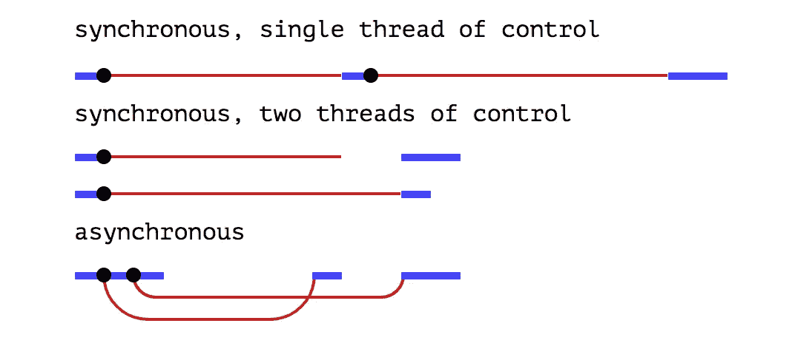

有不同的方法使用下面的机制在 Java 中实现异步编程，例如 Futures、ExecutorService、CompletionService、回调接口、线程池等。

但是 Java 8 引入了一个叫做 **CompletableFuture** 的新特性，这个特性可以广泛应用于用 Java 实现异步编程的情况。

# **什么是 CompletableFuture，它与 Future 有什么不同:**

根据 Oracle 文档，CompletableFuture 是一个可以显式完成(设置其值和状态)的`[Future](https://docs.oracle.com/javase/8/docs/api/java/util/concurrent/Future.html)`，并且可以用作`[CompletionStage](https://docs.oracle.com/javase/8/docs/api/java/util/concurrent/CompletionStage.html)`，支持在其完成时触发的依赖函数和动作。

当两个或更多的线程尝试`[complete](https://docs.oracle.com/javase/8/docs/api/java/util/concurrent/CompletableFuture.html#complete-T-)`、`[completeExceptionally](https://docs.oracle.com/javase/8/docs/api/java/util/concurrent/CompletableFuture.html#completeExceptionally-java.lang.Throwable-)`或`[cancel](https://docs.oracle.com/javase/8/docs/api/java/util/concurrent/CompletableFuture.html#cancel-boolean-)`CompletableFuture 时，只有一个成功。

CompletableFuture 类属于 java.util.concurrent 包。

> **签名**:

```
public class **CompletableFuture<T>**
extends [Object](https://docs.oracle.com/javase/8/docs/api/java/lang/Object.html)
implements [Future](https://docs.oracle.com/javase/8/docs/api/java/util/concurrent/Future.html)<T>, [CompletionStage](https://docs.oracle.com/javase/8/docs/api/java/util/concurrent/CompletionStage.html)<T>
```

CompletableFuture 实现了`Future`和`CompletionStage`接口，并为创建、链接和组合多种期货提供了大量方便的方法。它还具有非常全面的异常处理支持。CompletableFuture 克服了未来的以下限制:

*   即使遇到了异常情况，期货也不能明确完成。
*   Future 提供了一个`get()`方法，该方法会一直阻塞，直到结果可用。如果不阻塞主应用程序线程，就不能对将来的结果执行进一步的操作。
*   不能通过将多个期货链接在一起来创建异步工作流。
*   并行运行的期货不能组合在一起。
*   未来的 API 没有任何异常处理构造。

# **CompletableFuture 的实现**:

> **如何启动**:

我们可以用无参数构造函数创建 CompletableFuture 类的一个实例来表示未来的结果。最简单的前进步骤是将它分发给消费者，并在未来的某个时候使用`CompletableFuture.complete()`方法完成它。

我们可以尝试使用`CompletableFuture.get()`方法得到这个 CompletableFuture 的结果，`get()`方法会一直阻塞，直到未来完成。

> **completablefuture . run async()**:

如果我们想异步运行一些后台任务，而 ***不想从该任务返回*** 任何东西，这是`CompletableFuture.runAsync()`方法的理想用例。它接受一个 Runnable 对象并返回`CompletableFuture<Void>`。

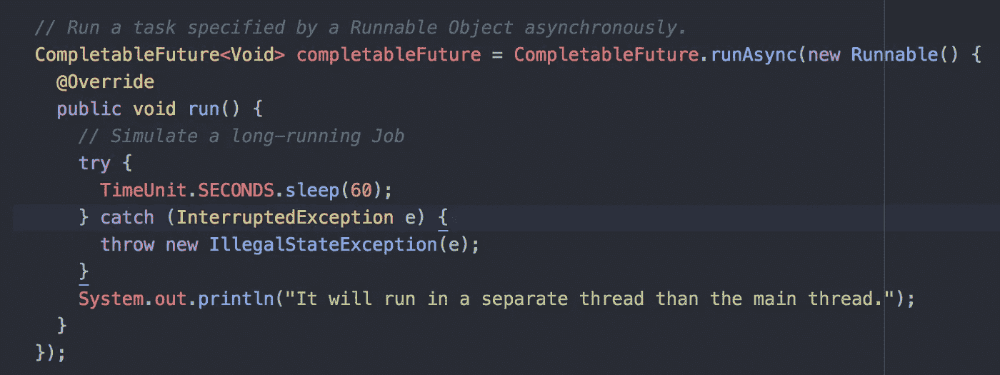

Runnable 对象也可以以 lambda 表达式的形式传递:

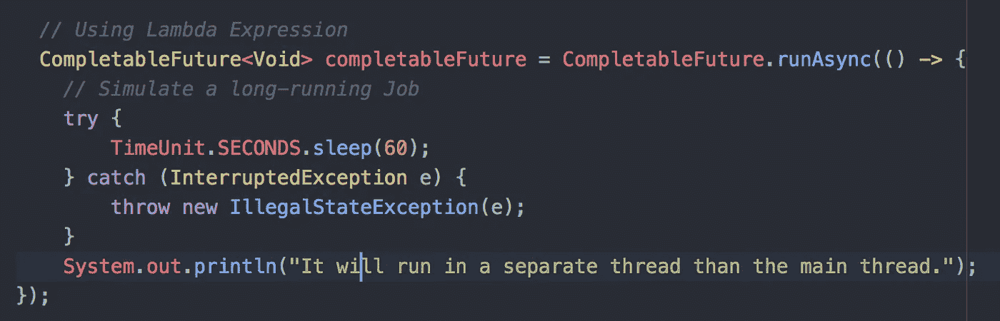

> **completablefuture . supplyasync()**:

与上面的用例相反，如果我们想异步运行某个后台任务，并且 ***想从该任务返回*** 任何东西，我们应该使用 CompletableFuture.supplyAsync()。它接受一个[供应商< T >](https://docs.oracle.com/javase/8/docs/api/java/util/function/Supplier.html) 并返回`CompletableFuture<T>`，其中 T 是通过调用给定供应商获得的值的类型。

[供应商< T >](https://docs.oracle.com/javase/8/docs/api/java/util/function/Supplier.html) 是一个简单的功能接口，表示结果的供应商。它有一个单独的`get()`方法，我们可以在其中编写后台任务并返回结果。

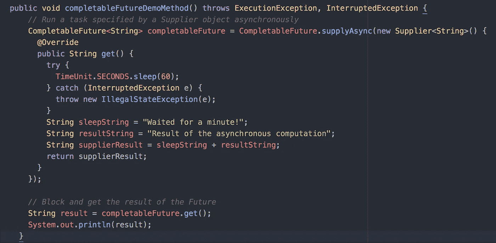

现在，我们知道`runAsync()`和`supplyAsync()`方法在一个单独的线程中执行它们的任务，这个线程从来不是由我们明确创建的。

CompletableFuture 在从全局[forkjoinpool . common pool()](https://docs.oracle.com/javase/8/docs/api/java/util/concurrent/ForkJoinPool.html#commonPool--)获得的线程中执行这些任务。

但是我们也可以创建一个[线程池](https://www.callicoder.com/java-executor-service-and-thread-pool-tutorial/)并将其传递给`runAsync()`和`supplyAsync()`方法，让它们在一个从我们的线程池中获得的线程中执行它们的任务。

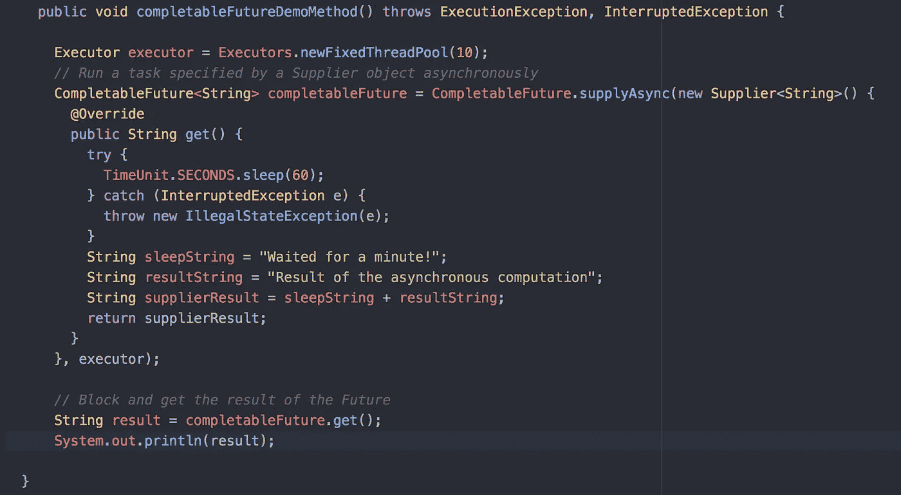

# ***回调*** :

回调是对 CompletableFuture 的结果进行转换和操作的准备。为了构建异步系统，我们应该能够给 CompletableFuture 附加一个回调，当未来完成它的任务时，这个回调应该被自动触发和执行。

这样，我们就不需要等待未来的结果(非阻塞)，我们可以在回调函数中编写未来完成后需要执行的逻辑。

我们可以使用`thenApply()`、`thenAccept()`和`thenRun()`方法给 CompletableFuture 附加一个回调。

> **thenApply()** :

当 CompletableFuture 的结果到达时，我们可以使用`thenApply()`方法对其进行处理和转换。它以一个[函数< T，R>作为自变量。](https://docs.oracle.com/javase/8/docs/api/java/util/function/Function.html) [Function < T，R >](https://docs.oracle.com/javase/8/docs/api/java/util/function/Function.html) 是一个简单的函数接口，表示一个接受 T 类型参数并产生 R 类型结果的函数。

我们还可以通过附加一系列`thenApply()`回调方法，在 CompletableFuture 上编写一系列转换。一个`thenApply()`方法的结果被传递到序列中的下一个。

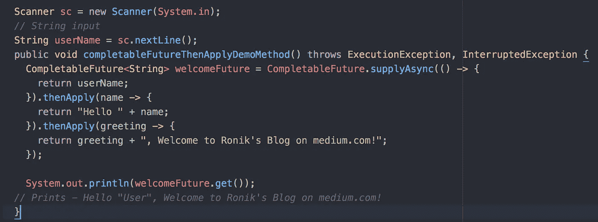

> **然后接受()**:

如果你不想从回调函数返回任何东西，只想在 CompletableFuture 完成后运行一段代码，那么我们可以使用`thenAccept()`方法。

`CompletableFuture.thenAccept()`取一个[消费者<T>并返回`CompletableFuture<Void>`。它可以访问它所附加的 CompletableFuture 的结果。](https://docs.oracle.com/javase/8/docs/api/java/util/function/Consumer.html)

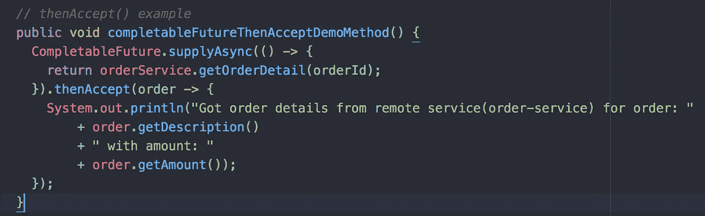

> **然后润()**:

`thenRun()`方法也被用作回调函数，该函数不返回任何内容，但执行写在该块中的逻辑。`thenAccept()`和`thenRun()`方法是消费者，通常用作回调链中的最后一个回调。

虽然`thenAccept()`可以访问它所附加的 CompletableFuture 的结果，但是`thenRun()`甚至不能访问未来的结果。它接受一个`Runnable`并返回`CompletableFuture<Void>`。

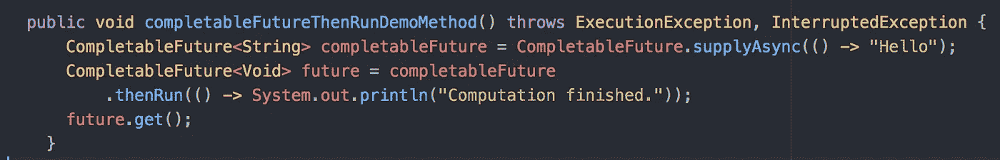

# 异步回调:

在上面的例子中，`thenApply()`内部的任务在执行`supplyAsync()`任务的同一个线程中执行，或者如果`supplyAsync()`任务立即完成，则在主线程中执行。如果我们想进一步增加程序的并行性，并且想在一个单独的线程上运行回调任务，那么异步回调就是解决方案。

我们可以使用`thenApplyAsync()`回调来代替`thenApply()`，然后这个任务将在从`ForkJoinPool.commonPool()`获得的不同线程中执行。

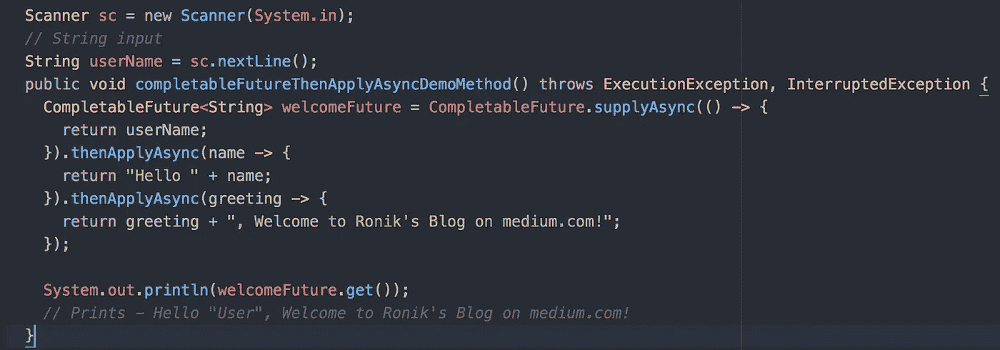

我们还可以向`thenApplyAsync()`回调传递一个执行程序，然后任务将在从执行程序的线程池中获得的线程中执行。

# 将 CompletableFutures 结合在一起:

> **使用 thenCompose():** 合并从属 completableFutures

在前面的例子中，传递给`thenApply()`回调函数的`Supplier`函数将会返回值。如果我们的用例是返回一个 CompletableFuture。这是`thenCompose()`方法的主要用例。

*如果我们的回调函数返回一个 CompletableFuture，我们希望从 CompletableFuture 链中得到一个扁平化的结果，我们需要使用* `*thenCompose()*` *。*

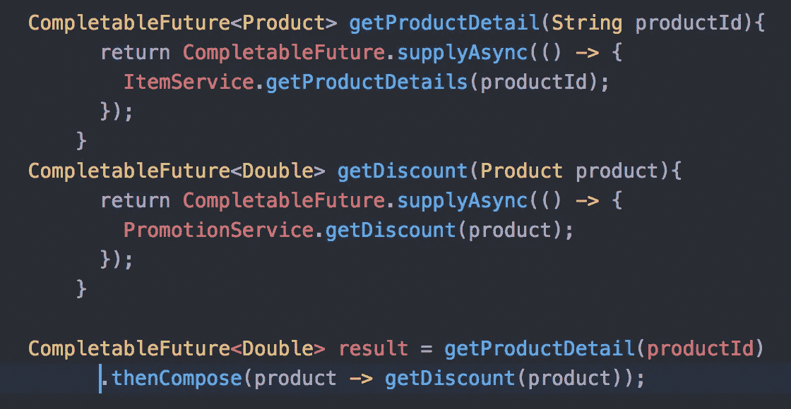

> **使用 thenCombine() *:*** 合并独立的 completableFutures

`thenCompose()`用于组合两个可完成的期货，其中一个期货依赖于另一个，`thenCombine()`用于当我们希望两个期货独立运行并在两个期货完成后做一些事情。当两个 CompletableFutures 都完成时，将调用传递给`thenCombine()`的回调函数。

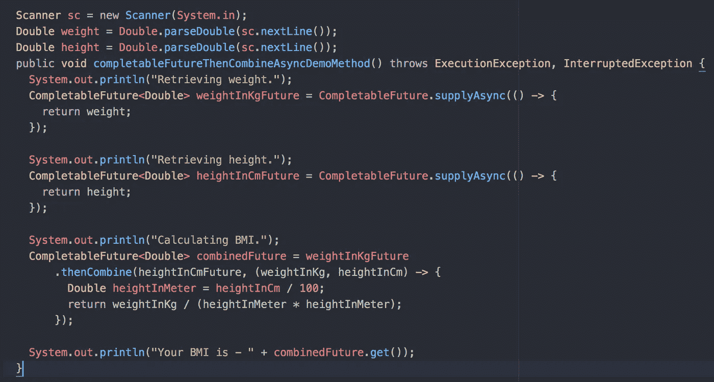

> **将 n 个可完成的期货组合在一起**:

当我们有一个独立的 completableFutures 列表，并且我们想要并行运行并且在它们都完成后做一些事情时，使用`CompletableFuture.allOf()`。

`CompletableFuture.anyOf()`顾名思义，返回一个新的 CompletableFuture，它在任何给定的 CompletableFutures 完成时完成，结果相同。

# CompletableFuture 中的异常处理:

> **使用 exceptions()回调处理异常**:

`exceptionally()`回调让我们有机会从最初的 CompletableFuture 产生的错误中恢复。

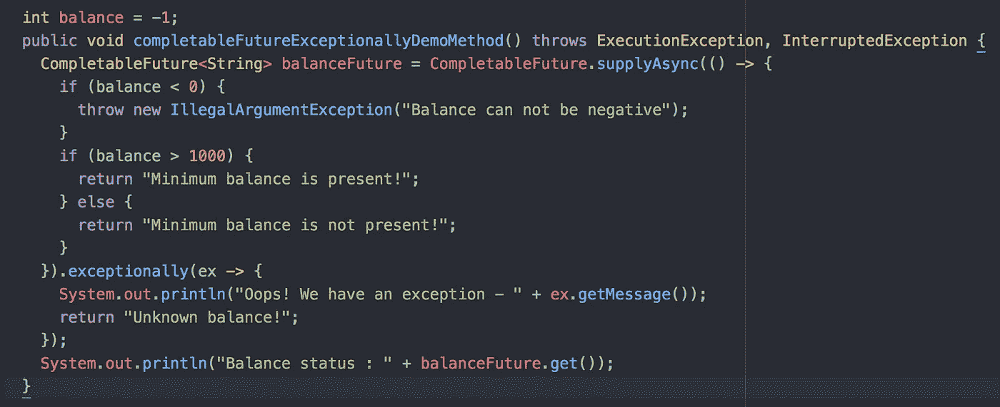

> **使用通用 Handle()方法处理异常**:

API 还提供了一个更通用的方法— `handle()`来从异常中恢复。无论异常是否发生，它都会被调用。如果出现异常，`ex`参数的值将为非空，否则在成功场景中`res`参数的值为非空。


# 结论:

在本文中，我试图阐明异步编程的不同用例，以及如何使用 Java 8 的 CompletableFuture 实现这些场景。如果你喜欢这篇文章，如果你能帮助它传播，我会非常感激。非常感谢您的阅读！

# **参考文献:**

[](https://eloquentjavascript.net/11_async.html) [## 异步编程::雄辩的 JavaScript

### 两个重要的 JavaScript 编程平台——浏览器和 node . js——进行操作可能需要一段时间…

eloquentjavascript.net](https://eloquentjavascript.net/11_async.html) [](https://stackify.com/when-to-use-asynchronous-programming/) [## 何时使用(以及不使用)异步编程

### 异步编程是并行编程的一种形式，它允许一个工作单元独立于…

stackify.com](https://stackify.com/when-to-use-asynchronous-programming/) [](https://technology.amis.nl/2009/02/19/asynchronous-processing-in-java-applications-leveraging-those-multi-cores/) [## Java 应用中的异步处理——利用多核——AMIS Oracle 和 Java……

### 处理器不会变得更快。预计不会有更高的时钟速度。处理速度将会是…

技术. amis.nl](https://technology.amis.nl/2009/02/19/asynchronous-processing-in-java-applications-leveraging-those-multi-cores/) [](https://www.callicoder.com/java-8-completablefuture-tutorial/) [## Java CompletableFuture 未来教程，带示例

### Java 8 带来了大量的新特性和增强，比如 Lambda 表达式、流、CompletableFutures 等等。在…

www.callicoder.com](https://www.callicoder.com/java-8-completablefuture-tutorial/) [](https://www.baeldung.com/java-completablefuture) [## CompletableFuture 指南| Baeldung

### 本文是 CompletableFuture 类的功能和用例指南——作为 Java 8…

www.baeldung.com](https://www.baeldung.com/java-completablefuture)