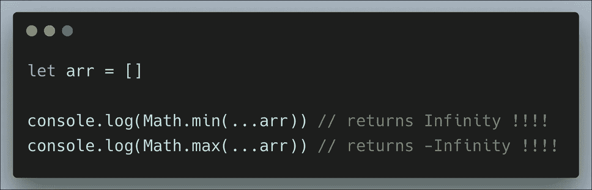

# JavaScript 中数学对象的完整指南

> 原文：<https://levelup.gitconnected.com/complete-guide-on-math-object-in-javascript-5c641254f288>

[Clem Onojeghuo](https://unsplash.com/@clemono2?utm_source=medium&utm_medium=referral) 在 [Unsplash](https://unsplash.com?utm_source=medium&utm_medium=referral) 上拍摄的照片

在 JavaScript 中，`**Math**`是一个内置的静态对象，允许你对数字进行数学运算。

让我们讨论一些我们可以在日常生活中使用的重要方法。

## **Math.max()和 Math.min()**

`Math.max()`用于查找列出值中最大的**和最小的`Math.min()`:**

但是，如果我们有一个数字数组，我们想找到其中的最小值和最大值呢？如果我们向`Math.min`或`Math.max`方法发送一个数组，我们将得到 **NaN** 。

这是因为 Math.min 或 Math.max 函数需要不同的变量，而不是数组。我们可以用不同的方式处理这件事

**在 ES5 中我们可以使用** `**apply**` **方法**来处理

**在 ES6 中我们可以用 spread** `**…**` **运算符**来处理

该运算符将数组中的值扩展或“散布”到函数的参数中。

## **Math.round()**

`**Math.round()**`用于将一个数字四舍五入到最接近的整数。

## **Math.ceil()**

`**Math.ceil()**`用于将数字**向上**舍入到最接近的整数:

## Math.floor()

`**Math.floor()**`用于将数字**向下**舍入到最接近的整数:

## Math.abs()

`**Math.abs()**`方法返回一个数的绝对值。

让我们看一个与下面的函数一起使用的**减法**的例子:

## Math.random()

`**Math.random()**`函数返回一个范围在 **0 到 1 之间的浮点数。**它可以用来得到两个值之间的随机数。

为了得到一个在`min`和`max`之间的随机整数，可以按如下方式使用`math.random()`函数:

我们也可以使用`Math.random()`生成一个随机的颜色值

`Math.random`是一个在实际项目中非常有用的生成随机数、id 和颜色的方法。

与其他全局对象不同，`Math`不是一个构造函数。`Math`的所有属性和方法都是静态的。

感谢阅读:)