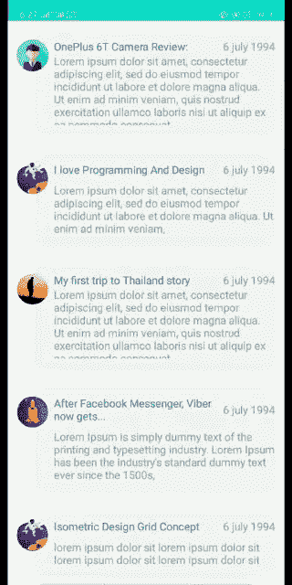

# Android Recyclerview 完整指南—第 2 部分

> 原文：<https://levelup.gitconnected.com/complete-guide-to-android-recyclerview-part-02-7cc6b71ab0d6>

再次欢迎，如果你是新来的，你可以到这里看前面的部分[。之前我们已经讨论了 recycler 视图的基本定义，它的重要性、优点和缺点，以及它为什么会存在，以及 recycler 视图如何解决 Listview 的局限性。](https://medium.com/codixlab/a-guide-to-android-recyclerview-76c42b011738)

在这一部分中，我们将讨论构建回收器视图所需的关键组件，并了解如何实现它以获得最佳结果。在开始之前，我假设您对 Kotlin 和 Android 框架有基本的了解。让我们从教程开始。

# 回收器视图组件

谷歌试图通过使用模块化方法和多个组件的分布式实现来尽可能减轻 recyclerview 的负担。结合这些组件将提供强大而又美观流畅的用户体验。

我们在上一部分中讨论过的回收器视图的组件非常少。所以，为了回忆一下，我将对每一个都进行详细说明。

## 1) Recyclerview.adapter

适配器提供了从数据集到显示在`[RecyclerView](https://developer.android.com/reference/android/support/v7/widget/RecyclerView)`中的视图的绑定。

## 2) Recyclerview.viewholder

回收查看*。viewholder* 存储了一个行视图引用列表，由于这个原因，这个方法只需要调用几次，而不是针对整个数据集和每个绑定视图。

## 3) Recyclerview。布局管理器

布局管理器帮助我们从适配器获取日期，并按照指定的顺序排列视图。即垂直排列、水平排列或网格状排列。

## 4) Recyclerview。ItemAnimator

ItemDecoration 用于为项目添加特殊用途的边界、可视组、分隔线等。

现在，我们将开始一步一步地实际实现功能回收视图。让我们立即开始实施吧。

# 实现基本回收视图的步骤

1.  创建项目
2.  添加依赖关系
3.  创建模型类
4.  行的设计项目
5.  创建适配器类
6.  在 MainActivity 中实现这些
7.  设计活动 _main.xml 布局

# 第一步:

首先，创建一个新项目并导航到 activity_main.xml，然后创建一个具有 recycler 视图的布局，如下所示。

**布局— activity_main.xml**

**布局— activity_main.xml**

我们在布局中使用了 recyclerview 组件，并使用了 **tools:listItem** 的一个属性，它将帮助我们查看我们将在其适配器中展开的项目。

# 第二步:

现在，让我们为 recyclerview 项目创建另一个布局，该布局将显示在每一行中，并将其命名为类似于 **animated_item.xml**

**布局— animated_item.xml**

# 第三步:

现在我们将创建一个适配器类，您可以在下面看到。

**Class — RecyclerAdapter.kt**

您可以看到在适配器类中覆盖了一些方法，这些方法是使其正常工作所必需的。我来一一解释这些方法。

## onCreateViewHolder

返回保存给定类型视图的视图持有者。

## onBindViewHolder

onBindViewHolder 由 RecyclerView 调用以绑定指定位置的数据。

## getItemCount

返回此适配器中的项目总数。

# 第四步:

模型类存储数据属性，在我们的例子中，它将保存像**标题**、**描述**、**日期**和**图像**这样的属性。通常，一个**模型**可以由一组保存我们的数据和业务逻辑的**类**组成。

**Class — NewsModel.kt**

# 第五步:

在最后一步，我们将初始化适配器，将虚拟数据插入列表，并将该列表传递给适配器。剩下的魔术将由我们已经创建的适配器来完成。所以让我们进入最后一步:

**Class — MainActivity.kt**

我们完成了所有的步骤。只要点击运行按钮，并享受它。😎

注意:完整的项目或教程中使用的资源请参考我的 Github — [**这里**](https://github.com/asifjawaid/RecyclerviewWithAnimations)

如果您有任何反馈或问题，请批评和原谅我，如果你发现任何错误。