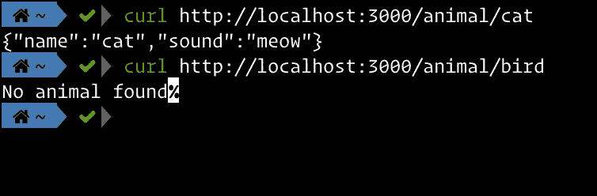

# 为您的 Golang 应用程序创建 Docker 容器的完整指南

> 原文：<https://levelup.gitconnected.com/complete-guide-to-create-docker-container-for-your-golang-application-80f3fb59a15e>


图片来源于[https://cdn . pix abay . com/photo/2018/12/06/12/02/container-3859710 _ 1280 . jpg](https://cdn.pixabay.com/photo/2018/12/06/12/02/container-3859710_1280.jpg)

在当今的软件工程界，Golang 和 Docker 是我们经常听说的两个东西，因为它们很受欢迎。Golang 之所以流行，是因为它内置了对简单并发、良好文档等的支持。此外，还有大量使用 Go 创建的很酷的开源项目。另一方面，Docker 彻底改变了我们发布软件的方式。

## **为什么是 docker？**

> 使用 docker 的主要目的是容器化。那就是为您的应用程序提供一个一致的环境，并且不依赖于运行它的主机。

想象一下这个场景，你在本地开发你的应用，然后它的一个功能依赖于一个操作系统包，而这个操作系统包又依赖于其他的包。开发过程完成后，您希望将应用程序部署到 web 服务器。此时，您必须再次确保所有的依赖项在完全相同的版本下正常运行，否则您的应用程序将会崩溃，永远无法运行。如果你想转移到另一个网络服务器，你不得不再次重复这个过程。这就是集装箱的用武之地。

无论是笔记本电脑还是 web 服务器，主机唯一需要的就是运行一个容器平台——这次是 docker。从此你不用担心你用的是 MacOS，Ubuntu，Arch，还是其他。您只需定义一次应用程序，就可以随时随地运行它。

使用容器技术还有许多其他优点。这篇文章不会涵盖所有这些，但是我鼓励你做你的研究，如果你仍然不确定的话。

同时使用这两种技术需要多种技术的组合，可以实现这些技术以确保最佳实践并获得最佳结果。

在这篇文章中，我将创建一个用 Golang 编写的 Docker 容器 web 服务器。

注意:我不会详细解释 Go 代码，因为这不是这篇文章的重点。

我们走吧！

# 1.编写代码

我将使用 [gin](https://github.com/gin-gonic/gin) 框架创建一个 go web 服务器。

首先，让我们创建一个 main.go 并添加以下代码。

上面的代码将通过端口 3000 和唯一一个到`/ping`的路径服务于 http web 服务器，并返回一个 JSON 响应。

# 2.创建 docker 图像

来自 Docker 文档:

> 映像包括运行应用程序所需的一切——代码或二进制文件、运行时、依赖项以及所需的任何其他文件系统对象。

或者简单地说，映像就是你如何定义你的应用程序和它运行所需的一切。

要创建 Docker 映像，必须在配置文件中指定步骤。默认且方便的文件名是`Dockerfile` ，但您可以随意命名。然而，遵循标准总是一个好主意。所以创建一个名为`Dockerfile`的文件，用下面的内容填充它。

## **解释**

`**FROM**`

我们正在使用基础图像`golang:alpine`创建我们的图像。这基本上是一个图像，就像我们想要创建的一样，可以在 Docker 存储库中找到。这个映像运行 alpine Linux 发行版，它很小，并且已经安装了 Golang，非常适合我们的用例。有大量公开的码头工人图片，看看[https://hub.docker.com/_/golang](https://hub.docker.com/_/golang)

`**ENV**`

我们还设置了环境变量`GO111MODULE`，但是这到底意味着什么呢？如果您对此不熟悉，这是一个用于 Go 如何导入包的变量。如果你想了解更多，可以搜索一下。还可以设置其他环境变量来定义您希望 go 如何工作。

`**WORKDIR**` **，** `**COPY**`，**，** `**RUN**`

接下来，我们在目录之间移动并安装依赖项。提供的评论已经不言自明了。

`**EXPORT**` **，** `**CMD**`

最后，我们将端口 3000 从容器内部导出到外部，因为应用程序将监听这个端口来工作。我们定义了一个默认命令，在运行我们的映像时执行这个命令`CMD [“/dist/main”]`。

要构建映像，请运行以下命令:

```
docker build . -t go-dock
```

我们构建了我们的图像，并用名称`go-dock`标记它。现在我们已经准备好了我们的图像，但是它现在什么也做不了。接下来，我们需要运行我们的映像，以便它能够处理我们的请求。运行的图像称为容器。

要运行映像，请键入以下内容:

```
docker run -p 3000:3000 go-dock
```

标志`-p`用于定义端口绑定。由于容器中的应用程序运行在端口 3000 上，因此我们将其绑定到主机端口，这次也是 3000。如果您想绑定到另一个端口，那么您可以使用`-p $HOST_PORT:3000`来运行它。比如说`-p 5000:3000`。

我们指定想要运行哪个映像，这次是`go-dock`。

测试服务器是否正常运行。

```
curl [http://localhost:3000/ping](http://localhost:3000/ping)
```

我们得到了回应。

```
{“message”:”pong”}
```

# 3.多阶段构建

现在你有了一个完全正常工作的 web 服务器，然后呢？

如果你仔细观察，我们想从 Go 程序中得到的唯一东西是构建过程之后的二进制输出。这就是我们想要的 Docker 映像，我们甚至不需要 go 编译器本身在运行时！Docker 的一个最佳实践是保持图像较小，通过只有二进制文件，然后我们使我们的图像比前一个更小。为了实现这一点，我们将使用一种称为多阶段构建的技术，这意味着我们将通过多个步骤来构建我们的图像。

用以下内容更新 Dockerfile 文件:

通过这种技术，我们将使用`golang:alpine`作为构建映像构建二进制文件的过程与基于`scratch`生成新映像的过程分开，T5 是一个简单且非常简单的映像。我们将主二进制文件从我们命名为`builder`的第一个映像复制到新创建的`scratch`映像中。欲了解更多关于刮刮乐图像的信息，请访问[https://hub.docker.com/_/scratch](https://hub.docker.com/_/scratch)

# 4.静态文件

有时你还想从 Golang 应用程序中获取静态文件，无论是图片、CSS、PDF 等。这一次，我们将使用一个 JSON 文件作为只读存储器来保存应用程序所需的数据。在之前的 Docker 构建过程中，当我们将二进制文件复制到暂存映像中时，我们丢失了静态文件。现在，我们还需要将所需的文件复制到其中。让我们实现这一点。

首先在您的工作目录中创建一个名为`/database`的新文件夹，然后创建一个名为`data.json`和`database.go`的文件。

将这些行添加到`main.go`

现在我们需要用暂存图像中的以下行来更新我们的`Dockerfile`:

```
COPY ./database/data.json /database/data.json
```

这将把静态文件复制到映像中，它将在应用程序运行时可用。让我们检查一下！



就是这样！现在您已经准备好在 docker 容器上运行您的应用程序了。

# 技巧

> 没有测试的代码是不干净的。不管它多么优雅，不管它多么易读易懂，如果它没有经过测试，它就是不干净的。
> - **罗伯特·c·马丁，干净的代码**

我们想要的另一件事是测试。我希望你能体会到测试的好处，以及它是如何让我们远离麻烦的。运行测试有两种技术。我们可以在映像构建过程中使用`go test`命令，或者在 CI/CD 过程中运行它。因此，如果由于某种原因测试失败了，我们就停止构建或部署过程。从那时起，我们可以确保我们只发布经过全面测试的软件。伟大的软件就是这样创造出来的。

这篇文章的代码可以在我的 GitHub【https://github.com/afdolriski/golang-docker 上找到

# 结束

如果您正在使用微服务，您还可以将您的应用程序容器部署到各种容器编排工具中，使其更具可扩展性。我最喜欢的是 [Kubernetes](https://kubernetes.io/) 和 [AWS ECS](https://aws.amazon.com/ecs/) 。我也将在下一篇文章中讨论这些技术。如果你不想错过的话，请跟我来。

如果您有任何问题或反馈，请在下面的回复部分留下。感谢您的阅读！